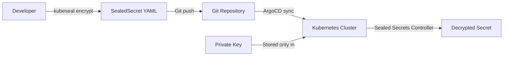

# How to Manage Secrets with ArgoCD and Sealed Secrets

Author: [nawazdhandala](https://github.com/nawazdhandala)

Tags: ArgoCD, GitOps, Kubernetes, Sealed Secrets, Security

Description: A complete guide to managing Kubernetes secrets in a GitOps workflow using Bitnami Sealed Secrets with ArgoCD for secure encrypted secret storage in Git.

---

The fundamental tension in GitOps is that everything should be in Git, but secrets should never be in Git. Bitnami Sealed Secrets solves this by encrypting secrets so they can be safely stored in your Git repository. ArgoCD then deploys the encrypted SealedSecret resources, and the Sealed Secrets controller decrypts them inside the cluster. This guide walks through the complete setup.

## How Sealed Secrets Work

The Sealed Secrets architecture is straightforward:



The sealed secrets controller generates an asymmetric key pair. The public key encrypts secrets, and the private key (which never leaves the cluster) decrypts them. Only the controller running in your cluster can decrypt the SealedSecret resources.

## Installing Sealed Secrets Controller

Deploy the controller using ArgoCD itself (GitOps all the way down):

```yaml
apiVersion: argoproj.io/v1alpha1
kind: Application
metadata:
  name: sealed-secrets
  namespace: argocd
spec:
  project: default
  source:
    repoURL: https://bitnami-labs.github.io/sealed-secrets
    chart: sealed-secrets
    targetRevision: 2.14.0
    helm:
      values: |
        fullnameOverride: sealed-secrets-controller
        namespace: kube-system
  destination:
    server: https://kubernetes.default.svc
    namespace: kube-system
  syncPolicy:
    automated:
      prune: true
      selfHeal: true
```

Or install with Helm directly:

```bash
helm repo add sealed-secrets https://bitnami-labs.github.io/sealed-secrets
helm install sealed-secrets sealed-secrets/sealed-secrets \
  --namespace kube-system \
  --set fullnameOverride=sealed-secrets-controller
```

## Installing kubeseal CLI

```bash
# macOS
brew install kubeseal

# Linux
KUBESEAL_VERSION=0.27.0
wget "https://github.com/bitnami-labs/sealed-secrets/releases/download/v${KUBESEAL_VERSION}/kubeseal-${KUBESEAL_VERSION}-linux-amd64.tar.gz"
tar -xvzf kubeseal-${KUBESEAL_VERSION}-linux-amd64.tar.gz kubeseal
sudo install -m 755 kubeseal /usr/local/bin/kubeseal
```

## Creating Sealed Secrets

### Basic Secret Encryption

Start with a regular Kubernetes secret and encrypt it:

```bash
# Create a regular secret (do not apply this to the cluster)
kubectl create secret generic my-app-secrets \
  --namespace app \
  --from-literal=DB_PASSWORD='super-secret-password' \
  --from-literal=API_KEY='api-key-12345' \
  --dry-run=client -o yaml > my-secret.yaml

# Encrypt it with kubeseal
kubeseal --format yaml < my-secret.yaml > my-sealed-secret.yaml

# Delete the unencrypted file
rm my-secret.yaml
```

The resulting SealedSecret looks like this:

```yaml
apiVersion: bitnami.com/v1alpha1
kind: SealedSecret
metadata:
  name: my-app-secrets
  namespace: app
spec:
  encryptedData:
    DB_PASSWORD: AgBy3i4OJSWK+PiTySYZZA9rO43cGDEq...
    API_KEY: AgCtr34RF+sd1r9y2B8sKE9JnqlmFP...
  template:
    metadata:
      name: my-app-secrets
      namespace: app
    type: Opaque
```

This SealedSecret is safe to commit to Git. Only the sealed secrets controller in your cluster can decrypt it.

### Encrypting from Literal Values

```bash
# Encrypt a single value
echo -n "my-password" | kubeseal --raw \
  --namespace app \
  --name my-app-secrets \
  --from-file=/dev/stdin
```

### Encrypting Files

```bash
# Create a sealed secret from a file
kubectl create secret generic tls-secret \
  --namespace app \
  --from-file=tls.crt=./server.crt \
  --from-file=tls.key=./server.key \
  --dry-run=client -o yaml | kubeseal --format yaml > sealed-tls-secret.yaml
```

## Integrating with ArgoCD

### Directory Structure

Organize your repository to include sealed secrets alongside your application manifests:

```
my-app/
  base/
    deployment.yaml
    service.yaml
    sealed-secret.yaml    # SealedSecret goes here
  overlays/
    dev/
      sealed-secret.yaml  # Environment-specific sealed secrets
      kustomization.yaml
    prod/
      sealed-secret.yaml
      kustomization.yaml
```

### ArgoCD Application

```yaml
apiVersion: argoproj.io/v1alpha1
kind: Application
metadata:
  name: my-app
  namespace: argocd
spec:
  project: default
  source:
    repoURL: https://github.com/your-org/manifests.git
    path: my-app/overlays/prod
    targetRevision: main
  destination:
    server: https://kubernetes.default.svc
    namespace: app
  syncPolicy:
    automated:
      prune: true
      selfHeal: true
```

ArgoCD syncs the SealedSecret, the sealed secrets controller detects it, decrypts it, and creates the regular Kubernetes Secret.

### Sync Ordering

Use sync waves to ensure secrets are created before the application that needs them:

```yaml
apiVersion: bitnami.com/v1alpha1
kind: SealedSecret
metadata:
  name: my-app-secrets
  namespace: app
  annotations:
    argocd.argoproj.io/sync-wave: "-1"  # Create before the deployment
spec:
  encryptedData:
    DB_PASSWORD: AgBy3i4OJSWK+PiTySYZZA9rO43cGDEq...
```

```yaml
apiVersion: apps/v1
kind: Deployment
metadata:
  name: my-app
  annotations:
    argocd.argoproj.io/sync-wave: "0"
spec:
  template:
    spec:
      containers:
        - name: app
          envFrom:
            - secretRef:
                name: my-app-secrets
```

## Handling Secret Rotation

When you need to update a secret, re-encrypt it with kubeseal and commit the updated SealedSecret:

```bash
# Create updated secret
kubectl create secret generic my-app-secrets \
  --namespace app \
  --from-literal=DB_PASSWORD='new-super-secret-password' \
  --from-literal=API_KEY='new-api-key-67890' \
  --dry-run=client -o yaml | kubeseal --format yaml > sealed-secret.yaml

# Commit and push
git add sealed-secret.yaml
git commit -m "Rotate application secrets"
git push
```

ArgoCD will detect the change and sync the updated SealedSecret. The controller will decrypt it and update the Kubernetes Secret.

## Backing Up the Sealed Secrets Key

The sealed secrets controller's private key is critical. If you lose it, you cannot decrypt any existing SealedSecrets:

```bash
# Backup the master key
kubectl get secret -n kube-system \
  -l sealedsecrets.bitnami.com/sealed-secrets-key \
  -o yaml > sealed-secrets-master-key.yaml

# Store this backup securely (NOT in Git)
# Use a secure location like a password manager or hardware security module
```

To restore the key to a new cluster:

```bash
kubectl apply -f sealed-secrets-master-key.yaml
kubectl rollout restart deployment sealed-secrets-controller -n kube-system
```

## Multi-Cluster Considerations

Each cluster has its own sealed secrets key pair. Secrets encrypted for one cluster cannot be decrypted by another. For multi-cluster setups:

```bash
# Fetch the public key from a specific cluster
kubeseal --fetch-cert \
  --controller-name=sealed-secrets-controller \
  --controller-namespace=kube-system \
  > cluster-a-cert.pem

# Encrypt for a specific cluster
kubeseal --cert cluster-a-cert.pem --format yaml < secret.yaml > sealed-secret-cluster-a.yaml
```

## Troubleshooting

### Secret Not Being Decrypted

```bash
# Check sealed secrets controller logs
kubectl logs -n kube-system deployment/sealed-secrets-controller

# Check if the SealedSecret was created
kubectl get sealedsecrets -n app

# Check if the Secret was created
kubectl get secrets -n app
```

### Common Issues

1. **Namespace mismatch**: SealedSecrets are namespace-scoped by default. The namespace in the SealedSecret must match where it is deployed.
2. **Key rotation**: If the controller's key has been rotated, old SealedSecrets need to be re-encrypted.
3. **Scope**: By default, sealed secrets are strict scope (name and namespace must match). Use `--scope cluster-wide` if you need flexibility.

## Conclusion

Sealed Secrets is the simplest path to managing secrets in a GitOps workflow. The encryption happens client-side, the decryption happens server-side, and the encrypted secrets are safe to commit to Git. Combined with ArgoCD's automated sync, you get a fully GitOps-driven secret management workflow. Remember to back up the controller's private key and plan for key rotation.

For alternative approaches, see our guides on [managing secrets with External Secrets Operator](https://oneuptime.com/blog/post/2026-02-26-argocd-external-secrets-operator/view) and [managing secrets with HashiCorp Vault](https://oneuptime.com/blog/post/2026-02-26-argocd-hashicorp-vault-secrets/view).
