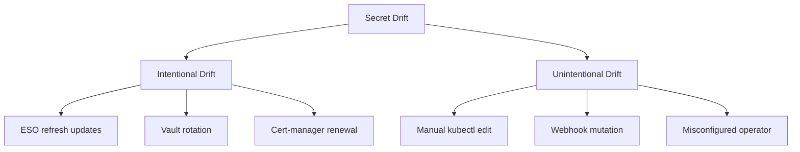

# How to Handle Secret Drift Detection in ArgoCD

Author: [nawazdhandala](https://github.com/nawazdhandala)

Tags: ArgoCD, GitOps, Kubernetes, Secrets, Configuration Drift

Description: Learn how to detect and handle secret drift in ArgoCD environments where Kubernetes secrets may diverge from their declared state due to external modifications, operator actions, or rotation processes.

---

Secret drift happens when the actual state of a Kubernetes Secret in your cluster no longer matches what ArgoCD expects based on Git. This can happen for many reasons: someone manually edited a secret with kubectl, an external secrets operator updated values, a Vault sidecar rotated credentials, or a controller mutated the secret after creation.

Detecting and handling this drift is essential for maintaining the integrity of your GitOps workflow. In this guide, I will walk you through the different types of secret drift, how ArgoCD detects them, and how to build a strategy that works for your environment.

## Understanding Secret Drift in ArgoCD

ArgoCD compares the desired state (from Git) with the live state (in the cluster) for every resource it manages. For regular resources like Deployments and Services, this comparison is straightforward. For Secrets, it gets complicated because:

1. Secret data is base64-encoded, and minor encoding differences can trigger false drifts
2. External operators (ESO, Sealed Secrets) modify secrets after creation
3. Kubernetes may add fields like `metadata.managedFields` or annotations
4. Manual edits via kubectl bypass the GitOps workflow
5. Secret rotation legitimately changes values

## Types of Secret Drift



The key is distinguishing between drift you expect and drift you do not. Your ArgoCD configuration should handle both cases differently.

## Detecting Secret Drift with ArgoCD

By default, ArgoCD will show Secrets as OutOfSync if any field differs from what is in Git. You can see this in the UI or CLI:

```bash
# Check for out-of-sync resources
argocd app get myapp --show-diff

# Get detailed diff for a specific resource
argocd app diff myapp --resource :Secret:my-secret
```

The diff output will show something like:

```diff
===== /v1, Kind=Secret, Namespace=production, Name=db-creds =====
  data:
-   password: b2xkX3Bhc3N3b3Jk  # Base64: old_password
+   password: bmV3X3Bhc3N3b3Jk  # Base64: new_password
```

## Strategy 1: Ignore Differences for Managed Secrets

If external tools like ESO or Sealed Secrets manage your secrets, tell ArgoCD to ignore the data field changes:

```yaml
apiVersion: argoproj.io/v1alpha1
kind: Application
metadata:
  name: myapp
  namespace: argocd
spec:
  project: default
  source:
    repoURL: https://github.com/your-org/apps.git
    targetRevision: main
    path: apps/myapp
  destination:
    server: https://kubernetes.default.svc
    namespace: production
  ignoreDifferences:
    - group: ""
      kind: Secret
      jsonPointers:
        - /data
        - /metadata/annotations/kubectl.kubernetes.io~1last-applied-configuration
    - group: ""
      kind: Secret
      name: managed-by-eso-*
      jqPathExpressions:
        - .data
        - .metadata.labels."reconcile.external-secrets.io/data-hash"
```

For a global configuration that applies to all applications, use the `argocd-cm` ConfigMap:

```yaml
apiVersion: v1
kind: ConfigMap
metadata:
  name: argocd-cm
  namespace: argocd
data:
  resource.customizations.ignoreDifferences.all: |
    managedFieldsManagers:
      - external-secrets
      - sealed-secrets-controller
```

## Strategy 2: Selective Drift Detection

Instead of ignoring all secret differences, you might want to detect drift only for secrets you manage directly in Git while ignoring operator-managed ones:

```yaml
apiVersion: argoproj.io/v1alpha1
kind: Application
metadata:
  name: myapp
  namespace: argocd
spec:
  ignoreDifferences:
    # Ignore data changes for secrets owned by ESO
    - group: ""
      kind: Secret
      jqPathExpressions:
        - select(.metadata.ownerReferences != null) | select(.metadata.ownerReferences[].kind == "ExternalSecret") | .data
    # Ignore data changes for secrets with sealed-secrets labels
    - group: ""
      kind: Secret
      jqPathExpressions:
        - select(.metadata.labels."sealedsecrets.bitnami.com/managed" == "true") | .data
```

## Strategy 3: Custom Drift Detection with Resource Hooks

For more sophisticated drift detection, use ArgoCD resource customizations to define custom health checks that detect unwanted drift:

```yaml
apiVersion: v1
kind: ConfigMap
metadata:
  name: argocd-cm
  namespace: argocd
data:
  resource.customizations.health.v1_Secret: |
    hs = {}
    if obj.metadata ~= nil and obj.metadata.annotations ~= nil then
      -- Check if the secret has a drift-detection annotation
      local expectedHash = obj.metadata.annotations["app.example.com/expected-hash"]
      if expectedHash ~= nil then
        local crypto = require("crypto")
        local actualHash = crypto.sha256(obj.data)
        if actualHash ~= expectedHash then
          hs.status = "Degraded"
          hs.message = "Secret data has drifted from expected hash"
          return hs
        end
      end
    end
    hs.status = "Healthy"
    return hs
```

## Strategy 4: Monitoring Drift with Metrics

ArgoCD exposes metrics that help you track drift over time:

```yaml
# PrometheusRule for secret drift monitoring
apiVersion: monitoring.coreos.com/v1
kind: PrometheusRule
metadata:
  name: argocd-secret-drift
  namespace: monitoring
spec:
  groups:
    - name: argocd-secret-drift
      rules:
        - alert: SecretDriftDetected
          expr: |
            argocd_app_info{sync_status="OutOfSync"} == 1
            and on(name, namespace)
            argocd_app_resource_info{kind="Secret", health_status!="Healthy"} == 1
          for: 15m
          labels:
            severity: warning
          annotations:
            summary: "Secret drift detected in ArgoCD app {{ $labels.name }}"
            description: "A Secret in application {{ $labels.name }} has been out of sync for 15 minutes"

        - alert: UnexpectedSecretModification
          expr: |
            increase(argocd_app_reconcile_count{dest_server!=""}[5m]) > 0
            and on(name)
            argocd_app_info{sync_status="OutOfSync"} == 1
          for: 5m
          labels:
            severity: critical
          annotations:
            summary: "Unexpected secret modification in {{ $labels.name }}"
```

## Strategy 5: Self-Healing for Intentional Drift

If you want ArgoCD to automatically correct drift (revert manual changes), enable self-healing:

```yaml
apiVersion: argoproj.io/v1alpha1
kind: Application
metadata:
  name: myapp
  namespace: argocd
spec:
  syncPolicy:
    automated:
      selfHeal: true
      prune: true
    syncOptions:
      - RespectIgnoreDifferences=true
```

The `RespectIgnoreDifferences=true` option is crucial. It tells the self-heal mechanism to not sync resources where the only differences are in ignored fields. Without this, ArgoCD might continuously try to sync secrets that are legitimately different due to operator management.

## Strategy 6: Audit Trail for Secret Changes

Track who changes secrets and when by enabling ArgoCD audit logging:

```yaml
apiVersion: v1
kind: ConfigMap
metadata:
  name: argocd-cm
  namespace: argocd
data:
  # Enable resource-level events
  resource.events.enable: "true"
```

Then query the audit log:

```bash
# View recent sync events for secrets
kubectl get events -n argocd --field-selector reason=ResourceUpdated \
  --sort-by='.lastTimestamp' | grep Secret

# Check ArgoCD application history
argocd app history myapp
```

For a comprehensive approach, use the Kubernetes audit policy:

```yaml
# audit-policy.yaml
apiVersion: audit.k8s.io/v1
kind: Policy
rules:
  - level: Metadata
    resources:
      - group: ""
        resources: ["secrets"]
    namespaces: ["production", "staging"]
```

## Building a Drift Detection Pipeline

Here is a complete approach that combines multiple strategies:

```yaml
# 1. Label secrets by management type
apiVersion: v1
kind: Secret
metadata:
  name: app-config
  namespace: production
  labels:
    secret-manager: "git"           # Managed directly in Git
    drift-detection: "enabled"      # Monitor for drift
type: Opaque
data:
  config.yaml: <base64-encoded>

---
# 2. ExternalSecret-managed secret (ESO adds labels automatically)
apiVersion: external-secrets.io/v1beta1
kind: ExternalSecret
metadata:
  name: api-credentials
  namespace: production
  labels:
    secret-manager: "eso"
    drift-detection: "disabled"  # ESO handles this
spec:
  refreshInterval: 15m
  secretStoreRef:
    name: vault-store
    kind: ClusterSecretStore
  target:
    name: api-credentials
```

```yaml
# 3. ArgoCD Application with selective ignore
apiVersion: argoproj.io/v1alpha1
kind: Application
metadata:
  name: production-app
  namespace: argocd
spec:
  ignoreDifferences:
    # Only ignore drift for ESO-managed secrets
    - group: ""
      kind: Secret
      jqPathExpressions:
        - select(.metadata.labels."secret-manager" == "eso") | .data
  syncPolicy:
    automated:
      selfHeal: true  # Correct drift for Git-managed secrets
    syncOptions:
      - RespectIgnoreDifferences=true
```

This setup means:
- Secrets labeled `secret-manager: git` will trigger OutOfSync if modified manually, and self-healing will revert them
- Secrets labeled `secret-manager: eso` will have their data changes ignored, letting ESO manage them freely

## Summary

Secret drift detection in ArgoCD requires a thoughtful approach that distinguishes between legitimate changes (from secret operators) and unauthorized modifications (manual edits). Use `ignoreDifferences` for secrets managed by external tools, enable self-healing with `RespectIgnoreDifferences` for secrets managed in Git, and set up monitoring to catch unexpected changes. The combination of these strategies gives you full visibility into your secret state while avoiding the noise of false positives. For related topics, check out our guide on [customizing diffs in ArgoCD](https://oneuptime.com/blog/post/2026-01-25-customize-diffs-argocd/view).
