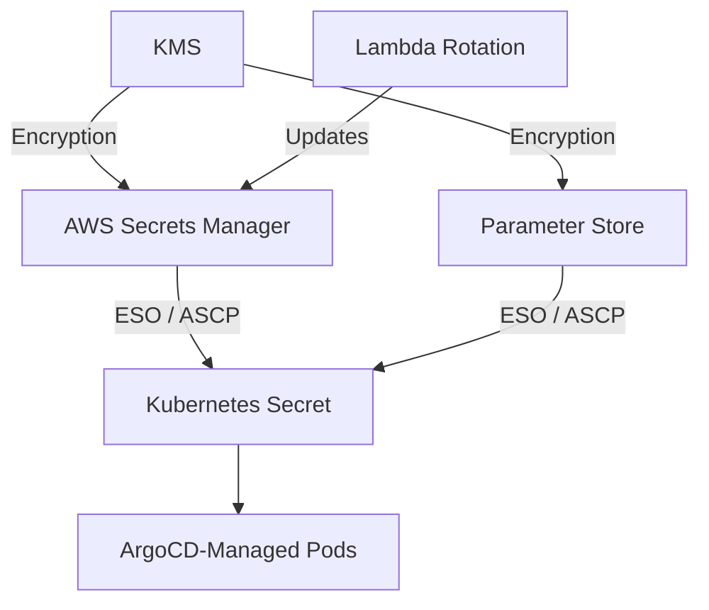

# How to Implement Secret Rotation with ArgoCD and AWS

Author: [nawazdhandala](https://github.com/nawazdhandala)

Tags: ArgoCD, GitOps, Kubernetes, AWS, Secrets

Description: Learn how to implement automated secret rotation with ArgoCD using AWS Secrets Manager, Parameter Store, and IAM Roles for Service Accounts.

---

AWS provides several services for secret management - Secrets Manager, Systems Manager Parameter Store, and KMS. Each can integrate with ArgoCD-managed Kubernetes workloads through the External Secrets Operator or the AWS Secrets and Configuration Provider (ASCP). This guide covers implementing automated secret rotation using AWS-native services with ArgoCD.

## AWS Secret Management Options

AWS offers three main services relevant to secret management in Kubernetes:

| Service | Best For | Rotation | Cost |
|---------|----------|----------|------|
| Secrets Manager | Database credentials, API keys | Built-in auto-rotation | $0.40/secret/month |
| Parameter Store | Configuration values, simple secrets | Manual or custom | Free for standard |
| KMS | Encryption keys | Automatic | $1/key/month |



## Setting Up IAM Roles for Service Accounts (IRSA)

ArgoCD-managed workloads need AWS credentials to access secrets. IRSA is the recommended approach:

```bash
# Create an IAM policy for reading secrets
aws iam create-policy \
  --policy-name ExternalSecretsPolicy \
  --policy-document '{
    "Version": "2012-10-17",
    "Statement": [
      {
        "Effect": "Allow",
        "Action": [
          "secretsmanager:GetSecretValue",
          "secretsmanager:DescribeSecret",
          "secretsmanager:ListSecretVersionIds"
        ],
        "Resource": "arn:aws:secretsmanager:us-east-1:123456789:secret:payments/*"
      },
      {
        "Effect": "Allow",
        "Action": [
          "ssm:GetParameter",
          "ssm:GetParametersByPath"
        ],
        "Resource": "arn:aws:ssm:us-east-1:123456789:parameter/payments/*"
      }
    ]
  }'

# Create the IRSA role
eksctl create iamserviceaccount \
  --name external-secrets \
  --namespace external-secrets \
  --cluster my-cluster \
  --attach-policy-arn arn:aws:iam::123456789:policy/ExternalSecretsPolicy \
  --approve
```

## Configuring External Secrets Operator for AWS

Deploy ESO and configure it to use AWS Secrets Manager:

```yaml
# ClusterSecretStore for AWS Secrets Manager
apiVersion: external-secrets.io/v1beta1
kind: ClusterSecretStore
metadata:
  name: aws-secrets-manager
spec:
  provider:
    aws:
      service: SecretsManager
      region: us-east-1
      auth:
        jwt:
          serviceAccountRef:
            name: external-secrets
            namespace: external-secrets
---
# ClusterSecretStore for AWS Parameter Store
apiVersion: external-secrets.io/v1beta1
kind: ClusterSecretStore
metadata:
  name: aws-parameter-store
spec:
  provider:
    aws:
      service: ParameterStore
      region: us-east-1
      auth:
        jwt:
          serviceAccountRef:
            name: external-secrets
            namespace: external-secrets
```

## Creating Secrets in AWS Secrets Manager

Store your secrets in AWS Secrets Manager:

```bash
# Create a database credential secret
aws secretsmanager create-secret \
  --name payments/database \
  --description "Payment service database credentials" \
  --secret-string '{
    "host": "payments-db.cluster-abc123.us-east-1.rds.amazonaws.com",
    "port": "5432",
    "username": "payment_svc",
    "password": "initial-secure-password",
    "dbname": "payments"
  }' \
  --tags Key=team,Value=payments Key=environment,Value=production
```

## Syncing AWS Secrets to Kubernetes with ArgoCD

Create ExternalSecret resources managed by ArgoCD:

```yaml
# ExternalSecret for AWS Secrets Manager
# This file is safe to store in Git - no secret values
apiVersion: external-secrets.io/v1beta1
kind: ExternalSecret
metadata:
  name: database-credentials
  namespace: payments
spec:
  refreshInterval: 15m
  secretStoreRef:
    name: aws-secrets-manager
    kind: ClusterSecretStore
  target:
    name: database-credentials
    creationPolicy: Owner
    template:
      type: Opaque
      data:
        DATABASE_URL: "postgresql://{{ .username }}:{{ .password }}@{{ .host }}:{{ .port }}/{{ .dbname }}?sslmode=require"
        DB_HOST: "{{ .host }}"
        DB_PORT: "{{ .port }}"
        DB_USERNAME: "{{ .username }}"
        DB_PASSWORD: "{{ .password }}"
        DB_NAME: "{{ .dbname }}"
  data:
    - secretKey: host
      remoteRef:
        key: payments/database
        property: host
    - secretKey: port
      remoteRef:
        key: payments/database
        property: port
    - secretKey: username
      remoteRef:
        key: payments/database
        property: username
    - secretKey: password
      remoteRef:
        key: payments/database
        property: password
    - secretKey: dbname
      remoteRef:
        key: payments/database
        property: dbname
```

## Implementing Automatic Rotation with AWS Secrets Manager

AWS Secrets Manager has built-in rotation support using Lambda functions. This is the most operationally simple approach.

### Step 1: Create the Rotation Lambda

For RDS credentials, AWS provides a pre-built rotation function:

```bash
# Enable rotation for the secret using AWS-provided Lambda
aws secretsmanager rotate-secret \
  --secret-id payments/database \
  --rotation-lambda-arn arn:aws:lambda:us-east-1:123456789:function:SecretsManagerRDSPostgreSQLRotation \
  --rotation-rules '{"AutomaticallyAfterDays": 30}'
```

For custom secrets, create a Lambda rotation function:

```python
# lambda_rotation.py - Custom rotation Lambda for API keys
import boto3
import json
import os
import secrets
import string

secretsmanager = boto3.client('secretsmanager')

def lambda_handler(event, context):
    """Handle rotation steps for AWS Secrets Manager."""
    secret_arn = event['SecretId']
    token = event['ClientRequestToken']
    step = event['Step']

    if step == "createSecret":
        create_secret(secret_arn, token)
    elif step == "setSecret":
        set_secret(secret_arn, token)
    elif step == "testSecret":
        test_secret(secret_arn, token)
    elif step == "finishSecret":
        finish_secret(secret_arn, token)

def create_secret(secret_arn, token):
    """Generate a new secret value."""
    # Get current secret
    current = secretsmanager.get_secret_value(
        SecretId=secret_arn,
        VersionStage="AWSCURRENT"
    )
    current_secret = json.loads(current['SecretString'])

    # Generate new password
    alphabet = string.ascii_letters + string.digits
    new_password = ''.join(secrets.choice(alphabet) for _ in range(32))

    # Store as pending
    current_secret['password'] = new_password
    secretsmanager.put_secret_value(
        SecretId=secret_arn,
        ClientRequestToken=token,
        SecretString=json.dumps(current_secret),
        VersionStages=['AWSPENDING']
    )

def set_secret(secret_arn, token):
    """Apply the new secret to the target service."""
    pending = secretsmanager.get_secret_value(
        SecretId=secret_arn,
        VersionId=token,
        VersionStage="AWSPENDING"
    )
    secret = json.loads(pending['SecretString'])

    # Update the database password
    # ... database-specific logic ...

def test_secret(secret_arn, token):
    """Test the new secret works."""
    pending = secretsmanager.get_secret_value(
        SecretId=secret_arn,
        VersionId=token,
        VersionStage="AWSPENDING"
    )
    secret = json.loads(pending['SecretString'])

    # Test database connection with new credentials
    # ... test logic ...

def finish_secret(secret_arn, token):
    """Finalize the rotation."""
    secretsmanager.update_secret_version_stage(
        SecretId=secret_arn,
        VersionStage="AWSCURRENT",
        MoveToVersionId=token,
        RemoveFromVersionId=get_current_version(secret_arn)
    )

def get_current_version(secret_arn):
    metadata = secretsmanager.describe_secret(SecretId=secret_arn)
    for version, stages in metadata['VersionIdsToStages'].items():
        if 'AWSCURRENT' in stages:
            return version
```

### Step 2: Deploy Rotation Infrastructure with ArgoCD

Manage the rotation Lambda and its configuration through ArgoCD:

```yaml
# ArgoCD Application for rotation infrastructure
apiVersion: argoproj.io/v1alpha1
kind: Application
metadata:
  name: secret-rotation-infra
  namespace: argocd
spec:
  source:
    repoURL: https://github.com/myorg/infrastructure
    path: terraform/secret-rotation
    targetRevision: main
    plugin:
      name: terraform
  destination:
    server: https://kubernetes.default.svc
    namespace: infrastructure
```

### Step 3: Ensure ESO Picks Up Rotated Secrets

Configure the ExternalSecret refresh interval to be shorter than the rotation period:

```yaml
# ESO refreshes more frequently than rotation happens
spec:
  # If rotation happens every 30 days, check every 15 minutes
  refreshInterval: 15m
```

When AWS Secrets Manager rotates the secret:
1. Lambda generates new credentials and updates the database
2. New secret version becomes AWSCURRENT
3. ESO detects the change during its next refresh cycle
4. ESO updates the Kubernetes Secret
5. Reloader or Stakater detects the Secret change
6. Application pods are gracefully restarted with new credentials

## Using Parameter Store for Configuration

For non-sensitive configuration that still needs GitOps management:

```yaml
# ExternalSecret for Parameter Store
apiVersion: external-secrets.io/v1beta1
kind: ExternalSecret
metadata:
  name: app-config
  namespace: payments
spec:
  refreshInterval: 5m
  secretStoreRef:
    name: aws-parameter-store
    kind: ClusterSecretStore
  target:
    name: app-config
    creationPolicy: Owner
  data:
    - secretKey: FEATURE_FLAGS
      remoteRef:
        key: /payments/feature-flags
    - secretKey: API_RATE_LIMIT
      remoteRef:
        key: /payments/api-rate-limit
```

## Multi-Region Secret Replication

For disaster recovery, replicate secrets across AWS regions:

```bash
# Enable secret replication
aws secretsmanager replicate-secret-to-regions \
  --secret-id payments/database \
  --add-replica-regions Region=us-west-2
```

Configure ESO to use the local region's secret:

```yaml
# Per-region ClusterSecretStore
apiVersion: external-secrets.io/v1beta1
kind: ClusterSecretStore
metadata:
  name: aws-secrets-manager-local
spec:
  provider:
    aws:
      service: SecretsManager
      # Each cluster uses its local region
      region: ${AWS_REGION}
      auth:
        jwt:
          serviceAccountRef:
            name: external-secrets
            namespace: external-secrets
```

## Monitoring Rotation Status

Monitor that rotation is happening correctly:

```bash
# Check rotation status
aws secretsmanager describe-secret \
  --secret-id payments/database \
  --query '{
    RotationEnabled: RotationEnabled,
    RotationRules: RotationRules,
    LastRotatedDate: LastRotatedDate,
    NextRotationDate: NextRotationDate
  }'

# Check for rotation failures
aws cloudwatch get-metric-statistics \
  --namespace AWS/SecretsManager \
  --metric-name RotationFailed \
  --dimensions Name=SecretName,Value=payments/database \
  --start-time $(date -u -d '7 days ago' +%Y-%m-%dT%H:%M:%SZ) \
  --end-time $(date -u +%Y-%m-%dT%H:%M:%SZ) \
  --period 86400 \
  --statistics Sum
```

## Summary

AWS Secrets Manager's built-in rotation combined with ArgoCD and the External Secrets Operator creates a robust, fully automated secret rotation pipeline. Secrets Manager handles the rotation logic through Lambda functions, ESO syncs the rotated secrets to Kubernetes, and ArgoCD ensures the ESO configuration is managed through GitOps. For RDS credentials, use the AWS-provided rotation functions. For custom secrets, write a Lambda that follows the four-step rotation protocol. For Vault-based rotation, see our guide on [secret rotation with ArgoCD and Vault](https://oneuptime.com/blog/post/2026-02-26-argocd-secret-rotation-vault/view).
