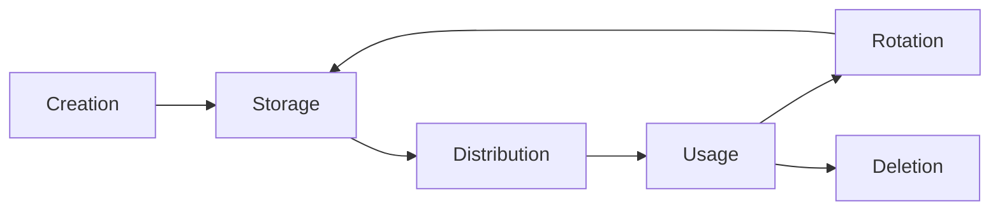

# How to Manage Kubernetes Secrets Lifecycle with ArgoCD

Author: [nawazdhandala](https://github.com/nawazdhandala)

Tags: ArgoCD, GitOps, Kubernetes, Secret, Security

Description: A comprehensive guide to managing the full lifecycle of Kubernetes secrets with ArgoCD, from creation through rotation to deletion, using GitOps best practices.

---

Managing secrets in Kubernetes is one of the trickiest parts of GitOps. The core principle of GitOps - everything in Git - conflicts directly with the requirement to keep secrets out of version control. This tension means secret lifecycle management needs careful design. ArgoCD provides several mechanisms and integrations that let you manage the full lifecycle of secrets - creation, distribution, rotation, and deletion - while maintaining GitOps principles.

## The Secret Lifecycle

Every secret goes through a predictable lifecycle:



Each phase presents unique challenges in a GitOps workflow:

- **Creation**: Where does the secret value come from?
- **Storage**: Where is the secret stored securely?
- **Distribution**: How does the secret reach the pods that need it?
- **Usage**: How do applications consume the secret?
- **Rotation**: How are secrets updated without downtime?
- **Deletion**: How are secrets cleaned up when no longer needed?

## Approach 1: External Secrets Operator (ESO)

The External Secrets Operator syncs secrets from external providers (Vault, AWS Secrets Manager, Azure Key Vault) into Kubernetes secrets. ArgoCD manages the ESO resources, not the secrets themselves.

```yaml
# ArgoCD Application managing External Secrets
apiVersion: argoproj.io/v1alpha1
kind: Application
metadata:
  name: payment-service-secrets
  namespace: argocd
spec:
  source:
    repoURL: https://github.com/myorg/payment-service
    path: k8s/secrets
    targetRevision: main
  destination:
    server: https://kubernetes.default.svc
    namespace: payments
  syncPolicy:
    automated:
      selfHeal: true
```

The Git repository contains ExternalSecret resources, not actual secret values:

```yaml
# k8s/secrets/database-credentials.yaml
# This is safe to store in Git - it references a secret, not the value
apiVersion: external-secrets.io/v1beta1
kind: ExternalSecret
metadata:
  name: database-credentials
  namespace: payments
spec:
  refreshInterval: 1h
  secretStoreRef:
    name: vault-backend
    kind: ClusterSecretStore
  target:
    name: database-credentials
    creationPolicy: Owner
    deletionPolicy: Retain
    template:
      type: Opaque
      data:
        DB_HOST: "{{ .host }}"
        DB_PORT: "{{ .port }}"
        DB_USERNAME: "{{ .username }}"
        DB_PASSWORD: "{{ .password }}"
  data:
    - secretKey: host
      remoteRef:
        key: payments/database
        property: host
    - secretKey: port
      remoteRef:
        key: payments/database
        property: port
    - secretKey: username
      remoteRef:
        key: payments/database
        property: username
    - secretKey: password
      remoteRef:
        key: payments/database
        property: password
```

### Managing the SecretStore

The SecretStore defines how ESO connects to the secret provider:

```yaml
# ClusterSecretStore for Vault
apiVersion: external-secrets.io/v1beta1
kind: ClusterSecretStore
metadata:
  name: vault-backend
spec:
  provider:
    vault:
      server: https://vault.example.com
      path: secret
      version: v2
      auth:
        kubernetes:
          mountPath: kubernetes
          role: external-secrets
          serviceAccountRef:
            name: external-secrets
            namespace: external-secrets
```

### Lifecycle with ESO

Creation:
```bash
# Create the secret in Vault (outside GitOps)
vault kv put secret/payments/database \
  host=db.payments.internal \
  port=5432 \
  username=payment_svc \
  password=s3cur3-p4ssw0rd
```

The ExternalSecret in Git triggers automatic syncing to Kubernetes. Rotation happens by updating the Vault value - ESO picks up changes based on `refreshInterval`.

Deletion:
```yaml
# Control what happens when the ExternalSecret is deleted
spec:
  target:
    # Retain: Keep the Kubernetes secret when ExternalSecret is removed
    deletionPolicy: Retain
    # Delete: Remove the Kubernetes secret when ExternalSecret is removed
    # deletionPolicy: Delete
    # Merge: Only remove keys managed by this ExternalSecret
    # deletionPolicy: Merge
```

## Approach 2: Sealed Secrets

Sealed Secrets encrypt secrets so they can be safely stored in Git:

```yaml
# Generate a SealedSecret from a regular secret
# This is done locally by the developer
apiVersion: bitnami.com/v1alpha1
kind: SealedSecret
metadata:
  name: api-keys
  namespace: payments
spec:
  encryptedData:
    # These values are encrypted with the cluster's public key
    API_KEY: AgBy8hHnB8...encrypted...
    API_SECRET: AgBy8hHnB8...encrypted...
  template:
    metadata:
      name: api-keys
      namespace: payments
    type: Opaque
```

### Lifecycle with Sealed Secrets

Creation:
```bash
# Create a secret and seal it
kubectl create secret generic api-keys \
  --from-literal=API_KEY=my-key \
  --from-literal=API_SECRET=my-secret \
  --dry-run=client -o yaml | \
  kubeseal --controller-name sealed-secrets \
  --controller-namespace kube-system \
  --format yaml > sealed-api-keys.yaml

# Commit the sealed secret to Git
git add sealed-api-keys.yaml
git commit -m "Add API keys for payment service"
```

Rotation:
```bash
# Create a new sealed secret with updated values
kubectl create secret generic api-keys \
  --from-literal=API_KEY=new-key \
  --from-literal=API_SECRET=new-secret \
  --dry-run=client -o yaml | \
  kubeseal --controller-name sealed-secrets \
  --controller-namespace kube-system \
  --format yaml > sealed-api-keys.yaml

# Commit and push - ArgoCD will sync the updated secret
git add sealed-api-keys.yaml
git commit -m "Rotate API keys for payment service"
git push
```

Deletion: Remove the SealedSecret from Git. ArgoCD's prune policy will delete it from the cluster.

## Approach 3: SOPS with ArgoCD

Mozilla SOPS encrypts specific values in YAML files, allowing encrypted secrets in Git:

```yaml
# secrets.enc.yaml - encrypted with SOPS
apiVersion: v1
kind: Secret
metadata:
  name: database-credentials
  namespace: payments
type: Opaque
stringData:
  DB_HOST: ENC[AES256_GCM,data:encrypted-host-value,tag:xxx]
  DB_PASSWORD: ENC[AES256_GCM,data:encrypted-password,tag:xxx]
sops:
  kms:
    - arn: arn:aws:kms:us-east-1:123456789:key/abc-123
  encrypted_regex: ^(data|stringData)$
  version: 3.8.0
```

Configure ArgoCD to decrypt SOPS files using the Helm secrets plugin or kustomize-sops:

```yaml
# ArgoCD ConfigMap for SOPS decryption
apiVersion: v1
kind: ConfigMap
metadata:
  name: argocd-cm
  namespace: argocd
data:
  configManagementPlugins: |
    - name: kustomize-sops
      generate:
        command: ["sh", "-c"]
        args: ["kustomize build . | ksops"]
```

## Secret Lifecycle Automation

### Automated Secret Creation with Init Jobs

Use ArgoCD sync hooks to initialize secrets when an application is first deployed:

```yaml
# PreSync hook to create initial secrets
apiVersion: batch/v1
kind: Job
metadata:
  name: init-secrets
  annotations:
    argocd.argoproj.io/hook: PreSync
    argocd.argoproj.io/hook-delete-policy: HookSucceeded
spec:
  template:
    spec:
      serviceAccountName: secret-initializer
      containers:
        - name: init
          image: vault:latest
          command:
            - /bin/sh
            - -c
            - |
              # Check if secret already exists in Vault
              if ! vault kv get secret/payments/database > /dev/null 2>&1; then
                # Generate initial credentials
                PASSWORD=$(openssl rand -base64 24)
                vault kv put secret/payments/database \
                  host=db.payments.internal \
                  port=5432 \
                  username=payment_svc \
                  password="$PASSWORD"
                echo "Initial secret created"
              else
                echo "Secret already exists, skipping"
              fi
      restartPolicy: Never
```

### Tracking Secret Freshness

Monitor how old your secrets are:

```yaml
# PrometheusRule for secret age monitoring
apiVersion: monitoring.coreos.com/v1
kind: PrometheusRule
metadata:
  name: secret-freshness
spec:
  groups:
    - name: secret-age
      rules:
        - alert: SecretNotRotated
          expr: |
            (time() - kube_secret_created) > 7776000
          for: 1h
          labels:
            severity: warning
          annotations:
            summary: "Secret {{ $labels.namespace }}/{{ $labels.secret }} has not been rotated in 90 days"
```

### Cleanup Orphaned Secrets

When ArgoCD deletes an application, ensure related secrets are cleaned up:

```yaml
# Use finalizers and sync hooks for cleanup
apiVersion: argoproj.io/v1alpha1
kind: Application
metadata:
  name: payment-service
  namespace: argocd
  finalizers:
    - resources-finalizer.argocd.argoproj.io
spec:
  syncPolicy:
    automated:
      prune: true  # Delete resources removed from Git
    syncOptions:
      - PruneLast=true  # Delete secrets after other resources
```

For secrets stored in external providers, use a PostDelete hook:

```yaml
# PostDelete hook to clean up Vault secrets
apiVersion: batch/v1
kind: Job
metadata:
  name: cleanup-secrets
  annotations:
    argocd.argoproj.io/hook: PostDelete
    argocd.argoproj.io/hook-delete-policy: HookSucceeded
spec:
  template:
    spec:
      containers:
        - name: cleanup
          image: vault:latest
          command:
            - /bin/sh
            - -c
            - |
              vault kv metadata delete secret/payments/database
              echo "Secret cleaned up from Vault"
      restartPolicy: Never
```

## Best Practices for Secret Lifecycle

1. **Never store plain-text secrets in Git** - Use ESO, Sealed Secrets, or SOPS
2. **Set refresh intervals** - ESO should check for updates regularly (every 1 to 6 hours)
3. **Use deletion policies** - Control what happens when ExternalSecret resources are removed
4. **Monitor secret age** - Alert when secrets have not been rotated within your policy window
5. **Automate rotation** - Manual rotation is error-prone; automate it
6. **Test rotation** - Ensure applications handle secret changes gracefully (no restarts needed, or graceful restarts)
7. **Audit access** - Log who reads and modifies secrets

## Summary

Managing the full lifecycle of Kubernetes secrets with ArgoCD requires choosing the right tool for your environment - External Secrets Operator for cloud provider integration, Sealed Secrets for simplicity, or SOPS for inline encryption. Each approach handles creation, distribution, rotation, and deletion differently. The key is making secret lifecycle management as automated and GitOps-native as possible while maintaining security. For more on specific rotation strategies, see our guides on [secret rotation with Vault](https://oneuptime.com/blog/post/2026-02-26-argocd-secret-rotation-vault/view) and [secret rotation with AWS](https://oneuptime.com/blog/post/2026-02-26-argocd-secret-rotation-aws/view).
