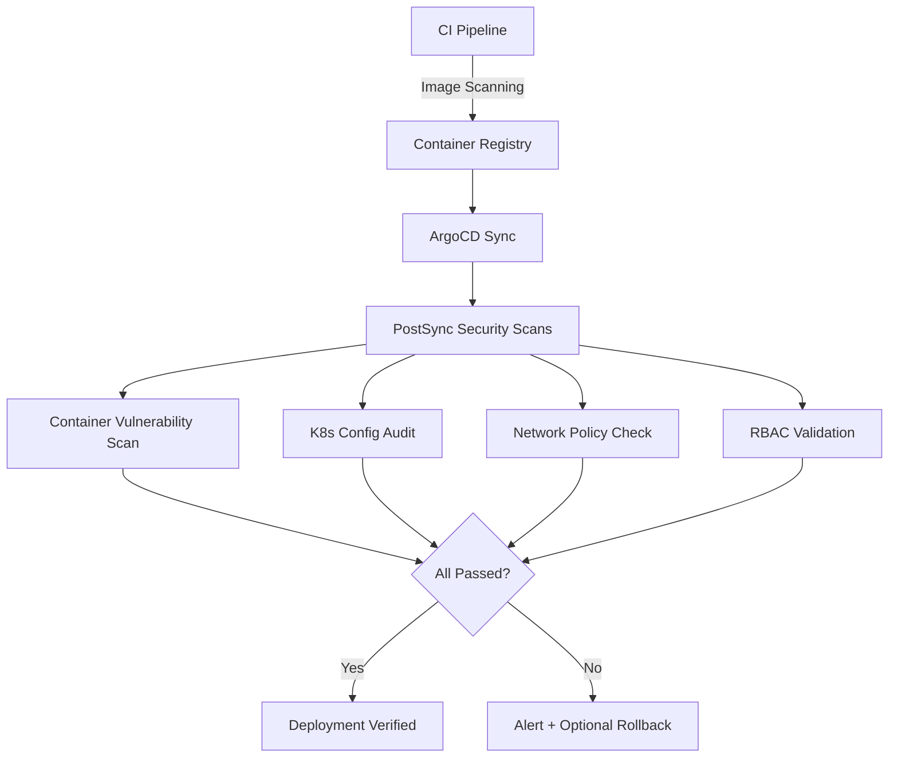

# How to Implement Security Scanning as PostSync Hook in ArgoCD

Author: [nawazdhandala](https://github.com/nawazdhandala)

Tags: ArgoCD, GitOps, Kubernetes, Security, DevSecOps

Description: Learn how to run automated security scans after ArgoCD deployments using PostSync hooks with tools like Trivy, Kubescape, and kube-bench to catch vulnerabilities and misconfigurations.

---

Shifting security left is great, but you also need security checks at the point of deployment. Container images might pass CI scanning with zero vulnerabilities and then get deployed with misconfigured RBAC, exposed services, or missing network policies. Running security scans as ArgoCD PostSync hooks catches configuration-level security issues that pre-deployment scanning misses.

This guide walks through implementing runtime security scanning as a PostSync hook, covering container vulnerability scanning, Kubernetes security posture checks, and compliance validation.

## What to Scan After Deployment

Security scanning in the deployment pipeline serves a different purpose than scanning in CI. You are validating the deployed state, not just the artifacts:



The focus areas for post-deployment security scanning are:

- Running container vulnerability checks against the actual deployed images
- Kubernetes security configuration audit (SecurityContext, resource limits, privilege escalation)
- Network policy validation
- RBAC configuration review
- Secrets management validation

## Container Scanning with Trivy

Trivy is an excellent open-source scanner that covers container images, Kubernetes configs, and more. Here is how to run it as a PostSync hook:

```yaml
apiVersion: batch/v1
kind: Job
metadata:
  name: security-scan-trivy
  annotations:
    argocd.argoproj.io/hook: PostSync
    argocd.argoproj.io/hook-delete-policy: BeforeHookCreation,HookSucceeded
spec:
  backoffLimit: 0
  activeDeadlineSeconds: 600
  template:
    spec:
      restartPolicy: Never
      serviceAccountName: security-scanner
      containers:
        - name: trivy
          image: aquasec/trivy:0.49.0
          command:
            - sh
            - -c
            - |
              echo "=== Security Scan: Container Images ==="

              # Get all running images in the namespace
              NAMESPACE=${NAMESPACE:-default}
              IMAGES=$(kubectl get pods -n "$NAMESPACE" \
                -o jsonpath='{range .items[*]}{range .spec.containers[*]}{.image}{"\n"}{end}{end}' \
                | sort -u)

              FAILURES=0

              for IMAGE in $IMAGES; do
                echo ""
                echo "Scanning: $IMAGE"
                echo "---"

                # Scan for CRITICAL and HIGH vulnerabilities
                trivy image --severity CRITICAL,HIGH \
                  --exit-code 1 \
                  --no-progress \
                  --format table \
                  "$IMAGE"

                if [ $? -ne 0 ]; then
                  echo "FAIL: Critical/High vulnerabilities found in $IMAGE"
                  FAILURES=$((FAILURES + 1))
                else
                  echo "PASS: No critical/high vulnerabilities"
                fi
              done

              echo ""
              echo "=== Scan Complete ==="

              if [ "$FAILURES" -gt 0 ]; then
                echo "$FAILURES image(s) have critical/high vulnerabilities"
                # Exit 1 to fail the sync, or exit 0 to just report
                exit 1
              fi

              echo "All images passed security scan"
          env:
            - name: NAMESPACE
              valueFrom:
                fieldRef:
                  fieldPath: metadata.namespace
```

You need a ServiceAccount with permissions to list pods:

```yaml
apiVersion: v1
kind: ServiceAccount
metadata:
  name: security-scanner
---
apiVersion: rbac.authorization.k8s.io/v1
kind: Role
metadata:
  name: security-scanner
rules:
  - apiGroups: [""]
    resources: ["pods"]
    verbs: ["get", "list"]
  - apiGroups: ["apps"]
    resources: ["deployments", "replicasets"]
    verbs: ["get", "list"]
---
apiVersion: rbac.authorization.k8s.io/v1
kind: RoleBinding
metadata:
  name: security-scanner
subjects:
  - kind: ServiceAccount
    name: security-scanner
roleRef:
  kind: Role
  name: security-scanner
  apiGroup: rbac.authorization.k8s.io
```

## Kubernetes Configuration Audit with Kubescape

Kubescape checks your deployed resources against security frameworks like NSA-CISA, MITRE ATT&CK, and CIS Benchmarks:

```yaml
apiVersion: batch/v1
kind: Job
metadata:
  name: security-scan-kubescape
  annotations:
    argocd.argoproj.io/hook: PostSync
    argocd.argoproj.io/sync-wave: "1"
    argocd.argoproj.io/hook-delete-policy: BeforeHookCreation,HookSucceeded
spec:
  backoffLimit: 0
  activeDeadlineSeconds: 300
  template:
    spec:
      restartPolicy: Never
      serviceAccountName: security-scanner
      containers:
        - name: kubescape
          image: quay.io/kubescape/kubescape:v3.0
          command:
            - kubescape
          args:
            - scan
            - framework
            - nsa
            - --include-namespaces
            - $(NAMESPACE)
            - --compliance-threshold
            - "80"
            - --format
            - pretty-printer
            - --output
            - /tmp/kubescape-report.txt
          env:
            - name: NAMESPACE
              valueFrom:
                fieldRef:
                  fieldPath: metadata.namespace
```

The `--compliance-threshold` flag makes Kubescape exit with a non-zero code if the compliance score drops below 80%, which fails the ArgoCD sync.

## Network Policy Validation

Verify that your namespace has proper network policies in place:

```yaml
apiVersion: batch/v1
kind: Job
metadata:
  name: security-scan-netpol
  annotations:
    argocd.argoproj.io/hook: PostSync
    argocd.argoproj.io/sync-wave: "1"
    argocd.argoproj.io/hook-delete-policy: BeforeHookCreation,HookSucceeded
spec:
  backoffLimit: 0
  activeDeadlineSeconds: 120
  template:
    spec:
      restartPolicy: Never
      serviceAccountName: security-scanner
      containers:
        - name: netpol-check
          image: bitnami/kubectl:1.29
          command:
            - sh
            - -c
            - |
              NAMESPACE=${NAMESPACE:-default}
              FAILURES=0

              echo "=== Network Policy Validation ==="

              # Check that network policies exist
              NETPOL_COUNT=$(kubectl get networkpolicies -n "$NAMESPACE" \
                --no-headers 2>/dev/null | wc -l)

              if [ "$NETPOL_COUNT" -eq 0 ]; then
                echo "FAIL: No NetworkPolicies found in $NAMESPACE"
                FAILURES=$((FAILURES + 1))
              else
                echo "PASS: $NETPOL_COUNT NetworkPolicy(ies) found"
              fi

              # Check that a default deny policy exists
              DEFAULT_DENY=$(kubectl get networkpolicies -n "$NAMESPACE" \
                -o json | python3 -c "
              import json, sys
              data = json.load(sys.stdin)
              for pol in data.get('items', []):
                spec = pol.get('spec', {})
                # A default deny has empty podSelector and no ingress rules
                if not spec.get('podSelector', {}).get('matchLabels') and \
                   not spec.get('ingress'):
                  print('found')
                  sys.exit(0)
              print('not_found')
              " 2>/dev/null)

              if [ "$DEFAULT_DENY" != "found" ]; then
                echo "WARN: No default deny NetworkPolicy found"
              else
                echo "PASS: Default deny NetworkPolicy exists"
              fi

              # Check pods are not running as root
              ROOT_PODS=$(kubectl get pods -n "$NAMESPACE" -o json | python3 -c "
              import json, sys
              data = json.load(sys.stdin)
              root_pods = []
              for pod in data.get('items', []):
                for container in pod['spec'].get('containers', []):
                  sc = container.get('securityContext', {})
                  if sc.get('runAsUser') == 0 or \
                     sc.get('runAsNonRoot') is False:
                    root_pods.append(pod['metadata']['name'])
              for p in set(root_pods):
                print(p)
              ")

              if [ -n "$ROOT_PODS" ]; then
                echo "FAIL: Pods running as root:"
                echo "$ROOT_PODS"
                FAILURES=$((FAILURES + 1))
              else
                echo "PASS: No pods running as root"
              fi

              # Check for privileged containers
              PRIV_CONTAINERS=$(kubectl get pods -n "$NAMESPACE" -o json | python3 -c "
              import json, sys
              data = json.load(sys.stdin)
              for pod in data.get('items', []):
                for container in pod['spec'].get('containers', []):
                  sc = container.get('securityContext', {})
                  if sc.get('privileged'):
                    print(f\"{pod['metadata']['name']}/{container['name']}\")
              ")

              if [ -n "$PRIV_CONTAINERS" ]; then
                echo "FAIL: Privileged containers found:"
                echo "$PRIV_CONTAINERS"
                FAILURES=$((FAILURES + 1))
              else
                echo "PASS: No privileged containers"
              fi

              echo ""
              if [ "$FAILURES" -gt 0 ]; then
                echo "Security scan failed with $FAILURES issue(s)"
                exit 1
              fi
              echo "All security checks passed"
          env:
            - name: NAMESPACE
              valueFrom:
                fieldRef:
                  fieldPath: metadata.namespace
```

## CIS Benchmark Scanning with kube-bench

For cluster-level security validation, run kube-bench to check against CIS Kubernetes Benchmarks:

```yaml
apiVersion: batch/v1
kind: Job
metadata:
  name: security-scan-cis
  annotations:
    argocd.argoproj.io/hook: PostSync
    argocd.argoproj.io/sync-wave: "2"
    argocd.argoproj.io/hook-delete-policy: BeforeHookCreation,HookSucceeded
spec:
  backoffLimit: 0
  activeDeadlineSeconds: 300
  template:
    spec:
      restartPolicy: Never
      hostPID: true
      containers:
        - name: kube-bench
          image: aquasec/kube-bench:v0.7.1
          command:
            - kube-bench
            - run
            - --targets
            - node
            - --json
          volumeMounts:
            - name: var-lib-kubelet
              mountPath: /var/lib/kubelet
              readOnly: true
            - name: etc-kubernetes
              mountPath: /etc/kubernetes
              readOnly: true
      volumes:
        - name: var-lib-kubelet
          hostPath:
            path: /var/lib/kubelet
        - name: etc-kubernetes
          hostPath:
            path: /etc/kubernetes
```

## Reporting Security Findings

Send security scan results to a central location for tracking and auditing:

```yaml
containers:
  - name: trivy-with-reporting
    image: aquasec/trivy:0.49.0
    command:
      - sh
      - -c
      - |
        # Run scan and save JSON report
        trivy image --format json \
          --output /tmp/scan-results.json \
          --severity CRITICAL,HIGH \
          "$TARGET_IMAGE"

        scan_exit=$?

        # Upload results to your security dashboard
        curl -X POST "$SECURITY_DASHBOARD_URL/api/v1/scans" \
          -H "Authorization: Bearer $API_TOKEN" \
          -H "Content-Type: application/json" \
          -d @/tmp/scan-results.json

        # Send alert on critical findings
        if [ $scan_exit -ne 0 ]; then
          curl -X POST "$SLACK_WEBHOOK" \
            -H "Content-Type: application/json" \
            -d "{
              \"text\": \"Security scan found critical vulnerabilities after deployment in $NAMESPACE\",
              \"attachments\": [{
                \"color\": \"danger\",
                \"text\": \"Review findings at $SECURITY_DASHBOARD_URL\"
              }]
            }"
        fi

        exit $scan_exit
    env:
      - name: SECURITY_DASHBOARD_URL
        value: "https://security.internal.company.com"
      - name: API_TOKEN
        valueFrom:
          secretKeyRef:
            name: security-dashboard
            key: token
      - name: SLACK_WEBHOOK
        valueFrom:
          secretKeyRef:
            name: slack-webhook
            key: url
```

## Orchestrating Multiple Security Scans

Use sync waves to run scans in order, from fastest to slowest:

```yaml
# Wave 1: Quick checks (< 30 seconds)
# - Network policy validation
# - SecurityContext checks

# Wave 2: Container scanning (1-3 minutes)
# - Trivy image scans

# Wave 3: Comprehensive audit (3-5 minutes)
# - Kubescape framework scan
# - CIS benchmarks
```

This way, fast checks catch obvious issues before you spend time on comprehensive scans.

For more on ArgoCD resource hooks and how to structure PostSync workflows, see our guide on [ArgoCD resource hooks](https://oneuptime.com/blog/post/2026-01-25-resource-hooks-argocd/view).

## When to Block vs Warn

Not every security finding should block a deployment. Use a tiered approach:

- **Block (exit 1)**: Critical vulnerabilities, privileged containers, missing network policies
- **Warn (exit 0 with notification)**: High vulnerabilities with no known exploit, missing resource limits, non-critical CIS findings
- **Info (log only)**: Medium/low vulnerabilities, informational findings

Configure OneUptime to track security scan outcomes over time and alert your security team when findings trend upward, even if individual scans pass.

## Best Practices

1. **Cache vulnerability databases** - Use a PersistentVolume to cache Trivy's vulnerability database between runs to speed up scans.
2. **Set scan timeouts** - Container scanning can be slow for large images. Set `activeDeadlineSeconds` accordingly.
3. **Version your security policies** - Keep scan configurations in Git alongside your application manifests.
4. **Run scans in a dedicated namespace** - Avoid giving security scanner service accounts broad cluster access.
5. **Correlate with CI scans** - Compare PostSync findings with CI findings to catch newly introduced issues.
6. **Review findings regularly** - Do not let accepted risks accumulate without review.

Post-deployment security scanning fills the gap between CI-time scanning and runtime protection. ArgoCD PostSync hooks make it automatic, and failing the sync on critical findings ensures security issues are addressed before they persist in production.
