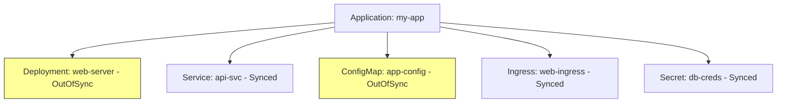

# How to Use Selective Sync from the ArgoCD UI

Author: [nawazdhandala](https://github.com/nawazdhandala)

Tags: ArgoCD, GitOps, Kubernetes, UI, Selective Sync

Description: A visual walkthrough of using the ArgoCD web UI to selectively sync individual resources or groups of resources within an application.

---

The ArgoCD web UI provides an intuitive way to sync specific resources without touching the rest of your application. While the CLI is more scriptable, the UI gives you a visual overview of what is out of sync and lets you pick exactly what to deploy. This guide walks through every method for selective sync available in the ArgoCD UI.

## Method 1: Sync from the Resource Tree

The most common way to selectively sync a resource is through the application's resource tree view.

Open your application in the ArgoCD UI. You will see the resource tree showing all Kubernetes resources managed by the application. Resources that are out of sync display a yellow "OutOfSync" badge.

Click on the specific resource you want to sync. A detail panel opens on the right side showing the resource's current state, sync status, and health.

In the detail panel, look for the actions menu. You can either click the three-dot menu icon or look for a "Sync" button directly on the resource. Click "Sync" to trigger a sync for just that resource.

A confirmation dialog appears showing the resource details and any sync options. Review the details and click "Synchronize" to proceed.

## Method 2: Sync Dialog with Resource Selection

For syncing multiple specific resources at once, use the application-level sync dialog with resource filtering.

Click the "Sync" button at the top of the application page. The sync dialog opens with a list of all resources in the application.

At the top of the resource list, there is a checkbox labeled "All" or "Select All". Uncheck this to deselect all resources. Then manually check only the resources you want to sync.

The resource list shows each resource with its kind, name, namespace, and current sync status. Resources that are out of sync are typically highlighted. Check the boxes next to the resources you want to include in the sync.

You can also use the sync options in this dialog. Common options include:

- **Prune**: Delete resources that no longer exist in Git
- **Dry Run**: Preview what would change without applying
- **Apply Only**: Skip any pre/post sync hooks
- **Force**: Delete and recreate resources instead of patching

After selecting your resources and options, click "Synchronize" to start the selective sync.

## Method 3: Filtering Resources in the Sync Dialog

The sync dialog supports filtering to help you find specific resources in large applications.

When the sync dialog is open and shows the resource list, use the filter or search functionality at the top of the list. You can filter by:

- **Kind**: Show only Deployments, ConfigMaps, or other specific resource types
- **Sync Status**: Show only OutOfSync resources
- **Health Status**: Show only Degraded or Progressing resources
- **Name**: Search for resources by name

This is particularly useful for applications with many resources. Instead of scrolling through 50+ resources, filter to show only what you need, select them, and sync.

## Method 4: Sync from the Resource Actions Menu

Each resource in the resource tree has an actions menu accessible by right-clicking or clicking the three-dot icon. The actions menu includes several options.

**Sync**: Triggers a sync for just this resource. Same as Method 1.

**Delete**: Removes the resource from the cluster. Use with caution.

**Diff**: Shows the difference between the live state and the desired state (Git). Useful for reviewing what a sync would change before actually syncing.

**Logs**: Shows container logs for pod-based resources. Not available for non-pod resources.

The Diff action is particularly valuable before a selective sync. It shows you exactly what will change, so you can verify the update is correct before applying it.

## Understanding Sync Status Indicators

The UI uses color-coded indicators to show resource status.

| Indicator | Meaning |
|---|---|
| Green checkmark | Synced and Healthy |
| Yellow circle | OutOfSync - resource differs from Git |
| Red heart | Degraded - resource is unhealthy |
| Blue spinner | Progressing - resource is being updated |
| Grey question | Unknown - ArgoCD cannot determine status |
| Missing icon | Missing - resource exists in Git but not in cluster |

When selectively syncing, focus on resources with yellow (OutOfSync) or missing indicators. These are the resources where the live state differs from your Git repository.

## Reviewing Changes Before Sync

Before syncing any resource, review what will change. Click on the out-of-sync resource in the resource tree. In the detail panel, click the "Diff" tab.

The diff view shows a side-by-side or unified comparison of the live state versus the desired state. Look for:

- Changed configuration values
- Updated image tags
- Added or removed environment variables
- Modified resource limits or requests
- New or removed annotations and labels

This visual diff is one of the main advantages of using the UI for selective sync. You get immediate visual feedback about what will change.

## Monitoring Sync Progress

After triggering a selective sync, the UI shows real-time progress.

The synced resource's status indicator changes to a blue spinner while the sync is in progress. Once complete, it transitions to either a green checkmark (success) or a red indicator (failure).

Click on the resource during sync to see the detailed sync status in the info panel. You can also check the "Events" tab to see Kubernetes events related to the resource.

For Deployments, the UI shows the rollout progress, including how many replicas are updated and ready.

## Handling Sync Failures in the UI

If a selective sync fails, the resource shows a red status indicator. Click on the resource to see the error details.

Common failure reasons visible in the UI:

- **Validation error**: The resource YAML is invalid
- **Conflict**: Another process modified the resource simultaneously
- **Permission denied**: The ArgoCD service account lacks permissions
- **Resource quota exceeded**: The namespace has hit its resource limits

The error message in the detail panel usually tells you exactly what went wrong. Fix the issue in your Git repository, push the change, and try the selective sync again.

## Selective Sync and Application Health

After a selective sync, the overall application status might still show "OutOfSync" if there are other resources that were not included in your sync. This is normal.

The application health status reflects the worst health among all resources. If you selectively synced one resource but another resource in the application is degraded, the application will still show as degraded.

To see a clear picture of what is synced and what is not, use the resource list view with sync status filtering. This shows you exactly which resources still need attention.

## When to Prefer UI Over CLI for Selective Sync

The UI is better when you want to visually review changes before applying them. The diff view gives immediate context about what will change.

The UI is also better for exploratory operations, where you are investigating which resources are out of sync and deciding what to sync based on what you see.

The CLI is better for scripted and repeatable operations. If you are integrating selective sync into a CI/CD pipeline or running it frequently, the CLI's command-line interface is more efficient.

For both approaches, the underlying ArgoCD API operation is the same. The UI and CLI are just different interfaces to the same sync mechanism.

For the CLI approach, see the [selective sync CLI guide](https://oneuptime.com/blog/post/2026-02-26-argocd-selective-sync-cli/view). For syncing specific resource types, check the [syncing specific kinds guide](https://oneuptime.com/blog/post/2026-02-26-argocd-sync-specific-resource-kinds/view).
