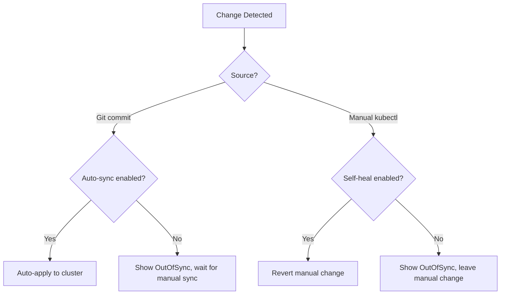

# ArgoCD Self-Healing vs Manual Sync: What to Choose

Author: [nawazdhandala](https://github.com/nawazdhandala)

Tags: ArgoCD, GitOps, Kubernetes, Deployment Strategy

Description: Compare ArgoCD self-healing automatic sync with manual sync approaches and learn when to use each strategy for different environments and workflows.

---

One of the first configuration decisions with ArgoCD is whether to enable auto-sync with self-healing or require manual syncs. Auto-sync means ArgoCD automatically applies changes from Git and reverts any manual changes in the cluster. Manual sync means humans must explicitly trigger each deployment.

Both approaches have strong advocates, and the right choice depends on your team's maturity, risk tolerance, and operational needs.

## What Self-Healing Actually Does

Self-healing in ArgoCD has two components:

1. **Auto-sync**: When ArgoCD detects a difference between Git and the cluster, it automatically applies the Git state. This covers both new commits to Git and manual changes in the cluster.

2. **Self-heal specifically**: When someone or something modifies a resource in the cluster directly (using kubectl, the Kubernetes dashboard, or another tool), ArgoCD detects the drift and reverts the change to match Git.

```yaml
apiVersion: argoproj.io/v1alpha1
kind: Application
metadata:
  name: my-app
  namespace: argocd
spec:
  syncPolicy:
    automated:
      # Auto-sync: apply Git changes automatically
      prune: true
      # Self-heal: revert manual cluster changes
      selfHeal: true
```

Without `selfHeal: true`, ArgoCD auto-syncs when Git changes but does NOT revert manual cluster changes. The distinction matters.



## The Case for Self-Healing

Self-healing is the purest form of GitOps. Git is the single source of truth, period. Any deviation gets corrected.

**Prevents configuration drift**: In any environment with multiple people and tools, drift happens. Someone scales a deployment manually to handle load and forgets to change it back. A debugging session leaves extra ConfigMaps around. Self-healing cleans all of this up.

**Enforces process**: When self-healing is enabled, the only way to make lasting changes is through Git. This forces the team to follow the proper PR review workflow for every change.

**Faster deployments**: No waiting for someone to click "Sync". Merge a PR and the change is live within minutes (or seconds with webhooks).

**Incident recovery**: If a cluster resource is accidentally deleted or modified, self-healing restores it automatically without human intervention.

### When to Use Self-Healing

- Production environments where consistency is critical
- Environments with strict change management requirements
- Teams that are fully committed to GitOps discipline
- Services that must always match their declared state
- Environments where manual cluster access is restricted

## The Case for Manual Sync

Manual sync gives humans a gate between a Git merge and a deployment. This is valuable in several scenarios.

**Controlled rollouts**: You want to merge PRs on your schedule and deploy on a separate schedule. Maybe you merge features during the day and deploy during maintenance windows.

**Emergency debugging**: During an incident, you might need to make temporary changes in the cluster (scaling up, enabling debug logging, applying hotfixes) without self-healing reverting them immediately.

**New team adoption**: Teams new to GitOps often need a learning period. Manual sync lets them see what ArgoCD would do before it does it. This builds trust in the system.

**Dependent deployments**: Some deployments need coordination. Database migrations might need to run before the application updates. Manual sync gives you control over timing.

### When to Use Manual Sync

- Environments where deployment timing matters (maintenance windows)
- During initial GitOps adoption while the team builds confidence
- Services with complex deployment dependencies
- Environments where emergency cluster access is common

## The Hybrid Approach (My Recommendation)

Most teams benefit from a hybrid approach that varies by environment and application criticality.

```yaml
# Development: full auto-sync with self-healing
# Changes are deployed instantly, drift is corrected
apiVersion: argoproj.io/v1alpha1
kind: Application
metadata:
  name: my-app-dev
spec:
  syncPolicy:
    automated:
      prune: true
      selfHeal: true

---
# Staging: auto-sync but no self-healing
# Git changes deploy automatically, but manual debugging changes persist
apiVersion: argoproj.io/v1alpha1
kind: Application
metadata:
  name: my-app-staging
spec:
  syncPolicy:
    automated:
      prune: true
      selfHeal: false

---
# Production: manual sync
# Every deployment requires explicit human approval
apiVersion: argoproj.io/v1alpha1
kind: Application
metadata:
  name: my-app-production
spec:
  syncPolicy: {}  # No auto-sync, no self-healing
```

This gives you fast iteration in development, reasonable automation in staging, and full control in production.

## Gradually Enabling Self-Healing

If you are moving from manual sync to self-healing, do it incrementally.

### Step 1: Enable Auto-Sync Without Self-Healing

```yaml
syncPolicy:
  automated:
    prune: false  # Do not auto-delete removed resources
    selfHeal: false  # Do not revert manual changes
```

This deploys Git changes automatically but leaves manual changes alone. It is the safest auto-sync configuration.

### Step 2: Add Pruning

```yaml
syncPolicy:
  automated:
    prune: true  # Auto-delete resources removed from Git
    selfHeal: false
```

Now ArgoCD both creates and deletes resources based on Git. Resources removed from Git are cleaned up automatically.

### Step 3: Enable Self-Healing

```yaml
syncPolicy:
  automated:
    prune: true
    selfHeal: true
```

Full GitOps. Every change must go through Git.

### Step 4: Restrict Cluster Access

The final step is removing direct cluster access for most team members. If people can still kubectl into the cluster, they might make changes that self-healing reverts, causing confusion.

```yaml
# RBAC: give developers read-only cluster access
apiVersion: rbac.authorization.k8s.io/v1
kind: ClusterRoleBinding
metadata:
  name: developers-readonly
subjects:
  - kind: Group
    name: developers
roleRef:
  kind: ClusterRole
  name: view
  apiGroup: rbac.authorization.k8s.io
```

## Handling Emergencies with Self-Healing

The biggest concern with self-healing is "what if I need to make a quick change during an incident?" There are several approaches.

**Disable auto-sync temporarily**: ArgoCD lets you disable auto-sync without changing the Application spec.

```bash
# Disable auto-sync during an incident
argocd app set my-app --sync-policy none

# Make your emergency changes directly
kubectl -n my-app scale deployment my-app --replicas=10

# After the incident, re-enable and sync from Git
argocd app set my-app --sync-policy automated
argocd app sync my-app
```

**Use sync windows**: Define maintenance windows during which auto-sync is allowed.

```yaml
apiVersion: argoproj.io/v1alpha1
kind: AppProject
metadata:
  name: production
spec:
  syncWindows:
    - kind: allow
      schedule: '0 6-18 * * 1-5'  # Allow sync Mon-Fri 6AM-6PM
      duration: 12h
    - kind: deny
      schedule: '0 0 * * 0'  # Deny sync on Sundays
      duration: 24h
```

**Annotate specific resources to skip self-healing**:

```yaml
metadata:
  annotations:
    argocd.argoproj.io/sync-options: Prune=false
```

## Monitoring Sync Behavior

Whether you use self-healing or manual sync, monitor how your applications behave.

For self-healing environments, watch for applications that keep self-healing repeatedly - this indicates someone or something is continuously modifying cluster state, which should be investigated.

For manual sync environments, monitor for applications that stay OutOfSync for too long - this might indicate that deployments are being forgotten.

[OneUptime](https://oneuptime.com) can monitor your ArgoCD applications and alert you on both sync failures and prolonged OutOfSync states, giving you confidence in whichever sync strategy you choose.

The best approach is the one that matches your team's maturity. Start with manual sync if you are new to GitOps, enable auto-sync as you build confidence, and graduate to full self-healing when your team trusts the workflow and has proper emergency procedures in place.
