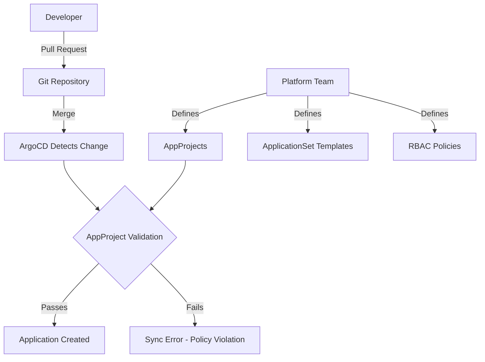

# How to Implement Self-Service Application Creation in ArgoCD

Author: [nawazdhandala](https://github.com/nawazdhandala)

Tags: ArgoCD, GitOps, Kubernetes, Self-Service, Platform Engineering

Description: Learn how to implement self-service application creation in ArgoCD so development teams can deploy new applications without waiting for platform team intervention.

---

The biggest friction in platform engineering is the deployment bottleneck. A developer finishes a new microservice and needs it deployed to Kubernetes. They open a ticket, wait for the platform team to create the ArgoCD application, configure the namespace, set up RBAC, and eventually the service goes live - three days later.

Self-service application creation eliminates this bottleneck. Developers create their own applications within boundaries defined by the platform team. They get speed, the platform team keeps control, and everyone is happier.

## The Self-Service Model

Self-service in ArgoCD means developers can create and manage their own Application resources, but within guardrails. The platform team defines the boundaries through AppProjects, and developers operate freely within those boundaries.



## Approach 1: Applications in Any Namespace

The simplest self-service approach lets teams create Application CRDs in their own namespaces. Enable this feature first.

```yaml
# argocd-cmd-params-cm ConfigMap
apiVersion: v1
kind: ConfigMap
metadata:
  name: argocd-cmd-params-cm
  namespace: argocd
data:
  application.namespaces: "team-*"
```

Now create an AppProject that restricts what teams can deploy:

```yaml
apiVersion: argoproj.io/v1alpha1
kind: AppProject
metadata:
  name: team-alpha
  namespace: argocd
spec:
  description: "Self-service project for Team Alpha"
  # Allowed deployment targets
  destinations:
    - server: https://kubernetes.default.svc
      namespace: "team-alpha-*"
  # Allowed source repositories
  sourceRepos:
    - "https://github.com/myorg/team-alpha-*"
    - "https://charts.example.com"
  # Allowed namespace-scoped resources
  namespaceResourceWhitelist:
    - group: ""
      kind: Service
    - group: ""
      kind: ConfigMap
    - group: ""
      kind: Secret
    - group: apps
      kind: Deployment
    - group: apps
      kind: StatefulSet
    - group: batch
      kind: Job
    - group: batch
      kind: CronJob
    - group: networking.k8s.io
      kind: Ingress
    - group: autoscaling
      kind: HorizontalPodAutoscaler
  # No cluster-scoped resources
  clusterResourceWhitelist: []
  # Block dangerous resources
  namespaceResourceBlacklist:
    - group: ""
      kind: ResourceQuota
    - group: ""
      kind: LimitRange
    - group: networking.k8s.io
      kind: NetworkPolicy
  # Allow applications to be created in team namespaces
  sourceNamespaces:
    - "team-alpha-*"
```

Developers then create applications in their namespace:

```yaml
# Committed to team-alpha's repo
apiVersion: argoproj.io/v1alpha1
kind: Application
metadata:
  name: user-service
  namespace: team-alpha-dev
spec:
  project: team-alpha
  source:
    repoURL: https://github.com/myorg/team-alpha-user-service.git
    path: k8s/overlays/dev
    targetRevision: main
  destination:
    server: https://kubernetes.default.svc
    namespace: team-alpha-dev
  syncPolicy:
    automated:
      prune: true
      selfHeal: true
```

## Approach 2: ApplicationSet with Git File Generator

A more structured approach uses ApplicationSets. Developers add a configuration file to a shared repository, and ArgoCD automatically creates the application.

```yaml
# Platform team defines this ApplicationSet
apiVersion: argoproj.io/v1alpha1
kind: ApplicationSet
metadata:
  name: self-service-apps
  namespace: argocd
spec:
  generators:
    - git:
        repoURL: https://github.com/myorg/app-registry.git
        revision: main
        files:
          - path: "apps/*/config.yaml"
  template:
    metadata:
      name: "{{app.name}}"
      namespace: argocd
      labels:
        team: "{{app.team}}"
        environment: "{{app.environment}}"
    spec:
      project: "{{app.team}}"
      source:
        repoURL: "{{app.repoURL}}"
        path: "{{app.path}}"
        targetRevision: "{{app.targetRevision}}"
      destination:
        server: https://kubernetes.default.svc
        namespace: "{{app.team}}-{{app.environment}}"
      syncPolicy:
        automated:
          prune: true
          selfHeal: true
        syncOptions:
          - CreateNamespace=false
```

Developers submit a pull request with their app configuration:

```yaml
# apps/user-service/config.yaml
app:
  name: user-service
  team: team-alpha
  environment: dev
  repoURL: https://github.com/myorg/team-alpha-user-service.git
  path: k8s/overlays/dev
  targetRevision: main
```

The platform team reviews the PR, verifies the team name and namespace are correct, and merges. The ApplicationSet creates the ArgoCD Application automatically.

## Approach 3: App-of-Apps Per Team

Each team gets a parent application that watches a directory in their repository. Any Application YAML they add to that directory gets created automatically.

```yaml
# Platform team creates this for each team
apiVersion: argoproj.io/v1alpha1
kind: Application
metadata:
  name: team-alpha-apps
  namespace: argocd
spec:
  project: team-alpha
  source:
    repoURL: https://github.com/myorg/team-alpha-config.git
    path: argocd-apps
    targetRevision: main
  destination:
    server: https://kubernetes.default.svc
    namespace: argocd
  syncPolicy:
    automated:
      prune: true
      selfHeal: true
```

Team Alpha then adds Application manifests to their `argocd-apps/` directory:

```yaml
# team-alpha-config/argocd-apps/payment-service.yaml
apiVersion: argoproj.io/v1alpha1
kind: Application
metadata:
  name: payment-service
  namespace: argocd
spec:
  project: team-alpha  # Enforced by parent's project
  source:
    repoURL: https://github.com/myorg/team-alpha-payment.git
    path: k8s/dev
    targetRevision: main
  destination:
    server: https://kubernetes.default.svc
    namespace: team-alpha-dev
  syncPolicy:
    automated:
      prune: true
      selfHeal: true
```

## Setting Up a Service Catalog Template

To make self-service even easier, provide application templates that developers can copy and customize.

```yaml
# templates/standard-web-service.yaml
apiVersion: argoproj.io/v1alpha1
kind: Application
metadata:
  name: REPLACE_APP_NAME
  namespace: argocd
  labels:
    app-type: web-service
spec:
  project: REPLACE_TEAM
  source:
    repoURL: REPLACE_REPO_URL
    path: k8s/overlays/REPLACE_ENVIRONMENT
    targetRevision: main
    kustomize:
      images:
        - "REPLACE_IMAGE_NAME=REPLACE_REGISTRY/REPLACE_APP_NAME:latest"
  destination:
    server: https://kubernetes.default.svc
    namespace: REPLACE_TEAM-REPLACE_ENVIRONMENT
  syncPolicy:
    automated:
      prune: true
      selfHeal: true
    syncOptions:
      - CreateNamespace=false
```

## Validating Self-Service Requests

Use admission webhooks or policy engines to validate self-service application creation. This adds a safety net beyond AppProject restrictions.

```yaml
# Kyverno policy to validate application configurations
apiVersion: kyverno.io/v1
kind: ClusterPolicy
metadata:
  name: validate-argocd-apps
spec:
  rules:
    - name: require-team-label
      match:
        resources:
          kinds:
            - Application
      validate:
        message: "Applications must have a team label"
        pattern:
          metadata:
            labels:
              team: "?*"
    - name: enforce-namespace-naming
      match:
        resources:
          kinds:
            - Application
      validate:
        message: "Destination namespace must match team-* pattern"
        pattern:
          spec:
            destination:
              namespace: "team-*"
```

## RBAC for Self-Service

Configure ArgoCD RBAC so teams can manage their own applications but not others.

```csv
# Team Alpha can manage their own applications
p, role:team-alpha-dev, applications, get, team-alpha/*, allow
p, role:team-alpha-dev, applications, create, team-alpha/*, allow
p, role:team-alpha-dev, applications, update, team-alpha/*, allow
p, role:team-alpha-dev, applications, delete, team-alpha/*, allow
p, role:team-alpha-dev, applications, sync, team-alpha/*, allow

# Team Alpha can view but not modify project settings
p, role:team-alpha-dev, projects, get, team-alpha, allow

# Team Alpha can list repositories they have access to
p, role:team-alpha-dev, repositories, get, *, allow

# Bind to SSO group
g, team-alpha-developers, role:team-alpha-dev
```

## Onboarding Workflow

A typical self-service onboarding flow looks like this:

1. **Platform team creates**: AppProject, namespaces, RBAC, quotas
2. **Developer creates**: Application manifest in their repo or config registry
3. **ArgoCD detects**: New Application and validates against AppProject
4. **Sync begins**: Resources deploy to the allowed namespace
5. **Developer monitors**: Via ArgoCD UI filtered to their project

The first step is a one-time setup per team. After that, developers can create as many applications as they need without platform team involvement.

## Monitoring Self-Service Usage

Track application creation through ArgoCD metrics and audit logs:

```bash
# List all applications by project
argocd app list --project team-alpha

# Check recent application creation events
kubectl get events -n argocd --field-selector reason=ResourceCreated
```

Set up dashboards showing application count per team, sync success rates, and resource consumption per namespace. This gives the platform team visibility into how self-service is being used without being a bottleneck.

Self-service application creation transforms ArgoCD from a platform-team-managed tool into a developer platform. Teams move faster, the platform team focuses on the guardrails instead of the deployments, and the organization scales its deployment capabilities without scaling the platform team linearly.
