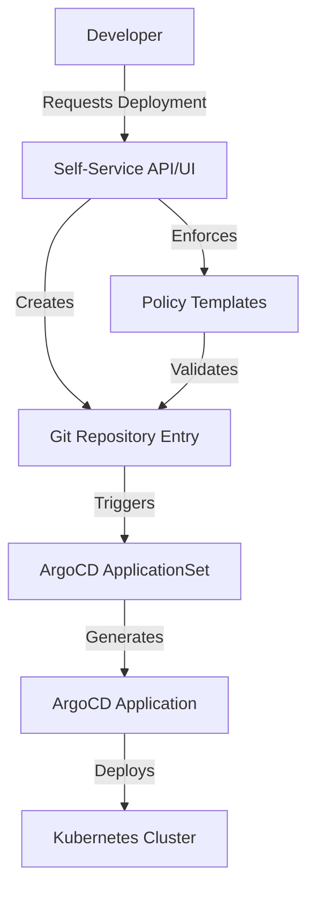

# How to Build Self-Service Deployment Catalog with ArgoCD

Author: [nawazdhandala](https://github.com/nawazdhandala)

Tags: ArgoCD, GitOps, Kubernetes, Self-Service, Platform Engineering

Description: Learn how to build a self-service deployment catalog using ArgoCD ApplicationSets, templates, and automation so developers can deploy services without platform team intervention.

---

Platform engineering is about removing friction from the developer experience. One of the highest-impact things a platform team can build is a self-service deployment catalog - a system where developers can deploy new services, create new environments, and manage their deployments without waiting for the platform team. ArgoCD, combined with ApplicationSets and GitOps templates, provides the foundation for building this kind of catalog.

## What Is a Self-Service Deployment Catalog

A self-service deployment catalog is an abstraction layer on top of ArgoCD that provides:

- Pre-approved deployment templates for common service types
- Automated environment creation
- Guardrails that enforce organizational policies
- A simple interface (CLI, web UI, or API) for developers



## Building Blocks

The self-service catalog uses three main ArgoCD features:

1. **ApplicationSets**: Automatically generate Applications from templates
2. **Projects**: Enforce RBAC and resource restrictions
3. **Sync Policies**: Automate deployment without manual intervention

## Step 1: Define Service Templates

Create a Git repository that holds your deployment templates. Each template defines how a specific type of service should be deployed:

```
deployment-catalog/
  templates/
    web-service/
      base/
        deployment.yaml
        service.yaml
        hpa.yaml
        networkpolicy.yaml
      overlays/
        development/
          kustomization.yaml
        staging/
          kustomization.yaml
        production/
          kustomization.yaml
    worker-service/
      base/
        deployment.yaml
        service.yaml
      overlays/
        ...
    cronjob-service/
      base/
        cronjob.yaml
      overlays/
        ...
  services/
    # Developers add entries here
```

Here is the base template for a web service:

```yaml
# templates/web-service/base/deployment.yaml
apiVersion: apps/v1
kind: Deployment
metadata:
  name: SERVICE_NAME
  labels:
    app: SERVICE_NAME
    team: TEAM_NAME
    managed-by: deployment-catalog
spec:
  replicas: 2
  selector:
    matchLabels:
      app: SERVICE_NAME
  template:
    metadata:
      labels:
        app: SERVICE_NAME
        team: TEAM_NAME
    spec:
      containers:
        - name: SERVICE_NAME
          image: SERVICE_IMAGE
          ports:
            - containerPort: 8080
          resources:
            requests:
              cpu: 100m
              memory: 128Mi
            limits:
              cpu: 500m
              memory: 512Mi
          livenessProbe:
            httpGet:
              path: /healthz
              port: 8080
            initialDelaySeconds: 10
          readinessProbe:
            httpGet:
              path: /ready
              port: 8080
            initialDelaySeconds: 5
---
# templates/web-service/base/service.yaml
apiVersion: v1
kind: Service
metadata:
  name: SERVICE_NAME
spec:
  selector:
    app: SERVICE_NAME
  ports:
    - port: 80
      targetPort: 8080
---
# templates/web-service/base/kustomization.yaml
apiVersion: kustomize.config.k8s.io/v1beta1
kind: Kustomization
resources:
  - deployment.yaml
  - service.yaml
```

## Step 2: Create the Service Registry

Define a service registry file where developers register their services. This can be a simple YAML file in Git:

```yaml
# services/registry.yaml
# Developers add their services here via pull request
services:
  - name: payment-api
    team: payments
    type: web-service
    image: registry.example.com/payment-api
    environments:
      - development
      - staging
      - production

  - name: email-worker
    team: notifications
    type: worker-service
    image: registry.example.com/email-worker
    environments:
      - development
      - staging
      - production

  - name: daily-report
    team: analytics
    type: cronjob-service
    image: registry.example.com/daily-report
    environments:
      - production
```

## Step 3: Create an ApplicationSet Generator

Use an ArgoCD ApplicationSet with a Git generator to automatically create Applications from the service registry:

```yaml
# ArgoCD ApplicationSet that reads from the service registry
apiVersion: argoproj.io/v1alpha1
kind: ApplicationSet
metadata:
  name: deployment-catalog
  namespace: argocd
spec:
  generators:
    # Use a Git file generator to read the service registry
    - git:
        repoURL: https://github.com/myorg/deployment-catalog
        revision: main
        files:
          - path: "services/*/config.yaml"
  template:
    metadata:
      name: "{{name}}-{{environment}}"
      labels:
        team: "{{team}}"
        service-type: "{{type}}"
        environment: "{{environment}}"
        managed-by: deployment-catalog
    spec:
      project: "{{team}}-project"
      source:
        repoURL: https://github.com/myorg/deployment-catalog
        targetRevision: main
        path: "templates/{{type}}/overlays/{{environment}}"
        kustomize:
          images:
            - "SERVICE_IMAGE={{image}}:{{tag}}"
          commonLabels:
            app: "{{name}}"
            team: "{{team}}"
      destination:
        server: "{{cluster}}"
        namespace: "{{team}}-{{environment}}"
      syncPolicy:
        automated:
          selfHeal: true
          prune: true
        syncOptions:
          - CreateNamespace=true
          - PruneLast=true
```

## Step 4: Individual Service Configuration

Each service gets its own config file in the services directory:

```yaml
# services/payment-api/config.yaml
name: payment-api
team: payments
type: web-service
image: registry.example.com/payment-api
tag: latest
environments:
  - name: development
    cluster: https://dev-cluster:6443
    replicas: 1
  - name: staging
    cluster: https://staging-cluster:6443
    replicas: 2
  - name: production
    cluster: https://prod-cluster:6443
    replicas: 3
```

Use a matrix generator to expand environments:

```yaml
# ApplicationSet with matrix generator for multi-environment
apiVersion: argoproj.io/v1alpha1
kind: ApplicationSet
metadata:
  name: deployment-catalog-matrix
  namespace: argocd
spec:
  generators:
    - matrix:
        generators:
          # First generator: read service configs
          - git:
              repoURL: https://github.com/myorg/deployment-catalog
              revision: main
              files:
                - path: "services/*/config.yaml"
          # Second generator: expand environments
          - list:
              elementsYaml: "{{environments}}"
  template:
    metadata:
      name: "{{name}}-{{environment}}"
    spec:
      project: "{{team}}-project"
      source:
        repoURL: https://github.com/myorg/deployment-catalog
        targetRevision: main
        path: "templates/{{type}}/overlays/{{environment}}"
      destination:
        server: "{{cluster}}"
        namespace: "{{team}}-{{environment}}"
      syncPolicy:
        automated:
          selfHeal: true
          prune: true
        syncOptions:
          - CreateNamespace=true
```

## Step 5: Build the Self-Service CLI

Create a simple CLI that developers use to register services:

```bash
#!/bin/bash
# deploy-catalog.sh - Self-service deployment CLI

set -e

CATALOG_REPO="https://github.com/myorg/deployment-catalog"

case "$1" in
  create)
    SERVICE_NAME=$2
    TEAM=$3
    SERVICE_TYPE=${4:-web-service}
    IMAGE=$5

    echo "Creating service: $SERVICE_NAME"
    echo "Team: $TEAM"
    echo "Type: $SERVICE_TYPE"
    echo "Image: $IMAGE"

    # Clone the catalog repo
    git clone "$CATALOG_REPO" /tmp/catalog
    cd /tmp/catalog

    # Create service directory and config
    mkdir -p "services/$SERVICE_NAME"
    cat > "services/$SERVICE_NAME/config.yaml" <<EOF
name: $SERVICE_NAME
team: $TEAM
type: $SERVICE_TYPE
image: $IMAGE
tag: latest
environments:
  - name: development
    cluster: https://dev-cluster:6443
    replicas: 1
  - name: staging
    cluster: https://staging-cluster:6443
    replicas: 2
EOF

    # Create PR
    git checkout -b "add-service-$SERVICE_NAME"
    git add .
    git commit -m "Add $SERVICE_NAME to deployment catalog"
    git push origin "add-service-$SERVICE_NAME"

    # Create PR using GitHub CLI
    gh pr create \
      --title "Add $SERVICE_NAME to deployment catalog" \
      --body "Service: $SERVICE_NAME\nTeam: $TEAM\nType: $SERVICE_TYPE" \
      --reviewer platform-team

    echo "PR created. Service will be deployed once approved."
    ;;

  promote)
    SERVICE_NAME=$2
    TARGET_ENV=$3

    echo "Promoting $SERVICE_NAME to $TARGET_ENV"
    # Update the service config to include the new environment
    # ... implementation ...
    ;;

  status)
    SERVICE_NAME=$2
    argocd app list -l service=$SERVICE_NAME
    ;;

  *)
    echo "Usage: deploy-catalog.sh {create|promote|status} [args]"
    ;;
esac
```

## Step 6: Enforce Policies with ArgoCD Projects

Create ArgoCD Projects that enforce resource restrictions per team:

```yaml
# ArgoCD Project for the payments team
apiVersion: argoproj.io/v1alpha1
kind: AppProject
metadata:
  name: payments-project
  namespace: argocd
spec:
  description: Payments team deployment project
  # Allowed source repositories
  sourceRepos:
    - https://github.com/myorg/deployment-catalog
    - https://github.com/myorg/payments-*
  # Allowed destinations
  destinations:
    - namespace: payments-*
      server: "*"
  # Allowed cluster resources
  clusterResourceWhitelist:
    - group: ""
      kind: Namespace
  # Allowed namespace resources
  namespaceResourceWhitelist:
    - group: ""
      kind: "*"
    - group: apps
      kind: "*"
    - group: networking.k8s.io
      kind: "*"
  # Deny certain resources
  namespaceResourceBlacklist:
    - group: ""
      kind: ResourceQuota
    - group: ""
      kind: LimitRange
  # Resource limits
  roles:
    - name: team-admin
      description: Payments team admin access
      policies:
        - p, proj:payments-project:team-admin, applications, *, payments-project/*, allow
      groups:
        - payments-team
```

## Step 7: Add Validation

Add a CI check that validates service registrations before they are merged:

```yaml
# .github/workflows/validate-catalog.yaml
name: Validate Deployment Catalog
on:
  pull_request:
    paths:
      - 'services/**'

jobs:
  validate:
    runs-on: ubuntu-latest
    steps:
      - uses: actions/checkout@v4

      - name: Validate service configs
        run: |
          for config in services/*/config.yaml; do
            echo "Validating $config"
            # Check required fields
            yq e '.name' "$config" > /dev/null || { echo "Missing name in $config"; exit 1; }
            yq e '.team' "$config" > /dev/null || { echo "Missing team in $config"; exit 1; }
            yq e '.type' "$config" > /dev/null || { echo "Missing type in $config"; exit 1; }

            # Validate service type exists
            TYPE=$(yq e '.type' "$config")
            if [ ! -d "templates/$TYPE" ]; then
              echo "Unknown service type: $TYPE"
              exit 1
            fi
          done
          echo "All validations passed"
```

## Summary

A self-service deployment catalog with ArgoCD combines ApplicationSets for automatic application generation, Git-based service registration for GitOps workflows, ArgoCD Projects for policy enforcement, and simple CLIs or UIs for the developer interface. The key principle is that developers interact with a simple abstraction (a config file in Git), while the platform team maintains the templates and policies that ensure everything is deployed consistently and safely. For related topics, see our guides on [integrating ArgoCD with Backstage](https://oneuptime.com/blog/post/2026-02-26-argocd-backstage-service-catalog/view) and [integrating ArgoCD with Port](https://oneuptime.com/blog/post/2026-02-26-argocd-port-developer-portal/view).
