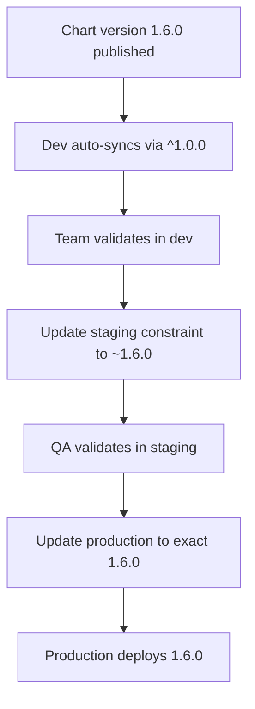

# How to Use Semantic Versioning for Tracking in ArgoCD

Author: [nawazdhandala](https://github.com/nawazdhandala)

Tags: ArgoCD, GitOps, Kubernetes, Helm, Versioning

Description: Learn how to leverage semantic versioning with ArgoCD for controlled deployments using semver constraints on Helm charts and Git tags.

---

Semantic versioning (semver) gives your deployment pipeline a structured way to reason about changes. Instead of tracking arbitrary branch names or opaque commit SHAs, you can use version numbers that communicate intent - patch versions for bug fixes, minor versions for backward-compatible features, and major versions for breaking changes.

ArgoCD supports semver-based tracking primarily through Helm chart versions. In this guide, we will explore how to use semver constraints in ArgoCD, how to set up version ranges, and how to build a promotion workflow around semantic versioning.

## Semver Basics for Deployment Tracking

Semantic versioning follows the format `MAJOR.MINOR.PATCH` (e.g., `1.5.2`):

- **MAJOR** (1.x.x): Breaking changes that may require manual intervention
- **MINOR** (x.5.x): New features that are backward compatible
- **PATCH** (x.x.2): Bug fixes and security patches

Pre-release versions use suffixes like `1.6.0-rc.1`, `1.6.0-beta.2`, or `1.6.0-alpha.1`.

## Using Semver Constraints with Helm Charts

ArgoCD allows you to specify semver version constraints for Helm chart sources. This is the primary way to use semver tracking in ArgoCD.

```yaml
# Track the latest patch release of 1.5.x
apiVersion: argoproj.io/v1alpha1
kind: Application
metadata:
  name: my-app
  namespace: argocd
spec:
  project: default
  source:
    # Helm chart from a repository
    chart: my-app
    repoURL: https://charts.myorg.com
    # Semver constraint - accepts any 1.5.x patch version
    targetRevision: "1.5.*"
    helm:
      releaseName: my-app
      values: |
        replicaCount: 3
        image:
          tag: latest
  destination:
    server: https://kubernetes.default.svc
    namespace: production
```

When ArgoCD evaluates the `targetRevision`, it queries the Helm repository for all available versions of the chart, filters them using the semver constraint, and selects the highest matching version.

## Common Semver Constraint Patterns

ArgoCD supports standard semver range syntax. Here are the most useful patterns:

```yaml
# Exact version - only this specific version
targetRevision: "1.5.2"

# Patch range - any 1.5.x version (>=1.5.0, <1.6.0)
targetRevision: "~1.5.0"
# or equivalently
targetRevision: "1.5.*"

# Minor range - any 1.x.x version (>=1.0.0, <2.0.0)
targetRevision: "^1.0.0"
# or equivalently
targetRevision: "1.*.*"

# Greater than or equal
targetRevision: ">=1.5.0"

# Range with upper bound
targetRevision: ">=1.5.0 <2.0.0"

# Latest stable (no pre-release)
targetRevision: "*"
```

## Practical Environment Strategy with Semver

A good pattern is to use progressively tighter constraints as you move toward production:

```yaml
# Development - track latest minor version (aggressive updates)
apiVersion: argoproj.io/v1alpha1
kind: Application
metadata:
  name: my-app-dev
  namespace: argocd
spec:
  source:
    chart: my-app
    repoURL: https://charts.myorg.com
    targetRevision: "^1.0.0"  # Any 1.x.x
    helm:
      releaseName: my-app
  destination:
    server: https://kubernetes.default.svc
    namespace: dev
  syncPolicy:
    automated:
      prune: true
---
# Staging - track latest patch version (moderate updates)
apiVersion: argoproj.io/v1alpha1
kind: Application
metadata:
  name: my-app-staging
  namespace: argocd
spec:
  source:
    chart: my-app
    repoURL: https://charts.myorg.com
    targetRevision: "~1.5.0"  # Any 1.5.x
    helm:
      releaseName: my-app
  destination:
    server: https://kubernetes.default.svc
    namespace: staging
  syncPolicy:
    automated:
      prune: true
---
# Production - pinned to exact version (manual promotion)
apiVersion: argoproj.io/v1alpha1
kind: Application
metadata:
  name: my-app-production
  namespace: argocd
spec:
  source:
    chart: my-app
    repoURL: https://charts.myorg.com
    targetRevision: "1.5.2"  # Exact version
    helm:
      releaseName: my-app
  destination:
    server: https://kubernetes.default.svc
    namespace: production
  syncPolicy:
    automated:
      prune: true
      selfHeal: true
```

This strategy means development gets all new features automatically, staging gets bug fixes automatically, and production requires explicit promotion.

## Promotion Workflow

The promotion flow using semver looks like this:



To promote a version to production:

```bash
# Update production to the new version
argocd app set my-app-production \
  --helm-chart my-app \
  --revision "1.6.0"

# Sync if auto-sync is not enabled
argocd app sync my-app-production
```

## Semver with Git Tags

While ArgoCD's semver constraint syntax works natively with Helm chart repositories, you can implement a similar pattern with Git tags by using CI/CD to automate the process:

```yaml
# .github/workflows/promote-on-tag.yaml
name: Promote semver release
on:
  push:
    tags:
      - 'v[0-9]+.[0-9]+.[0-9]+'

jobs:
  promote:
    runs-on: ubuntu-latest
    steps:
      - name: Parse semver
        id: semver
        run: |
          TAG=${GITHUB_REF#refs/tags/v}
          MAJOR=$(echo $TAG | cut -d. -f1)
          MINOR=$(echo $TAG | cut -d. -f2)
          PATCH=$(echo $TAG | cut -d. -f3)
          echo "tag=$TAG" >> $GITHUB_OUTPUT
          echo "major=$MAJOR" >> $GITHUB_OUTPUT
          echo "minor=$MINOR" >> $GITHUB_OUTPUT

      - name: Update ArgoCD app revision
        run: |
          # For Git-based apps, update targetRevision to the tag
          argocd app set my-app-production \
            --revision "v${{ steps.semver.outputs.tag }}" \
            --auth-token "${{ secrets.ARGOCD_TOKEN }}" \
            --server argocd.example.com
```

## Checking the Resolved Version

To see which version ArgoCD has resolved your semver constraint to:

```bash
# See the current chart version being used
argocd app get my-app-staging -o json | jq '.status.sync.revision'

# See the target constraint
argocd app get my-app-staging -o json | jq '.spec.source.targetRevision'

# List available chart versions in the repository
argocd repo get https://charts.myorg.com --type helm
```

## Excluding Pre-release Versions

By default, semver constraints in ArgoCD do not match pre-release versions unless you explicitly include them. This means a constraint like `~1.5.0` will not match `1.5.3-rc.1`. If you want to include pre-release versions (useful for staging), use an explicit range:

```yaml
# This WILL include pre-release versions like 1.6.0-rc.1
targetRevision: ">=1.6.0-0 <1.7.0"

# This will NOT include pre-release versions
targetRevision: "~1.6.0"
```

## Summary

Semantic versioning gives your ArgoCD deployments a structured, predictable upgrade path. Use semver constraints on Helm chart versions to automatically receive patch fixes while blocking breaking changes. Combine this with per-environment strategies - loose constraints for development, tight constraints for production - to build a robust promotion pipeline. For Git-based applications without Helm, implement similar patterns using [Git tags](https://oneuptime.com/blog/post/2026-02-26-argocd-track-git-tag/view) and CI/CD automation.
