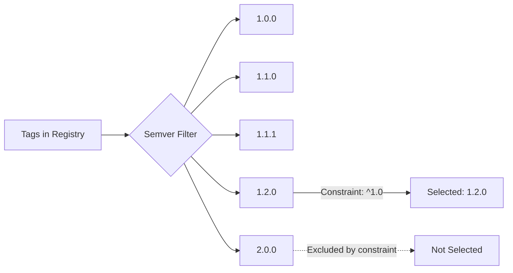

# How to Use Semver Strategy for Image Updates

Author: [nawazdhandala](https://github.com/nawazdhandala)

Tags: ArgoCD, GitOps, Kubernetes, Image Updater, SemVer

Description: Learn how to use the semver update strategy in ArgoCD Image Updater to automatically deploy container images based on semantic versioning constraints like major, minor, and patch ranges.

---

The semver (semantic versioning) strategy is the most popular update strategy for ArgoCD Image Updater. It understands version numbers like 1.2.3 and picks the highest version that matches your constraint. This gives you precise control over which updates are applied automatically - you can allow patch updates while blocking breaking major version changes.

## How Semantic Versioning Works

Semantic versioning follows the format `MAJOR.MINOR.PATCH`:

- **MAJOR** (1.x.x to 2.x.x) - Breaking changes
- **MINOR** (1.1.x to 1.2.x) - New features, backward compatible
- **PATCH** (1.1.1 to 1.1.2) - Bug fixes, backward compatible

Pre-release tags like `1.2.3-beta.1` and build metadata like `1.2.3+build.456` are also supported.



## Basic Semver Configuration

```yaml
apiVersion: argoproj.io/v1alpha1
kind: Application
metadata:
  name: myapp
  namespace: argocd
  annotations:
    argocd-image-updater.argoproj.io/image-list: myapp=myregistry.com/myapp
    argocd-image-updater.argoproj.io/myapp.update-strategy: semver
spec:
  # ... source and destination config
```

Without a constraint, Image Updater will pick the absolute highest semver tag. You almost always want to add a constraint.

## Semver Constraints

Constraints control which versions are acceptable. ArgoCD Image Updater uses the standard semver constraint syntax.

### Caret Constraint (^) - Allow Minor and Patch Updates

The most common constraint. It allows updates that do not change the leftmost non-zero digit.

```yaml
annotations:
  argocd-image-updater.argoproj.io/myapp.update-strategy: semver
  # ^1.0 means >=1.0.0 and <2.0.0
  argocd-image-updater.argoproj.io/myapp.semver-constraint: "^1.0"
```

Examples of what `^1.0` matches:
- 1.0.0, 1.0.1, 1.1.0, 1.2.5, 1.99.99 - all accepted
- 2.0.0 - rejected (major version change)

For 0.x versions, caret is more restrictive:
- `^0.2` matches 0.2.0 to 0.2.x (not 0.3.0)
- `^0.0.3` matches only 0.0.3

### Tilde Constraint (~) - Allow Only Patch Updates

More conservative than caret. Allows only patch-level changes.

```yaml
annotations:
  argocd-image-updater.argoproj.io/myapp.update-strategy: semver
  # ~1.2 means >=1.2.0 and <1.3.0
  argocd-image-updater.argoproj.io/myapp.semver-constraint: "~1.2"
```

Examples of what `~1.2` matches:
- 1.2.0, 1.2.1, 1.2.99 - all accepted
- 1.3.0 - rejected (minor version change)

### Range Constraints

For explicit control, use range operators:

```yaml
annotations:
  argocd-image-updater.argoproj.io/myapp.update-strategy: semver
  # Explicit range
  argocd-image-updater.argoproj.io/myapp.semver-constraint: ">=1.5.0, <2.0.0"
```

```yaml
  # Exact version range
  argocd-image-updater.argoproj.io/myapp.semver-constraint: ">=1.2.0, <=1.5.0"
```

```yaml
  # Multiple ranges with OR
  argocd-image-updater.argoproj.io/myapp.semver-constraint: ">=1.0.0, <2.0.0 || >=3.0.0"
```

### Exact Version Pinning

```yaml
annotations:
  argocd-image-updater.argoproj.io/myapp.update-strategy: semver
  # Only accept exact version
  argocd-image-updater.argoproj.io/myapp.semver-constraint: "1.5.0"
```

This is useful when you want Image Updater to detect a specific version but not auto-update beyond it.

## Filtering Tags for Semver

Not all tags in your registry may be valid semver. Use tag filters to help Image Updater find the right ones.

### Allow Only Clean Semver Tags

```yaml
annotations:
  argocd-image-updater.argoproj.io/myapp.update-strategy: semver
  argocd-image-updater.argoproj.io/myapp.semver-constraint: "^1.0"
  # Only consider tags that are pure semver (no prefix)
  argocd-image-updater.argoproj.io/myapp.allow-tags: "regexp:^[0-9]+\\.[0-9]+\\.[0-9]+$"
```

### Handle v-Prefixed Tags

Many projects tag images with a `v` prefix (v1.2.3). Image Updater strips the `v` prefix automatically for semver comparison, but you may want to filter tags explicitly:

```yaml
annotations:
  argocd-image-updater.argoproj.io/myapp.update-strategy: semver
  argocd-image-updater.argoproj.io/myapp.semver-constraint: "^1.0"
  # Accept both v1.2.3 and 1.2.3 formats
  argocd-image-updater.argoproj.io/myapp.allow-tags: "regexp:^v?[0-9]+\\.[0-9]+\\.[0-9]+$"
```

### Exclude Pre-Release Tags

```yaml
annotations:
  argocd-image-updater.argoproj.io/myapp.update-strategy: semver
  argocd-image-updater.argoproj.io/myapp.semver-constraint: "^1.0"
  # Exclude tags with pre-release identifiers like -beta, -rc, -alpha
  argocd-image-updater.argoproj.io/myapp.ignore-tags: "regexp:-(alpha|beta|rc|dev)"
```

## Production vs Staging Strategies

Use different semver constraints per environment:

### Staging - Accept All Minor and Patch Updates

```yaml
# staging-app.yaml
metadata:
  name: myapp-staging
  annotations:
    argocd-image-updater.argoproj.io/image-list: myapp=myregistry.com/myapp
    argocd-image-updater.argoproj.io/myapp.update-strategy: semver
    # Staging gets all updates within major version
    argocd-image-updater.argoproj.io/myapp.semver-constraint: "^1.0"
```

### Production - Accept Only Patch Updates

```yaml
# production-app.yaml
metadata:
  name: myapp-production
  annotations:
    argocd-image-updater.argoproj.io/image-list: myapp=myregistry.com/myapp
    argocd-image-updater.argoproj.io/myapp.update-strategy: semver
    # Production only gets patch updates
    argocd-image-updater.argoproj.io/myapp.semver-constraint: "~1.2"
```

This means staging automatically gets new features (1.3.0, 1.4.0) while production only gets bug fixes (1.2.1, 1.2.2) until you manually update the constraint.

## Multi-Image Applications

When tracking multiple images, each can have its own semver constraint:

```yaml
annotations:
  argocd-image-updater.argoproj.io/image-list: |
    frontend=myregistry.com/frontend,
    backend=myregistry.com/backend,
    worker=myregistry.com/worker
  # Frontend is stable, only patch updates
  argocd-image-updater.argoproj.io/frontend.update-strategy: semver
  argocd-image-updater.argoproj.io/frontend.semver-constraint: "~2.1"
  # Backend actively developed, allow minor updates
  argocd-image-updater.argoproj.io/backend.update-strategy: semver
  argocd-image-updater.argoproj.io/backend.semver-constraint: "^3.0"
  # Worker tracks a specific version range
  argocd-image-updater.argoproj.io/worker.update-strategy: semver
  argocd-image-updater.argoproj.io/worker.semver-constraint: ">=1.5.0, <1.8.0"
```

## Write-Back Configuration

When Image Updater finds a new version, it needs to persist the change:

### Kustomize Write-Back

```yaml
annotations:
  argocd-image-updater.argoproj.io/write-back-method: git
  argocd-image-updater.argoproj.io/write-back-target: kustomization
  argocd-image-updater.argoproj.io/git-branch: main
```

Image Updater will update the `images` section in `kustomization.yaml`:

```yaml
images:
  - name: myregistry.com/myapp
    newTag: "1.2.5"  # Updated by Image Updater
```

### Helm Write-Back

```yaml
annotations:
  argocd-image-updater.argoproj.io/write-back-method: git
  argocd-image-updater.argoproj.io/write-back-target: "helmvalues:values.yaml"
  argocd-image-updater.argoproj.io/myapp.helm.image-name: image.repository
  argocd-image-updater.argoproj.io/myapp.helm.image-tag: image.tag
```

## Troubleshooting Semver Issues

**Image Updater picks an unexpected version** - Check which tags are available and which match your constraint:

```bash
# List all tags
kubectl logs -n argocd deployment/argocd-image-updater --tail=200 | grep "found tags"

# Look for semver parse errors
kubectl logs -n argocd deployment/argocd-image-updater --tail=200 | grep -i "semver"
```

**Pre-release versions being selected** - Pre-release versions (1.2.3-beta) are only matched if your constraint explicitly includes them. If they are still being picked up, add an ignore-tags filter.

**v-prefix causing issues** - Image Updater handles the `v` prefix for semver, but make sure your tags are consistently formatted.

**Constraint too restrictive** - If no tags match your constraint, Image Updater will not update anything. Check the logs for "no newer version found" messages.

For monitoring version updates, configure [ArgoCD notifications](https://oneuptime.com/blog/post/2026-01-25-notifications-argocd/view) to alert your team when new versions are deployed.

The semver strategy is the best choice for production workloads because it gives you explicit control over the scope of automatic updates while still benefiting from automated deployments.
