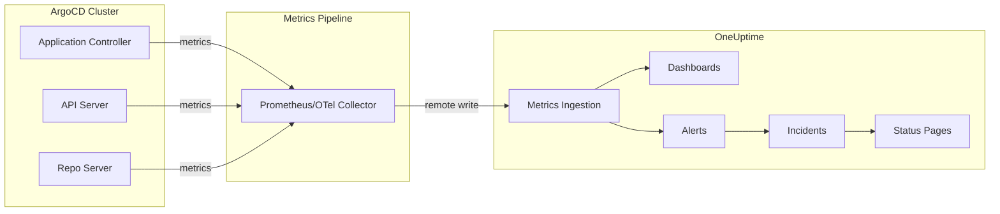

# How to Send ArgoCD Metrics to OneUptime

Author: [nawazdhandala](https://github.com/nawazdhandala)

Tags: ArgoCD, GitOps, Kubernetes, OneUptime, Monitoring

Description: Learn how to send ArgoCD Prometheus metrics to OneUptime for centralized GitOps monitoring, alerting, and dashboards that give you full visibility into your deployment pipeline.

---

OneUptime provides a comprehensive monitoring platform that can ingest Prometheus metrics, create dashboards, and set up intelligent alerts. By sending ArgoCD metrics to OneUptime, you get centralized visibility into your GitOps pipeline alongside your application monitoring, infrastructure metrics, and incident management - all in one place.

This guide walks you through configuring ArgoCD to export its Prometheus metrics to OneUptime.

## Why Send ArgoCD Metrics to OneUptime

Running a separate Prometheus and Grafana stack just for ArgoCD creates operational overhead. You need to maintain the infrastructure, manage storage, configure alerts in yet another system, and switch between multiple dashboards during incidents.

OneUptime consolidates all of this:



With all your metrics in OneUptime, you can correlate ArgoCD deployment events with application performance changes, set up alerts that create incidents automatically, and keep your team informed through status pages.

## Method 1: Prometheus Remote Write to OneUptime

If you already have Prometheus scraping ArgoCD metrics, configure remote write to forward them to OneUptime.

Add the remote write configuration to your Prometheus setup:

```yaml
# prometheus.yml
remote_write:
  - url: "https://oneuptime.com/api/telemetry/metrics/v1/remote-write"
    headers:
      "x-oneuptime-service-token": "<your-oneuptime-telemetry-token>"
    write_relabel_configs:
      # Only send ArgoCD metrics to reduce volume
      - source_labels: [__name__]
        regex: 'argocd_.*|workqueue_.*|grpc_server_.*'
        action: keep
```

If you use the Prometheus Operator, configure remote write in the Prometheus CR:

```yaml
apiVersion: monitoring.coreos.com/v1
kind: Prometheus
metadata:
  name: prometheus
  namespace: monitoring
spec:
  remoteWrite:
  - url: "https://oneuptime.com/api/telemetry/metrics/v1/remote-write"
    headers:
      x-oneuptime-service-token: "<your-oneuptime-telemetry-token>"
    writeRelabelConfigs:
    - sourceLabels: [__name__]
      regex: 'argocd_.*|workqueue_.*|grpc_server_.*'
      action: keep
```

The `writeRelabelConfigs` filter ensures you only send ArgoCD-related metrics to OneUptime, reducing data volume and cost.

## Method 2: OpenTelemetry Collector

For environments that use OpenTelemetry, configure the OpenTelemetry Collector to scrape ArgoCD metrics and export them to OneUptime:

```yaml
apiVersion: v1
kind: ConfigMap
metadata:
  name: otel-collector-config
  namespace: monitoring
data:
  config.yaml: |
    receivers:
      prometheus:
        config:
          scrape_configs:
            - job_name: 'argocd-application-controller'
              scrape_interval: 30s
              static_configs:
                - targets:
                  - argocd-application-controller-metrics.argocd.svc:8082

            - job_name: 'argocd-server'
              scrape_interval: 30s
              static_configs:
                - targets:
                  - argocd-server-metrics.argocd.svc:8083

            - job_name: 'argocd-repo-server'
              scrape_interval: 30s
              static_configs:
                - targets:
                  - argocd-repo-server-metrics.argocd.svc:8084

    processors:
      filter:
        metrics:
          include:
            match_type: regexp
            metric_names:
              - argocd_.*
              - workqueue_.*
              - grpc_server_.*

      batch:
        timeout: 30s
        send_batch_size: 1000

    exporters:
      otlphttp:
        endpoint: "https://oneuptime.com/api/telemetry/metrics/v1/otlp"
        headers:
          "x-oneuptime-service-token": "${ONEUPTIME_TOKEN}"

    service:
      pipelines:
        metrics:
          receivers: [prometheus]
          processors: [filter, batch]
          exporters: [otlphttp]
```

Deploy the collector:

```yaml
apiVersion: apps/v1
kind: Deployment
metadata:
  name: otel-collector
  namespace: monitoring
spec:
  replicas: 1
  selector:
    matchLabels:
      app: otel-collector
  template:
    metadata:
      labels:
        app: otel-collector
    spec:
      containers:
      - name: otel-collector
        image: otel/opentelemetry-collector-contrib:latest
        args:
        - --config=/etc/otel/config.yaml
        env:
        - name: ONEUPTIME_TOKEN
          valueFrom:
            secretKeyRef:
              name: oneuptime-credentials
              key: telemetry-token
        volumeMounts:
        - name: config
          mountPath: /etc/otel
        ports:
        - containerPort: 8888  # Collector metrics
        - containerPort: 8889  # Prometheus exporter
      volumes:
      - name: config
        configMap:
          name: otel-collector-config
```

## Setting Up OneUptime for ArgoCD Monitoring

After metrics are flowing to OneUptime, configure your monitoring:

### Creating a OneUptime Service

Create a service in OneUptime to represent your ArgoCD installation:

1. Navigate to your OneUptime project
2. Go to Telemetry > Services
3. Create a new service named "ArgoCD"
4. Note the service token for the metrics pipeline configuration

### Creating Dashboards

In OneUptime, create a custom dashboard for ArgoCD:

**Application Overview Panel:**
- Metric: `argocd_app_info`
- Group by: `sync_status`
- Visualization: Pie chart

**Sync Success Rate Panel:**
- Query: `rate(argocd_app_sync_total{phase="Succeeded"}[5m]) / rate(argocd_app_sync_total[5m]) * 100`
- Visualization: Gauge with thresholds (green > 95%, yellow > 80%, red < 80%)

**Git Operation Latency Panel:**
- Query: `histogram_quantile(0.95, rate(argocd_git_request_duration_seconds_bucket[5m]))`
- Visualization: Time series

**Reconciliation Duration Panel:**
- Query: `histogram_quantile(0.95, rate(argocd_app_reconcile_duration_seconds_bucket[5m]))`
- Visualization: Time series

### Configuring Alerts in OneUptime

Set up alerts in OneUptime that create incidents and notify your team:

**Sync Failure Alert:**
- Metric: `argocd_app_sync_total{phase=~"Failed|Error"}`
- Condition: Rate increase > 0 for 5 minutes
- Severity: Critical for production, Warning for staging
- Notification: Slack, PagerDuty, Email

**Application Degraded Alert:**
- Metric: `argocd_app_info{health_status="Degraded"}`
- Condition: Value equals 1 for 5 minutes
- Create incident automatically
- Assign to on-call team

**Git Operations Alert:**
- Metric: `argocd_git_request_total{grpc_code!="OK"}`
- Condition: Error rate > 10% for 10 minutes
- Severity: Warning

## Filtering Metrics for Cost Optimization

Sending all ArgoCD metrics can be expensive. Filter to the most important ones:

```yaml
# Essential metrics to send to OneUptime
write_relabel_configs:
  - source_labels: [__name__]
    regex: |
      argocd_app_info|
      argocd_app_sync_total|
      argocd_app_reconcile_duration_seconds_bucket|
      argocd_app_reconcile_count|
      argocd_git_request_total|
      argocd_git_request_duration_seconds_bucket|
      workqueue_depth|
      workqueue_queue_duration_seconds_bucket
    action: keep
```

This keeps only the metrics needed for the most important dashboards and alerts, significantly reducing ingestion volume.

## Verifying the Pipeline

After setup, verify metrics are reaching OneUptime:

```bash
# Check if the collector/Prometheus is scraping ArgoCD
kubectl logs -n monitoring deployment/otel-collector --tail=50 | grep argocd

# Verify remote write is succeeding
kubectl logs -n monitoring deployment/prometheus --tail=50 | grep "remote_write"

# Check for errors in the pipeline
kubectl logs -n monitoring deployment/otel-collector --tail=50 | grep -i error
```

In OneUptime, navigate to your ArgoCD service's metrics page and verify that the ArgoCD metrics appear. Run a simple query like `argocd_app_info` to confirm data is flowing.

## Correlating Deployment Events with Application Performance

One of the biggest advantages of using OneUptime is correlating ArgoCD deployment events with application performance:

1. ArgoCD syncs trigger a deployment
2. OneUptime receives the sync metrics
3. Application performance metrics (response time, error rate) change
4. OneUptime dashboards show both side by side
5. Incident timeline includes the deployment event

This correlation makes root cause analysis faster. When an application's error rate spikes, you can immediately see if an ArgoCD sync happened at the same time and what changed.

## Best Practices

1. Start by sending only essential metrics. Add more as you build out dashboards and identify which metrics provide value.

2. Use the OpenTelemetry Collector if you plan to send traces and logs from ArgoCD alongside metrics. It provides a unified pipeline for all telemetry data.

3. Set up alerts in OneUptime rather than maintaining separate Prometheus alerting. This keeps your alert configuration in one place and ties alerts to incidents.

4. Create a dedicated dashboard in OneUptime for ArgoCD that your platform team can use as their primary view during GitOps operations.

5. Configure incident auto-creation for critical ArgoCD failures so that sync failures and degraded applications immediately enter your incident management workflow.

Sending ArgoCD metrics to OneUptime gives you a single pane of glass for your entire infrastructure, from Git changes through deployment to application performance. It eliminates the need to jump between multiple monitoring tools and provides the context needed for fast incident resolution.
