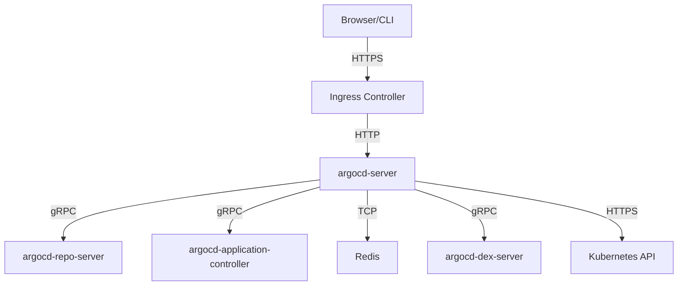

# How to Configure argocd-server Command-Line Options

Author: [nawazdhandala](https://github.com/nawazdhandala)

Tags: ArgoCD, GitOps, Kubernetes, Server Configuration, Operations

Description: Learn how to configure argocd-server command-line options to customize API server behavior, authentication, TLS, rate limiting, and performance tuning.

---

The `argocd-server` is the API server component of ArgoCD. It serves the web UI, handles API requests, processes webhook events, and manages SSO authentication. While the default configuration works for most small deployments, production environments often need to tune the server's behavior through command-line flags.

This guide covers the most important argocd-server command-line options, when to use them, and how to configure them in your Kubernetes deployment.

## How to Set Command-Line Options

The argocd-server runs as a Kubernetes Deployment. You modify its command-line options by editing the container's `command` or `args` field.

### Using kubectl edit

```bash
kubectl edit deployment argocd-server -n argocd
```

### Using a Kustomize Patch

This is the GitOps-friendly approach.

```yaml
# kustomization.yaml
apiVersion: kustomize.config.k8s.io/v1beta1
kind: Kustomization

resources:
  - https://raw.githubusercontent.com/argoproj/argo-cd/stable/manifests/install.yaml

patches:
  - target:
      kind: Deployment
      name: argocd-server
    patch: |
      - op: replace
        path: /spec/template/spec/containers/0/command
        value:
          - argocd-server
          - --insecure
          - --rootpath=/argocd
          - --loglevel=info
```

### Using Helm Values

If you installed ArgoCD with Helm:

```yaml
# values.yaml
server:
  extraArgs:
    - --insecure
    - --rootpath=/argocd
    - --loglevel=info
```

## Essential Server Options

### TLS and Security

#### --insecure

Disables TLS on the ArgoCD server. Use this when TLS is terminated at the ingress controller or load balancer.

```yaml
command:
  - argocd-server
  - --insecure
```

This is one of the most commonly used flags. Without it, ArgoCD serves HTTPS on port 8080, which can cause issues with ingress controllers that expect to do TLS termination themselves.

#### --tls-cert-file and --tls-key-file

Specify custom TLS certificates instead of the auto-generated ones.

```yaml
command:
  - argocd-server
  - --tls-cert-file=/tls/tls.crt
  - --tls-key-file=/tls/tls.key
```

Mount the certificates from a Kubernetes Secret.

```yaml
volumeMounts:
  - name: tls-certs
    mountPath: /tls
volumes:
  - name: tls-certs
    secret:
      secretName: argocd-server-tls
```

### URL and Path Configuration

#### --rootpath

Sets a root path for the ArgoCD server. Essential when running ArgoCD behind a reverse proxy at a subpath.

```yaml
command:
  - argocd-server
  - --rootpath=/argocd
```

With this setting, the ArgoCD UI will be available at `https://example.com/argocd/` instead of `https://example.com/`.

#### --basehref

Sets the base href for the UI. Usually set to the same value as rootpath.

```yaml
command:
  - argocd-server
  - --rootpath=/argocd
  - --basehref=/argocd
```

### Logging and Debugging

#### --loglevel

Controls the log verbosity. Available levels: `debug`, `info`, `warn`, `error`.

```yaml
command:
  - argocd-server
  - --loglevel=debug
```

Use `debug` for troubleshooting, `info` for normal operation, and `warn` or `error` to reduce log volume in large deployments.

#### --logformat

Choose between `text` (default) and `json` log formats. JSON is better for log aggregation systems.

```yaml
command:
  - argocd-server
  - --logformat=json
```

### Authentication and SSO

#### --dex-server

Specifies the Dex server address for SSO.

```yaml
command:
  - argocd-server
  - --dex-server=http://argocd-dex-server:5556
```

#### --oidc-cache-expiration

Controls how long OIDC tokens are cached. Default is 3 minutes.

```yaml
command:
  - argocd-server
  - --oidc-cache-expiration=10m
```

Increase this for high-traffic environments to reduce the load on your OIDC provider.

#### --enable-gzip

Enables gzip compression for API responses. Reduces bandwidth usage.

```yaml
command:
  - argocd-server
  - --enable-gzip
```

### Connection and Performance

#### --repo-server

Specifies the repo server address. Useful for custom deployments.

```yaml
command:
  - argocd-server
  - --repo-server=argocd-repo-server:8081
```

#### --staticassets

Directory containing the static web assets. Change this if you are serving custom UI builds.

```yaml
command:
  - argocd-server
  - --staticassets=/shared/app
```

#### --app-state-cache-expiration

How long application state is cached. Default is 1 hour.

```yaml
command:
  - argocd-server
  - --app-state-cache-expiration=30m
```

Lower values mean more frequent state checks but more load on the cluster.

## Rate Limiting Options

### --api-content-types

Restrict accepted content types for API requests.

### --connection-status-cache-expiration

Controls how long cluster connection status is cached.

```yaml
command:
  - argocd-server
  - --connection-status-cache-expiration=5m
```

## Full Production Configuration Example

Here is a comprehensive production configuration.

```yaml
apiVersion: apps/v1
kind: Deployment
metadata:
  name: argocd-server
  namespace: argocd
spec:
  replicas: 2
  selector:
    matchLabels:
      app.kubernetes.io/name: argocd-server
  template:
    metadata:
      labels:
        app.kubernetes.io/name: argocd-server
    spec:
      containers:
        - name: argocd-server
          image: quay.io/argoproj/argocd:v2.10.0
          command:
            - argocd-server
            # TLS terminated at ingress
            - --insecure
            # JSON logs for log aggregation
            - --logformat=json
            - --loglevel=info
            # Enable compression
            - --enable-gzip
            # Cache settings for performance
            - --app-state-cache-expiration=30m
            - --oidc-cache-expiration=10m
            # Redis configuration
            - --redis=argocd-redis-ha-haproxy:6379
          ports:
            - containerPort: 8080
              name: http
            - containerPort: 8083
              name: metrics
          resources:
            requests:
              cpu: 100m
              memory: 128Mi
            limits:
              cpu: 500m
              memory: 512Mi
          livenessProbe:
            httpGet:
              path: /healthz?full=true
              port: 8080
            initialDelaySeconds: 3
            periodSeconds: 30
          readinessProbe:
            httpGet:
              path: /healthz
              port: 8080
            initialDelaySeconds: 3
            periodSeconds: 30
```

## Architecture: ArgoCD Server Components



## Environment Variables as Alternatives

Some options can also be set via environment variables, which is useful when you cannot modify the command line.

```yaml
env:
  # Equivalent to --insecure
  - name: ARGOCD_SERVER_INSECURE
    value: "true"
  # Equivalent to --rootpath
  - name: ARGOCD_SERVER_ROOTPATH
    value: "/argocd"
  # Log level
  - name: ARGOCD_LOG_LEVEL
    value: "info"
  # Log format
  - name: ARGOCD_LOG_FORMAT
    value: "json"
```

## Viewing Current Configuration

Check what options your argocd-server is currently running with.

```bash
# See the full command line
kubectl get deployment argocd-server -n argocd \
  -o jsonpath='{.spec.template.spec.containers[0].command}' | jq .

# See environment variables
kubectl get deployment argocd-server -n argocd \
  -o jsonpath='{.spec.template.spec.containers[0].env}' | jq .

# Check all available options
kubectl exec -n argocd deployment/argocd-server -- argocd-server --help
```

## Common Mistakes

### Forgetting --insecure Behind a TLS-Terminating Proxy

If your ingress controller terminates TLS and forwards plain HTTP to ArgoCD, you must use `--insecure`. Otherwise, ArgoCD will try to serve HTTPS on the backend, causing protocol mismatches and redirect loops.

### Setting --rootpath Without --basehref

If you set `--rootpath` but forget `--basehref`, the UI assets will not load correctly because the browser will request them from the wrong path.

### Running Multiple Replicas Without Redis

If you scale argocd-server to multiple replicas for high availability, you need a shared Redis instance for session management. Without it, users will experience session drops as requests hit different replicas.

## Conclusion

The argocd-server command-line options give you fine-grained control over how the API server behaves. The most important ones for production are `--insecure` (when using TLS termination), `--logformat=json` (for log aggregation), and `--enable-gzip` (for bandwidth savings). Use Kustomize patches or Helm values to manage these options in Git for a proper GitOps approach. Check `argocd-server --help` for the complete list of available flags, as new options are added with each ArgoCD release.
