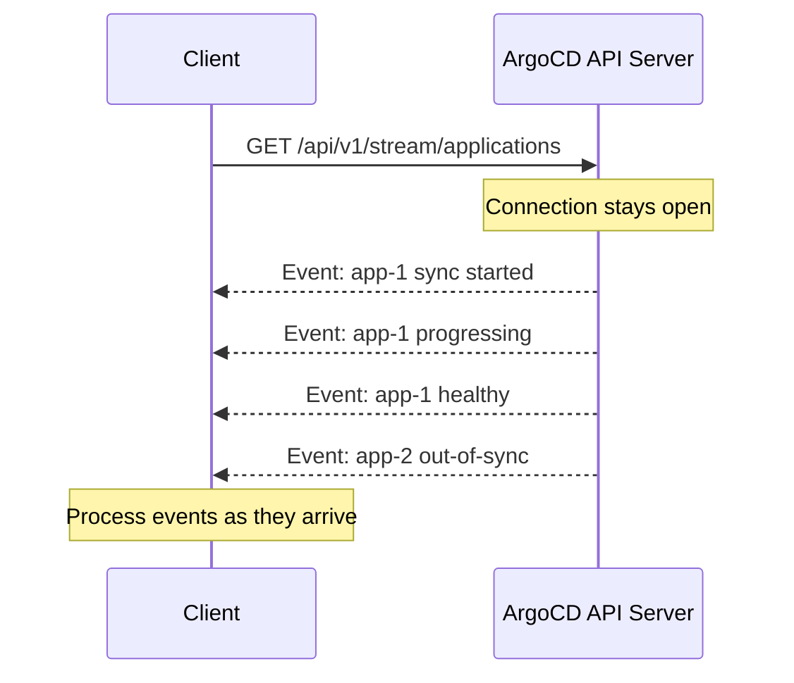

# How to Use ArgoCD Server-Sent Events API

Author: [nawazdhandala](https://github.com/nawazdhandala)

Tags: ArgoCD, GitOps, Kubernetes, Server-Sent Events, Monitoring

Description: Learn how to use the ArgoCD Server-Sent Events (SSE) API for real-time application monitoring, live dashboards, and event-driven automation.

---

ArgoCD provides a Server-Sent Events (SSE) API that streams application state changes in real-time. Unlike polling the REST API at intervals, SSE gives you instant notifications when applications change - whether they go out of sync, start progressing, become degraded, or complete a sync operation. This makes it perfect for building live dashboards, real-time alerting, and event-driven automation.

## What Are Server-Sent Events?

Server-Sent Events (SSE) is a W3C standard for one-way server-to-client streaming over HTTP. The server keeps the connection open and pushes events as they occur. Unlike WebSockets, SSE is simpler, works over standard HTTP, and automatically handles reconnection.



## The Stream Endpoint

ArgoCD exposes application events through this endpoint:

```
GET /api/v1/stream/applications
```

Optional query parameters:
- `name` - Watch a specific application
- `project` - Watch all applications in a project
- `resourceVersion` - Start watching from a specific resource version

## Basic SSE Consumption

### Using curl

```bash
# Watch all application events
curl -s -k -N \
  -H "Authorization: Bearer $ARGOCD_TOKEN" \
  "https://argocd.example.com/api/v1/stream/applications"

# Watch a specific application
curl -s -k -N \
  -H "Authorization: Bearer $ARGOCD_TOKEN" \
  "https://argocd.example.com/api/v1/stream/applications?name=my-app"
```

The `-N` flag disables curl's output buffering, so you see events as they arrive. Each event is a JSON object on a single line:

```json
{"result":{"type":"MODIFIED","application":{"metadata":{"name":"my-app",...},"status":{"sync":{"status":"Synced"},"health":{"status":"Healthy"}}}}}
```

### Processing Events in Bash

```bash
#!/bin/bash
# live-monitor.sh - Real-time application event monitor

ARGOCD_SERVER="https://argocd.example.com"

echo "Starting real-time ArgoCD monitor..."
echo "Press Ctrl+C to stop"
echo ""

curl -s -k -N \
  -H "Authorization: Bearer $ARGOCD_TOKEN" \
  "$ARGOCD_SERVER/api/v1/stream/applications" | \
while read -r line; do
  # Skip empty lines (SSE keepalive)
  [ -z "$line" ] && continue

  # Parse the event
  TYPE=$(echo "$line" | jq -r '.result.type // empty')
  NAME=$(echo "$line" | jq -r '.result.application.metadata.name // empty')
  HEALTH=$(echo "$line" | jq -r '.result.application.status.health.status // empty')
  SYNC=$(echo "$line" | jq -r '.result.application.status.sync.status // empty')

  if [ -n "$NAME" ]; then
    TIMESTAMP=$(date +"%Y-%m-%d %H:%M:%S")
    echo "[$TIMESTAMP] $TYPE | $NAME | Health: $HEALTH | Sync: $SYNC"
  fi
done
```

Sample output:

```
Starting real-time ArgoCD monitor...

[2026-02-26 14:23:01] MODIFIED | api-service | Health: Progressing | Sync: Synced
[2026-02-26 14:23:15] MODIFIED | api-service | Health: Healthy | Sync: Synced
[2026-02-26 14:25:30] MODIFIED | web-frontend | Health: Healthy | Sync: OutOfSync
[2026-02-26 14:25:32] MODIFIED | web-frontend | Health: Progressing | Sync: Synced
[2026-02-26 14:25:45] MODIFIED | web-frontend | Health: Healthy | Sync: Synced
```

## Python SSE Client

Python is ideal for building production-grade SSE consumers:

```python
import requests
import json
import time
from datetime import datetime

class ArgoCDEventStream:
    """Consume ArgoCD Server-Sent Events."""

    def __init__(self, server, token, verify_ssl=False):
        self.server = server.rstrip('/')
        self.token = token
        self.verify = verify_ssl

    def watch_all(self, callback):
        """Watch all application events and invoke callback for each."""
        self._stream("/api/v1/stream/applications", callback)

    def watch_app(self, app_name, callback):
        """Watch a specific application's events."""
        self._stream(
            f"/api/v1/stream/applications?name={app_name}",
            callback
        )

    def _stream(self, path, callback):
        """Internal method to consume the SSE stream."""
        url = f"{self.server}{path}"
        headers = {"Authorization": f"Bearer {self.token}"}

        while True:
            try:
                # Use stream=True for chunked transfer
                with requests.get(url, headers=headers,
                                  stream=True, verify=self.verify) as resp:
                    resp.raise_for_status()
                    for line in resp.iter_lines(decode_unicode=True):
                        if not line:
                            continue
                        try:
                            event = json.loads(line)
                            result = event.get("result", {})
                            callback(result)
                        except json.JSONDecodeError:
                            continue

            except requests.exceptions.ConnectionError:
                print(f"[{datetime.now()}] Connection lost. Reconnecting in 5s...")
                time.sleep(5)
            except Exception as e:
                print(f"[{datetime.now()}] Error: {e}. Reconnecting in 10s...")
                time.sleep(10)


def handle_event(event):
    """Process an application event."""
    event_type = event.get("type", "UNKNOWN")
    app = event.get("application", {})
    name = app.get("metadata", {}).get("name", "unknown")
    health = app.get("status", {}).get("health", {}).get("status", "unknown")
    sync = app.get("status", {}).get("sync", {}).get("status", "unknown")

    timestamp = datetime.now().strftime("%H:%M:%S")
    print(f"[{timestamp}] {event_type:8s} | {name:30s} | Health: {health:12s} | Sync: {sync}")

    # Trigger alerts for degraded applications
    if health == "Degraded":
        send_alert(name, health, sync)


def send_alert(app_name, health, sync):
    """Send an alert when application health degrades."""
    print(f"  ALERT: {app_name} is {health}!")
    # Integrate with your alerting system here
    # e.g., PagerDuty, Slack, OneUptime


# Run the event stream
stream = ArgoCDEventStream("https://argocd.example.com", token)
stream.watch_all(handle_event)
```

## Building a Live Dashboard

### HTML/JavaScript SSE Client

You can consume ArgoCD SSE events directly in a browser:

```html
<!DOCTYPE html>
<html>
<head>
  <title>ArgoCD Live Dashboard</title>
  <style>
    body { font-family: monospace; background: #1a1a2e; color: #eee; padding: 20px; }
    .app { padding: 8px 12px; margin: 4px 0; border-radius: 4px; }
    .Healthy { background: #16213e; border-left: 4px solid #0f0; }
    .Degraded { background: #2d1b1b; border-left: 4px solid #f00; }
    .Progressing { background: #1b2d1b; border-left: 4px solid #ff0; }
    .OutOfSync { background: #2d2d1b; border-left: 4px solid #fa0; }
    #events { max-height: 300px; overflow-y: auto; }
    .event { font-size: 12px; color: #888; }
  </style>
</head>
<body>
  <h2>ArgoCD Live Dashboard</h2>
  <div id="apps"></div>
  <h3>Event Log</h3>
  <div id="events"></div>

  <script>
    const ARGOCD_SERVER = 'https://argocd.example.com';
    const TOKEN = 'your-token-here';  // In production, use proper auth

    const apps = {};
    const appsDiv = document.getElementById('apps');
    const eventsDiv = document.getElementById('events');

    // Connect to SSE stream
    function connect() {
      const url = `${ARGOCD_SERVER}/api/v1/stream/applications`;

      fetch(url, {
        headers: { 'Authorization': `Bearer ${TOKEN}` }
      }).then(response => {
        const reader = response.body.getReader();
        const decoder = new TextDecoder();

        function read() {
          reader.read().then(({ done, value }) => {
            if (done) {
              // Reconnect after stream ends
              setTimeout(connect, 5000);
              return;
            }

            const text = decoder.decode(value);
            text.split('\n').forEach(line => {
              if (!line.trim()) return;
              try {
                const event = JSON.parse(line);
                handleEvent(event.result);
              } catch (e) {}
            });

            read();
          });
        }
        read();
      }).catch(() => {
        setTimeout(connect, 5000);
      });
    }

    function handleEvent(result) {
      const app = result.application;
      const name = app.metadata.name;
      const health = app.status.health.status;
      const sync = app.status.sync.status;

      // Update app state
      apps[name] = { health, sync };
      renderApps();

      // Log event
      const time = new Date().toLocaleTimeString();
      const eventEl = document.createElement('div');
      eventEl.className = 'event';
      eventEl.textContent = `[${time}] ${name}: health=${health}, sync=${sync}`;
      eventsDiv.prepend(eventEl);
    }

    function renderApps() {
      appsDiv.innerHTML = Object.entries(apps)
        .sort(([a], [b]) => a.localeCompare(b))
        .map(([name, { health, sync }]) =>
          `<div class="app ${health}">
            ${name} - Health: ${health} | Sync: ${sync}
          </div>`
        ).join('');
    }

    connect();
  </script>
</body>
</html>
```

## Event-Driven Automation

### Trigger Actions on Specific Events

```bash
#!/bin/bash
# event-driven-actions.sh - Take action based on SSE events

ARGOCD_SERVER="https://argocd.example.com"

curl -s -k -N \
  -H "Authorization: Bearer $ARGOCD_TOKEN" \
  "$ARGOCD_SERVER/api/v1/stream/applications" | \
while read -r line; do
  [ -z "$line" ] && continue

  NAME=$(echo "$line" | jq -r '.result.application.metadata.name // empty')
  HEALTH=$(echo "$line" | jq -r '.result.application.status.health.status // empty')
  SYNC=$(echo "$line" | jq -r '.result.application.status.sync.status // empty')
  PREV_HEALTH=$(echo "$line" | jq -r '.result.application.status.health.previousStatus // empty')

  [ -z "$NAME" ] && continue

  # Alert on degradation
  if [ "$HEALTH" = "Degraded" ]; then
    echo "ALERT: $NAME became Degraded"
    # Send to Slack, PagerDuty, etc.
    curl -s -X POST "$SLACK_WEBHOOK" \
      -d "{\"text\": \"ArgoCD Alert: $NAME is Degraded\"}" &
  fi

  # Log sync completions
  if [ "$SYNC" = "Synced" ] && [ "$HEALTH" = "Healthy" ]; then
    echo "SUCCESS: $NAME sync completed successfully"
  fi

  # Auto-sync OutOfSync apps during business hours
  HOUR=$(date +%H)
  if [ "$SYNC" = "OutOfSync" ] && [ "$HOUR" -ge 9 ] && [ "$HOUR" -lt 17 ]; then
    echo "AUTO-SYNC: Triggering sync for $NAME"
    curl -s -k -H "Authorization: Bearer $ARGOCD_TOKEN" \
      -X POST "$ARGOCD_SERVER/api/v1/applications/$NAME/sync" \
      -H "Content-Type: application/json" \
      -d '{"prune": false}' &
  fi
done
```

## Handling Reconnection

SSE connections can drop due to network issues or server restarts. Always implement reconnection logic:

```python
import time
import requests

def resilient_stream(server, token, callback, max_retries=None):
    """SSE stream with automatic reconnection."""
    retries = 0
    backoff = 1

    while max_retries is None or retries < max_retries:
        try:
            with requests.get(
                f"{server}/api/v1/stream/applications",
                headers={"Authorization": f"Bearer {token}"},
                stream=True,
                verify=False,
                timeout=(10, None)  # 10s connect, no read timeout
            ) as resp:
                resp.raise_for_status()
                retries = 0  # Reset on successful connection
                backoff = 1

                for line in resp.iter_lines(decode_unicode=True):
                    if line:
                        try:
                            event = json.loads(line)
                            callback(event.get("result", {}))
                        except json.JSONDecodeError:
                            pass

        except Exception as e:
            retries += 1
            wait = min(backoff * 2, 60)  # Cap at 60 seconds
            print(f"Connection error: {e}. Retry {retries} in {wait}s")
            time.sleep(wait)
            backoff = wait
```

The ArgoCD SSE API transforms how you monitor and react to application state changes. Instead of polling at intervals and potentially missing rapid state transitions, you get instant notifications as events occur. Use it for live dashboards, event-driven automation, and real-time alerting to keep your GitOps workflows responsive and observable.
