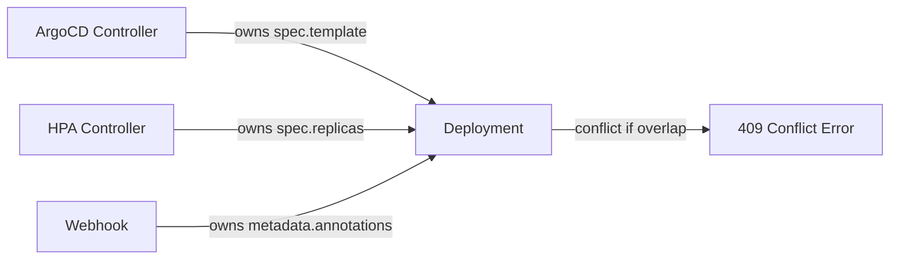

# How to Handle Server-Side Apply Conflicts in ArgoCD

Author: [nawazdhandala](https://github.com/nawazdhandala)

Tags: ArgoCD, GitOps, Kubernetes, Server-Side Apply, Troubleshooting

Description: Learn how to handle server-side apply conflicts in ArgoCD when multiple controllers or tools compete for field ownership in Kubernetes resources.

---

Server-side apply (SSA) is the modern way Kubernetes handles resource updates. Instead of the client sending the entire resource and hoping nothing else changed, SSA tracks which manager owns which fields. When ArgoCD uses server-side apply, conflicts can arise if another controller, operator, or even kubectl tries to modify the same fields. This guide covers what causes these conflicts and how to resolve them cleanly.

## Understanding Server-Side Apply and Field Ownership

Kubernetes 1.22+ supports server-side apply as a stable feature. Every field in a resource has an owner - the manager that last set it. When two managers try to set the same field to different values, Kubernetes raises a conflict.

ArgoCD identifies itself as a field manager named `argocd-controller` when it applies resources. If a Horizontal Pod Autoscaler changes `spec.replicas` or a mutating webhook sets annotations, those fields now have different owners. The next time ArgoCD tries to sync, it hits a conflict because it wants to set a field that another manager owns.

Here is a simplified view of how field ownership works:



## Enabling Server-Side Apply in ArgoCD

Before handling conflicts, here is how you enable SSA for an application. You add the `ServerSideApply=true` sync option.

```yaml
# Application manifest with server-side apply enabled
apiVersion: argoproj.io/v1alpha1
kind: Application
metadata:
  name: my-app
  namespace: argocd
spec:
  project: default
  source:
    repoURL: https://github.com/org/repo.git
    targetRevision: main
    path: manifests
  destination:
    server: https://kubernetes.default.svc
    namespace: production
  syncPolicy:
    syncOptions:
      # Enable server-side apply for this application
      - ServerSideApply=true
```

You can also enable it globally in the ArgoCD ConfigMap.

```yaml
# argocd-cm ConfigMap - global setting
apiVersion: v1
kind: ConfigMap
metadata:
  name: argocd-cm
  namespace: argocd
data:
  # Enable server-side apply for all applications
  application.sync.options: ServerSideApply=true
```

## Common Conflict Scenarios

### Scenario 1: HPA Conflicts with Replicas Field

The most common conflict happens when ArgoCD manages a Deployment that also has a Horizontal Pod Autoscaler. The HPA changes `spec.replicas`, but your Git manifest also declares it.

The solution is to tell ArgoCD to ignore the replicas field.

```yaml
apiVersion: argoproj.io/v1alpha1
kind: Application
metadata:
  name: my-app
  namespace: argocd
spec:
  project: default
  source:
    repoURL: https://github.com/org/repo.git
    targetRevision: main
    path: manifests
  destination:
    server: https://kubernetes.default.svc
    namespace: production
  ignoreDifferences:
    # Let the HPA manage replicas without ArgoCD fighting it
    - group: apps
      kind: Deployment
      jsonPointers:
        - /spec/replicas
  syncPolicy:
    syncOptions:
      - ServerSideApply=true
      # Respect the ignoreDifferences during sync
      - RespectIgnoreDifferences=true
```

### Scenario 2: Mutating Webhook Adds Fields

Mutating admission webhooks often inject sidecar containers, add labels, or set default values. These mutations create fields that ArgoCD does not know about, leading to drift detection or SSA conflicts.

```yaml
# Tell ArgoCD to ignore fields set by your webhook
ignoreDifferences:
  - group: apps
    kind: Deployment
    # Ignore the sidecar container injected by Istio
    jqPathExpressions:
      - '.spec.template.spec.containers[] | select(.name == "istio-proxy")'
    # Ignore annotations set by webhooks
    jsonPointers:
      - /metadata/annotations/sidecar.istio.io~1status
```

### Scenario 3: Operator-Managed Resources

When ArgoCD deploys a Custom Resource that an operator then modifies (setting status fields, adding defaults), conflicts can occur on the status subresource or on defaulted spec fields.

```yaml
# For operator-managed CRDs, ignore status entirely
ignoreDifferences:
  - group: databases.example.com
    kind: PostgresCluster
    jsonPointers:
      - /status
    # Also ignore operator-set defaults
    jqPathExpressions:
      - '.spec.backup.schedule // empty'
```

## Force Applying to Resolve Stubborn Conflicts

When you need to forcefully take ownership of a field, you can use the `--force` flag during a manual sync. This tells Kubernetes to override the conflict and reassign field ownership to ArgoCD.

```bash
# Force sync a specific application to resolve conflicts
argocd app sync my-app --force

# Or use kubectl with force-conflicts flag directly
kubectl apply --server-side --force-conflicts -f deployment.yaml
```

Be careful with force-conflicts. It takes ownership away from whatever controller previously managed those fields. If an HPA was managing replicas and you force-apply, ArgoCD now owns replicas and the HPA can no longer change them.

## Using managedFields to Debug Conflicts

When a conflict occurs, checking managedFields on the resource tells you exactly who owns what.

```bash
# View the managed fields for a deployment
kubectl get deployment my-app -o jsonpath='{.metadata.managedFields}' | jq .

# Look for the specific field manager causing conflicts
kubectl get deployment my-app -o jsonpath='{.metadata.managedFields[*].manager}'
```

The output shows each manager and which fields it owns.

```json
[
  {
    "manager": "argocd-controller",
    "operation": "Apply",
    "apiVersion": "apps/v1",
    "fieldsType": "FieldsV1",
    "fieldsV1": {
      "f:spec": {
        "f:template": {
          "f:spec": {
            "f:containers": {}
          }
        }
      }
    }
  },
  {
    "manager": "kube-controller-manager",
    "operation": "Update",
    "fieldsV1": {
      "f:spec": {
        "f:replicas": {}
      }
    }
  }
]
```

## Best Practices for Avoiding SSA Conflicts

### 1. Separate Concerns Early

Design your manifests so that ArgoCD only declares fields it should own. Remove `spec.replicas` from Deployments that use HPAs. Do not set annotations that webhooks manage.

### 2. Use ignoreDifferences Consistently

Set up `ignoreDifferences` proactively, not reactively. If you know an operator will modify certain fields, configure ArgoCD to ignore them from the start.

### 3. Standardize on One Apply Method

Mixing client-side apply (the default kubectl behavior) with server-side apply causes confusion. If you enable SSA in ArgoCD, make sure your CI pipelines and manual kubectl commands also use `--server-side`.

```bash
# Consistent: always use server-side apply
kubectl apply --server-side -f resource.yaml

# Avoid mixing: do not use client-side apply on the same resources
# kubectl apply -f resource.yaml  # this uses last-applied-configuration annotation
```

### 4. Configure the ArgoCD Field Manager Name

You can customize the field manager name ArgoCD uses, which helps when debugging across multiple ArgoCD instances.

```yaml
# argocd-cm ConfigMap
apiVersion: v1
kind: ConfigMap
metadata:
  name: argocd-cm
  namespace: argocd
data:
  # Custom field manager name for this ArgoCD instance
  server.side.apply.field.manager: argocd-prod-cluster
```

## Monitoring for SSA Conflicts

ArgoCD surfaces SSA conflicts as sync errors in the UI and through notifications. Set up alerts to catch these early.

```yaml
# ArgoCD notification trigger for sync failures (including SSA conflicts)
apiVersion: v1
kind: ConfigMap
metadata:
  name: argocd-notifications-cm
  namespace: argocd
data:
  trigger.on-sync-failed: |
    - when: app.status.operationState.phase in ['Error', 'Failed']
      send: [slack-notification]
  template.slack-notification: |
    message: |
      Application {{.app.metadata.name}} sync failed.
      Error: {{.app.status.operationState.message}}
```

For more details on monitoring ArgoCD, check out [ArgoCD health checks and monitoring](https://oneuptime.com/blog/post/2026-01-25-health-checks-argocd/view).

## Summary

Server-side apply conflicts in ArgoCD come down to field ownership disputes. The fix is almost always one of three things: ignore the conflicting fields with `ignoreDifferences`, force-apply to take ownership, or remove the contested fields from your Git manifests entirely. Start by understanding who owns what with `managedFields`, then choose the resolution that matches your operational model. The most reliable approach is to design your manifests so that each controller manages its own fields without overlap.
