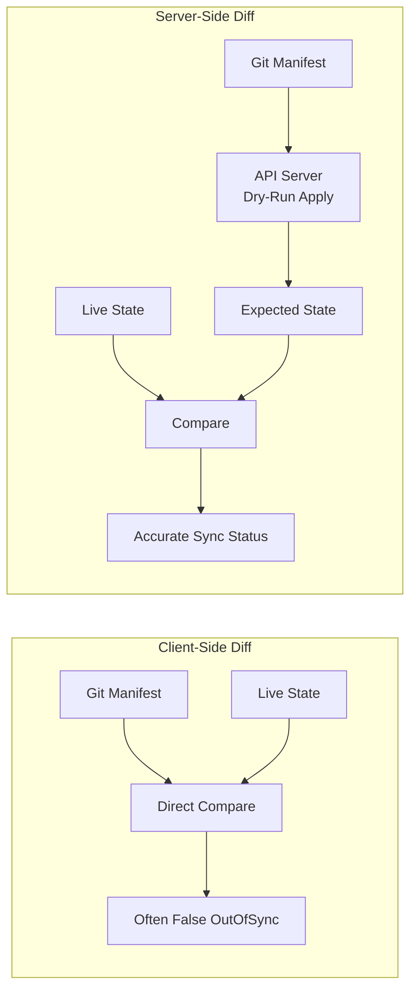

# How to Use Server-Side Diff in ArgoCD

Author: [nawazdhandala](https://github.com/nawazdhandala)

Tags: ArgoCD, GitOps, Kubernetes, Server-Side Diff, Sync

Description: Learn how to enable and configure server-side diff in ArgoCD to get accurate sync status by leveraging Kubernetes server-side apply for comparison.

---

Server-side diff is a diff strategy in ArgoCD that uses Kubernetes' server-side apply mechanism to compute differences between your desired state and the live cluster state. Instead of ArgoCD doing the comparison locally, it delegates the work to the Kubernetes API server, which understands field defaults, ownership, and admission controller mutations. This produces significantly more accurate diff results.

## Why Server-Side Diff Matters

With the traditional client-side diff, ArgoCD renders your manifests and compares them directly against the live cluster state. This comparison has a fundamental problem: ArgoCD does not know what the API server will add to your manifest when it is applied.

For example, when you apply a Deployment, the API server:

- Adds default values (strategy type, revision history limit, etc.)
- Processes admission controller mutations (sidecar injection, resource limits, etc.)
- Sets managed fields metadata

Client-side diff sees these API server additions as differences, causing false OutOfSync reports. Server-side diff avoids this because it asks the API server "what would this look like if I applied it?" and compares that result.



## Enabling Server-Side Diff

### Per-Application

Enable server-side diff on a specific application:

```yaml
apiVersion: argoproj.io/v1alpha1
kind: Application
metadata:
  name: my-app
  namespace: argocd
spec:
  source:
    repoURL: https://github.com/myorg/app.git
    targetRevision: main
    path: k8s/production
  destination:
    server: https://kubernetes.default.svc
    namespace: my-app
  syncPolicy:
    syncOptions:
      - ServerSideApply=true
```

The `ServerSideApply=true` sync option enables both server-side diff (for status computation) and server-side apply (for sync operations).

### Global Default

Enable server-side diff for all applications:

```yaml
apiVersion: v1
kind: ConfigMap
metadata:
  name: argocd-cmd-params-cm
  namespace: argocd
data:
  controller.diff.server.side: "true"
```

After applying, restart the controller:

```bash
kubectl apply -f argocd-cmd-params-cm.yaml
kubectl rollout restart statefulset/argocd-application-controller -n argocd
```

### For Specific Resource Types (System-Level)

You can enable server-side diff for specific resource types system-wide using the `argocd-cm` ConfigMap:

```yaml
apiVersion: v1
kind: ConfigMap
metadata:
  name: argocd-cm
  namespace: argocd
data:
  # Enable server-side diff for specific resource types
  resource.customizations.useServerSideDiff.admissionregistration.k8s.io_MutatingWebhookConfiguration: "true"
  resource.customizations.useServerSideDiff.apps_Deployment: "true"
  resource.customizations.useServerSideDiff.cert-manager.io_Certificate: "true"
```

## How Server-Side Diff Works Internally

When ArgoCD computes the diff using server-side diff, it performs these steps:

1. **Render manifests** from Git (same as client-side)
2. **Send dry-run server-side apply** request to the Kubernetes API server
3. **API server processes the request** - applies defaults, runs admission controllers, computes managed fields
4. **API server returns the expected result** without actually modifying the resource
5. **ArgoCD compares** the expected result against the live state
6. **ArgoCD only considers fields it manages** based on managedFields ownership

The dry-run request looks like this under the hood:

```bash
# Conceptually, ArgoCD does this:
kubectl apply -f manifest.yaml \
  --dry-run=server \
  --server-side \
  --field-manager=argocd-controller
```

## Practical Examples

### Example 1: Admission Controller Sidecar Injection

When Istio injects a sidecar, it adds a container to your pod spec. With client-side diff, this causes OutOfSync:

```yaml
# Your manifest (1 container)
spec:
  containers:
    - name: app
      image: myapp:v1

# Live state (2 containers - Istio injected sidecar)
spec:
  containers:
    - name: app
      image: myapp:v1
    - name: istio-proxy
      image: istio/proxyv2:1.20
```

**Client-side diff**: Shows OutOfSync because the live state has an extra container.

**Server-side diff**: Recognizes that ArgoCD only manages the `app` container (based on field ownership). The `istio-proxy` container is managed by the Istio admission controller. No false diff.

### Example 2: HPA-Managed Replicas

When an HPA manages replicas, it changes the replica count:

```yaml
# Your manifest
spec:
  replicas: 3

# Live state (HPA scaled up)
spec:
  replicas: 7
```

With server-side diff and the HPA managing the replicas field, ArgoCD correctly identifies that it does not own the replicas field and ignores the difference. You may still need to use `ignoreDifferences` for this case depending on your setup.

### Example 3: Defaulted Fields

```yaml
# Your manifest (minimal)
apiVersion: apps/v1
kind: Deployment
spec:
  template:
    spec:
      containers:
        - name: app
          image: nginx:1.25

# Live state (API server added defaults)
spec:
  revisionHistoryLimit: 10
  progressDeadlineSeconds: 600
  template:
    spec:
      terminationGracePeriodSeconds: 30
      containers:
        - name: app
          image: nginx:1.25
          imagePullPolicy: IfNotPresent
```

**Server-side diff**: The dry-run apply returns the same defaults, so the comparison matches. No false OutOfSync.

## Configuring the Field Manager

Server-side apply uses field managers to track ownership. ArgoCD uses a specific field manager name:

```yaml
# In argocd-cmd-params-cm
apiVersion: v1
kind: ConfigMap
metadata:
  name: argocd-cmd-params-cm
  namespace: argocd
data:
  controller.diff.server.side: "true"
  # Customize the field manager name (optional)
  controller.diff.server.side.manager: "argocd-controller"
```

The field manager name determines which fields ArgoCD "owns." Only owned fields are considered in the diff.

## Handling Conflicts

When server-side apply detects a conflict (another manager owns a field you are trying to change), ArgoCD can be configured to force the apply:

```yaml
apiVersion: argoproj.io/v1alpha1
kind: Application
metadata:
  name: my-app
  namespace: argocd
spec:
  syncPolicy:
    syncOptions:
      - ServerSideApply=true
    # Force conflicts resolution in favor of ArgoCD
    managedNamespaceMetadata:
      labels:
        managed-by: argocd
```

To force ownership on conflicts during sync:

```yaml
syncPolicy:
  syncOptions:
    - ServerSideApply=true
    - ServerSideApply.ForceConflicts=true
```

## Monitoring Server-Side Diff Behavior

Check the diff output to verify server-side diff is working:

```bash
# View the diff for an application
argocd app diff my-app

# If using server-side diff, the output should be clean
# (no false diffs from defaulted fields)

# Check application annotations for diff strategy
kubectl get application my-app -n argocd \
  -o jsonpath='{.status.sync.comparedTo.source}'
```

Check controller logs for server-side diff activity:

```bash
kubectl logs -n argocd -l app.kubernetes.io/name=argocd-application-controller \
  --tail=200 | grep -i "server.side\|dry.run\|field.manager"
```

## Troubleshooting

### Still Seeing False Diffs

If you still see false diffs after enabling server-side diff, check:

```bash
# Verify the option is actually applied
kubectl get application my-app -n argocd \
  -o jsonpath='{.spec.syncPolicy.syncOptions}'

# Check if global setting is enabled
kubectl get configmap argocd-cmd-params-cm -n argocd \
  -o jsonpath='{.data.controller\.diff\.server\.side}'
```

### API Server Errors on Dry-Run

If the API server rejects dry-run requests:

```bash
# Check controller logs for dry-run errors
kubectl logs -n argocd -l app.kubernetes.io/name=argocd-application-controller \
  --tail=100 | grep "dry-run\|DryRun"

# Common cause: CRD webhooks that do not support dry-run
# Fix: update the webhook to support dry-run or fall back to client-side diff for that resource
```

### Performance Impact

Server-side diff makes additional API server requests (dry-run apply for each resource). Monitor API server load:

```promql
# API server request rate from ArgoCD
rate(apiserver_request_total{
  verb="PATCH",
  resource=~".*",
  client=~".*argocd.*"
}[5m])
```

If the API server is under pressure, consider:

- Increasing the reconciliation interval to reduce diff frequency
- Only enabling server-side diff for resources that produce false diffs

## Migration Checklist

When migrating from client-side to server-side diff:

1. Enable on one non-critical application first
2. Check that sync status is accurate (no new false OutOfSync)
3. Review if any existing `ignoreDifferences` can be removed
4. Gradually enable on more applications
5. Enable globally once confident
6. Clean up `ignoreDifferences` that are no longer needed

Server-side diff is the recommended approach for modern ArgoCD deployments. It produces more accurate results, requires less `ignoreDifferences` configuration, and handles complex scenarios (admission controllers, operators, defaulting) that client-side diff struggles with. For more on diff customization, see our guide on [choosing the right diff strategy](https://oneuptime.com/blog/post/2026-02-26-argocd-choose-right-diff-strategy/view) and [configuring ignoreDifferences](https://oneuptime.com/blog/post/2026-02-26-argocd-configure-ignore-differences/view).
