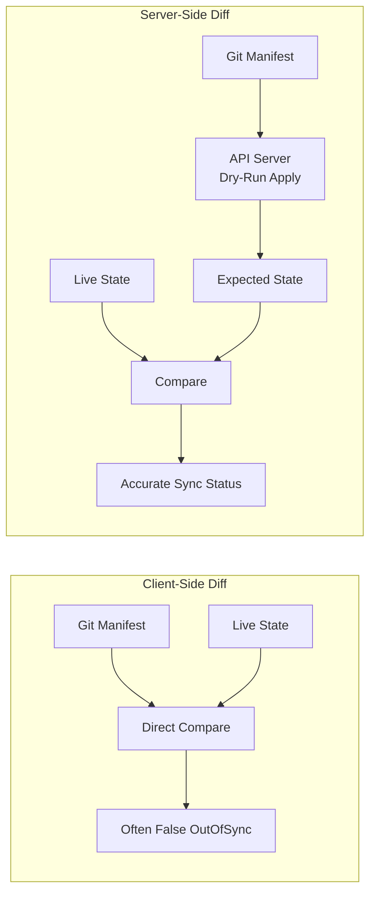

# How to Use Server-Side Diff in ArgoCD

Author: [nawazdhandala](https://github.com/nawazdhandala)

Tags: ArgoCD, GitOps, Kubernetes, Server-Side Diff, Sync

Description: Learn how to enable and configure server-side diff in ArgoCD to get accurate sync status by leveraging Kubernetes server-side apply for comparison.

---

Server-side diff is a diff strategy in ArgoCD that uses Kubernetes' server-side apply dry-run mechanism to compute differences between your desired state and the live cluster state. Instead of ArgoCD doing the comparison locally, it asks the Kubernetes API server to calculate the predicted live object, which accounts for API defaulting and validation admission. Mutating webhooks can also be included when explicitly enabled. This produces significantly more accurate diff results.

## Why Server-Side Diff Matters

With the traditional client-side diff, ArgoCD renders your manifests and compares them directly against the live cluster state. This comparison has a fundamental problem: ArgoCD does not know what the API server will add to your manifest when it is applied.

For example, when you apply a Deployment, the API server:

- Adds default values (strategy type, revision history limit, etc.)
- Processes validation admission checks, and optionally mutation webhooks when configured
- Sets managed fields metadata

Client-side diff can see API server additions as differences, causing false OutOfSync reports. Server-side diff avoids many of these cases because it asks the API server "what would this look like if I applied it?" and compares that result.


```mermaid
flowchart LR
    subgraph "Client-Side Diff"
        Git1["Git Manifest"] --> Compare1["Direct Compare"]
        Live1["Live State"] --> Compare1
        Compare1 --> Result1["Often False OutOfSync"]
    end

    subgraph "Server-Side Diff"
        Git2["Git Manifest"] --> DryRun["API Server<br/>Dry-Run Apply"]
        DryRun --> Expected["Expected State"]
        Live2["Live State"] --> Compare2["Compare"]
        Expected --> Compare2
        Compare2 --> Result2["Accurate Sync Status"]
    end
```

## Enabling Server-Side Diff

### Per-Application

Enable server-side diff on a specific application:

```yaml
apiVersion: argoproj.io/v1alpha1
kind: Application
metadata:
  name: my-app
  namespace: argocd
  annotations:
    argocd.argoproj.io/compare-options: ServerSideDiff=true
spec:
  project: default
  source:
    repoURL: https://github.com/myorg/app.git
    targetRevision: main
    path: k8s/production
  destination:
    server: https://kubernetes.default.svc
    namespace: my-app
```

The `argocd.argoproj.io/compare-options: ServerSideDiff=true` annotation enables server-side diff for status computation. The `ServerSideApply=true` sync option is separate: it enables Kubernetes server-side apply for sync operations.

### Global Default

Enable server-side diff for all applications:

```yaml
apiVersion: v1
kind: ConfigMap
metadata:
  name: argocd-cmd-params-cm
  namespace: argocd
data:
  controller.diff.server.side: "true"
```

After applying, restart the controller:

```bash
kubectl apply -f argocd-cmd-params-cm.yaml
kubectl rollout restart statefulset/argocd-application-controller -n argocd
```

### Including Mutation Webhooks

Server-side diff does not include changes made by mutating webhooks by default. If you want mutation webhooks to participate in the diff, add `IncludeMutationWebhook=true` to the same compare-options annotation:

```yaml
apiVersion: argoproj.io/v1alpha1
kind: Application
metadata:
  name: my-app
  namespace: argocd
  annotations:
    argocd.argoproj.io/compare-options: ServerSideDiff=true,IncludeMutationWebhook=true
spec:
  # ...
```

## How Server-Side Diff Works Internally

When ArgoCD computes the diff using server-side diff, it performs these steps:

1. **Render manifests** from Git (same as client-side)
2. **Send dry-run server-side apply** request to the Kubernetes API server for existing resources
3. **API server processes the request** - applies defaults, runs validation admission, and optionally includes mutating webhooks if configured
4. **API server returns the expected result** without actually modifying the resource
5. **ArgoCD compares** the expected result against the live state
6. **ArgoCD caches the result** until inputs change, such as an application refresh, a new Git revision, an application spec change, or a live resource version change

The dry-run request looks like this under the hood:

```bash
# Conceptually, ArgoCD does this:

kubectl apply -f manifest.yaml \
  --dry-run=server \
  --server-side \
  --field-manager=argocd-controller
```

## Practical Examples

### Example 1: Mutating Webhook Changes

When a mutating webhook changes a managed resource during admission, client-side diff may not know about that mutation. With server-side diff and `IncludeMutationWebhook=true`, ArgoCD can include webhook mutations in the predicted live object:

```yaml
# Your manifest
metadata:
  labels:
    app: my-app

# Live state after a mutating webhook adds a label
metadata:
  labels:
    app: my-app
    policy.example.com/injected: "true"
```

**Client-side diff**: Can show OutOfSync because the live state has an extra webhook-managed field.

**Server-side diff with mutation webhooks included**: The dry-run apply includes the same webhook mutation, so the comparison can avoid a false diff.

### Example 2: HPA-Managed Replicas

When an HPA manages replicas, it changes the replica count:

```yaml
# Your manifest
spec:
  replicas: 3

# Live state (HPA scaled up)
spec:
  replicas: 7
```

If the desired manifest still contains `spec.replicas: 3`, server-side diff can still report this as a difference because the predicted object has 3 replicas while the live object has 7. For HPA-managed workloads, use `ignoreDifferences` for `/spec/replicas` and consider omitting `replicas` from the desired manifest when appropriate.

### Example 3: Defaulted Fields

```yaml
# Your manifest (minimal)
apiVersion: apps/v1
kind: Deployment
metadata:
  name: web
spec:
  selector:
    matchLabels:
      app: web
  template:
    metadata:
      labels:
        app: web
    spec:
      containers:
        - name: app
          image: nginx:1.25

# Live state (API server added defaults)
spec:
  revisionHistoryLimit: 10
  progressDeadlineSeconds: 600
  template:
    spec:
      terminationGracePeriodSeconds: 30
      containers:
        - name: app
          image: nginx:1.25
          imagePullPolicy: IfNotPresent
```

**Server-side diff**: The dry-run apply returns the same defaults, so the comparison matches. No false OutOfSync.

## Field Manager Notes

Server-side apply uses field managers to track ownership. For server-side apply syncs, ArgoCD uses its own field manager, commonly `argocd-controller`. You can customize the field manager used during client-side apply migration with the `argocd.argoproj.io/client-side-apply-migration-manager` annotation:

```yaml
apiVersion: argoproj.io/v1alpha1
kind: Application
metadata:
  name: my-app
  namespace: argocd
  annotations:
    argocd.argoproj.io/client-side-apply-migration-manager: "my-custom-manager"
spec:
  # ...
```

This annotation is for migration from client-side apply to server-side apply. It is not required to enable server-side diff.

## Handling Conflicts

When server-side apply detects a conflict, another manager owns a field you are trying to change. In current ArgoCD documentation, `ServerSideApply=true` syncs use `kubectl apply --server-side --force-conflicts`, so ArgoCD takes ownership of the fields it applies:

```yaml
apiVersion: argoproj.io/v1alpha1
kind: Application
metadata:
  name: my-app
  namespace: argocd
spec:
  syncPolicy:
    syncOptions:
      - ServerSideApply=true
```

If you do not want ArgoCD to own a field, remove that field from the desired manifest or configure `ignoreDifferences` and `RespectIgnoreDifferences=true` where appropriate.

## Monitoring Server-Side Diff Behavior

Check the diff output to verify server-side diff is working:

```bash
# View the diff for an application
argocd app diff my-app --server-side-diff

# If using server-side diff, the output should be clean
# (no false diffs from defaulted fields)

# Check application annotations for diff strategy
kubectl get application my-app -n argocd \
  -o jsonpath='{.metadata.annotations.argocd\.argoproj\.io/compare-options}'
```

Check controller logs for server-side diff activity:

```bash
kubectl logs -n argocd -l app.kubernetes.io/name=argocd-application-controller \
  --tail=200 | grep -i "server.side\|dry.run\|field.manager"
```

## Troubleshooting

### Still Seeing False Diffs

If you still see false diffs after enabling server-side diff, check:

```bash
# Verify the option is actually applied
kubectl get application my-app -n argocd \
  -o jsonpath='{.metadata.annotations.argocd\.argoproj\.io/compare-options}'

# Check if global setting is enabled
kubectl get configmap argocd-cmd-params-cm -n argocd \
  -o jsonpath='{.data.controller\.diff\.server\.side}'
```

### API Server Errors on Dry-Run

If the API server rejects dry-run requests:

```bash
# Check controller logs for dry-run errors
kubectl logs -n argocd -l app.kubernetes.io/name=argocd-application-controller \
  --tail=100 | grep "dry-run\|DryRun"

# Common cause: CRD webhooks that do not support dry-run
# Fix: update the webhook to support dry-run or fall back to client-side diff for that resource
```

### Performance Impact

Server-side diff makes additional API server requests (dry-run apply for existing resources). Monitor API server load:

```promql
# API server dry-run PATCH request rate
rate(apiserver_request_total{
  verb="PATCH",
  dry_run="All"
}[5m])
```

If the API server is under pressure, consider:

- Increasing the reconciliation interval to reduce diff frequency
- Only enabling server-side diff for applications that produce false diffs

## Migration Checklist

When migrating from client-side to server-side diff:

1. Enable on one non-critical application first
2. Check that sync status is accurate (no new false OutOfSync)
3. Review if any existing `ignoreDifferences` can be removed
4. Gradually enable on more applications
5. Enable globally once confident
6. Clean up `ignoreDifferences` that are no longer needed

Server-side diff is the recommended approach for modern ArgoCD deployments. It produces more accurate results, requires less `ignoreDifferences` configuration, and handles complex scenarios (admission controllers, operators, defaulting) that client-side diff struggles with. For more on diff customization, see our guide on [choosing the right diff strategy](https://oneuptime.com/blog/post/2026-02-26-argocd-choose-right-diff-strategy/view) and [configuring ignoreDifferences](https://oneuptime.com/blog/post/2026-02-26-argocd-configure-ignore-differences/view).
