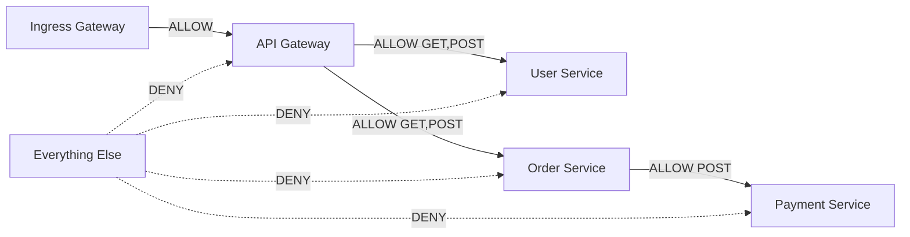
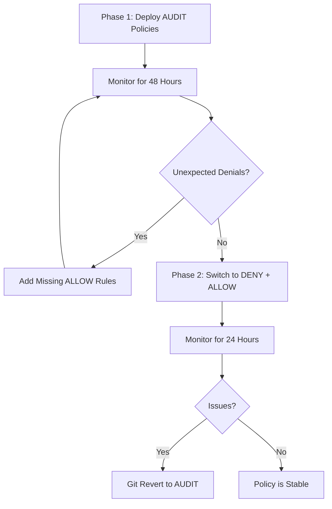

# How to Deploy Service Mesh Authorization Policies with ArgoCD

Author: [nawazdhandala](https://github.com/nawazdhandala)

Tags: ArgoCD, GitOps, Kubernetes, Service Mesh, Authorization

Description: Learn how to deploy and manage Istio authorization policies through ArgoCD for zero-trust security enforcement across your Kubernetes services.

---

Authorization policies in a service mesh control which services can talk to each other. They are the foundation of zero-trust networking - instead of trusting everything inside your cluster, you explicitly define every allowed communication path. Managing these policies through ArgoCD means your entire security posture is defined in Git, reviewed by your team, and automatically enforced.

This guide covers deploying Istio AuthorizationPolicy resources through ArgoCD, from basic deny-all policies to fine-grained rules.

## Why GitOps for Authorization Policies

Authorization policies are security-critical. You do not want someone running kubectl apply to change who can access your payment service. With ArgoCD:

- Every policy change is a Git commit with an author
- Changes require pull request review
- ArgoCD's self-heal reverts unauthorized manual changes
- Full audit trail for compliance

## The Foundation: Deny-All Default

The first step in zero-trust networking is to deny all traffic by default, then explicitly allow what is needed. Create a base ArgoCD Application for authorization policies:

```yaml
# authz-policies-app.yaml
apiVersion: argoproj.io/v1alpha1
kind: Application
metadata:
  name: authz-policies
  namespace: argocd
spec:
  project: security
  source:
    repoURL: https://github.com/myorg/k8s-security.git
    path: authz-policies
    targetRevision: main
    directory:
      recurse: true
  destination:
    server: https://kubernetes.default.svc
  syncPolicy:
    automated:
      selfHeal: true
      prune: true
    syncOptions:
      - ServerSideApply=true
```

The deny-all policy for your production namespace:

```yaml
# authz-policies/production/deny-all.yaml
apiVersion: security.istio.io/v1beta1
kind: AuthorizationPolicy
metadata:
  name: deny-all
  namespace: production
spec:
  # Empty spec with no rules means deny everything
  {}
```

## Layered Allow Policies

Once deny-all is in place, add explicit allow policies for each communication path. Here is a realistic microservices setup:

```yaml
# authz-policies/production/api-gateway-policy.yaml
apiVersion: security.istio.io/v1beta1
kind: AuthorizationPolicy
metadata:
  name: allow-api-gateway-ingress
  namespace: production
spec:
  selector:
    matchLabels:
      app: api-gateway
  action: ALLOW
  rules:
    # Allow traffic from the ingress gateway
    - from:
        - source:
            principals:
              - "cluster.local/ns/istio-ingress/sa/istio-ingressgateway"
      to:
        - operation:
            methods: ["GET", "POST", "PUT", "DELETE"]
            ports: ["8080"]
```

```yaml
# authz-policies/production/user-service-policy.yaml
apiVersion: security.istio.io/v1beta1
kind: AuthorizationPolicy
metadata:
  name: allow-user-service
  namespace: production
spec:
  selector:
    matchLabels:
      app: user-service
  action: ALLOW
  rules:
    # Only api-gateway can reach user-service
    - from:
        - source:
            principals:
              - "cluster.local/ns/production/sa/api-gateway"
      to:
        - operation:
            methods: ["GET", "POST"]
            paths: ["/api/users/*", "/api/auth/*"]
            ports: ["8080"]
```

```yaml
# authz-policies/production/payment-service-policy.yaml
apiVersion: security.istio.io/v1beta1
kind: AuthorizationPolicy
metadata:
  name: allow-payment-service
  namespace: production
spec:
  selector:
    matchLabels:
      app: payment-service
  action: ALLOW
  rules:
    # Only order-service can reach payment-service
    - from:
        - source:
            principals:
              - "cluster.local/ns/production/sa/order-service"
      to:
        - operation:
            methods: ["POST"]
            paths: ["/api/payments/*"]
            ports: ["8080"]
    # Health checks from kubelet
    - from:
        - source:
            namespaces: ["kube-system"]
      to:
        - operation:
            methods: ["GET"]
            paths: ["/healthz", "/readyz"]
```

## Visualizing the Service Communication Map

Your authorization policies define the allowed communication graph. Here is what the above policies look like:



## Gradual Rollout with AUDIT Mode

Jumping straight to DENY can break things. Istio supports an AUDIT action that logs policy violations without blocking traffic. Use this for testing:

```yaml
# authz-policies/staging/audit-deny-all.yaml
apiVersion: security.istio.io/v1beta1
kind: AuthorizationPolicy
metadata:
  name: audit-all
  namespace: staging
spec:
  action: AUDIT
  rules:
    - {}  # Audit all traffic
```

After deploying in AUDIT mode, check the Envoy access logs for RBAC violations:

```bash
# Check for denied requests in logs
kubectl logs -n production -l app=payment-service -c istio-proxy | grep "rbac_access_denied"
```

Your rollout strategy through Git branches:



## Handling Cross-Namespace Communication

Services often need to talk across namespaces. Be explicit about these paths:

```yaml
# authz-policies/monitoring/allow-prometheus-scrape.yaml
apiVersion: security.istio.io/v1beta1
kind: AuthorizationPolicy
metadata:
  name: allow-prometheus-scrape
  namespace: production
spec:
  action: ALLOW
  rules:
    # Allow Prometheus to scrape metrics from any pod
    - from:
        - source:
            namespaces: ["monitoring"]
            principals:
              - "cluster.local/ns/monitoring/sa/prometheus"
      to:
        - operation:
            methods: ["GET"]
            paths: ["/metrics", "/actuator/prometheus"]
            ports: ["9090", "15090"]  # app metrics + envoy metrics
```

## Sync Waves for Safe Policy Deployment

When deploying both services and their authorization policies, order matters. Deploy the ALLOW policy before the DENY policy:

```yaml
# Deploy service first
apiVersion: apps/v1
kind: Deployment
metadata:
  name: payment-service
  annotations:
    argocd.argoproj.io/sync-wave: "0"
---
# Deploy ALLOW policies second
apiVersion: security.istio.io/v1beta1
kind: AuthorizationPolicy
metadata:
  name: allow-payment-service
  annotations:
    argocd.argoproj.io/sync-wave: "1"
---
# Deploy DENY-ALL last
apiVersion: security.istio.io/v1beta1
kind: AuthorizationPolicy
metadata:
  name: deny-all
  annotations:
    argocd.argoproj.io/sync-wave: "2"
```

## Pre-Sync Validation Hook

Before applying authorization policies, validate that all referenced service accounts actually exist:

```yaml
# authz-policies/hooks/validate-sa.yaml
apiVersion: batch/v1
kind: Job
metadata:
  name: validate-service-accounts
  annotations:
    argocd.argoproj.io/hook: PreSync
    argocd.argoproj.io/hook-delete-policy: HookSucceeded
spec:
  template:
    spec:
      containers:
        - name: validate
          image: bitnami/kubectl:latest
          command:
            - /bin/sh
            - -c
            - |
              MISSING=0

              # Check that referenced service accounts exist
              for SA in api-gateway user-service order-service payment-service; do
                if ! kubectl get sa "$SA" -n production > /dev/null 2>&1; then
                  echo "ERROR: ServiceAccount $SA not found in production namespace"
                  MISSING=$((MISSING + 1))
                fi
              done

              if [ "$MISSING" -gt 0 ]; then
                echo "Found $MISSING missing service accounts. Aborting policy sync."
                exit 1
              fi

              echo "All service accounts verified."
      restartPolicy: Never
      serviceAccountName: authz-validator
  backoffLimit: 1
```

## Self-Heal for Security

ArgoCD's self-heal feature is critical for authorization policies. If someone manually modifies a policy with kubectl, ArgoCD immediately reverts it:

```yaml
syncPolicy:
  automated:
    selfHeal: true  # Revert unauthorized manual changes
    prune: true     # Remove policies deleted from Git
```

This means the only way to change authorization policies is through a Git commit, which requires a pull request review. This is exactly the workflow your security team wants.

## Emergency Override

For incident response, you may need to quickly open up traffic. Create an emergency branch strategy:

```bash
# In an emergency, create a branch that relaxes policies
git checkout -b emergency/open-payment-service
# Modify the policy to PERMISSIVE
git commit -m "EMERGENCY: Open payment service for debugging"
git push origin emergency/open-payment-service

# Update ArgoCD to track the emergency branch
argocd app set authz-policies --revision emergency/open-payment-service
```

After the incident, switch back to main and the strict policies are automatically restored.

## Summary

Authorization policies managed through ArgoCD give you a complete, auditable, and automatically-enforced security layer. Start with deny-all, add explicit allow policies for every service communication path, use AUDIT mode for safe rollout, and rely on ArgoCD's self-heal to prevent unauthorized changes. Your entire zero-trust posture lives in Git, exactly where your security team can review and approve it.
