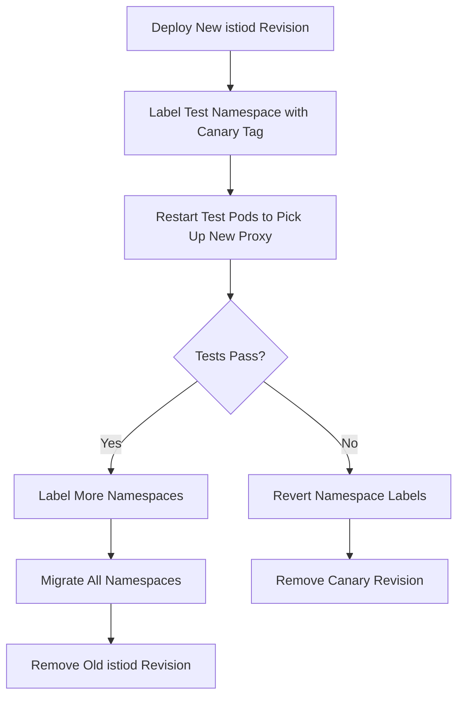

# How to Handle Service Mesh Upgrades with ArgoCD

Author: [nawazdhandala](https://github.com/nawazdhandala)

Tags: ArgoCD, GitOps, Kubernetes, Service Mesh, Istio

Description: Learn how to safely handle service mesh upgrades using ArgoCD GitOps workflows including canary upgrades, revision-based rollouts, and rollback strategies.

---

Service mesh upgrades are one of the most nerve-wracking operations in Kubernetes. A botched Istio or Linkerd upgrade can bring down your entire cluster's networking layer. ArgoCD brings sanity to this process by making mesh upgrades declarative, repeatable, and reversible through GitOps.

This guide walks through practical strategies for upgrading service meshes with ArgoCD, covering Istio as the primary example since it is the most widely deployed mesh.

## Why Service Mesh Upgrades Are Tricky

Service meshes touch every pod in your cluster through sidecar proxies. An upgrade typically involves:

- Upgrading control plane components (istiod, pilot, etc.)
- Upgrading data plane proxies (sidecars in every pod)
- Updating CRDs that define traffic rules
- Migrating configuration between API versions

If any of these steps fail or happen out of order, you can lose connectivity between services. ArgoCD helps by enforcing the correct order through sync waves and hooks.

## Setting Up Istio as ArgoCD Applications

The key insight is to split your mesh into multiple ArgoCD Applications, each handling a different layer of the upgrade.

Here is the base application for Istio CRDs:

```yaml
# istio-crds-app.yaml
apiVersion: argoproj.io/v1alpha1
kind: Application
metadata:
  name: istio-crds
  namespace: argocd
  annotations:
    argocd.argoproj.io/sync-wave: "0"
spec:
  project: infrastructure
  source:
    repoURL: https://istio-release.storage.googleapis.com/charts
    chart: base
    targetRevision: 1.21.0
    helm:
      values: |
        global:
          istioNamespace: istio-system
  destination:
    server: https://kubernetes.default.svc
    namespace: istio-system
  syncPolicy:
    automated:
      prune: false  # Never auto-prune CRDs
    syncOptions:
      - CreateNamespace=true
      - ServerSideApply=true
```

Next, the control plane application syncs after CRDs are ready:

```yaml
# istiod-app.yaml
apiVersion: argoproj.io/v1alpha1
kind: Application
metadata:
  name: istiod
  namespace: argocd
  annotations:
    argocd.argoproj.io/sync-wave: "1"
spec:
  project: infrastructure
  source:
    repoURL: https://istio-release.storage.googleapis.com/charts
    chart: istiod
    targetRevision: 1.21.0
    helm:
      values: |
        pilot:
          resources:
            requests:
              cpu: 200m
              memory: 256Mi
          autoscaleEnabled: true
          autoscaleMin: 2
          autoscaleMax: 5
        global:
          proxy:
            resources:
              requests:
                cpu: 100m
                memory: 128Mi
  destination:
    server: https://kubernetes.default.svc
    namespace: istio-system
  syncPolicy:
    automated:
      selfHeal: true
    syncOptions:
      - ServerSideApply=true
```

Finally, the gateway application:

```yaml
# istio-gateway-app.yaml
apiVersion: argoproj.io/v1alpha1
kind: Application
metadata:
  name: istio-gateway
  namespace: argocd
  annotations:
    argocd.argoproj.io/sync-wave: "2"
spec:
  project: infrastructure
  source:
    repoURL: https://istio-release.storage.googleapis.com/charts
    chart: gateway
    targetRevision: 1.21.0
    helm:
      values: |
        service:
          type: LoadBalancer
        autoscaling:
          enabled: true
          minReplicas: 2
          maxReplicas: 5
  destination:
    server: https://kubernetes.default.svc
    namespace: istio-ingress
  syncPolicy:
    automated:
      selfHeal: true
    syncOptions:
      - CreateNamespace=true
```

## Canary Upgrade Strategy with Revision Tags

Istio supports revision-based upgrades where you run two control plane versions simultaneously. This is the safest approach, and ArgoCD makes it easy to manage.

```yaml
# istiod-canary-app.yaml
apiVersion: argoproj.io/v1alpha1
kind: Application
metadata:
  name: istiod-canary
  namespace: argocd
spec:
  project: infrastructure
  source:
    repoURL: https://istio-release.storage.googleapis.com/charts
    chart: istiod
    targetRevision: 1.21.0
    helm:
      values: |
        revision: 1-21-0
        revisionTags:
          - canary
        pilot:
          autoscaleEnabled: true
          autoscaleMin: 1
  destination:
    server: https://kubernetes.default.svc
    namespace: istio-system
```

With this setup, you label namespaces to opt into the new version:

```yaml
apiVersion: v1
kind: Namespace
metadata:
  name: my-app
  labels:
    istio.io/rev: canary  # Points to new revision
```

The upgrade flow looks like this:



## Pre-Sync Hooks for Validation

Before any mesh upgrade, you want to validate that the cluster is healthy. ArgoCD pre-sync hooks are perfect for this.

```yaml
# pre-upgrade-check.yaml
apiVersion: batch/v1
kind: Job
metadata:
  name: istio-pre-upgrade-check
  annotations:
    argocd.argoproj.io/hook: PreSync
    argocd.argoproj.io/hook-delete-policy: HookSucceeded
spec:
  template:
    spec:
      containers:
        - name: istioctl-check
          image: istio/istioctl:1.21.0
          command:
            - /bin/sh
            - -c
            - |
              # Check current mesh health
              istioctl analyze --all-namespaces
              if [ $? -ne 0 ]; then
                echo "Mesh analysis found issues. Aborting upgrade."
                exit 1
              fi

              # Verify no stuck proxies
              istioctl proxy-status | grep -v "SYNCED" | grep -v "NAME"
              if [ $? -eq 0 ]; then
                echo "Found proxies not in SYNCED state. Aborting."
                exit 1
              fi

              echo "Pre-upgrade checks passed."
      restartPolicy: Never
      serviceAccountName: istio-upgrade-sa
  backoffLimit: 1
```

## Post-Sync Data Plane Rolling Restart

After the control plane upgrades, sidecar proxies need to be restarted. A post-sync hook handles this automatically:

```yaml
# post-upgrade-restart.yaml
apiVersion: batch/v1
kind: Job
metadata:
  name: sidecar-rolling-restart
  annotations:
    argocd.argoproj.io/hook: PostSync
    argocd.argoproj.io/hook-delete-policy: HookSucceeded
spec:
  template:
    spec:
      containers:
        - name: restart-pods
          image: bitnami/kubectl:latest
          command:
            - /bin/sh
            - -c
            - |
              # Get all namespaces with istio injection
              NAMESPACES=$(kubectl get ns -l istio-injection=enabled -o jsonpath='{.items[*].metadata.name}')

              for NS in $NAMESPACES; do
                echo "Rolling restart deployments in $NS"
                kubectl rollout restart deployment -n $NS

                # Wait for rollout to complete before moving to next namespace
                for DEPLOY in $(kubectl get deploy -n $NS -o name); do
                  kubectl rollout status $DEPLOY -n $NS --timeout=300s
                done
              done
      restartPolicy: Never
      serviceAccountName: istio-upgrade-sa
  backoffLimit: 1
```

## Rollback Strategy

If something goes wrong, ArgoCD gives you instant rollback. In your Git repository, simply revert the version bump commit:

```bash
# Revert the upgrade commit
git revert HEAD
git push origin main
```

ArgoCD automatically detects the revert and syncs back to the previous version. For the canary approach, you just remove the canary revision Application and relabel namespaces.

## Health Checks for Mesh Components

Custom health checks in ArgoCD tell you whether the mesh is actually working, not just whether pods are running:

```lua
-- Custom health check for Istio VirtualService
hs = {}
if obj.status ~= nil then
  if obj.status.validationMessages ~= nil then
    for _, msg in ipairs(obj.status.validationMessages) do
      if msg.type == "ERROR" then
        hs.status = "Degraded"
        hs.message = msg.documentation
        return hs
      end
    end
  end
end
hs.status = "Healthy"
hs.message = "VirtualService is valid"
return hs
```

## Monitoring Upgrades

During the upgrade, watch these key indicators through your monitoring stack:

- Proxy injection success rate (should stay at 100%)
- 5xx error rates across services
- mTLS connection success rate
- Control plane resource usage

You can integrate this with [OneUptime monitoring](https://oneuptime.com/blog/post/2026-02-26-argocd-monitor-service-mesh/view) to get alerts when mesh metrics deviate during upgrades.

## Summary

Service mesh upgrades with ArgoCD follow a clear pattern: split the mesh into layered Applications, use sync waves for ordering, use revision-based canary upgrades for safety, and rely on pre/post-sync hooks for validation and data plane updates. The declarative nature of GitOps means every upgrade is documented in Git, every change is reviewable, and every upgrade is reversible with a simple git revert.
