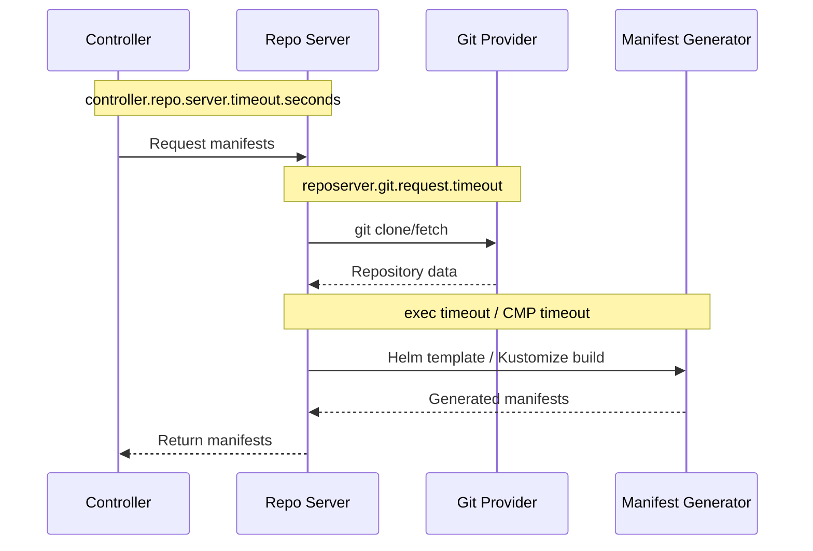

# How to Set Timeouts for Manifest Generation in ArgoCD

Author: [nawazdhandala](https://github.com/nawazdhandala)

Tags: ArgoCD, GitOps, Kubernetes, Configuration, Performance

Description: Learn how to configure manifest generation timeouts in ArgoCD for the repo server, controller, and config management plugins to prevent stuck operations and improve reliability.

---

Manifest generation in ArgoCD involves cloning Git repositories, rendering Helm templates, building Kustomize overlays, and running config management plugins. Any of these steps can hang or take longer than expected. Without proper timeouts, a single stuck operation can block the entire repo server, causing a cascade of reconciliation failures across all applications. This guide covers all the timeout settings related to manifest generation and how to configure them properly.

## Understanding the Timeout Chain

Manifest generation involves multiple components, each with its own timeout:



If any timeout is hit, the operation fails and the application shows an error. The timeouts are layered - an inner timeout must be shorter than the outer timeout, or the outer timeout fires first without giving a clear error message.

## Timeout 1: Controller to Repo Server Timeout

This is the most important timeout. It controls how long the controller waits for the repo server to return generated manifests:

```yaml
# argocd-cmd-params-cm ConfigMap
apiVersion: v1
kind: ConfigMap
metadata:
  name: argocd-cmd-params-cm
  namespace: argocd
data:
  # How long the controller waits for repo server response
  # Default: 60 seconds
  controller.repo.server.timeout.seconds: "180"
```

When this timeout is too short, you see errors like:

```text
rpc error: code = DeadlineExceeded desc = context deadline exceeded
```

### Choosing the Right Value

| Scenario | Recommended Timeout |
|----------|-------------------|
| Simple YAML directories | 60s (default) |
| Standard Helm charts | 90s |
| Large Helm umbrella charts | 180s |
| Complex Kustomize with remote bases | 180s |
| Config management plugins | 120-300s |
| Large monorepos | 180-300s |

## Timeout 2: Git Request Timeout

Controls how long the repo server waits for Git operations (clone, fetch, ls-remote):

```yaml
# argocd-cmd-params-cm ConfigMap
apiVersion: v1
kind: ConfigMap
metadata:
  name: argocd-cmd-params-cm
  namespace: argocd
data:
  # Git request timeout (default: 15s for ls-remote, 90s for clone)
  reposerver.git.request.timeout: "120"
```

You can also configure Git-level timeouts through environment variables:

```yaml
apiVersion: apps/v1
kind: Deployment
metadata:
  name: argocd-repo-server
  namespace: argocd
spec:
  template:
    spec:
      containers:
        - name: argocd-repo-server
          env:
            # Disable low speed timeout (prevents timeout on slow networks)
            - name: GIT_HTTP_LOW_SPEED_LIMIT
              value: "0"
            - name: GIT_HTTP_LOW_SPEED_TIME
              value: "0"
            # Increase SSH connection timeout
            - name: GIT_SSH_COMMAND
              value: "ssh -o ConnectTimeout=30 -o ServerAliveInterval=15"
```

## Timeout 3: Helm Execution Timeout

Helm template rendering has its own timeout, though it is not directly configurable through ArgoCD. It is bounded by the controller-to-repo-server timeout. However, you can influence it:

```yaml
# Speed up Helm operations by pinning versions
apiVersion: argoproj.io/v1alpha1
kind: Application
metadata:
  name: my-app
spec:
  source:
    chart: my-chart
    targetRevision: "1.2.3"  # Pinned version avoids index resolution
    helm:
      # Skip running helm dependency update
      skipCrds: false
```

For Helm charts that include network-dependent operations (like fetching dependencies), ensure the repo server has adequate network timeouts.

## Timeout 4: Config Management Plugin Timeout

If you use Config Management Plugins (CMPs), they have their own execution timeout:

```yaml
# CMP Plugin configuration
apiVersion: argoproj.io/v1alpha1
kind: ConfigManagementPlugin
metadata:
  name: my-plugin
spec:
  init:
    command:
      - /bin/sh
      - -c
      - "initialize-something"
  generate:
    command:
      - /bin/sh
      - -c
      - "generate-manifests"
```

The CMP execution timeout is inherited from the controller-to-repo-server timeout. If your CMP runs external tools, add internal timeouts:

```yaml
spec:
  generate:
    command:
      - /bin/sh
      - -c
      - |
        # Add timeout to external tool execution
        timeout 120 my-custom-tool generate --format yaml
        if [ $? -ne 0 ]; then
          echo "Manifest generation timed out" >&2
          exit 1
        fi
```

## Timeout 5: Sync Operation Timeout

Separate from manifest generation, sync operations have their own timeout behavior. The sync operation timeout is not explicitly configurable as a single value, but you control it through retry policies:

```yaml
apiVersion: argoproj.io/v1alpha1
kind: Application
metadata:
  name: my-app
spec:
  syncPolicy:
    retry:
      limit: 5
      backoff:
        duration: 5s
        factor: 2
        maxDuration: 3m
```

## Configuring All Timeouts Together

Here is a complete configuration for a medium-complexity environment:

```yaml
# argocd-cmd-params-cm ConfigMap
apiVersion: v1
kind: ConfigMap
metadata:
  name: argocd-cmd-params-cm
  namespace: argocd
data:
  # Controller waits 180s for repo server
  controller.repo.server.timeout.seconds: "180"

  # Repo server waits 120s for Git operations
  reposerver.git.request.timeout: "120"

  # Repo server parallelism (prevents resource exhaustion)
  reposerver.parallelism.limit: "5"
```

```yaml
# Repo server environment variables
apiVersion: apps/v1
kind: Deployment
metadata:
  name: argocd-repo-server
  namespace: argocd
spec:
  template:
    spec:
      containers:
        - name: argocd-repo-server
          env:
            - name: GIT_HTTP_LOW_SPEED_LIMIT
              value: "0"
            - name: GIT_HTTP_LOW_SPEED_TIME
              value: "0"
          resources:
            requests:
              cpu: "1"
              memory: "2Gi"
            limits:
              cpu: "2"
              memory: "4Gi"
```

## The Timeout Hierarchy

Your timeouts should follow this hierarchy to ensure proper error messages:

```text
controller.repo.server.timeout.seconds > reposerver.git.request.timeout > internal tool timeouts
```

For example:

```text
Controller timeout: 180s
  Git request timeout: 120s
    CMP tool timeout: 90s
```

If the inner timeout fires, you get a specific error ("Git fetch timed out"). If the outer timeout fires first, you get a generic error ("context deadline exceeded") which is harder to debug.

## Diagnosing Timeout Issues

### Check Which Timeout Is Firing

```bash
# Controller logs show "deadline exceeded" for controller-to-repo-server timeout
kubectl logs -n argocd deployment/argocd-application-controller | \
  grep -i "deadline\|timeout\|exceeded"

# Repo server logs show specific operation timeouts
kubectl logs -n argocd deployment/argocd-repo-server | \
  grep -i "deadline\|timeout\|exceeded"
```

### Measure Actual Generation Time

```bash
# Time a manual manifest generation
time argocd app manifests my-app

# If this takes 45 seconds and your timeout is 60 seconds,
# you are cutting it too close
```

### Check for Stuck Operations

```bash
# Look for repo server processes that have been running too long
kubectl exec -n argocd deployment/argocd-repo-server -- ps aux | grep -E "git|helm|kustomize"

# Check for pending requests (indicates timeout or slow processing)
kubectl port-forward svc/argocd-repo-server -n argocd 8084:8084 &
curl -s http://localhost:8084/metrics | grep argocd_repo_pending_request_total
```

## Timeout Settings for Different Environments

### Development Environment

```yaml
data:
  controller.repo.server.timeout.seconds: "60"
  reposerver.git.request.timeout: "30"
```

Fast repos, simple manifests, tight timeouts catch issues early.

### Standard Production

```yaml
data:
  controller.repo.server.timeout.seconds: "120"
  reposerver.git.request.timeout: "60"
```

Room for normal variation in network latency and repo size.

### Large-Scale Production

```yaml
data:
  controller.repo.server.timeout.seconds: "300"
  reposerver.git.request.timeout: "120"
```

Complex charts, large repos, and potential network congestion need longer timeouts.

### Air-Gapped Environment

```yaml
data:
  controller.repo.server.timeout.seconds: "180"
  # Git timeout can be shorter since repos are local
  reposerver.git.request.timeout: "30"
```

Local Git mirrors are fast, but manifest generation may still be complex.

## Monitoring Timeouts

Set up alerts for timeout-related issues:

```yaml
groups:
  - name: argocd-timeouts
    rules:
      - alert: ArgocdManifestGenerationTimeout
        expr: |
          increase(argocd_app_reconcile_duration_seconds_count{
            result="ComparisonError"
          }[5m]) > 0
        for: 5m
        labels:
          severity: warning
        annotations:
          summary: "ArgoCD applications experiencing manifest generation errors"
          description: "Check for timeout issues in repo server and controller logs"

      - alert: ArgocdRepoServerSlowRequests
        expr: |
          histogram_quantile(0.99,
            rate(argocd_git_request_duration_seconds_bucket[5m])
          ) > 60
        for: 10m
        labels:
          severity: warning
        annotations:
          summary: "ArgoCD Git requests taking >60 seconds at p99"
```

For comprehensive timeout monitoring and ArgoCD performance tracking, [OneUptime](https://oneuptime.com) provides observability that helps you identify slow manifest generation and timeout issues across your GitOps pipeline.

## Key Takeaways

- The controller-to-repo-server timeout is the most impactful setting (default 60s)
- Follow the timeout hierarchy: controller > git > internal tool
- Inner timeouts should be shorter than outer timeouts for clear error messages
- Increase timeouts for complex Helm charts, large repos, and CMPs
- Measure actual generation time before setting timeouts
- Different environments need different timeout configurations
- Monitor for timeout errors and set alerts to catch issues early
- Combine timeout increases with performance optimizations (caching, shallow clones) to address root causes, not just symptoms
