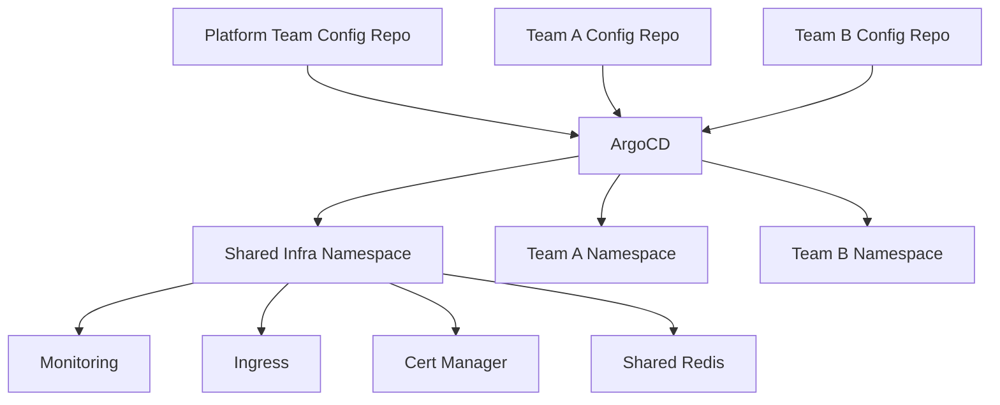

# How to Implement the Shared Infrastructure Pattern

Author: [nawazdhandala](https://github.com/nawazdhandala)

Tags: ArgoCD, GitOps, Kubernetes, Infrastructure, Multi-Tenancy

Description: Learn how to implement the shared infrastructure pattern with ArgoCD to manage common platform services like databases, message queues, and monitoring across multiple teams.

---

Most organizations have infrastructure that multiple teams depend on - databases, message queues, monitoring stacks, ingress controllers, and service meshes. The shared infrastructure pattern uses ArgoCD to manage these common services separately from team-specific applications, with proper access controls and lifecycle management. This ensures platform stability while giving teams the services they need.

## What Is Shared Infrastructure

Shared infrastructure includes any component that serves multiple teams or applications:

- **Ingress controllers** (nginx, Traefik, Ambassador)
- **Certificate management** (cert-manager)
- **Monitoring** (Prometheus, Grafana, Loki)
- **Service mesh** (Istio, Linkerd)
- **Message queues** (RabbitMQ, Kafka, NATS)
- **Databases** (shared PostgreSQL, Redis clusters)
- **Secret management** (Vault, External Secrets Operator)
- **DNS and service discovery** (CoreDNS, ExternalDNS)
- **Policy enforcement** (OPA Gatekeeper, Kyverno)

## Architecture



The key principle: shared infrastructure is owned and managed by the platform team through their own Git repository and ArgoCD project, completely separate from team workloads.

## Repository Structure

```text
platform-infra/
├── apps/
│   ├── root.yaml                    # Root App-of-Apps for all infra
│   ├── ingress-nginx.yaml
│   ├── cert-manager.yaml
│   ├── monitoring.yaml
│   ├── shared-redis.yaml
│   ├── external-secrets.yaml
│   └── kyverno.yaml
├── manifests/
│   ├── ingress-nginx/
│   │   ├── base/
│   │   │   ├── helmrelease.yaml
│   │   │   └── kustomization.yaml
│   │   └── overlays/
│   │       ├── staging/
│   │       └── production/
│   ├── cert-manager/
│   │   ├── base/
│   │   └── overlays/
│   ├── monitoring/
│   │   ├── prometheus/
│   │   ├── grafana/
│   │   └── loki/
│   ├── shared-redis/
│   │   ├── base/
│   │   └── overlays/
│   └── kyverno/
│       ├── base/
│       └── policies/
└── cluster-config/
    ├── namespaces.yaml
    ├── cluster-roles.yaml
    └── priority-classes.yaml
```

## Deploying Shared Infrastructure with Sync Waves

Order matters for infrastructure components. Use sync waves to ensure dependencies are met:

```yaml
# apps/root.yaml
apiVersion: argoproj.io/v1alpha1
kind: Application
metadata:
  name: platform-infra
  namespace: argocd
spec:
  project: platform
  source:
    repoURL: https://github.com/org/platform-infra.git
    targetRevision: main
    path: apps/
  destination:
    server: https://kubernetes.default.svc
    namespace: argocd
  syncPolicy:
    automated:
      selfHeal: true
      prune: true
```

Each child application gets a sync wave:

```yaml
# apps/cert-manager.yaml - Wave 1: must be first
apiVersion: argoproj.io/v1alpha1
kind: Application
metadata:
  name: cert-manager
  namespace: argocd
  annotations:
    argocd.argoproj.io/sync-wave: "1"
spec:
  project: platform
  source:
    repoURL: https://github.com/org/platform-infra.git
    targetRevision: main
    path: manifests/cert-manager/overlays/production
  destination:
    server: https://kubernetes.default.svc
    namespace: cert-manager
  syncPolicy:
    automated:
      selfHeal: true
      prune: true
    syncOptions:
      - CreateNamespace=true
```

```yaml
# apps/ingress-nginx.yaml - Wave 2: depends on cert-manager
apiVersion: argoproj.io/v1alpha1
kind: Application
metadata:
  name: ingress-nginx
  namespace: argocd
  annotations:
    argocd.argoproj.io/sync-wave: "2"
spec:
  project: platform
  source:
    repoURL: https://github.com/org/platform-infra.git
    targetRevision: main
    path: manifests/ingress-nginx/overlays/production
  destination:
    server: https://kubernetes.default.svc
    namespace: ingress-nginx
  syncPolicy:
    automated:
      selfHeal: true
      prune: true
    syncOptions:
      - CreateNamespace=true
```

```yaml
# apps/monitoring.yaml - Wave 3: depends on cert-manager for TLS
apiVersion: argoproj.io/v1alpha1
kind: Application
metadata:
  name: monitoring-stack
  namespace: argocd
  annotations:
    argocd.argoproj.io/sync-wave: "3"
spec:
  project: platform
  source:
    repoURL: https://github.com/org/platform-infra.git
    targetRevision: main
    path: manifests/monitoring
  destination:
    server: https://kubernetes.default.svc
    namespace: monitoring
  syncPolicy:
    automated:
      selfHeal: true
      prune: true
    syncOptions:
      - CreateNamespace=true
```

## Shared Redis Cluster Example

A shared Redis cluster that multiple teams can use:

```yaml
# manifests/shared-redis/base/redis-cluster.yaml
apiVersion: apps/v1
kind: StatefulSet
metadata:
  name: shared-redis
  namespace: shared-services
spec:
  serviceName: shared-redis
  replicas: 3
  selector:
    matchLabels:
      app: shared-redis
  template:
    metadata:
      labels:
        app: shared-redis
    spec:
      containers:
        - name: redis
          image: redis:7-alpine
          ports:
            - containerPort: 6379
          command:
            - redis-server
            - --maxmemory 2gb
            - --maxmemory-policy allkeys-lru
            - --requirepass $(REDIS_PASSWORD)
          env:
            - name: REDIS_PASSWORD
              valueFrom:
                secretKeyRef:
                  name: shared-redis-auth
                  key: password
          resources:
            requests:
              cpu: 500m
              memory: 2Gi
            limits:
              cpu: "1"
              memory: 3Gi
          volumeMounts:
            - name: data
              mountPath: /data
  volumeClaimTemplates:
    - metadata:
        name: data
      spec:
        accessModes: ["ReadWriteOnce"]
        resources:
          requests:
            storage: 10Gi
---
apiVersion: v1
kind: Service
metadata:
  name: shared-redis
  namespace: shared-services
spec:
  ports:
    - port: 6379
  selector:
    app: shared-redis
```

Network policy to allow team namespaces to access the shared Redis:

```yaml
# manifests/shared-redis/base/networkpolicy.yaml
apiVersion: networking.k8s.io/v1
kind: NetworkPolicy
metadata:
  name: shared-redis-access
  namespace: shared-services
spec:
  podSelector:
    matchLabels:
      app: shared-redis
  policyTypes:
    - Ingress
  ingress:
    # Allow access from team namespaces
    - from:
        - namespaceSelector:
            matchLabels:
              shared-redis-access: "true"
      ports:
        - port: 6379
    # Allow access from monitoring
    - from:
        - namespaceSelector:
            matchLabels:
              kubernetes.io/metadata.name: monitoring
```

Teams label their namespace to get access:

```yaml
apiVersion: v1
kind: Namespace
metadata:
  name: team-a
  labels:
    shared-redis-access: "true"
```

## AppProject for Platform Infrastructure

The platform project should have elevated permissions since it manages cluster-wide resources:

```yaml
apiVersion: argoproj.io/v1alpha1
kind: AppProject
metadata:
  name: platform
  namespace: argocd
spec:
  description: Platform shared infrastructure
  sourceRepos:
    - https://github.com/org/platform-infra.git
  destinations:
    - namespace: '*'
      server: '*'
  clusterResourceWhitelist:
    - group: '*'
      kind: '*'
  namespaceResourceWhitelist:
    - group: '*'
      kind: '*'
  roles:
    - name: platform-admin
      description: Platform team admin access
      policies:
        - p, proj:platform:platform-admin, applications, *, platform/*, allow
      groups:
        - platform-engineers
    - name: platform-viewer
      description: Read-only access for all teams
      policies:
        - p, proj:platform:platform-viewer, applications, get, platform/*, allow
      groups:
        - all-engineers
```

Team projects should NOT be able to modify shared infrastructure:

```yaml
apiVersion: argoproj.io/v1alpha1
kind: AppProject
metadata:
  name: team-a
  namespace: argocd
spec:
  sourceRepos:
    - https://github.com/org/team-a-config.git
  destinations:
    # Can only deploy to their own namespace
    - namespace: team-a
      server: https://kubernetes.default.svc
  # Cannot create cluster-scoped resources
  clusterResourceWhitelist: []
  namespaceResourceWhitelist:
    - group: apps
      kind: Deployment
    - group: ""
      kind: Service
    - group: ""
      kind: ConfigMap
    - group: ""
      kind: Secret
```

## Multi-Cluster Shared Infrastructure

Deploy the same infrastructure stack across all clusters:

```yaml
apiVersion: argoproj.io/v1alpha1
kind: ApplicationSet
metadata:
  name: platform-infra-all-clusters
  namespace: argocd
spec:
  generators:
    - clusters:
        selector:
          matchLabels:
            platform-managed: "true"
  template:
    metadata:
      name: 'platform-infra-{{name}}'
    spec:
      project: platform
      source:
        repoURL: https://github.com/org/platform-infra.git
        targetRevision: main
        path: apps/
      destination:
        server: '{{server}}'
        namespace: argocd
      syncPolicy:
        automated:
          selfHeal: true
          prune: true
```

## Upgrade Strategy

Shared infrastructure upgrades need careful coordination:

1. **Test in staging first** - Always deploy to a staging cluster before production
2. **Use sync windows** - Restrict when production infra can be updated
3. **Pin versions** - Use specific Helm chart versions, not latest
4. **Canary clusters** - Roll out to one production cluster first, then the rest
5. **Communicate changes** - Notify teams before upgrading shared services

```yaml
# Pin versions in the infra manifests
apiVersion: source.toolkit.fluxcd.io/v1
kind: HelmRelease
metadata:
  name: cert-manager
spec:
  chart:
    spec:
      chart: cert-manager
      version: "1.14.2"  # Pinned version
      sourceRef:
        kind: HelmRepository
        name: jetstack
```

## Health Monitoring for Shared Infra

Set up dedicated health checks for infrastructure components:

```yaml
# Custom health check for CRDs managed by infrastructure operators
resource.customizations.health.cert-manager.io_Certificate: |
  hs = {}
  if obj.status ~= nil then
    if obj.status.conditions ~= nil then
      for i, condition in ipairs(obj.status.conditions) do
        if condition.type == "Ready" and condition.status == "True" then
          hs.status = "Healthy"
          hs.message = "Certificate is valid"
          return hs
        end
      end
    end
  end
  hs.status = "Progressing"
  hs.message = "Waiting for certificate"
  return hs
```

The shared infrastructure pattern is essential for any organization running ArgoCD at scale. By separating platform services from team workloads, you get predictable infrastructure management with clear ownership boundaries. For more on sync waves and ordering, see our guide on [ArgoCD sync waves](https://oneuptime.com/blog/post/2026-01-25-sync-waves-argocd/view).
