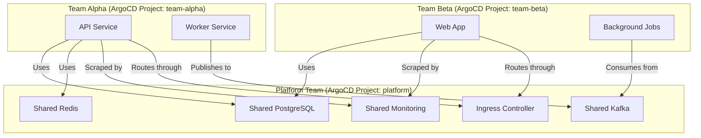

# How to Share Common Infrastructure Across Tenants in ArgoCD

Author: [nawazdhandala](https://github.com/nawazdhandala)

Tags: ArgoCD, GitOps, Kubernetes, Multi-Tenancy, Infrastructure

Description: Learn how to share common infrastructure components like databases, message queues, and monitoring across multiple tenants in ArgoCD while maintaining proper isolation.

---

In a multi-tenant ArgoCD setup, teams need access to shared infrastructure - databases, message queues, monitoring stacks, ingress controllers, and service meshes. You cannot give every team their own Kafka cluster or their own Prometheus instance. That would be wasteful and expensive. But you also cannot give every team direct access to manage shared infrastructure. That breaks isolation.

The solution is a layered approach where the platform team manages shared infrastructure through ArgoCD, and tenant teams consume it through well-defined interfaces. This guide shows how to structure this in practice.

## The Shared Infrastructure Architecture



## Setting Up the Platform Project

The platform team gets an AppProject with broad permissions to manage shared infrastructure. Tenant teams get restricted projects that can only deploy to their own namespaces.

```yaml
# Platform team's project - manages shared infrastructure
apiVersion: argoproj.io/v1alpha1
kind: AppProject
metadata:
  name: platform
  namespace: argocd
spec:
  description: "Platform team - shared infrastructure management"
  destinations:
    - server: https://kubernetes.default.svc
      namespace: "shared-*"
    - server: https://kubernetes.default.svc
      namespace: "monitoring"
    - server: https://kubernetes.default.svc
      namespace: "ingress-nginx"
    - server: https://kubernetes.default.svc
      namespace: "kafka"
    - server: https://kubernetes.default.svc
      namespace: "redis"
  sourceRepos:
    - "https://github.com/myorg/platform-*"
    - "https://charts.bitnami.com/bitnami"
    - "https://prometheus-community.github.io/helm-charts"
  clusterResourceWhitelist:
    - group: "*"
      kind: "*"
  namespaceResourceWhitelist:
    - group: "*"
      kind: "*"
```

```yaml
# Tenant project - restricted to own namespaces
apiVersion: argoproj.io/v1alpha1
kind: AppProject
metadata:
  name: team-alpha
  namespace: argocd
spec:
  description: "Team Alpha - consumes shared infrastructure"
  destinations:
    - server: https://kubernetes.default.svc
      namespace: "team-alpha-*"
  sourceRepos:
    - "https://github.com/myorg/team-alpha-*"
  clusterResourceWhitelist: []
  namespaceResourceWhitelist:
    - group: ""
      kind: "*"
    - group: apps
      kind: "*"
    - group: batch
      kind: "*"
    - group: networking.k8s.io
      kind: Ingress
```

## Sharing a Database

A shared PostgreSQL cluster runs in a `shared-databases` namespace managed by the platform team. Each tenant gets their own database within the cluster, with credentials delivered through Kubernetes Secrets.

### Platform Team Deploys PostgreSQL

```yaml
apiVersion: argoproj.io/v1alpha1
kind: Application
metadata:
  name: shared-postgresql
  namespace: argocd
spec:
  project: platform
  source:
    repoURL: https://charts.bitnami.com/bitnami
    chart: postgresql-ha
    targetRevision: 13.4.0
    helm:
      values: |
        postgresql:
          replicaCount: 3
          resources:
            requests:
              cpu: 500m
              memory: 1Gi
            limits:
              cpu: 2
              memory: 4Gi
        pgpool:
          replicaCount: 2
  destination:
    server: https://kubernetes.default.svc
    namespace: shared-databases
  syncPolicy:
    automated:
      selfHeal: true
```

### Platform Team Creates Tenant Databases

Use a Job or CMP plugin to create databases for each tenant:

```yaml
apiVersion: batch/v1
kind: Job
metadata:
  name: create-tenant-databases
  namespace: shared-databases
  annotations:
    argocd.argoproj.io/hook: PostSync
    argocd.argoproj.io/hook-delete-policy: HookSucceeded
spec:
  template:
    spec:
      containers:
        - name: create-dbs
          image: postgres:16
          command:
            - /bin/bash
            - -c
            - |
              # Create databases for each tenant
              for TENANT in team-alpha team-beta team-gamma; do
                psql -h shared-postgresql-pgpool -U postgres -c \
                  "CREATE DATABASE ${TENANT//-/_} OWNER ${TENANT//-/_};" || true
                psql -h shared-postgresql-pgpool -U postgres -c \
                  "CREATE USER ${TENANT//-/_} WITH PASSWORD '$(cat /secrets/${TENANT}/password)';" || true
              done
          envFrom:
            - secretRef:
                name: postgresql-admin-credentials
      restartPolicy: Never
```

### Tenant Teams Access Through Secrets

The platform team creates secrets in tenant namespaces with database connection details:

```yaml
apiVersion: v1
kind: Secret
metadata:
  name: database-credentials
  namespace: team-alpha-prod
  labels:
    managed-by: platform-team
type: Opaque
stringData:
  DATABASE_HOST: shared-postgresql-pgpool.shared-databases.svc
  DATABASE_PORT: "5432"
  DATABASE_NAME: team_alpha
  DATABASE_USER: team_alpha
  DATABASE_PASSWORD: "<generated>"
```

For better security, use External Secrets Operator to pull credentials from a secret manager:

```yaml
apiVersion: external-secrets.io/v1beta1
kind: ExternalSecret
metadata:
  name: database-credentials
  namespace: team-alpha-prod
spec:
  refreshInterval: 1h
  secretStoreRef:
    name: vault-backend
    kind: ClusterSecretStore
  target:
    name: database-credentials
  data:
    - secretKey: DATABASE_PASSWORD
      remoteRef:
        key: databases/team-alpha/credentials
        property: password
```

## Sharing a Message Queue

Kafka is typically shared because running dedicated clusters per team is expensive. The platform team manages the cluster and creates topics per tenant.

```yaml
# Platform manages the Kafka cluster
apiVersion: argoproj.io/v1alpha1
kind: Application
metadata:
  name: shared-kafka
  namespace: argocd
spec:
  project: platform
  source:
    repoURL: https://charts.bitnami.com/bitnami
    chart: kafka
    targetRevision: 28.0.0
    helm:
      values: |
        replicaCount: 3
        kraft:
          enabled: true
        listeners:
          client:
            protocol: SASL_PLAINTEXT
          interbroker:
            protocol: SASL_PLAINTEXT
  destination:
    server: https://kubernetes.default.svc
    namespace: kafka
```

Each tenant gets Kafka credentials with ACLs restricting them to their own topics:

```yaml
# Platform creates topic ACLs per tenant
apiVersion: kafka.strimzi.io/v1beta2
kind: KafkaUser
metadata:
  name: team-alpha
  namespace: kafka
  labels:
    strimzi.io/cluster: shared-kafka
spec:
  authentication:
    type: scram-sha-512
  authorization:
    type: simple
    acls:
      # Allow producing and consuming from team-alpha topics only
      - resource:
          type: topic
          name: team-alpha-
          patternType: prefix
        operations:
          - Read
          - Write
          - Describe
          - Create
      - resource:
          type: group
          name: team-alpha-
          patternType: prefix
        operations:
          - Read
```

## Sharing Monitoring Infrastructure

Prometheus and Grafana typically run as shared services. Each tenant gets their own dashboards and alert rules, but the infrastructure is shared.

```yaml
# Platform manages the monitoring stack
apiVersion: argoproj.io/v1alpha1
kind: Application
metadata:
  name: monitoring-stack
  namespace: argocd
spec:
  project: platform
  source:
    repoURL: https://prometheus-community.github.io/helm-charts
    chart: kube-prometheus-stack
    targetRevision: 56.6.0
    helm:
      values: |
        prometheus:
          prometheusSpec:
            # Enable multi-tenant label enforcement
            enforcedNamespaceLabel: namespace
            # Scrape ServiceMonitors from all namespaces
            serviceMonitorSelectorNilUsesHelmValues: false
            podMonitorSelectorNilUsesHelmValues: false
            ruleSelectorNilUsesHelmValues: false
        grafana:
          sidecar:
            dashboards:
              searchNamespace: ALL
  destination:
    server: https://kubernetes.default.svc
    namespace: monitoring
```

Tenants create ServiceMonitors in their own namespaces:

```yaml
# In team-alpha's repo, deployed to team-alpha-prod
apiVersion: monitoring.coreos.com/v1
kind: ServiceMonitor
metadata:
  name: payment-service-metrics
  namespace: team-alpha-prod
spec:
  selector:
    matchLabels:
      app: payment-service
  endpoints:
    - port: metrics
      interval: 30s
```

The `enforcedNamespaceLabel` setting ensures tenants can only see metrics from their own namespaces in Grafana, even if they write custom queries.

## Network Policies for Shared Access

Tenants need network access to shared infrastructure. Create NetworkPolicies that allow this while maintaining isolation between tenants.

```yaml
# Allow team-alpha pods to reach shared PostgreSQL
apiVersion: networking.k8s.io/v1
kind: NetworkPolicy
metadata:
  name: allow-shared-postgresql
  namespace: shared-databases
spec:
  podSelector:
    matchLabels:
      app.kubernetes.io/name: postgresql
  ingress:
    - from:
        - namespaceSelector:
            matchLabels:
              uses-shared-db: "true"
      ports:
        - protocol: TCP
          port: 5432
```

Label tenant namespaces to grant access:

```yaml
apiVersion: v1
kind: Namespace
metadata:
  name: team-alpha-prod
  labels:
    uses-shared-db: "true"
    uses-shared-kafka: "true"
```

## Managing Shared Infrastructure Lifecycle

When upgrading shared infrastructure, coordinate with tenants. Use ArgoCD notifications to alert teams before maintenance:

```yaml
# Notification when shared infrastructure is about to sync
trigger.on-shared-infra-sync: |
  - when: app.metadata.labels.type == 'shared-infrastructure' and app.status.operationState.phase == 'Running'
    send: [slack-shared-infra-update]
template.slack-shared-infra-update: |
  message: |
    Shared infrastructure update in progress: {{.app.metadata.name}}
    All tenant teams should monitor their applications for impact.
```

Sharing infrastructure across tenants in ArgoCD requires careful boundary management. The platform team controls the shared services, tenants consume them through well-defined interfaces, and ArgoCD ensures both sides stay in their lanes. This approach gives you the efficiency of shared infrastructure with the safety of proper isolation.
