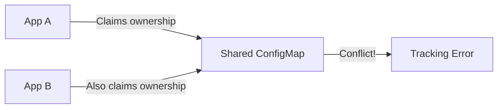

# How to Handle Shared Resources Between Applications in ArgoCD

Author: [nawazdhandala](https://github.com/nawazdhandala)

Tags: ArgoCD, GitOps, Kubernetes, Multi-Tenancy, Resource Management

Description: Learn how to manage Kubernetes resources that need to be shared across multiple ArgoCD applications without causing tracking conflicts or sync failures.

---

In a real Kubernetes environment, some resources are naturally shared. A single Namespace might host multiple applications. A ConfigMap with TLS CA bundles might be consumed by ten different services. A ClusterRole for log collection might be needed across every namespace. ArgoCD, however, expects each resource to belong to exactly one application. This creates a tension that you need to resolve deliberately. This guide covers the patterns and strategies for handling shared resources in ArgoCD without breaking your GitOps workflow.

## The Problem with Shared Resources

ArgoCD tracks resource ownership using labels or annotations. When two applications include the same resource (same kind, name, and namespace), both try to claim it. This causes several issues:

- Sync conflicts where one application's sync overwrites the other's changes
- Constant OutOfSync status as each application sees "unexpected" values
- Pruning one application can accidentally delete resources needed by another
- Unpredictable behavior depending on which application syncs last



## Strategy 1: Dedicated Shared Resources Application

The most robust pattern is to create a dedicated ArgoCD application that owns all shared resources. Other applications consume these resources but do not include them in their manifests.

```yaml
# shared-infra-app.yaml
apiVersion: argoproj.io/v1alpha1
kind: Application
metadata:
  name: shared-infra
  namespace: argocd
spec:
  project: platform
  source:
    repoURL: https://github.com/org/platform-config
    targetRevision: main
    path: shared-resources/
  destination:
    server: https://kubernetes.default.svc
  syncPolicy:
    automated:
      prune: false    # Never auto-prune shared resources
      selfHeal: true
    syncOptions:
      - CreateNamespace=true
```

The shared resources repo contains all the common resources:

```text
shared-resources/
  namespaces/
    production.yaml
    staging.yaml
  configmaps/
    ca-bundle.yaml
    feature-flags.yaml
  rbac/
    log-reader-role.yaml
    monitoring-role.yaml
```

```yaml
# shared-resources/configmaps/ca-bundle.yaml
apiVersion: v1
kind: ConfigMap
metadata:
  name: ca-bundle
  namespace: production
  labels:
    app.kubernetes.io/managed-by: shared-infra
data:
  ca.crt: |
    -----BEGIN CERTIFICATE-----
    ...
    -----END CERTIFICATE-----
```

Individual applications then reference these resources but do not define them:

```yaml
# In your application's deployment.yaml
apiVersion: apps/v1
kind: Deployment
metadata:
  name: my-service
spec:
  template:
    spec:
      containers:
        - name: my-service
          volumeMounts:
            - name: ca-bundle
              mountPath: /etc/ssl/certs/custom
      volumes:
        - name: ca-bundle
          configMap:
            name: ca-bundle  # Managed by shared-infra app
```

## Strategy 2: Resource Exclusions

If you cannot restructure your manifests immediately, you can tell ArgoCD to exclude specific resources from tracking in one of the applications.

```yaml
# In argocd-cm ConfigMap, exclude shared resources globally
apiVersion: v1
kind: ConfigMap
metadata:
  name: argocd-cm
  namespace: argocd
data:
  resource.exclusions: |
    - apiGroups:
        - ""
      kinds:
        - ConfigMap
      clusters:
        - "*"
      names:
        - "ca-bundle"
        - "feature-flags"
```

For per-application exclusions, use the `ignoreDifferences` field:

```yaml
apiVersion: argoproj.io/v1alpha1
kind: Application
metadata:
  name: my-app
spec:
  ignoreDifferences:
    - group: ""
      kind: ConfigMap
      name: shared-config
      jsonPointers:
        - /data
        - /metadata/labels
```

## Strategy 3: Using Sync Waves with Ordering

When shared resources and consuming applications must live in the same ArgoCD Application (for example, in an App-of-Apps pattern), use sync waves to ensure shared resources are created first.

```yaml
# Namespace created first (wave -1)
apiVersion: v1
kind: Namespace
metadata:
  name: production
  annotations:
    argocd.argoproj.io/sync-wave: "-1"
---
# ConfigMap created second (wave 0)
apiVersion: v1
kind: ConfigMap
metadata:
  name: shared-config
  namespace: production
  annotations:
    argocd.argoproj.io/sync-wave: "0"
---
# Deployment created last (wave 1)
apiVersion: apps/v1
kind: Deployment
metadata:
  name: my-app
  namespace: production
  annotations:
    argocd.argoproj.io/sync-wave: "1"
```

## Strategy 4: External Resource Management

For resources managed by external tools (Terraform, Crossplane, platform operators), tell ArgoCD to ignore them entirely using the `argocd.argoproj.io/compare-options` annotation.

```yaml
apiVersion: v1
kind: ConfigMap
metadata:
  name: terraform-managed-config
  namespace: production
  annotations:
    # Tell ArgoCD not to compare this resource
    argocd.argoproj.io/compare-options: IgnoreExtraneous
```

You can also mark resources so ArgoCD sees them but does not try to manage them:

```yaml
apiVersion: v1
kind: Secret
metadata:
  name: external-secret
  namespace: production
  annotations:
    argocd.argoproj.io/managed-by: external-secrets-operator
```

## Strategy 5: Namespace-Level Separation

The simplest way to avoid shared resource conflicts is to give each application its own namespace. This eliminates most sharing scenarios entirely.

```yaml
# ApplicationSet that creates per-service namespaces
apiVersion: argoproj.io/v1alpha1
kind: ApplicationSet
metadata:
  name: microservices
  namespace: argocd
spec:
  generators:
    - list:
        elements:
          - service: api-gateway
            namespace: api-gateway-prod
          - service: user-service
            namespace: user-service-prod
          - service: order-service
            namespace: order-service-prod
  template:
    metadata:
      name: "{{service}}"
    spec:
      project: default
      source:
        repoURL: https://github.com/org/services
        path: "{{service}}/manifests"
      destination:
        server: https://kubernetes.default.svc
        namespace: "{{namespace}}"
      syncPolicy:
        syncOptions:
          - CreateNamespace=true
```

## Handling Shared CRDs

Custom Resource Definitions are cluster-scoped and particularly prone to conflicts. Multiple applications might need the same CRD.

```yaml
# Create a dedicated CRD management application
apiVersion: argoproj.io/v1alpha1
kind: Application
metadata:
  name: crds
  namespace: argocd
spec:
  project: platform
  source:
    repoURL: https://github.com/org/crds
    targetRevision: main
    path: crds/
  destination:
    server: https://kubernetes.default.svc
  syncPolicy:
    automated:
      prune: false  # NEVER auto-prune CRDs
      selfHeal: true
    syncOptions:
      - Replace=false
      - ServerSideApply=true  # SSA handles CRD updates better
```

Then in your other applications, ensure CRDs are excluded:

```yaml
apiVersion: argoproj.io/v1alpha1
kind: Application
metadata:
  name: my-operator
spec:
  source:
    repoURL: https://github.com/org/operator
    path: manifests/
    directory:
      exclude: "crds/*"  # Exclude CRDs from this application
```

## Handling Shared RBAC Resources

ClusterRoles and ClusterRoleBindings are another common source of conflicts. The aggregation pattern works well here:

```yaml
# Base ClusterRole in shared-infra app
apiVersion: rbac.authorization.k8s.io/v1
kind: ClusterRole
metadata:
  name: monitoring-base
  labels:
    rbac.myorg.io/aggregate-monitoring: "true"
rules:
  - apiGroups: [""]
    resources: ["pods", "services"]
    verbs: ["get", "list", "watch"]
---
# Aggregated ClusterRole that selects all monitoring roles
apiVersion: rbac.authorization.k8s.io/v1
kind: ClusterRole
metadata:
  name: monitoring-aggregate
aggregationRule:
  clusterRoleSelectors:
    - matchLabels:
        rbac.myorg.io/aggregate-monitoring: "true"
rules: []  # Populated automatically by Kubernetes
```

Each application can then contribute its own rules by adding a labeled ClusterRole, without conflicting with the shared base.

## Decision Matrix for Shared Resources

Use this guide to pick the right strategy:

| Scenario | Recommended Strategy |
|----------|---------------------|
| Namespaces used by many apps | Dedicated shared-infra app |
| ConfigMaps used by 2-3 apps | Dedicated shared-infra app |
| CRDs installed by operators | Separate CRD management app |
| Resources from Terraform | IgnoreExtraneous annotation |
| RBAC across teams | ClusterRole aggregation |
| Temporary sharing during migration | Resource exclusions |

## Monitoring Shared Resource Health

Set up monitoring to detect when shared resources are modified unexpectedly:

```yaml
# PrometheusRule for shared resource drift detection
apiVersion: monitoring.coreos.com/v1
kind: PrometheusRule
metadata:
  name: shared-resource-alerts
spec:
  groups:
    - name: argocd-shared-resources
      rules:
        - alert: SharedResourceOutOfSync
          expr: |
            argocd_app_info{name="shared-infra", sync_status!="Synced"} == 1
          for: 10m
          labels:
            severity: warning
          annotations:
            summary: "Shared infrastructure resources are out of sync"
```

For end-to-end visibility into how shared resources affect your applications, [OneUptime](https://oneuptime.com) provides deployment monitoring that can correlate shared resource changes with application health across your cluster.

## Key Takeaways

Shared resources in ArgoCD require deliberate architecture decisions:

- Create a dedicated ArgoCD application for shared infrastructure resources
- Never let two applications define the same resource
- Use `prune: false` on applications managing shared resources
- Separate CRDs into their own management application
- Use RBAC aggregation for shared cluster roles
- Mark externally-managed resources with `IgnoreExtraneous`
- Monitor shared resource sync status closely since drift affects multiple applications
