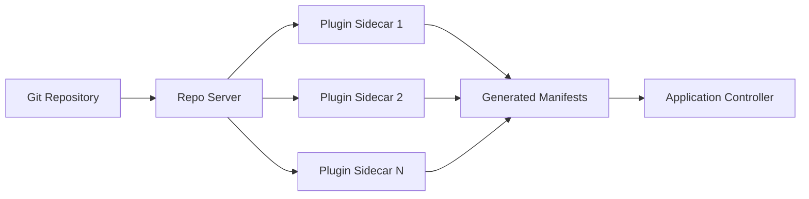

# How to Use Sidecar-Based Config Management Plugins in ArgoCD

Author: [nawazdhandala](https://github.com/nawazdhandala)

Tags: ArgoCD, GitOps, Kubernetes, Config Management Plugins, CMP

Description: Learn how to build and deploy sidecar-based Config Management Plugins in ArgoCD to extend manifest generation with custom tools and workflows.

---

ArgoCD supports Helm, Kustomize, Jsonnet, and plain YAML out of the box, but real-world Kubernetes environments often demand more. Maybe you need to render manifests with a proprietary templating engine, decrypt secrets during generation, or chain multiple tools together. That is where Config Management Plugins (CMPs) come in, and since ArgoCD v2.4, the recommended approach is to run them as sidecar containers on the repo-server.

In this guide, you will learn exactly how sidecar-based CMPs work, how to build one from scratch, and how to avoid the common pitfalls that trip up most teams.

## Why Sidecar-Based Plugins?

Before ArgoCD v2.4, plugins were configured directly inside the argocd-cm ConfigMap and executed within the repo-server process. This had several problems:

- Security risks from running arbitrary commands inside the repo-server container
- Dependency conflicts when different plugins needed different tools
- No isolation between plugin processes and the core repo-server
- Difficulty managing plugin-specific environment variables and credentials

The sidecar approach solves all of these by running each plugin in its own container. The repo-server communicates with sidecars over a Unix domain socket, and each sidecar has its own filesystem, dependencies, and resource limits.

## Architecture Overview

Here is how the sidecar CMP architecture works:



The repo-server clones the Git repository, then passes the source files to the appropriate sidecar plugin through a shared volume. The sidecar runs its generate command and returns Kubernetes manifests.

## Building a Sidecar Plugin

Every sidecar plugin needs two things: a plugin configuration file and a container image with your tools installed.

### Step 1: Create the Plugin Configuration

Create a file called `plugin.yaml` that tells ArgoCD how your plugin works:

```yaml
# plugin.yaml - defines the plugin interface
apiVersion: argoproj.io/v1alpha1
kind: ConfigManagementPlugin
metadata:
  name: my-custom-plugin
spec:
  version: v1.0
  # init runs once before generate (optional)
  init:
    command: [sh, -c]
    args:
      - |
        echo "Initializing plugin..."
        # Install dependencies, download resources, etc.
        npm install 2>/dev/null || true
  # generate produces the Kubernetes manifests
  generate:
    command: [sh, -c]
    args:
      - |
        # Your manifest generation logic goes here
        # Must output valid YAML to stdout
        cat rendered/*.yaml
  # discover tells ArgoCD when to use this plugin (optional)
  discover:
    find:
      # Match repositories containing a specific file
      glob: "**/custom-config.yaml"
```

This file must be placed at `/home/argocd/cmp-server/config/plugin.yaml` inside the sidecar container.

### Step 2: Build the Container Image

Create a Dockerfile for your sidecar. The key requirement is that the `argocd-cmp-server` binary must be present in the container:

```dockerfile
# Dockerfile for custom CMP sidecar
FROM ubuntu:22.04

# Install your custom tools
RUN apt-get update && \
    apt-get install -y curl jq python3 python3-pip && \
    pip3 install pyyaml && \
    rm -rf /var/lib/apt/lists/*

# Copy the argocd-cmp-server binary from the ArgoCD image
COPY --from=quay.io/argoproj/argocd:v2.10.0 \
    /usr/local/bin/argocd-cmp-server \
    /usr/local/bin/argocd-cmp-server

# Copy your plugin configuration
COPY plugin.yaml /home/argocd/cmp-server/config/plugin.yaml

# Copy any custom scripts
COPY scripts/ /usr/local/bin/

# The CMP server runs as non-root
USER 999

# The entrypoint must be the CMP server
ENTRYPOINT ["/usr/local/bin/argocd-cmp-server"]
```

Build and push the image:

```bash
# Build the sidecar image
docker build -t my-registry/argocd-cmp-custom:v1.0 .

# Push to your container registry
docker push my-registry/argocd-cmp-custom:v1.0
```

### Step 3: Configure the Repo Server Deployment

Now patch the ArgoCD repo-server deployment to include your sidecar:

```yaml
# repo-server-patch.yaml
apiVersion: apps/v1
kind: Deployment
metadata:
  name: argocd-repo-server
  namespace: argocd
spec:
  template:
    spec:
      containers:
        # The main repo-server container remains unchanged
        - name: argocd-repo-server
          # ... existing config ...
          volumeMounts:
            - name: cmp-tmp
              mountPath: /tmp
        # Add your sidecar plugin container
        - name: my-custom-plugin
          image: my-registry/argocd-cmp-custom:v1.0
          securityContext:
            runAsNonRoot: true
            runAsUser: 999
          resources:
            requests:
              memory: "128Mi"
              cpu: "100m"
            limits:
              memory: "512Mi"
              cpu: "500m"
          volumeMounts:
            # Required: shared volume for plugin communication
            - name: var-files
              mountPath: /var/run/argocd
            # Required: shared plugins directory
            - name: plugins
              mountPath: /home/argocd/cmp-server/plugins
            # Required: tmp directory for working files
            - name: cmp-tmp
              mountPath: /tmp
      volumes:
        - name: cmp-tmp
          emptyDir: {}
        - name: var-files
          emptyDir: {}
        - name: plugins
          emptyDir: {}
```

Apply this with Kustomize or as a strategic merge patch:

```bash
# Apply the patch to the repo-server deployment
kubectl patch deployment argocd-repo-server \
  -n argocd \
  --type strategic \
  --patch-file repo-server-patch.yaml
```

## Communication Between Repo Server and Sidecar

The repo-server and sidecar communicate through a Unix domain socket at `/home/argocd/cmp-server/plugins/`. When ArgoCD needs to generate manifests:

1. The repo-server clones the Git repo to a temporary directory
2. It discovers which plugin to use based on the application configuration or auto-detection
3. It sends the source files to the sidecar over the socket
4. The sidecar runs the `init` command (if configured), then the `generate` command
5. The sidecar returns the generated YAML manifests

The shared volume at `/tmp` allows the sidecar to create temporary files during processing.

## Using Your Plugin in an Application

Once the sidecar is running, you can reference the plugin in your ArgoCD Application:

```yaml
apiVersion: argoproj.io/v1alpha1
kind: Application
metadata:
  name: my-app
  namespace: argocd
spec:
  project: default
  source:
    repoURL: https://github.com/myorg/myrepo.git
    targetRevision: main
    path: environments/production
    # Reference the plugin by name
    plugin:
      name: my-custom-plugin
      # Pass parameters to the plugin (optional)
      env:
        - name: ENVIRONMENT
          value: production
        - name: REGION
          value: us-east-1
  destination:
    server: https://kubernetes.default.svc
    namespace: my-app
```

## Debugging Sidecar Plugins

When things go wrong, start by checking the sidecar container logs:

```bash
# Check sidecar logs
kubectl logs deployment/argocd-repo-server \
  -n argocd \
  -c my-custom-plugin \
  --tail=100

# Check if the sidecar is actually running
kubectl get pods -n argocd \
  -l app.kubernetes.io/name=argocd-repo-server \
  -o jsonpath='{.items[0].status.containerStatuses[*].name}'
```

Common issues include:

- **Socket connection errors**: Make sure the `var-files` volume is mounted at `/var/run/argocd` in both the repo-server and sidecar
- **Permission denied**: The sidecar must run as user 999 (the argocd user) and the shared volumes must be writable
- **Plugin not found**: Verify that `plugin.yaml` is at the correct path inside the container

## Security Considerations

Sidecar plugins inherit the same network access as the repo-server pod. If your plugin needs to reach external services (like a secrets manager), make sure your network policies allow it. However, limit outbound access to only what the plugin needs:

```yaml
# NetworkPolicy to restrict plugin network access
apiVersion: networking.k8s.io/v1
kind: NetworkPolicy
metadata:
  name: repo-server-egress
  namespace: argocd
spec:
  podSelector:
    matchLabels:
      app.kubernetes.io/name: argocd-repo-server
  policyTypes:
    - Egress
  egress:
    # Allow DNS resolution
    - to: []
      ports:
        - port: 53
          protocol: UDP
    # Allow access to Git servers
    - to: []
      ports:
        - port: 443
          protocol: TCP
        - port: 22
          protocol: TCP
```

## Resource Management

Each sidecar consumes resources independently. Monitor memory and CPU usage carefully, especially if your plugin performs heavy operations like template rendering or secret decryption:

```bash
# Check resource usage for the sidecar container
kubectl top pod -n argocd \
  -l app.kubernetes.io/name=argocd-repo-server \
  --containers
```

Set appropriate resource limits to prevent a misbehaving plugin from consuming all available resources on the node and affecting other ArgoCD components.

## Summary

Sidecar-based Config Management Plugins give you a clean, isolated way to extend ArgoCD's manifest generation capabilities. The key steps are: build a container with your tools and the CMP server binary, define a `plugin.yaml` configuration, and mount it as a sidecar on the repo-server deployment. This approach keeps your plugins isolated, secure, and independently scalable.

For monitoring your ArgoCD deployments and plugin health, consider using [OneUptime](https://oneuptime.com/blog/post/2026-02-26-argocd-debug-config-management-plugin-errors/view) to track errors and performance across your GitOps pipeline.
