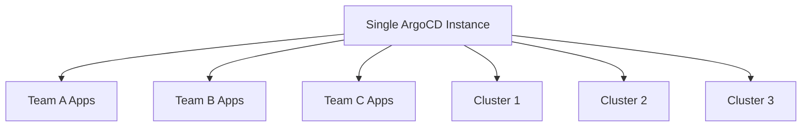
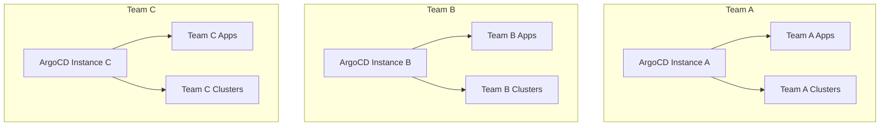
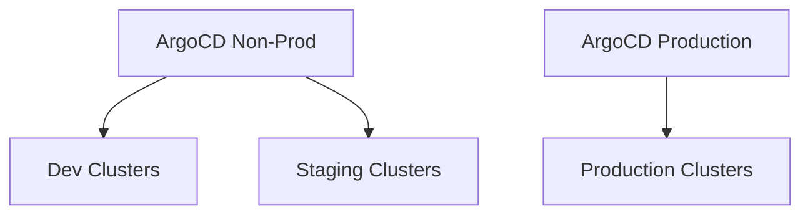

# ArgoCD Single Instance vs Multiple Instances: Decision Guide

Author: [nawazdhandala](https://github.com/nawazdhandala)

Tags: ArgoCD, GitOps, Kubernetes, Architecture, Scalability

Description: A practical decision guide for choosing between a single shared ArgoCD instance and multiple dedicated instances, covering scalability, isolation, and operational trade-offs.

---

One of the most consequential architectural decisions when adopting ArgoCD at scale is whether to run a single shared instance or multiple dedicated instances. This choice affects your team structure, security posture, blast radius, operational overhead, and how your organization scales its GitOps practice. There is no universally right answer - it depends on your specific constraints and requirements. This guide provides a framework for making the decision.

## The Two Approaches

### Single Instance (Hub Model)

One ArgoCD installation manages all applications across all clusters and teams.



### Multiple Instances (Distributed Model)

Each team, environment, or logical boundary gets its own ArgoCD installation.



## Single Instance: Deep Dive

### Configuration

A single shared instance uses Projects and RBAC to provide isolation between teams.

```yaml
# Project for Team A - restricts what they can deploy and where
apiVersion: argoproj.io/v1alpha1
kind: AppProject
metadata:
  name: team-a
  namespace: argocd
spec:
  description: "Team A project"
  sourceRepos:
    - 'https://github.com/org/team-a-*'
  destinations:
    - namespace: 'team-a-*'
      server: 'https://kubernetes.default.svc'
    - namespace: 'team-a-*'
      server: 'https://staging-cluster.example.com'
  clusterResourceWhitelist:
    - group: ''
      kind: Namespace
  namespaceResourceBlacklist:
    - group: ''
      kind: ResourceQuota
  roles:
    - name: team-a-admin
      policies:
        - p, proj:team-a:team-a-admin, applications, *, team-a/*, allow
      groups:
        - team-a-engineers

---
# RBAC configuration in argocd-rbac-cm
apiVersion: v1
kind: ConfigMap
metadata:
  name: argocd-rbac-cm
  namespace: argocd
data:
  policy.csv: |
    # Team A can manage their own applications
    p, role:team-a, applications, get, team-a/*, allow
    p, role:team-a, applications, sync, team-a/*, allow
    p, role:team-a, applications, create, team-a/*, allow
    p, role:team-a, applications, delete, team-a/*, allow

    # Team B can manage their own applications
    p, role:team-b, applications, get, team-b/*, allow
    p, role:team-b, applications, sync, team-b/*, allow

    # Platform team has full access
    p, role:platform, applications, *, */*, allow
    p, role:platform, clusters, *, *, allow

    # Map groups to roles
    g, team-a-engineers, role:team-a
    g, team-b-engineers, role:team-b
    g, platform-engineers, role:platform
```

### Advantages

**Lower operational overhead.** You maintain one ArgoCD installation instead of many. One upgrade process, one monitoring setup, one backup strategy.

```bash
# Single upgrade process
helm upgrade argocd argo/argo-cd -n argocd -f values.yaml
# Done - all teams benefit from the upgrade
```

**Unified visibility.** The platform team sees all applications across all teams in one dashboard. This is invaluable for understanding the overall state of your infrastructure.

**Efficient resource usage.** One set of ArgoCD components (server, controller, repo server) serving all teams uses fewer cluster resources than running multiple instances.

**Centralized configuration.** SSO, RBAC policies, repository credentials, and cluster registrations are managed in one place.

### Disadvantages

**Blast radius.** If the single ArgoCD instance goes down, no team can deploy. A misconfiguration or bug affects everyone.

**Noisy neighbor problems.** One team's large application with thousands of resources can slow down reconciliation for all teams.

```yaml
# Large applications consume disproportionate controller resources
# Team C's mega-app might slow down Team A's small services
controller:
  resources:
    requests:
      cpu: 4000m    # Need to size for the largest consumer
      memory: 8Gi
```

**RBAC complexity.** As the number of teams grows, RBAC policies become complex and harder to audit. A misconfiguration could give one team access to another's resources.

**Upgrade coordination.** Every team must be compatible with the same ArgoCD version. One team blocking an upgrade blocks everyone.

## Multiple Instances: Deep Dive

### Configuration

Each instance is independent with its own configuration, RBAC, and cluster registrations.

```yaml
# Instance for Team A
# values-team-a.yaml
global:
  image:
    tag: v2.10.2

server:
  ingress:
    enabled: true
    hostname: argocd-team-a.internal.example.com

configs:
  cm:
    url: https://argocd-team-a.internal.example.com
  repositories:
    team-a-repo:
      url: https://github.com/org/team-a-gitops.git
      type: git
```

```bash
# Deploy multiple instances in different namespaces
helm install argocd-team-a argo/argo-cd -n argocd-team-a -f values-team-a.yaml
helm install argocd-team-b argo/argo-cd -n argocd-team-b -f values-team-b.yaml
helm install argocd-platform argo/argo-cd -n argocd-platform -f values-platform.yaml
```

### Advantages

**Strong isolation.** Each instance is completely independent. One team's issues cannot affect another team. This is real isolation, not policy-based isolation.

**Independent lifecycle.** Each team can upgrade their ArgoCD instance on their own schedule.

```bash
# Team A upgrades to v2.11 immediately
helm upgrade argocd-team-a argo/argo-cd -n argocd-team-a --version 6.6.0

# Team B stays on v2.10 until they're ready
# No coordination needed
```

**Smaller blast radius.** If one instance fails, only that team is affected. Other teams continue deploying normally.

**Simpler RBAC.** Each instance has simpler RBAC because it only serves one team. Admins within each instance have full control without risking other teams.

**Performance isolation.** Each team's ArgoCD instance is sized for their specific workload. No noisy neighbor issues.

### Disadvantages

**Higher operational overhead.** More instances mean more to manage, monitor, upgrade, and troubleshoot.

```bash
# Upgrading 10 ArgoCD instances
for ns in argocd-team-{a,b,c,d,e,f,g,h,i,j}; do
  helm upgrade argocd argo/argo-cd -n $ns -f values-$ns.yaml
done
# 10x the upgrade work, 10x the testing, 10x the monitoring
```

**No unified visibility.** The platform team needs to check multiple dashboards or build a meta-dashboard to see overall deployment status.

**Resource waste.** Each instance runs its own server, controller, repo server, and Redis. This adds up quickly.

```
# Resource usage comparison for 10 teams
# Single instance: ~4 CPU, 8Gi RAM
# 10 instances: ~20 CPU, 40Gi RAM (5x more resources)
```

**Configuration drift.** Different instances may end up with different configurations, making it harder to maintain consistency across the organization.

## Hybrid Approaches

Most organizations at scale end up with a hybrid model.

### Pattern 1: Environment-Based Instances



One instance for non-production environments, a separate hardened instance for production. This limits blast radius for production while keeping non-prod management simple.

### Pattern 2: Criticality-Based Instances

```yaml
# High-criticality instance for payment, auth, and core services
# Dedicated resources, stricter RBAC, enhanced monitoring
# values-critical.yaml
controller:
  replicas: 3
  resources:
    requests:
      cpu: 2000m
      memory: 4Gi

# Standard instance for everything else
# values-standard.yaml
controller:
  replicas: 1
  resources:
    requests:
      cpu: 500m
      memory: 1Gi
```

### Pattern 3: App-of-Apps Meta Instance

A management ArgoCD instance deploys and manages other ArgoCD instances.

```yaml
# Meta ArgoCD Application that manages team ArgoCD instances
apiVersion: argoproj.io/v1alpha1
kind: Application
metadata:
  name: argocd-team-a
  namespace: argocd-meta
spec:
  source:
    repoURL: https://github.com/org/platform-gitops.git
    path: argocd-instances/team-a
    targetRevision: main
  destination:
    server: https://kubernetes.default.svc
    namespace: argocd-team-a
```

## Decision Matrix

| Factor | Single Instance | Multiple Instances |
|--------|----------------|-------------------|
| Team count | Under 10 teams | Over 10 teams |
| Compliance needs | Standard | Strict isolation required |
| Platform team size | Small (1-3) | Large (5+) |
| Risk tolerance | Higher | Lower |
| Resource budget | Constrained | Flexible |
| Upgrade coordination | Easy (few teams) | Hard (many teams) |
| Deployment volume | Under 500 apps | Over 500 apps |

## Making the Call

Start with a single instance. It is simpler to operate and sufficient for most organizations until they reach significant scale (10+ teams, 500+ applications) or have specific isolation requirements (regulatory, security, or organizational boundaries).

Migrate to multiple instances when you experience:
- Noisy neighbor performance issues
- RBAC becoming unmanageable
- Teams needing different ArgoCD versions
- Regulatory requirements for deployment isolation
- The single instance becoming a critical bottleneck

The transition from single to multiple instances does not need to happen all at once. You can carve out specific teams or environments into dedicated instances incrementally. For monitoring across single or multiple ArgoCD instances, consider [centralized observability](https://oneuptime.com/blog/post/2026-02-26-argocd-community-vs-enterprise-akuity/view) to maintain visibility regardless of your architecture.
