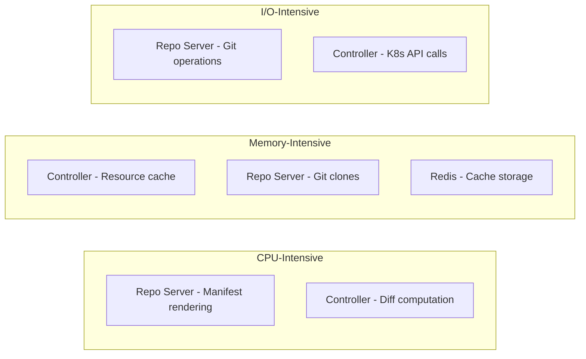

# How to Size ArgoCD Components for Large Clusters

Author: [nawazdhandala](https://github.com/nawazdhandala)

Tags: ArgoCD, GitOps, Kubernetes, Performance, Capacity Planning

Description: A practical guide to sizing ArgoCD component resources for large-scale deployments, with specific recommendations based on application count, cluster count, and resource volume.

---

Sizing ArgoCD components correctly is the difference between a responsive GitOps platform and one that constantly crashes, lags, or misses sync events. Undersized components lead to OOMKilled restarts, slow reconciliation, and frustrated teams. Oversized components waste cluster resources. This guide provides concrete sizing recommendations based on real-world deployment scales.

## Understanding Resource Consumption Patterns

Each ArgoCD component has different resource consumption characteristics:



The application controller is almost always the component that needs the most resources, followed by the repo server.

## Sizing Matrix

Here are tested sizing recommendations based on the number of ArgoCD-managed applications:

### Small: 1 to 50 Applications

Suitable for single-team or small platform deployments.

```yaml
controller:
  replicas: 1
  resources:
    requests:
      cpu: 250m
      memory: 512Mi
    limits:
      cpu: "1"
      memory: 2Gi

server:
  replicas: 2
  resources:
    requests:
      cpu: 100m
      memory: 128Mi
    limits:
      cpu: 500m
      memory: 256Mi

repoServer:
  replicas: 2
  resources:
    requests:
      cpu: 200m
      memory: 256Mi
    limits:
      cpu: "1"
      memory: 1Gi

redis:
  resources:
    requests:
      cpu: 100m
      memory: 128Mi
    limits:
      cpu: 250m
      memory: 256Mi
```

### Medium: 50 to 200 Applications

Typical for a multi-team platform deployment.

```yaml
controller:
  replicas: 1
  resources:
    requests:
      cpu: 500m
      memory: 1Gi
    limits:
      cpu: "2"
      memory: 4Gi
  env:
    - name: ARGOCD_CONTROLLER_REPLICAS
      value: "1"

server:
  replicas: 3
  resources:
    requests:
      cpu: 200m
      memory: 256Mi
    limits:
      cpu: "1"
      memory: 512Mi

repoServer:
  replicas: 3
  resources:
    requests:
      cpu: 500m
      memory: 512Mi
    limits:
      cpu: "2"
      memory: 2Gi

redis-ha:
  enabled: true
  replicas: 3
  redis:
    resources:
      requests:
        cpu: 200m
        memory: 256Mi
      limits:
        cpu: 500m
        memory: 512Mi
```

### Large: 200 to 500 Applications

Enterprise platform with many teams and clusters.

```yaml
controller:
  replicas: 2
  resources:
    requests:
      cpu: "1"
      memory: 2Gi
    limits:
      cpu: "4"
      memory: 8Gi
  env:
    - name: ARGOCD_CONTROLLER_REPLICAS
      value: "2"

server:
  replicas: 5
  autoscaling:
    enabled: true
    minReplicas: 3
    maxReplicas: 7
    targetCPUUtilizationPercentage: 70
  resources:
    requests:
      cpu: 500m
      memory: 256Mi
    limits:
      cpu: "1"
      memory: 512Mi

repoServer:
  replicas: 5
  autoscaling:
    enabled: true
    minReplicas: 3
    maxReplicas: 7
    targetCPUUtilizationPercentage: 70
  resources:
    requests:
      cpu: "1"
      memory: 1Gi
    limits:
      cpu: "2"
      memory: 4Gi

redis-ha:
  enabled: true
  replicas: 3
  redis:
    resources:
      requests:
        cpu: 500m
        memory: 512Mi
      limits:
        cpu: "1"
        memory: 1Gi
    config:
      maxmemory: 512mb
```

### Extra Large: 500 to 2000+ Applications

Large-scale enterprise with aggressive sharding.

```yaml
controller:
  replicas: 4
  resources:
    requests:
      cpu: "2"
      memory: 4Gi
    limits:
      cpu: "4"
      memory: 12Gi
  env:
    - name: ARGOCD_CONTROLLER_REPLICAS
      value: "4"

server:
  replicas: 7
  autoscaling:
    enabled: true
    minReplicas: 5
    maxReplicas: 15
    targetCPUUtilizationPercentage: 60
  resources:
    requests:
      cpu: 500m
      memory: 512Mi
    limits:
      cpu: "2"
      memory: 1Gi

repoServer:
  replicas: 7
  autoscaling:
    enabled: true
    minReplicas: 5
    maxReplicas: 15
    targetCPUUtilizationPercentage: 60
  resources:
    requests:
      cpu: "1"
      memory: 1Gi
    limits:
      cpu: "4"
      memory: 4Gi

redis-ha:
  enabled: true
  replicas: 3
  redis:
    resources:
      requests:
        cpu: "1"
        memory: 1Gi
      limits:
        cpu: "2"
        memory: 2Gi
    config:
      maxmemory: 1gb

applicationSet:
  replicas: 3
  resources:
    requests:
      cpu: 250m
      memory: 256Mi
    limits:
      cpu: "1"
      memory: 1Gi
```

## Factors That Affect Sizing

### Number of Kubernetes Resources per Application

An application deploying 5 resources is very different from one deploying 500. The controller must track every individual resource:

```bash
# Check total managed resources
argocd app list -o json | jq '[.[].status.resources | length] | add'

# Resources per application
argocd app list -o json | jq '.[] | {name: .metadata.name, resources: (.status.resources | length)}'
```

For applications with many resources, increase controller memory. Each resource adds approximately 5-10 KB to the controller's memory footprint.

### Repository Size and Complexity

Large Git repositories or complex Helm charts increase repo server resource needs:

- **Plain YAML**: Minimal CPU and memory
- **Small Helm charts**: ~50-100MB memory during rendering
- **Large Helm charts with subcharts**: ~200-500MB memory
- **Kustomize with remote bases**: Additional network I/O and memory
- **Config Management Plugins**: Varies widely by plugin

### Number of Managed Clusters

More clusters means more API connections and state to track:

| Clusters | Controller Memory Increase | Additional Notes |
|---|---|---|
| 1 (in-cluster) | Baseline | No cross-cluster overhead |
| 2 to 5 | +25% | One connection pool per cluster |
| 5 to 20 | +50% | Consider sharding |
| 20+ | +100% | Must use sharding |

### Sync Frequency

Frequent syncs (auto-sync with self-healing) consume more resources than periodic manual syncs:

```yaml
# High-frequency sync tuning
apiVersion: v1
kind: ConfigMap
metadata:
  name: argocd-cmd-params-cm
  namespace: argocd
data:
  # Increase processors for high-frequency environments
  controller.status.processors: "50"
  controller.operation.processors: "25"
  # Increase K8s API QPS for more clusters
  controller.k8s.client.config.qps: "100"
  controller.k8s.client.config.burst: "200"
```

## Measuring Actual Usage

Do not guess - measure. Use these commands to understand your actual resource consumption:

```bash
# Current pod resource usage
kubectl top pods -n argocd

# Historical usage (if Prometheus/metrics-server is available)
kubectl top pods -n argocd --containers

# Detailed memory breakdown for the controller
kubectl exec -n argocd deployment/argocd-application-controller -- \
  curl -s localhost:8082/debug/pprof/heap > /tmp/heap.prof

# Check Redis memory usage
kubectl exec -n argocd statefulset/argocd-redis-ha-server -- \
  redis-cli info memory
```

### Key Prometheus Queries

```promql
# Controller memory usage over time
container_memory_working_set_bytes{namespace="argocd", container="argocd-application-controller"}

# Repo server CPU usage
rate(container_cpu_usage_seconds_total{namespace="argocd", container="argocd-repo-server"}[5m])

# API server request rate
sum(rate(grpc_server_handled_total{namespace="argocd"}[5m])) by (grpc_service)

# Redis memory usage
redis_memory_used_bytes{namespace="argocd"}
```

## Node Sizing Recommendations

ArgoCD components should ideally run on dedicated or appropriately sized nodes:

```yaml
# Node affinity for ArgoCD workloads
controller:
  nodeSelector:
    workload-type: argocd
  tolerations:
    - key: "argocd"
      operator: "Equal"
      value: "true"
      effect: "NoSchedule"
```

Recommended node types by cloud provider:

| Scale | AWS | GCP | Azure |
|---|---|---|---|
| Small | m6i.large | e2-standard-4 | Standard_D4s_v5 |
| Medium | m6i.xlarge | e2-standard-8 | Standard_D8s_v5 |
| Large | m6i.2xlarge | e2-standard-16 | Standard_D16s_v5 |
| Extra Large | m6i.4xlarge | e2-standard-32 | Standard_D32s_v5 |

## Iterative Sizing Process

1. **Start conservative**: Begin with the sizing for your estimated scale
2. **Monitor for 1-2 weeks**: Collect actual resource usage data
3. **Identify bottlenecks**: Look for OOMKilled events, high CPU throttling, or slow reconciliation
4. **Adjust**: Increase resources for bottlenecked components, decrease for overprovisioned ones
5. **Repeat**: Resource needs change as your application count grows

```bash
# Check for OOMKilled events
kubectl get events -n argocd --field-selector reason=OOMKilling

# Check for CPU throttling
kubectl top pods -n argocd --containers | sort -k3 -rn
```

Proper sizing is an ongoing process, not a one-time decision. Start with the recommendations in this guide, measure actual usage, and adjust. For continuous monitoring of your ArgoCD resource usage, see our guide on [monitoring ArgoCD component health](https://oneuptime.com/blog/post/2026-02-26-argocd-monitor-component-health/view).
