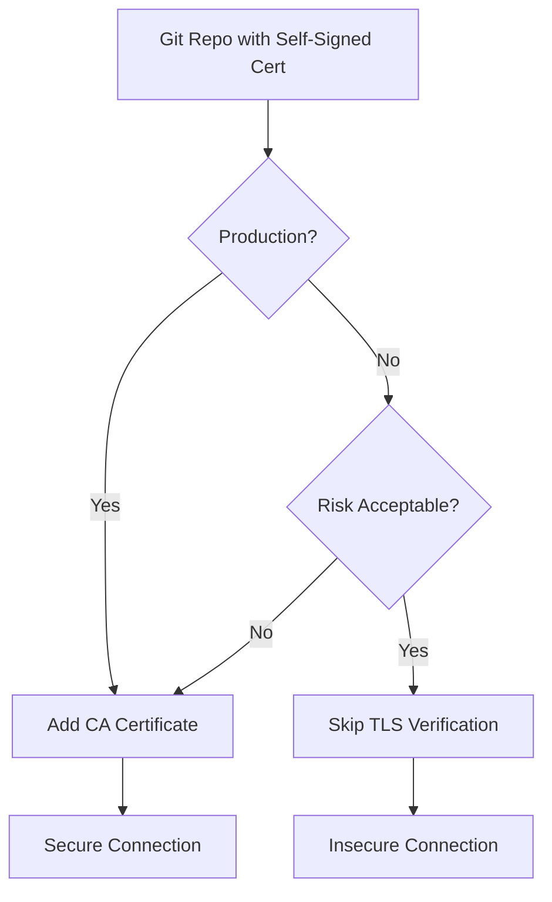

# How to Configure ArgoCD to Skip TLS Verification for Git Repos

Author: [nawazdhandala](https://github.com/nawazdhandala)

Tags: ArgoCD, GitOps, Kubernetes, Security, Git

Description: Learn how to configure ArgoCD to skip TLS verification for self-signed certificates on Git repositories and understand the security implications.

---

When you connect ArgoCD to a Git repository that uses a self-signed certificate or an internal CA, you will get TLS verification errors. ArgoCD rightfully refuses to connect to HTTPS endpoints it cannot verify. But in many enterprise environments, internal Git servers use certificates issued by a private CA, and you need to either skip TLS verification or provide the CA certificate.

This guide covers both approaches, starting with the quick fix (skipping TLS) and then the proper fix (adding your CA certificate).

## The Error You Are Seeing

When ArgoCD cannot verify the TLS certificate of your Git server, you will see errors like:

```
x509: certificate signed by unknown authority
```

or

```
unable to access 'https://git.internal.example.com/my-org/my-repo.git/': SSL certificate problem: unable to get local issuer certificate
```

These show up in the ArgoCD UI when you try to add a repository, or in the repo-server logs.

## Method 1: Skip TLS Verification Per Repository

The quickest way to get past TLS errors is to disable verification for a specific repository.

### Using the CLI

```bash
# Add a repository with TLS verification disabled
argocd repo add https://git.internal.example.com/my-org/my-repo.git \
  --username my-user \
  --password my-password \
  --insecure-skip-server-verification
```

### Using a Repository Secret

You can also configure TLS skipping by creating a repository secret directly.

```yaml
apiVersion: v1
kind: Secret
metadata:
  name: my-internal-repo
  namespace: argocd
  labels:
    argocd.argoproj.io/secret-type: repository
type: Opaque
stringData:
  type: git
  url: https://git.internal.example.com/my-org/my-repo.git
  username: my-user
  password: my-password
  # This is the key setting
  insecure: "true"
```

```bash
kubectl apply -f repo-secret.yaml
```

### Using a Credential Template

If you have multiple repositories on the same Git server, use a credential template to apply TLS settings to all of them at once.

```yaml
apiVersion: v1
kind: Secret
metadata:
  name: internal-git-creds
  namespace: argocd
  labels:
    argocd.argoproj.io/secret-type: repo-creds
type: Opaque
stringData:
  type: git
  url: https://git.internal.example.com
  username: my-user
  password: my-password
  insecure: "true"
```

Any repository URL that starts with `https://git.internal.example.com` will automatically inherit these credentials and TLS settings.

## Method 2: Add Your CA Certificate (Recommended)

Instead of skipping TLS verification entirely, the better approach is to provide ArgoCD with your organization's CA certificate. This maintains the security benefits of TLS while allowing connections to your internal servers.

### Add the CA Certificate via ConfigMap

ArgoCD reads custom CA certificates from the `argocd-tls-certs-cm` ConfigMap.

```yaml
apiVersion: v1
kind: ConfigMap
metadata:
  name: argocd-tls-certs-cm
  namespace: argocd
data:
  # The key must be the Git server hostname
  git.internal.example.com: |
    -----BEGIN CERTIFICATE-----
    MIIDqzCCApOgAwIBAgIUB...
    (your CA certificate in PEM format)
    -----END CERTIFICATE-----
```

```bash
kubectl apply -f argocd-tls-certs-cm.yaml
```

You do not need to restart ArgoCD after adding the ConfigMap. The repo-server watches this ConfigMap and picks up new certificates automatically.

### Get Your CA Certificate

If you do not have the CA certificate handy, you can extract it from the Git server.

```bash
# Download the certificate chain from the server
openssl s_client -connect git.internal.example.com:443 \
  -showcerts </dev/null 2>/dev/null | \
  openssl x509 -outform PEM > ca-cert.pem

# View the certificate details
openssl x509 -in ca-cert.pem -text -noout
```

If the server uses an intermediate CA, you may need to include the full certificate chain.

```bash
# Get the full certificate chain
openssl s_client -connect git.internal.example.com:443 \
  -showcerts </dev/null 2>/dev/null | \
  awk '/BEGIN CERTIFICATE/,/END CERTIFICATE/ {print}' > full-chain.pem
```

### Add the CA Certificate via CLI

```bash
# Add a TLS certificate for a specific server
argocd cert add-tls git.internal.example.com --from ca-cert.pem
```

### Verify the Certificate Was Added

```bash
# List all TLS certificates known to ArgoCD
argocd cert list --cert-type https
```

## Method 3: Mount CA Certificates in the Repo-Server

For organizations with many internal services using the same CA, you can mount the CA certificate bundle directly into the repo-server pod.

```yaml
# Patch the repo-server deployment
apiVersion: apps/v1
kind: Deployment
metadata:
  name: argocd-repo-server
  namespace: argocd
spec:
  template:
    spec:
      containers:
        - name: argocd-repo-server
          volumeMounts:
            - name: custom-ca
              mountPath: /etc/ssl/certs/internal-ca.crt
              subPath: ca.crt
      volumes:
        - name: custom-ca
          configMap:
            name: internal-ca-bundle
```

Create the ConfigMap with your CA bundle.

```bash
kubectl -n argocd create configmap internal-ca-bundle \
  --from-file=ca.crt=/path/to/your/ca-cert.pem
```

## Security Considerations

Skipping TLS verification has real security implications that you should understand.

**Man-in-the-middle attacks**: Without TLS verification, an attacker positioned between ArgoCD and your Git server could intercept and modify the manifests that ArgoCD deploys. This means someone could inject malicious workloads into your clusters.

**Supply chain attacks**: If your Git traffic is not verified, it becomes a target for supply chain attacks. An attacker does not need to compromise your Git server - they just need to intercept the traffic.

**Compliance requirements**: Many compliance frameworks (SOC 2, PCI DSS, HIPAA) require TLS verification for all internal communications. Skipping TLS may put you out of compliance.

The recommendation is clear: use Method 2 (CA certificates) for production environments and only use Method 1 (skip TLS) for development or testing where the risk is acceptable.



## Troubleshooting

**Certificate still not accepted after adding to ConfigMap**: Make sure the key in `argocd-tls-certs-cm` exactly matches the hostname in your repository URL. If your URL is `https://git.internal.example.com:8443`, the key should be `git.internal.example.com`.

**Certificate chain issues**: If the server uses an intermediate CA, you need to include both the intermediate and root CA certificates in the ConfigMap.

**Repo-server not picking up changes**: While ArgoCD should auto-detect ConfigMap changes, sometimes a restart helps.

```bash
kubectl -n argocd rollout restart deployment argocd-repo-server
```

**SSH repositories**: TLS verification only applies to HTTPS repositories. If you are using SSH URLs (git@...), you need to manage SSH known hosts instead.

```bash
# Add SSH known hosts
argocd cert add-ssh --batch < /path/to/known_hosts
```

Whether you choose to skip TLS or add your CA certificate, the important thing is understanding the tradeoff. For anything touching production clusters, invest the extra time to set up proper CA certificates. Your security team will thank you.
