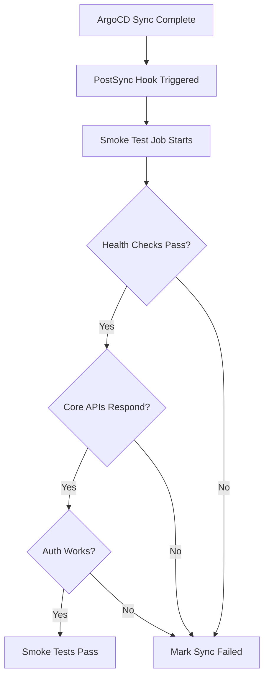

# How to Run Smoke Tests as PostSync Hooks in ArgoCD

Author: [nawazdhandala](https://github.com/nawazdhandala)

Tags: ArgoCD, GitOps, Kubernetes, Testing, Deployment

Description: Learn how to configure ArgoCD PostSync hooks to run smoke tests automatically after every deployment, catching critical failures before they reach users.

---

A smoke test answers one simple question: does the thing we just deployed actually work? Not whether every edge case is covered, not whether performance is optimal, but whether the core functionality is alive and responding. In a GitOps workflow with ArgoCD, PostSync hooks give you the perfect mechanism to answer that question automatically after every sync.

This guide covers how to build effective smoke tests as ArgoCD PostSync hooks, from simple HTTP checks to multi-service validation suites.

## What Makes a Good Smoke Test

Smoke tests are the first line of defense after deployment. They should be:

- **Fast** - Complete in under 2 minutes
- **Reliable** - No flaky results
- **Focused** - Test critical paths only
- **Lightweight** - Minimal resource consumption

A smoke test is not the place for comprehensive validation. It is the quick sanity check that tells you whether to proceed with more thorough testing or roll back immediately.



## Basic HTTP Smoke Test

The simplest smoke test checks that your key endpoints return expected status codes:

```yaml
apiVersion: batch/v1
kind: Job
metadata:
  name: smoke-tests
  annotations:
    argocd.argoproj.io/hook: PostSync
    argocd.argoproj.io/hook-delete-policy: BeforeHookCreation,HookSucceeded
spec:
  backoffLimit: 0
  activeDeadlineSeconds: 120
  ttlSecondsAfterFinished: 300
  template:
    spec:
      restartPolicy: Never
      containers:
        - name: smoke
          image: curlimages/curl:8.5.0
          command:
            - /bin/sh
            - -c
            - |
              set -e
              PASS=0
              FAIL=0

              # Function to test an endpoint
              test_endpoint() {
                local name=$1
                local url=$2
                local expected_code=$3

                code=$(curl -s -o /dev/null -w "%{http_code}" \
                  --connect-timeout 5 --max-time 10 "$url")
                if [ "$code" = "$expected_code" ]; then
                  echo "PASS: $name (HTTP $code)"
                  PASS=$((PASS + 1))
                else
                  echo "FAIL: $name - expected $expected_code, got $code"
                  FAIL=$((FAIL + 1))
                fi
              }

              echo "=== Smoke Tests Starting ==="
              echo ""

              # Test critical endpoints
              test_endpoint "API Health" \
                "http://api.default.svc:8080/health" "200"
              test_endpoint "Frontend" \
                "http://frontend.default.svc:3000/" "200"
              test_endpoint "Auth Service" \
                "http://auth.default.svc:8081/health" "200"
              test_endpoint "Worker Health" \
                "http://worker.default.svc:8082/health" "200"

              echo ""
              echo "=== Results: $PASS passed, $FAIL failed ==="

              # Exit with failure if any test failed
              if [ "$FAIL" -gt 0 ]; then
                exit 1
              fi
```

## Smoke Tests with Response Body Validation

Checking status codes is good. Checking response content is better. Here is a more thorough smoke test that validates response bodies:

```yaml
apiVersion: batch/v1
kind: Job
metadata:
  name: smoke-tests-detailed
  annotations:
    argocd.argoproj.io/hook: PostSync
    argocd.argoproj.io/hook-delete-policy: BeforeHookCreation,HookSucceeded
spec:
  backoffLimit: 0
  activeDeadlineSeconds: 180
  template:
    spec:
      restartPolicy: Never
      initContainers:
        # Wait for services to be ready
        - name: wait-for-readiness
          image: busybox:1.36
          command:
            - sh
            - -c
            - |
              echo "Waiting for API to be ready..."
              attempt=0
              until wget -q -O /dev/null http://api.default.svc:8080/health 2>/dev/null; do
                attempt=$((attempt + 1))
                if [ $attempt -ge 30 ]; then
                  echo "API not ready after 30 seconds"
                  exit 1
                fi
                sleep 1
              done
              echo "API is ready"
      containers:
        - name: smoke
          image: curlimages/curl:8.5.0
          command:
            - /bin/sh
            - -c
            - |
              set -e
              errors=""

              # Test 1: API health returns healthy status
              echo "Test 1: API health check"
              health=$(curl -sf http://api.default.svc:8080/health)
              if echo "$health" | grep -q '"status":"healthy"'; then
                echo "  PASS"
              else
                echo "  FAIL: unexpected response: $health"
                errors="$errors\nAPI health check failed"
              fi

              # Test 2: Version endpoint returns current version
              echo "Test 2: Version endpoint"
              version=$(curl -sf http://api.default.svc:8080/version)
              if echo "$version" | grep -q '"version"'; then
                echo "  PASS: $version"
              else
                echo "  FAIL: version endpoint broken"
                errors="$errors\nVersion endpoint failed"
              fi

              # Test 3: Database connectivity
              echo "Test 3: Database connectivity"
              db_status=$(curl -sf http://api.default.svc:8080/health/db)
              if echo "$db_status" | grep -q '"connected":true'; then
                echo "  PASS"
              else
                echo "  FAIL: database not connected"
                errors="$errors\nDatabase connectivity failed"
              fi

              # Test 4: Cache connectivity
              echo "Test 4: Redis cache connectivity"
              cache_status=$(curl -sf http://api.default.svc:8080/health/cache)
              if echo "$cache_status" | grep -q '"connected":true'; then
                echo "  PASS"
              else
                echo "  FAIL: cache not connected"
                errors="$errors\nCache connectivity failed"
              fi

              # Test 5: Can create a test resource
              echo "Test 5: Write operation"
              create_resp=$(curl -s -w "\n%{http_code}" \
                -X POST http://api.default.svc:8080/api/v1/smoke-test \
                -H "Content-Type: application/json" \
                -d '{"test": true}')
              code=$(echo "$create_resp" | tail -1)
              if [ "$code" = "201" ] || [ "$code" = "200" ]; then
                echo "  PASS"
              else
                echo "  FAIL: write returned $code"
                errors="$errors\nWrite operation failed"
              fi

              # Report results
              if [ -n "$errors" ]; then
                echo ""
                echo "SMOKE TESTS FAILED:"
                echo "$errors"
                exit 1
              fi

              echo ""
              echo "All smoke tests passed!"
```

## Using a ConfigMap for Test Configuration

Hardcoding URLs in the test script gets messy fast. Use a ConfigMap to manage your test targets:

```yaml
apiVersion: v1
kind: ConfigMap
metadata:
  name: smoke-test-config
data:
  targets.json: |
    {
      "tests": [
        {
          "name": "API Health",
          "url": "http://api.default.svc:8080/health",
          "expectedStatus": 200,
          "expectedBody": "healthy"
        },
        {
          "name": "Frontend",
          "url": "http://frontend.default.svc:3000/",
          "expectedStatus": 200,
          "expectedBody": "<html"
        },
        {
          "name": "Auth Service",
          "url": "http://auth.default.svc:8081/.well-known/openid-configuration",
          "expectedStatus": 200,
          "expectedBody": "issuer"
        }
      ]
    }
---
apiVersion: batch/v1
kind: Job
metadata:
  name: smoke-tests
  annotations:
    argocd.argoproj.io/hook: PostSync
    argocd.argoproj.io/hook-delete-policy: BeforeHookCreation,HookSucceeded
spec:
  backoffLimit: 0
  activeDeadlineSeconds: 120
  template:
    spec:
      restartPolicy: Never
      containers:
        - name: smoke
          image: python:3.12-slim
          command:
            - python3
            - /scripts/run-smoke-tests.py
          volumeMounts:
            - name: config
              mountPath: /config
            - name: scripts
              mountPath: /scripts
      volumes:
        - name: config
          configMap:
            name: smoke-test-config
        - name: scripts
          configMap:
            name: smoke-test-scripts
---
apiVersion: v1
kind: ConfigMap
metadata:
  name: smoke-test-scripts
data:
  run-smoke-tests.py: |
    import json
    import urllib.request
    import sys

    with open("/config/targets.json") as f:
        config = json.load(f)

    passed = 0
    failed = 0

    for test in config["tests"]:
        try:
            req = urllib.request.Request(test["url"])
            resp = urllib.request.urlopen(req, timeout=10)
            body = resp.read().decode()

            status_ok = resp.status == test["expectedStatus"]
            body_ok = test.get("expectedBody", "") in body

            if status_ok and body_ok:
                print(f"PASS: {test['name']}")
                passed += 1
            else:
                print(f"FAIL: {test['name']} - status={resp.status}, body contains expected={body_ok}")
                failed += 1
        except Exception as e:
            print(f"FAIL: {test['name']} - {e}")
            failed += 1

    print(f"\nResults: {passed} passed, {failed} failed")
    sys.exit(1 if failed > 0 else 0)
```

## Sending Smoke Test Results to Slack

When a smoke test fails, you want to know immediately. Add a notification step:

```yaml
containers:
  - name: smoke
    image: curlimages/curl:8.5.0
    env:
      - name: SLACK_WEBHOOK
        valueFrom:
          secretKeyRef:
            name: slack-webhook
            key: url
      - name: NAMESPACE
        valueFrom:
          fieldRef:
            fieldPath: metadata.namespace
    command:
      - /bin/sh
      - -c
      - |
        # Run smoke tests
        results=""
        failed=0

        check() {
          local name=$1 url=$2
          code=$(curl -s -o /dev/null -w "%{http_code}" --max-time 10 "$url")
          if [ "$code" = "200" ]; then
            results="$results\n:white_check_mark: $name"
          else
            results="$results\n:x: $name (HTTP $code)"
            failed=$((failed + 1))
          fi
        }

        check "API" "http://api.default.svc:8080/health"
        check "Frontend" "http://frontend.default.svc:3000/"
        check "Worker" "http://worker.default.svc:8082/health"

        # Send results to Slack
        if [ "$failed" -gt 0 ]; then
          status="FAILED"
          color="#ff0000"
        else
          status="PASSED"
          color="#36a64f"
        fi

        curl -s -X POST "$SLACK_WEBHOOK" \
          -H "Content-Type: application/json" \
          -d "{
            \"attachments\": [{
              \"color\": \"$color\",
              \"title\": \"Smoke Tests $status - $NAMESPACE\",
              \"text\": \"$(echo -e "$results")\"
            }]
          }"

        [ "$failed" -eq 0 ]
```

## Smoke Tests in Multi-Environment Pipelines

When you deploy to staging first and then production, your smoke test configuration should adapt per environment. Use Kustomize overlays:

```
smoke-tests/
  base/
    job.yaml
    kustomization.yaml
  overlays/
    staging/
      config-patch.yaml
      kustomization.yaml
    production/
      config-patch.yaml
      kustomization.yaml
```

The base Job definition stays the same. Each overlay patches the service URLs and thresholds for its environment.

For a deeper dive into running full integration test suites after deployment, check out our guide on [running integration tests after ArgoCD deployment](https://oneuptime.com/blog/post/2026-02-26-argocd-integration-tests-after-deployment/view).

## Best Practices for Smoke Tests

1. **Keep them under 2 minutes** - Smoke tests should be fast. If they take longer, you are testing too much.
2. **Test the critical path** - Focus on what would break the user experience if it failed.
3. **Use init containers for readiness** - Do not let tests fail because a service is still starting up.
4. **Do not test external dependencies** - Smoke tests should validate your services, not third-party APIs.
5. **Include write operations** - Reading data works does not mean writing works. Test both.
6. **Clean up test data** - Use identifiable markers for test data and clean up after tests run.
7. **Fail fast** - If a critical check fails, exit immediately rather than continuing through all tests.

Smoke tests as PostSync hooks give you automated confidence in every deployment. They are simple to implement, cheap to run, and catch the most damaging failures before anyone notices.
