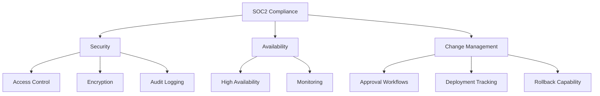

# How to Configure ArgoCD for SOC2 Compliance

Author: [nawazdhandala](https://github.com/nawazdhandala)

Tags: ArgoCD, GitOps, Kubernetes, Compliance, SOC2

Description: A practical guide to configuring ArgoCD to meet SOC2 compliance requirements including access control, audit logging, change management, and encryption.

---

SOC2 compliance is a common requirement for SaaS companies and any organization that handles customer data. If ArgoCD manages your production deployments, it falls squarely within your SOC2 audit scope. This guide maps SOC2 Trust Services Criteria to specific ArgoCD configurations so you can demonstrate compliance to your auditors.

## SOC2 Trust Services Criteria and ArgoCD

SOC2 is organized around five Trust Services Criteria. The three most relevant to ArgoCD are:



Let us walk through each requirement and the specific ArgoCD configuration needed.

## CC6.1: Logical and Physical Access Controls

SOC2 requires that only authorized individuals can access systems. For ArgoCD, this means proper authentication and authorization.

### SSO Integration

Disable local authentication and use SSO with your identity provider:

```yaml
apiVersion: v1
kind: ConfigMap
metadata:
  name: argocd-cm
  namespace: argocd
data:
  # Disable the admin account
  admin.enabled: "false"
  # Disable anonymous access
  users.anonymous.enabled: "false"
  # Configure OIDC SSO
  oidc.config: |
    name: Okta
    issuer: https://your-org.okta.com
    clientID: argocd-client-id
    clientSecret: $oidc.okta.clientSecret
    requestedScopes:
      - openid
      - profile
      - email
      - groups
```

### Role-Based Access Control

Implement least-privilege RBAC:

```yaml
apiVersion: v1
kind: ConfigMap
metadata:
  name: argocd-rbac-cm
  namespace: argocd
data:
  # Deny by default
  policy.default: role:none
  policy.csv: |
    # Developers can view and sync their own applications
    p, role:developer, applications, get, */*, allow
    p, role:developer, applications, sync, */*, allow
    p, role:developer, logs, get, */*, allow

    # Ops team has full access
    p, role:ops, applications, *, */*, allow
    p, role:ops, clusters, *, *, allow
    p, role:ops, repositories, *, *, allow
    p, role:ops, projects, *, *, allow

    # Auditors have read-only access
    p, role:auditor, applications, get, */*, allow
    p, role:auditor, projects, get, *, allow
    p, role:auditor, repositories, get, *, allow
    p, role:auditor, clusters, get, *, allow
    p, role:auditor, logs, get, */*, allow

    # Map SSO groups to roles
    g, dev-team, role:developer
    g, ops-team, role:ops
    g, audit-team, role:auditor

    # Deny all for undefined role
    p, role:none, *, *, */*, deny
```

### Session Management

Configure session timeouts to automatically log out inactive users:

```yaml
apiVersion: v1
kind: ConfigMap
metadata:
  name: argocd-cm
  namespace: argocd
data:
  # Session timeout in hours (24 hours)
  timeout.session: "24h"
  # Require re-authentication after this period
  timeout.reconciliation: "3m"
```

## CC6.6: Encryption of Data in Transit

All communication must be encrypted. Configure TLS for every ArgoCD connection:

```yaml
# ArgoCD server TLS
apiVersion: cert-manager.io/v1
kind: Certificate
metadata:
  name: argocd-server-tls
  namespace: argocd
spec:
  secretName: argocd-server-tls
  issuerRef:
    name: letsencrypt-prod
    kind: ClusterIssuer
  dnsNames:
    - argocd.example.com
  duration: 8760h
  renewBefore: 720h
```

Enable Redis TLS:

```yaml
apiVersion: v1
kind: ConfigMap
metadata:
  name: argocd-cmd-params-cm
  namespace: argocd
data:
  redis.tls.enabled: "true"
  # Enforce TLS 1.2 minimum
  server.tls.minversion: "1.2"
```

## CC7.2: Monitoring and Detection

SOC2 requires monitoring for unauthorized access and changes. Configure comprehensive audit logging:

```yaml
apiVersion: v1
kind: ConfigMap
metadata:
  name: argocd-cmd-params-cm
  namespace: argocd
data:
  server.log.format: "json"
  server.log.level: "info"
  controller.log.format: "json"
  controller.log.level: "info"
```

Set up alerts for security-relevant events:

```yaml
apiVersion: v1
kind: ConfigMap
metadata:
  name: argocd-notifications-cm
  namespace: argocd
data:
  trigger.on-sync-status-unknown: |
    - when: app.status.sync.status == 'Unknown'
      send: [security-alert]

  trigger.on-health-degraded: |
    - when: app.status.health.status == 'Degraded'
      send: [security-alert]

  template.security-alert: |
    slack:
      attachments: |
        [{
          "color": "#FF0000",
          "title": "Security Alert: {{.app.metadata.name}}",
          "text": "Application {{.app.metadata.name}} has status: {{.app.status.sync.status}} / {{.app.status.health.status}}",
          "fields": [
            {"title": "Project", "value": "{{.app.spec.project}}", "short": true},
            {"title": "Cluster", "value": "{{.app.spec.destination.server}}", "short": true}
          ]
        }]

  service.slack: |
    token: $slack-token
```

## CC8.1: Change Management

This is where GitOps shines for SOC2. Every change goes through Git, providing a complete audit trail.

### Disable Auto-Sync for Production

For SOC2, production deployments should require explicit approval:

```yaml
apiVersion: argoproj.io/v1alpha1
kind: Application
metadata:
  name: production-app
  namespace: argocd
spec:
  syncPolicy:
    # Do NOT enable automated sync for production
    # automated: {}  # Intentionally commented out
    syncOptions:
      - Validate=true
      - CreateNamespace=false
  # Require manual sync with approval
```

### Git Branch Protection

Ensure your Git repository has branch protection rules that require:

- Pull request reviews before merging
- Status checks passing
- No direct pushes to main/production branches

This is configured in your Git provider (GitHub, GitLab), not in ArgoCD, but it is part of your SOC2 change management controls.

### Deployment Tracking

Track every deployment with ArgoCD sync history:

```bash
# View sync history for compliance reporting
argocd app history production-app

# Export sync history as JSON
argocd app history production-app -o json > sync-history.json
```

## CC7.1: Vulnerability Management

Track and remediate vulnerabilities in ArgoCD itself:

```yaml
# Kyverno policy to ensure ArgoCD images are scanned
apiVersion: kyverno.io/v1
kind: ClusterPolicy
metadata:
  name: argocd-image-scanning
spec:
  validationFailureAction: Enforce
  rules:
    - name: require-trivy-scan
      match:
        any:
          - resources:
              kinds:
                - Pod
              namespaces:
                - argocd
      verifyImages:
        - imageReferences:
            - "quay.io/argoproj/argocd:*"
          attestations:
            - predicateType: https://cosign.sigstore.dev/attestation/vuln/v1
              conditions:
                - all:
                    - key: "{{ scanner }}"
                      operator: Equals
                      value: "trivy"
```

## Compliance Documentation

Generate compliance evidence that your auditors can review:

```bash
#!/bin/bash
# SOC2 ArgoCD Compliance Evidence Generator

REPORT_DIR="soc2-evidence-$(date +%Y-%m-%d)"
mkdir -p "$REPORT_DIR"

echo "Generating SOC2 compliance evidence..."

# Access Control Evidence
echo "=== Access Control Configuration ===" > "$REPORT_DIR/access-control.txt"
kubectl get configmap argocd-rbac-cm -n argocd -o yaml >> "$REPORT_DIR/access-control.txt"
kubectl get configmap argocd-cm -n argocd -o yaml >> "$REPORT_DIR/access-control.txt"

# Encryption Evidence
echo "=== TLS Configuration ===" > "$REPORT_DIR/encryption.txt"
kubectl get certificate -n argocd -o yaml >> "$REPORT_DIR/encryption.txt"
kubectl get configmap argocd-cmd-params-cm -n argocd -o yaml >> "$REPORT_DIR/encryption.txt"

# Network Security Evidence
echo "=== Network Policies ===" > "$REPORT_DIR/network-security.txt"
kubectl get networkpolicy -n argocd -o yaml >> "$REPORT_DIR/network-security.txt"

# Change Management Evidence
echo "=== Recent Deployments ===" > "$REPORT_DIR/change-management.txt"
for app in $(argocd app list -o name); do
  echo "--- $app ---" >> "$REPORT_DIR/change-management.txt"
  argocd app history "$app" >> "$REPORT_DIR/change-management.txt"
done

# Container Security Evidence
echo "=== Pod Security ===" > "$REPORT_DIR/container-security.txt"
kubectl get pods -n argocd -o json | jq '.items[] | {
  name: .metadata.name,
  runAsNonRoot: .spec.securityContext.runAsNonRoot,
  readOnlyRootFilesystem: .spec.containers[].securityContext.readOnlyRootFilesystem
}' >> "$REPORT_DIR/container-security.txt"

echo "Evidence generated in $REPORT_DIR/"
```

## SOC2 Compliance Checklist for ArgoCD

Use this checklist during your audit preparation:

| Control | Requirement | ArgoCD Configuration |
|---------|-------------|---------------------|
| CC6.1 | Access control | SSO + RBAC + admin disabled |
| CC6.2 | User provisioning | SSO group mapping |
| CC6.3 | Least privilege | RBAC deny-by-default |
| CC6.6 | Encryption in transit | TLS for all connections |
| CC7.1 | Vulnerability mgmt | Image scanning |
| CC7.2 | Monitoring | JSON audit logging |
| CC7.3 | Incident detection | Notification alerts |
| CC8.1 | Change management | GitOps workflow |

## Conclusion

ArgoCD and GitOps are naturally aligned with SOC2 requirements. The Git-based workflow provides an immutable audit trail for every change. SSO and RBAC provide access control. TLS encryption protects data in transit. The key is to configure these features correctly and document them for your auditors. Use the evidence generation script and checklist above as starting points for your SOC2 compliance program.

For related security topics, see our guides on [auditing API calls in ArgoCD](https://oneuptime.com/blog/post/2026-02-26-argocd-audit-api-calls/view) and [hardening ArgoCD server for production](https://oneuptime.com/blog/post/2026-02-26-argocd-harden-server-production/view).
