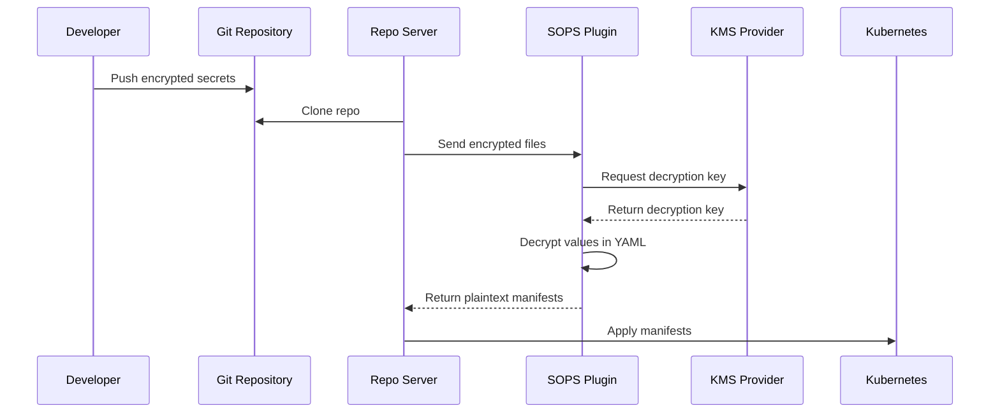

# How to Use SOPS Config Management Plugin with ArgoCD

Author: [nawazdhandala](https://github.com/nawazdhandala)

Tags: ArgoCD, GitOps, Kubernetes, SOPS, Secrets Management

Description: Learn how to configure a SOPS Config Management Plugin for ArgoCD to decrypt encrypted secrets during manifest generation in your GitOps workflow.

---

Storing secrets in Git is one of the hardest problems in GitOps. You want everything in version control, but Kubernetes Secrets contain sensitive data that should never appear as plaintext in a repository. Mozilla SOPS solves this by encrypting only the values in your YAML files while keeping the keys readable, and with an ArgoCD Config Management Plugin, you can decrypt those secrets automatically during manifest generation.

This guide shows you how to set up SOPS as a CMP sidecar in ArgoCD, covering key management with AWS KMS, GCP KMS, Azure Key Vault, and age/PGP keys.

## How SOPS Works with ArgoCD

The workflow is straightforward:



The encrypted files look like normal YAML with encrypted values:

```yaml
apiVersion: v1
kind: Secret
metadata:
  name: database-credentials
type: Opaque
stringData:
  username: ENC[AES256_GCM,data:kD8jXw==,iv:...,tag:...,type:str]
  password: ENC[AES256_GCM,data:p8HjKvBfzQ==,iv:...,tag:...,type:str]
sops:
  kms:
    - arn: arn:aws:kms:us-east-1:123456789:key/abc-def-123
  version: 3.8.1
```

## Setting Up the SOPS Plugin

### Plugin Configuration

```yaml
# plugin.yaml
apiVersion: argoproj.io/v1alpha1
kind: ConfigManagementPlugin
metadata:
  name: sops-decrypt
spec:
  version: v1.0
  # No init needed for basic SOPS decryption
  generate:
    command: [sh, -c]
    args:
      - |
        set -euo pipefail

        # Process each YAML file in the directory
        for file in *.yaml *.yml; do
          [ -f "$file" ] || continue

          # Check if this file is SOPS-encrypted
          if grep -q "^sops:" "$file" 2>/dev/null; then
            # Decrypt the file
            sops --decrypt "$file"
          else
            # Pass through unencrypted files as-is
            cat "$file"
          fi

          # Add YAML document separator between files
          echo "---"
        done
  discover:
    find:
      # Match directories containing SOPS-encrypted files
      glob: "**/.sops.yaml"
```

### Building the Sidecar Image

```dockerfile
FROM alpine:3.19

# Install SOPS
ARG SOPS_VERSION=3.8.1
RUN apk add --no-cache curl bash gnupg && \
    curl -fsSL "https://github.com/getsops/sops/releases/download/v${SOPS_VERSION}/sops-v${SOPS_VERSION}.linux.amd64" \
      -o /usr/local/bin/sops && \
    chmod +x /usr/local/bin/sops

# Install age for age-key-based encryption
RUN apk add --no-cache age

# Install AWS CLI for KMS access (if using AWS KMS)
RUN apk add --no-cache aws-cli

# Copy ArgoCD CMP server
COPY --from=quay.io/argoproj/argocd:v2.10.0 \
    /usr/local/bin/argocd-cmp-server \
    /usr/local/bin/argocd-cmp-server

COPY plugin.yaml /home/argocd/cmp-server/config/plugin.yaml

USER 999
ENTRYPOINT ["/usr/local/bin/argocd-cmp-server"]
```

### Deploying with Key Management

The deployment depends on which KMS provider you use. Here are configurations for the most common options.

#### AWS KMS

If you are using AWS KMS, the sidecar needs AWS credentials. The cleanest approach is IRSA (IAM Roles for Service Accounts):

```yaml
apiVersion: apps/v1
kind: Deployment
metadata:
  name: argocd-repo-server
  namespace: argocd
spec:
  template:
    metadata:
      annotations:
        # Enable IRSA for AWS KMS access
        eks.amazonaws.com/role-arn: arn:aws:iam::123456789:role/argocd-sops-role
    spec:
      serviceAccountName: argocd-repo-server
      containers:
        - name: sops-plugin
          image: my-registry/argocd-sops:v1.0
          env:
            - name: AWS_REGION
              value: us-east-1
          volumeMounts:
            - name: var-files
              mountPath: /var/run/argocd
            - name: plugins
              mountPath: /home/argocd/cmp-server/plugins
            - name: cmp-tmp
              mountPath: /tmp
```

The IAM role needs this policy:

```json
{
  "Version": "2012-10-17",
  "Statement": [
    {
      "Effect": "Allow",
      "Action": [
        "kms:Decrypt",
        "kms:DescribeKey"
      ],
      "Resource": "arn:aws:kms:us-east-1:123456789:key/*"
    }
  ]
}
```

#### GCP KMS

For GCP KMS, mount a service account key or use Workload Identity:

```yaml
containers:
  - name: sops-plugin
    image: my-registry/argocd-sops:v1.0
    env:
      - name: GOOGLE_APPLICATION_CREDENTIALS
        value: /var/secrets/google/credentials.json
    volumeMounts:
      - name: gcp-credentials
        mountPath: /var/secrets/google
        readOnly: true
      - name: var-files
        mountPath: /var/run/argocd
      - name: plugins
        mountPath: /home/argocd/cmp-server/plugins
      - name: cmp-tmp
        mountPath: /tmp
volumes:
  - name: gcp-credentials
    secret:
      secretName: gcp-sops-credentials
```

#### Age Keys

Age is the simplest option and does not require cloud infrastructure. Store the age secret key in a Kubernetes secret:

```bash
# Generate an age key pair
age-keygen -o age-key.txt

# Create a Kubernetes secret with the private key
kubectl create secret generic sops-age-key \
  -n argocd \
  --from-file=keys.txt=age-key.txt
```

Mount it in the sidecar:

```yaml
containers:
  - name: sops-plugin
    image: my-registry/argocd-sops:v1.0
    env:
      # Tell SOPS where to find the age key
      - name: SOPS_AGE_KEY_FILE
        value: /home/argocd/.config/sops/age/keys.txt
    volumeMounts:
      - name: sops-age-key
        mountPath: /home/argocd/.config/sops/age
        readOnly: true
      - name: var-files
        mountPath: /var/run/argocd
      - name: plugins
        mountPath: /home/argocd/cmp-server/plugins
      - name: cmp-tmp
        mountPath: /tmp
volumes:
  - name: sops-age-key
    secret:
      secretName: sops-age-key
```

## Encrypting Files for Use with the Plugin

Set up a `.sops.yaml` configuration in your repository root to define encryption rules:

```yaml
# .sops.yaml
creation_rules:
  # Encrypt only files matching these patterns
  - path_regex: \.enc\.yaml$
    age: age1xxxxxxxxxxxxxxxxxxxxxxxxxxxxxxxxxxxxxxxxxxxxxxxxxxxxxxxx

  # Or use AWS KMS
  - path_regex: secrets/.*\.yaml$
    kms: arn:aws:kms:us-east-1:123456789:key/abc-def-123

  # Or use GCP KMS
  - path_regex: secrets/.*\.yaml$
    gcp_kms: projects/my-project/locations/global/keyRings/sops/cryptoKeys/sops-key
```

Encrypt your secrets:

```bash
# Encrypt a file
sops --encrypt --in-place secrets/database.yaml

# Verify it is encrypted
cat secrets/database.yaml
# Values should show ENC[...] markers

# You can still edit encrypted files
sops secrets/database.yaml
# Opens in your editor with decrypted values
# Re-encrypts on save
```

## Combining SOPS with Helm or Kustomize

For more advanced setups, you can chain SOPS decryption with Helm or Kustomize:

```yaml
# plugin.yaml for sops + kustomize
apiVersion: argoproj.io/v1alpha1
kind: ConfigManagementPlugin
metadata:
  name: sops-kustomize
spec:
  version: v1.0
  init:
    command: [sh, -c]
    args:
      - |
        # Decrypt all SOPS-encrypted files in place before Kustomize runs
        find . -name "*.enc.yaml" -o -name "*.enc.yml" | while read -r file; do
          decrypted="${file%.enc.yaml}.yaml"
          decrypted="${decrypted%.enc.yml}.yml"
          sops --decrypt "$file" > "$decrypted"
        done
  generate:
    command: [sh, -c]
    args:
      - |
        kustomize build .
```

## Creating the Application

```yaml
apiVersion: argoproj.io/v1alpha1
kind: Application
metadata:
  name: my-app-with-secrets
  namespace: argocd
spec:
  project: default
  source:
    repoURL: https://github.com/myorg/k8s-secrets.git
    targetRevision: main
    path: environments/production
    plugin:
      name: sops-decrypt
  destination:
    server: https://kubernetes.default.svc
    namespace: my-app
```

## Security Considerations

- The decrypted secrets only exist in memory during manifest generation. They are never written to disk on the repo-server.
- Use RBAC to restrict which ArgoCD projects can use the SOPS plugin.
- Rotate your KMS keys regularly and re-encrypt your SOPS files when you do.
- Consider using separate KMS keys for different environments (dev, staging, production).

## Summary

The SOPS CMP plugin lets you store encrypted secrets directly in Git while ArgoCD handles decryption transparently during manifest generation. Whether you use AWS KMS, GCP KMS, Azure Key Vault, or simple age keys, the pattern is the same: encrypt values with SOPS, push to Git, and let the plugin decrypt them when ArgoCD generates manifests. This gives you the full GitOps experience for secrets without compromising security.
