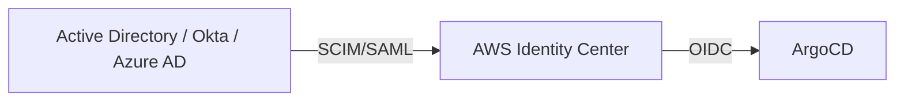
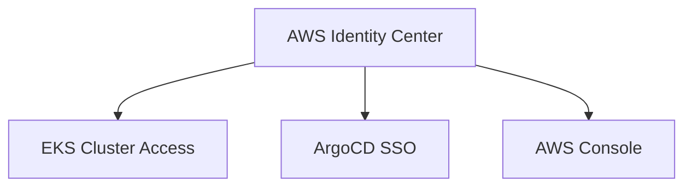

# How to Configure SSO with AWS Identity Center in ArgoCD

Author: [nawazdhandala](https://github.com/nawazdhandala)

Tags: ArgoCD, GitOps, Kubernetes, AWS, SSO

Description: Step-by-step guide to configuring AWS Identity Center (formerly AWS SSO) as the OIDC identity provider for ArgoCD on EKS and other Kubernetes clusters.

---

AWS Identity Center (formerly AWS Single Sign-On or AWS SSO) is the recommended service for managing workforce identity and access across AWS accounts and applications. If your organization uses AWS Identity Center to manage user access to AWS resources, integrating it with ArgoCD provides a consistent authentication experience for your DevOps team.

This guide covers how to configure ArgoCD to use AWS Identity Center as its OIDC identity provider, including group-based RBAC.

## AWS Identity Center Overview

AWS Identity Center provides:

- Centralized identity management for AWS accounts and applications
- Integration with external identity providers (Active Directory, Okta, Azure AD)
- SAML 2.0 and OIDC application support
- Group-based access management
- Free to use with any AWS account

As of 2024, AWS Identity Center supports custom OIDC applications, which is what ArgoCD uses.

## Prerequisites

- An AWS account with AWS Identity Center enabled
- ArgoCD v2.0+ running in Kubernetes (EKS or any other cluster)
- Admin access to AWS Identity Center
- Users and groups already configured in AWS Identity Center

## Step 1: Create a Custom OIDC Application in AWS Identity Center

1. Log into the AWS Management Console
2. Navigate to **AWS Identity Center**
3. Go to **Applications**
4. Click **Add application**
5. Select **I have an application I want to set up** and then **OAuth 2.0**
6. Click **Next**
7. Configure the application:
   - **Application name**: `ArgoCD`
   - **Description**: `GitOps deployment platform`
   - **Application URL**: `https://argocd.example.com`

8. Under **OAuth 2.0 settings**:
   - **Application type**: Web application
   - **Grant types**: Authorization code
   - **Redirect URLs**: `https://argocd.example.com/auth/callback`
   - **Scopes**: `openid`, `profile`, `email`

9. Click **Submit**

Note the following values from the application details:
- **Application ARN**
- **OIDC Issuer URL**: e.g., `https://identitycenter.amazonaws.com/ssoins-xxxxxxxxxxxx`
- **Client ID**

10. Generate a client secret:
    - In the application settings, generate credentials
    - Note the **Client Secret**

## Step 2: Assign Users and Groups

1. In the application, go to **Assigned users and groups**
2. Click **Assign users and groups**
3. Select the groups that should have ArgoCD access:
   - `PlatformAdmins`
   - `Developers`
   - `DevOps`
4. Click **Assign**

## Step 3: Configure Group Claims

AWS Identity Center can include group membership in OIDC tokens. Configure attribute mappings:

1. In the application settings, go to **Attribute mappings**
2. Add a mapping:
   - **Application attribute**: `groups`
   - **Maps to**: Select **Groups**
   - **Format**: String

This ensures that when users authenticate, their group memberships are included in the ID token.

## Step 4: Configure ArgoCD

Edit the `argocd-cm` ConfigMap:

```yaml
apiVersion: v1
kind: ConfigMap
metadata:
  name: argocd-cm
  namespace: argocd
data:
  url: https://argocd.example.com
  oidc.config: |
    name: AWS Identity Center
    issuer: https://identitycenter.amazonaws.com/ssoins-xxxxxxxxxxxx
    clientID: your-client-id
    clientSecret: $oidc.aws.clientSecret
    requestedScopes:
      - openid
      - profile
      - email
    requestedIDTokenClaims:
      groups:
        essential: true
```

Store the client secret:

```bash
kubectl -n argocd patch secret argocd-secret --type merge -p '
{
  "stringData": {
    "oidc.aws.clientSecret": "your-aws-identity-center-client-secret"
  }
}'
```

## Step 5: Configure RBAC

Map AWS Identity Center groups to ArgoCD roles:

```yaml
apiVersion: v1
kind: ConfigMap
metadata:
  name: argocd-rbac-cm
  namespace: argocd
data:
  policy.default: role:readonly
  policy.csv: |
    # AWS Identity Center groups
    g, PlatformAdmins, role:admin
    g, DevOps, role:admin

    # Developers get limited deploy access
    p, role:developer, applications, get, */*, allow
    p, role:developer, applications, sync, staging/*, allow
    p, role:developer, applications, sync, dev/*, allow
    p, role:developer, applications, create, dev/*, allow
    g, Developers, role:developer

  scopes: '[groups]'
```

## Step 6: Restart and Test

```bash
kubectl -n argocd rollout restart deployment argocd-server
```

Test the login:

1. Open `https://argocd.example.com`
2. Click **Login via AWS Identity Center**
3. You will be redirected to the AWS Identity Center login page
4. Authenticate with your credentials (which may redirect to your external IdP if configured)
5. Verify you are returned to ArgoCD with the correct permissions

## Using Dex as an Alternative

If the direct OIDC approach does not meet your needs (for example, if AWS Identity Center's OIDC implementation does not include groups in the token), you can use Dex with a generic OIDC connector:

```yaml
apiVersion: v1
kind: ConfigMap
metadata:
  name: argocd-cm
  namespace: argocd
data:
  url: https://argocd.example.com
  dex.config: |
    connectors:
      - type: oidc
        id: aws-identity-center
        name: AWS Identity Center
        config:
          issuer: https://identitycenter.amazonaws.com/ssoins-xxxxxxxxxxxx
          clientID: your-client-id
          clientSecret: $dex.aws.clientSecret
          redirectURI: https://argocd.example.com/api/dex/callback
          scopes:
            - openid
            - profile
            - email
          getUserInfo: true
          insecureSkipEmailVerified: true
```

When using Dex, update the redirect URL in AWS Identity Center to `https://argocd.example.com/api/dex/callback`.

## Integration with External Identity Sources

AWS Identity Center often connects to external identity providers:

- **Active Directory** via AWS Directory Service or AD Connector
- **Okta** via SCIM provisioning
- **Azure AD** via SCIM provisioning
- **External SAML providers**

The flow looks like this:



Users and groups synced from the external provider appear in AWS Identity Center and can be assigned to the ArgoCD application. The group names in ArgoCD's RBAC should match the group names as they appear in AWS Identity Center (which may differ from the source system).

## EKS-Specific Considerations

If ArgoCD runs on Amazon EKS, you may want to align ArgoCD authentication with your existing EKS access patterns:

### Using the Same Identity Center for EKS and ArgoCD

AWS Identity Center can provide access to both EKS clusters (via EKS access entries or `aws-auth` ConfigMap) and ArgoCD. This creates a unified access model:



### Network Connectivity

Make sure the ArgoCD server pod can reach the AWS Identity Center OIDC endpoints. If your EKS cluster uses private subnets without internet access, you may need:

- A NAT Gateway for outbound internet access
- VPC endpoints for AWS Identity Center (if available)
- A proxy configuration in ArgoCD

## Troubleshooting

### "Invalid issuer" Error

The issuer URL must match exactly. Find the correct URL:

1. Go to AWS Identity Center settings
2. Look for the **Identity Center instance ARN**
3. The issuer URL format is typically `https://identitycenter.amazonaws.com/ssoins-xxxxxxxxxxxx`

You can also check the OIDC discovery endpoint:

```bash
curl https://identitycenter.amazonaws.com/ssoins-xxxxxxxxxxxx/.well-known/openid-configuration
```

### Groups Not Working

1. Verify the attribute mapping is configured in the AWS Identity Center application
2. Check that users are assigned to groups in AWS Identity Center
3. Check that the groups are assigned to the application
4. Inspect the token claims by checking ArgoCD server logs:
```bash
kubectl -n argocd logs deploy/argocd-server | grep -i "groups\|claims"
```

### "Access Denied" from AWS Identity Center

Make sure:
- The user is assigned to the ArgoCD application (directly or via group)
- The application is active and not in a pending state
- The redirect URI matches exactly

### Token Expiry Issues

AWS Identity Center tokens have a configurable lifetime. If users are being logged out frequently:
- Increase the session duration in AWS Identity Center settings
- Configure ArgoCD's token refresh settings

## Summary

AWS Identity Center integrates with ArgoCD through OIDC, providing centralized authentication that aligns with your existing AWS access management. The setup is particularly appealing for organizations running ArgoCD on EKS, as it creates a unified identity model across AWS services and Kubernetes tools. Group-based RBAC lets you manage ArgoCD permissions through the same groups you use for AWS account access.

For more on ArgoCD SSO, see [How to Configure ArgoCD SSO](https://oneuptime.com/blog/post/2026-01-27-argocd-sso/view).
