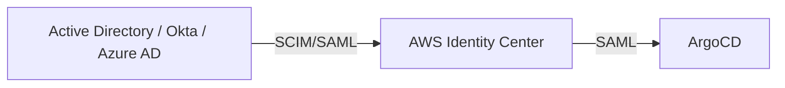
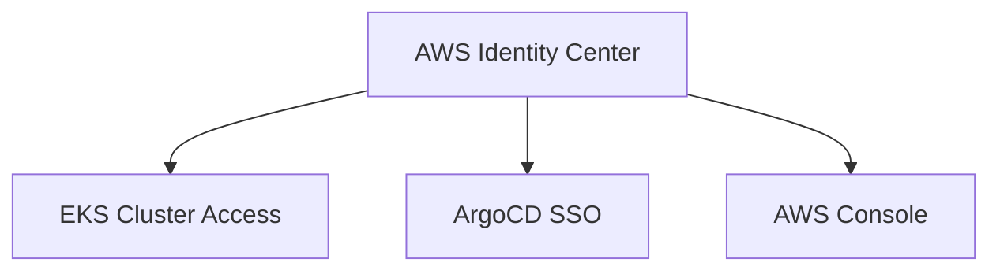

# How to Configure SSO with AWS Identity Center in ArgoCD

Author: [nawazdhandala](https://github.com/nawazdhandala)

Tags: ArgoCD, GitOps, Kubernetes, AWS, SSO

Description: Step-by-step guide to configuring AWS Identity Center (formerly AWS SSO) as the OIDC identity provider for ArgoCD on EKS and other Kubernetes clusters.

---

AWS Identity Center (formerly AWS Single Sign-On or AWS SSO) is the recommended service for managing workforce identity and access across AWS accounts and applications. If your organization uses AWS Identity Center to manage user access to AWS resources, integrating it with ArgoCD provides a consistent authentication experience for your DevOps team.

This guide covers how to configure ArgoCD to use AWS Identity Center as its SAML identity provider through ArgoCD's bundled Dex service, including group-based RBAC.

## AWS Identity Center Overview

AWS Identity Center provides:

- Centralized identity management for AWS accounts and applications
- Integration with external identity providers (Active Directory, Okta, Azure AD)
- SAML 2.0 application support
- Group-based access management
- Free to use with any AWS account

AWS Identity Center supports customer managed SAML 2.0 applications. Its OAuth 2.0 support is designed for AWS-supported OAuth flows and trusted identity propagation, not for configuring ArgoCD directly as a generic OIDC relying party.

## Prerequisites

- An AWS account with AWS Identity Center enabled
- ArgoCD v2.0+ running in Kubernetes (EKS or any other cluster)
- Admin access to AWS Identity Center
- Users and groups already configured in AWS Identity Center

## Step 1: Create a Custom SAML 2.0 Application in AWS Identity Center

1. Log into the AWS Management Console
2. Navigate to **AWS Identity Center**
3. Go to **Applications**
4. Click **Add application**
5. Select **I have an application I want to set up** and then **SAML 2.0**
6. Click **Next**
7. Configure the application:
   - **Application name**: `ArgoCD`
   - **Description**: `GitOps deployment platform`
   - **Application start URL**: `https://argocd.example.com`

8. Under **IAM Identity Center metadata**, download the metadata file and certificate
9. Under **Application metadata**, manually type the service provider values:
   - **Application ACS URL**: `https://argocd.example.com/api/dex/callback`
   - **Application SAML audience**: `https://argocd.example.com/api/dex/callback`

10. Click **Submit**

Note the following values from the application details:
- **Application ARN**
- **IAM Identity Center SAML metadata file**
- **IAM Identity Center certificate**
- **IAM Identity Center sign-in URL**

## Step 2: Assign Users and Groups

1. In the application, go to **Assigned users and groups**
2. Click **Assign users and groups**
3. Select the groups that should have ArgoCD access:
   - `PlatformAdmins`
   - `Developers`
   - `DevOps`
4. Click **Assign**

## Step 3: Configure SAML Attributes

AWS Identity Center can include user attributes in the SAML assertion. Configure attribute mappings:

1. In the application settings, go to **Attribute mappings**
2. Add mappings for the attributes Dex will read:
   - **Application attribute**: `email`, **Maps to**: `${user:email}`, **Format**: `basic`
   - **Application attribute**: `name`, **Maps to**: `${user:name}`, **Format**: `basic`
   - **Application attribute**: `groups`, **Maps to**: the group attribute available from your identity source, **Format**: `basic`

This ensures that when users authenticate, the SAML assertion contains the attributes Dex maps into ArgoCD's OIDC claims. The exact group mapping available in IAM Identity Center depends on your identity source and provisioning configuration.

## Step 4: Configure ArgoCD

Edit the `argocd-cm` ConfigMap:

```yaml
apiVersion: v1
kind: ConfigMap
metadata:
  name: argocd-cm
  namespace: argocd
data:
  url: https://argocd.example.com
  dex.config: |
    connectors:
      - type: saml
        id: aws-identity-center
        name: AWS Identity Center
        config:
          ssoURL: https://portal.sso.<region>.amazonaws.com/saml/assertion/<application-id>
          caData: <base64-encoded-iam-identity-center-certificate>
          redirectURI: https://argocd.example.com/api/dex/callback
          usernameAttr: name
          emailAttr: email
          groupsAttr: groups
          entityIssuer: https://argocd.example.com/api/dex/callback
```

Use the sign-in URL and certificate from the AWS Identity Center SAML metadata. `caData` should contain the base64-encoded PEM certificate file.

If your organization uses an external OIDC provider such as Okta, Microsoft Entra ID, or Amazon Cognito, you can also configure that provider directly with ArgoCD:

```yaml
apiVersion: v1
kind: ConfigMap
metadata:
  name: argocd-cm
  namespace: argocd
data:
  url: https://argocd.example.com
  oidc.config: |
    name: External OIDC
    issuer: https://your-oidc-provider.example.com
    clientID: your-client-id
    clientSecret: $oidc.provider.clientSecret
    requestedScopes:
      - openid
      - profile
      - email
    requestedIDTokenClaims:
      groups:
        essential: true
```

Store the client secret only when you use a direct OIDC provider:

```bash
kubectl -n argocd patch secret argocd-secret --type merge -p '
{
  "stringData": {
    "oidc.provider.clientSecret": "your-oidc-client-secret"
  }
}'
```

## Step 5: Configure RBAC

Map AWS Identity Center groups to ArgoCD roles:

```yaml
apiVersion: v1
kind: ConfigMap
metadata:
  name: argocd-rbac-cm
  namespace: argocd
data:
  policy.default: role:readonly
  policy.csv: |
    # AWS Identity Center groups
    g, PlatformAdmins, role:admin
    g, DevOps, role:admin

    # Developers get limited deploy access
    p, role:developer, applications, get, */*, allow
    p, role:developer, applications, sync, staging/*, allow
    p, role:developer, applications, sync, dev/*, allow
    p, role:developer, applications, create, dev/*, allow
    g, Developers, role:developer

  scopes: '[groups]'
```

## Step 6: Restart and Test

```bash
kubectl -n argocd rollout restart deployment argocd-server
```

Test the login:

1. Open `https://argocd.example.com`
2. Click **Login via AWS Identity Center**
3. You will be redirected to the AWS Identity Center login page
4. Authenticate with your credentials (which may redirect to your external IdP if configured)
5. Verify you are returned to ArgoCD with the correct permissions

## Using External OIDC as an Alternative

If your organization's upstream identity provider supports OIDC directly, you can bypass AWS Identity Center and use Dex with a generic OIDC connector:

```yaml
apiVersion: v1
kind: ConfigMap
metadata:
  name: argocd-cm
  namespace: argocd
data:
  url: https://argocd.example.com
  dex.config: |
    connectors:
      - type: oidc
        id: external-oidc
        name: External OIDC
        config:
          issuer: https://your-oidc-provider.example.com
          clientID: your-client-id
          clientSecret: $dex.oidc.clientSecret
          redirectURI: https://argocd.example.com/api/dex/callback
          insecureEnableGroups: true
          scopes:
            - openid
            - profile
            - email
            - groups
          getUserInfo: true
```

When using Dex with an external OIDC provider, register the redirect URL `https://argocd.example.com/api/dex/callback` in that provider.

## Integration with External Identity Sources

AWS Identity Center often connects to external identity providers:

- **Active Directory** via AWS Directory Service or AD Connector
- **Okta** via SCIM provisioning
- **Azure AD** via SCIM provisioning
- **External SAML providers**

The flow looks like this:


```mermaid
flowchart LR
    AD[Active Directory / Okta / Azure AD] -->|SCIM/SAML| AWSIC[AWS Identity Center]
    AWSIC -->|SAML| ArgoCD
```

Users and groups synced from the external provider appear in AWS Identity Center and can be assigned to the ArgoCD application. The group names in ArgoCD's RBAC should match the values Dex receives in the SAML `groups` attribute (which may differ from the source system).

## EKS-Specific Considerations

If ArgoCD runs on Amazon EKS, you may want to align ArgoCD authentication with your existing EKS access patterns:

### Using the Same Identity Center for EKS and ArgoCD

AWS Identity Center can provide access to AWS accounts that contain EKS clusters through permission sets. Those permission sets create IAM roles that you can map to EKS access entries or the legacy `aws-auth` ConfigMap, while ArgoCD access is handled through the SAML application. This creates a unified access model:


```mermaid
flowchart TD
    AWSIC[AWS Identity Center] --> EKS[EKS Cluster Access]
    AWSIC --> ArgoCD[ArgoCD SSO]
    AWSIC --> Console[AWS Console]
```

### Network Connectivity

Make sure the ArgoCD server pod can reach the AWS Identity Center SAML endpoints. If your EKS cluster uses private subnets without internet access, you may need:

- A NAT Gateway for outbound internet access
- Public connectivity to the IAM Identity Center SAML endpoints; VPC endpoints for Identity Store APIs do not replace browser or SAML sign-in endpoint access
- A proxy configuration in ArgoCD

## Troubleshooting

### SAML Audience or Destination Errors

The SAML audience and destination must match exactly:

1. In AWS Identity Center, verify the **Application ACS URL** is `https://argocd.example.com/api/dex/callback`
2. Verify the **Application SAML audience** matches Dex's `entityIssuer`
3. Verify `redirectURI` in `dex.config` is also `https://argocd.example.com/api/dex/callback`

### Groups Not Working

1. Verify the SAML attribute mapping is configured in the AWS Identity Center application
2. Check that users are assigned to groups in AWS Identity Center
3. Check that the groups are assigned to the application
4. Inspect the Dex and ArgoCD token claims by checking ArgoCD server logs:
```bash
kubectl -n argocd logs deploy/argocd-server | grep -i "groups\|claims"
```

### "Access Denied" from AWS Identity Center

Make sure:
- The user is assigned to the ArgoCD application (directly or via group)
- The application is active and not in a pending state
- The redirect URI matches exactly

### Token Expiry Issues

SAML-based Dex logins do not support refresh tokens. If users are being logged out frequently:
- Increase the session duration in AWS Identity Center settings
- Review ArgoCD's session duration settings

## Summary

AWS Identity Center integrates with ArgoCD through SAML and Dex, providing centralized authentication that aligns with your existing AWS access management. The setup is particularly appealing for organizations running ArgoCD on EKS, as it creates a unified identity model across AWS services and Kubernetes tools. Group-based RBAC lets you manage ArgoCD permissions through the same groups you use for AWS account access.

For more on ArgoCD SSO, see [How to Configure ArgoCD SSO](https://oneuptime.com/blog/post/2026-01-27-argocd-sso/view).
