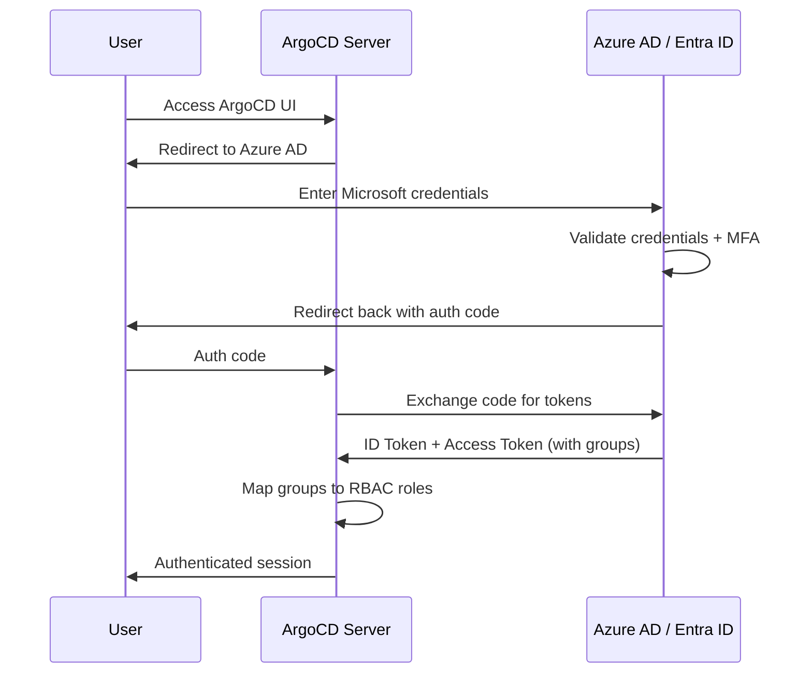

# How to Configure SSO with Azure AD (Entra ID) in ArgoCD

Author: [nawazdhandala](https://github.com/nawazdhandala)

Tags: ArgoCD, GitOps, Kubernetes, Azure AD, SSO

Description: Complete guide to setting up Single Sign-On with Azure AD (now Microsoft Entra ID) in ArgoCD, including app registration, group claims, and RBAC mapping.

---

Microsoft Entra ID (formerly Azure Active Directory or Azure AD) is the identity platform for organizations using Microsoft 365, Azure, and the broader Microsoft ecosystem. If your team already uses Azure AD for authentication, integrating it with ArgoCD means your developers can sign in with their existing Microsoft accounts and have their group memberships automatically mapped to ArgoCD roles.

This guide covers the complete setup process, from Azure app registration to RBAC configuration.

## Overview of the Integration

The integration works through OIDC (OpenID Connect). ArgoCD redirects users to Azure AD for authentication, Azure AD validates credentials and returns a token containing the user's identity and group memberships, and ArgoCD uses that information to authorize the user.



## Step 1: Register an Application in Azure AD

1. Log into the [Azure Portal](https://portal.azure.com)
2. Navigate to **Microsoft Entra ID > App registrations**
3. Click **New registration**
4. Configure the registration:
   - **Name**: `ArgoCD`
   - **Supported account types**: Select based on your organization (typically "Accounts in this organizational directory only")
   - **Redirect URI**: Select **Web** and enter `https://argocd.example.com/auth/callback`
5. Click **Register**

Note the following from the overview page:
- **Application (client) ID**: e.g., `12345678-1234-1234-1234-123456789012`
- **Directory (tenant) ID**: e.g., `abcdefgh-abcd-abcd-abcd-abcdefghijkl`

## Step 2: Create a Client Secret

1. In the app registration, go to **Certificates & secrets**
2. Click **New client secret**
3. Add a description (e.g., "ArgoCD SSO") and select an expiration period
4. Click **Add**
5. Copy the **Value** immediately (it will not be shown again)

## Step 3: Configure API Permissions

1. Go to **API permissions**
2. Click **Add a permission**
3. Select **Microsoft Graph**
4. Select **Delegated permissions**
5. Add these permissions:
   - `openid`
   - `profile`
   - `email`
   - `User.Read`
6. Click **Add permissions**
7. Click **Grant admin consent** (required for the permissions to take effect)

## Step 4: Configure Group Claims

To include group memberships in the token:

1. Go to **Token configuration**
2. Click **Add groups claim**
3. Select the group types to include:
   - **Security groups** (recommended)
   - **Directory roles** (if needed)
   - **All groups** (can cause large token size in organizations with many groups)
4. Under **Customize token properties by type**, for **ID** tokens, select **Group ID** (default) or **sAMAccountName** if available
5. Click **Add**

Important: By default, Azure AD includes group Object IDs (GUIDs) in the token, not group names. This means your RBAC rules will use GUIDs like `a1b2c3d4-e5f6-7890-abcd-ef1234567890` instead of friendly names.

### Using Group Names Instead of GUIDs

If you want human-readable group names in ArgoCD RBAC, you have two options:

**Option A: Configure Azure AD to emit group names** (requires Azure AD Premium P1)

In Token configuration, change the group claim to emit `sAMAccountName` or `Display Name` instead of Object IDs.

**Option B: Use Dex with Azure AD connector** (works with any Azure AD tier)

Dex can transform group GUIDs into display names. See the Dex section later in this guide.

## Step 5: Configure ArgoCD

Edit the `argocd-cm` ConfigMap:

```yaml
apiVersion: v1
kind: ConfigMap
metadata:
  name: argocd-cm
  namespace: argocd
data:
  url: https://argocd.example.com
  oidc.config: |
    name: Azure AD
    issuer: https://login.microsoftonline.com/TENANT_ID/v2.0
    clientID: CLIENT_ID
    clientSecret: $oidc.azure.clientSecret
    requestedScopes:
      - openid
      - profile
      - email
    requestedIDTokenClaims:
      groups:
        essential: true
```

Replace `TENANT_ID` with your Azure AD tenant ID and `CLIENT_ID` with your application client ID.

Store the client secret:

```bash
kubectl -n argocd patch secret argocd-secret --type merge -p '
{
  "stringData": {
    "oidc.azure.clientSecret": "your-client-secret-value"
  }
}'
```

## Step 6: Configure RBAC with Azure AD Groups

Map Azure AD groups to ArgoCD roles in `argocd-rbac-cm`:

```yaml
apiVersion: v1
kind: ConfigMap
metadata:
  name: argocd-rbac-cm
  namespace: argocd
data:
  policy.default: role:readonly
  policy.csv: |
    # Using Azure AD group Object IDs (GUIDs)
    # "Platform Engineering" group - admin access
    g, a1b2c3d4-e5f6-7890-abcd-ef1234567890, role:admin

    # "Backend Developers" group - deploy access to staging
    p, role:backend-dev, applications, get, */*, allow
    p, role:backend-dev, applications, sync, staging/*, allow
    g, b2c3d4e5-f6a7-8901-bcde-f12345678901, role:backend-dev

    # "SRE Team" group - admin access
    g, c3d4e5f6-a7b8-9012-cdef-123456789012, role:admin

  scopes: '[groups]'
```

If your Azure AD emits group names instead of GUIDs:

```yaml
  policy.csv: |
    g, Platform Engineering, role:admin
    g, Backend Developers, role:backend-dev
    g, SRE Team, role:admin
  scopes: '[groups]'
```

## Step 7: Restart and Test

```bash
# Restart ArgoCD server
kubectl -n argocd rollout restart deployment argocd-server
```

Test the login:

1. Open `https://argocd.example.com`
2. Click **Login via Azure AD**
3. Authenticate with your Microsoft account
4. Verify you have the expected access level

Test with CLI:

```bash
argocd login argocd.example.com --sso
argocd account get-user-info
```

## Handling the Group Overage Claim

Azure AD has a limit of 200 groups per token. If a user belongs to more than 200 groups, Azure AD returns a "group overage claim" instead of the actual groups. This means the groups will be missing from the token.

To handle this, you have two approaches:

### Approach 1: Filter Groups in Azure AD

In the App registration under **Token configuration**, configure the groups claim to only include groups assigned to the application:

1. Go to **Enterprise applications** (not App registrations)
2. Find your ArgoCD app
3. Go to **Properties**
4. Set **Assignment required** to **Yes**
5. Go to **Users and groups**
6. Assign only the groups that need ArgoCD access

Then in **Token configuration**, select "Groups assigned to the application" instead of "All groups."

### Approach 2: Use Dex with Microsoft Connector

Dex can use the Microsoft Graph API to resolve groups, bypassing the token size limit:

```yaml
apiVersion: v1
kind: ConfigMap
metadata:
  name: argocd-cm
  namespace: argocd
data:
  url: https://argocd.example.com
  dex.config: |
    connectors:
      - type: microsoft
        id: microsoft
        name: Azure AD
        config:
          clientID: CLIENT_ID
          clientSecret: $dex.azure.clientSecret
          tenant: TENANT_ID
          redirectURI: https://argocd.example.com/api/dex/callback
          groups:
            - Platform Engineering
            - Backend Developers
            - SRE Team
          # Use group names instead of IDs
          useGroupDisplayName: true
```

## Troubleshooting

### "AADSTS50011: The redirect URI does not match"

The redirect URI registered in Azure AD does not match the one ArgoCD sends. Make sure:
- The `url` in `argocd-cm` matches your ArgoCD external URL exactly
- The redirect URI in Azure AD is `<url>/auth/callback` (for OIDC) or `<url>/api/dex/callback` (for Dex)

### "AADSTS700016: Application not found in tenant"

The client ID or tenant ID is wrong. Double-check both values.

### Users Get "Forbidden" After Login

The user authenticated successfully but has no permissions. Check:
- The groups claim is present in the token
- The group IDs in RBAC match the Azure AD group Object IDs
- The `scopes: '[groups]'` is set in `argocd-rbac-cm`

### Token Size Too Large (HTTP 431)

If users belong to many groups, the token can exceed HTTP header limits. Solutions:
- Filter groups as described in the overage section
- Use Dex with the Microsoft connector
- Increase the HTTP header size limit in your ingress controller

## Summary

Azure AD (Entra ID) integrates well with ArgoCD through OIDC. The main complexity is around group claims - Azure AD uses GUIDs by default and has a 200-group limit per token. For most organizations, the direct OIDC approach works fine. For larger organizations with many groups, using Dex with the Microsoft connector provides better group resolution.

For general ArgoCD SSO concepts, see [How to Configure ArgoCD SSO](https://oneuptime.com/blog/post/2026-01-27-argocd-sso/view).
