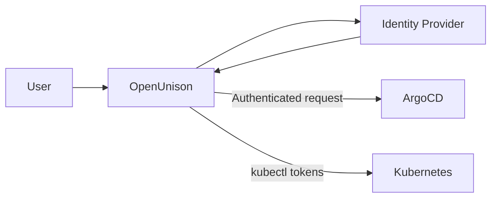

# How to Configure SSO with OpenUnison in ArgoCD

Author: [nawazdhandala](https://github.com/nawazdhandala)

Tags: ArgoCD, GitOps, Kubernetes, OpenUnison, SSO

Description: Learn how to integrate OpenUnison with ArgoCD for SSO, providing identity-aware reverse proxy, just-in-time provisioning, and multi-cluster authentication.

---

OpenUnison is an open-source identity management platform designed specifically for Kubernetes environments. Unlike general-purpose identity providers like Okta or Keycloak, OpenUnison focuses on Kubernetes-native workflows. It provides an identity-aware reverse proxy, just-in-time namespace provisioning, and integration with kubectl and the Kubernetes dashboard.

If your organization already uses OpenUnison for Kubernetes authentication, integrating it with ArgoCD gives you a consistent identity layer across all your cluster management tools.

## Why OpenUnison for ArgoCD

OpenUnison brings several Kubernetes-specific advantages:

- **Identity-aware reverse proxy** - OpenUnison sits in front of ArgoCD, handling authentication before requests reach the ArgoCD server
- **Just-in-time access** - Users can request temporary elevated access that automatically expires
- **Multi-cluster SSO** - A single OpenUnison instance can provide SSO across multiple ArgoCD instances and Kubernetes clusters
- **Integration with upstream IdPs** - OpenUnison connects to Active Directory, LDAP, Okta, Azure AD, and other providers

## Architecture Overview

When OpenUnison sits in front of ArgoCD, the authentication flow changes:



There are two integration patterns:

1. **Reverse proxy mode** - OpenUnison handles authentication and proxies requests to ArgoCD
2. **OIDC mode** - ArgoCD uses OpenUnison as its OIDC provider

This guide covers both approaches.

## Method 1: OpenUnison as OIDC Provider

This is the simpler approach where ArgoCD uses OpenUnison as its OIDC identity provider.

### Step 1: Configure OpenUnison Trust

In your OpenUnison configuration, add ArgoCD as a trusted client. This is typically done in the OpenUnison Helm values:

```yaml
# openunison-values.yaml
openunison:
  non_secret_data:
    ARGOCD_URL: https://argocd.example.com

  apps:
    - name: argocd
      label: ArgoCD
      org: MyOrg
      badgeUrl: argocd
      injectToken: false
      azSuccessResponse: redirect
      azFailResponse: default
      azRules:
        - scope: filter
          constraint: "(groups=argocd-users)"
      results:
        auSuccess: redirect
        auFail: default
      urls:
        - hosts:
            - "#[ARGOCD_URL]"
          filterType: redirect
          uri: /
          azRules:
            - scope: filter
              constraint: "(groups=argocd-users)"
```

Register ArgoCD as an OIDC client in OpenUnison's trust configuration:

```yaml
# In OpenUnison trust configuration
trusts:
  - name: argocd
    clientID: argocd
    clientSecret: <generated-secret>
    redirectURI:
      - https://argocd.example.com/auth/callback
    publicEndpoint: true
    verifyRedirect: true
    mapGroups: true
```

### Step 2: Configure ArgoCD

Edit the `argocd-cm` ConfigMap to use OpenUnison as the OIDC provider:

```yaml
apiVersion: v1
kind: ConfigMap
metadata:
  name: argocd-cm
  namespace: argocd
data:
  url: https://argocd.example.com
  oidc.config: |
    name: OpenUnison
    issuer: https://openunison.example.com/auth/idp/argocd
    clientID: argocd
    clientSecret: $oidc.openunison.clientSecret
    requestedScopes:
      - openid
      - profile
      - email
      - groups
    requestedIDTokenClaims:
      groups:
        essential: true
```

Store the client secret:

```bash
kubectl -n argocd patch secret argocd-secret --type merge -p '
{
  "stringData": {
    "oidc.openunison.clientSecret": "your-openunison-client-secret"
  }
}'
```

### Step 3: Configure RBAC

Map OpenUnison groups to ArgoCD roles:

```yaml
apiVersion: v1
kind: ConfigMap
metadata:
  name: argocd-rbac-cm
  namespace: argocd
data:
  policy.default: ""
  policy.csv: |
    g, k8s-admins, role:admin
    g, argocd-developers, role:developer
    p, role:developer, applications, get, */*, allow
    p, role:developer, applications, sync, staging/*, allow
    g, argocd-viewers, role:readonly
  scopes: '[groups]'
```

## Method 2: OpenUnison as Reverse Proxy

In this mode, OpenUnison sits in front of ArgoCD and handles all authentication. ArgoCD trusts the identity information forwarded by OpenUnison.

### Step 1: Deploy OpenUnison with ArgoCD Integration

Use the OpenUnison Helm chart with ArgoCD integration enabled:

```yaml
# openunison-values.yaml
network:
  openunison_host: openunison.example.com
  dashboard_host: dashboard.example.com
  argocd_host: argocd.example.com
  api_server_host: api.example.com

services:
  enable_argocd: true
  argocd:
    # ArgoCD service name and port
    service_name: argocd-server
    namespace: argocd
    port: 443
```

Install OpenUnison:

```bash
helm upgrade --install openunison openunison/openunison-k8s-login-argocd \
  -n openunison \
  -f openunison-values.yaml
```

### Step 2: Configure ArgoCD for Proxy Authentication

When using the reverse proxy mode, configure ArgoCD to trust the headers that OpenUnison sends:

```yaml
apiVersion: v1
kind: ConfigMap
metadata:
  name: argocd-cm
  namespace: argocd
data:
  url: https://argocd.example.com
  # ArgoCD trusts OpenUnison's OIDC tokens
  oidc.config: |
    name: OpenUnison
    issuer: https://openunison.example.com/auth/idp/argocd
    clientID: argocd
    clientSecret: $oidc.openunison.clientSecret
    requestedScopes:
      - openid
      - profile
      - email
      - groups
```

### Step 3: Update Ingress

Route traffic through OpenUnison instead of directly to ArgoCD:

```yaml
apiVersion: networking.k8s.io/v1
kind: Ingress
metadata:
  name: argocd-ingress
  namespace: openunison
  annotations:
    nginx.ingress.kubernetes.io/backend-protocol: "HTTPS"
spec:
  rules:
    - host: argocd.example.com
      http:
        paths:
          - path: /
            pathType: Prefix
            backend:
              service:
                name: openunison-orchestra
                port:
                  number: 443
  tls:
    - hosts:
        - argocd.example.com
      secretName: argocd-tls
```

## Connecting OpenUnison to Upstream Identity Providers

OpenUnison typically connects to your existing identity provider. Common configurations:

### Active Directory / LDAP

```yaml
# In OpenUnison configuration
authentication:
  type: ldap
  config:
    host: ldap.example.com
    port: 636
    useSsl: true
    bindDn: CN=openunison,OU=ServiceAccounts,DC=example,DC=com
    baseDn: DC=example,DC=com
    userSearchFilter: (sAMAccountName=${login})
    groupSearchFilter: (member:1.2.840.113556.1.4.1941:=${userDN})
```

### Okta or Azure AD

OpenUnison can connect to Okta or Azure AD as an upstream OIDC provider, then present itself as the OIDC provider to ArgoCD. This adds features like just-in-time provisioning and temporary access that the upstream providers do not natively support for ArgoCD.

## Just-in-Time Access with OpenUnison

One of OpenUnison's unique features is just-in-time (JIT) access. Users can request temporary elevated access to ArgoCD:

1. User requests "deploy to production" access through OpenUnison's self-service portal
2. The request goes through an approval workflow
3. Once approved, the user's groups are temporarily updated to include production access
4. After the configured time period, the access is automatically revoked

This is configured in OpenUnison's workflow engine, not in ArgoCD itself.

## Troubleshooting

### ArgoCD Shows "Login Required" After Authentication

If OpenUnison authenticates the user but ArgoCD still shows the login page:
- Verify the OIDC issuer URL matches OpenUnison's actual issuer
- Check that the client ID and secret are correct
- Inspect OpenUnison's logs for token generation errors

### Groups Not Appearing

Check OpenUnison's group mapping configuration:
```bash
kubectl -n openunison logs deploy/openunison-orchestra | grep -i group
```

Make sure the upstream identity provider is returning group information to OpenUnison.

### Certificate Errors Between OpenUnison and ArgoCD

If the services are in different namespaces and use internal TLS:
```bash
# Add OpenUnison's CA to ArgoCD's trust store
kubectl -n argocd create configmap argocd-tls-certs-cm \
  --from-file=openunison.example.com=/path/to/openunison-ca.crt \
  --dry-run=client -o yaml | kubectl apply -f -
```

## Summary

OpenUnison provides a Kubernetes-native identity layer for ArgoCD, offering features like just-in-time access provisioning and identity-aware reverse proxying that general-purpose identity providers do not provide out of the box. Whether you use it as an OIDC provider or as a reverse proxy, OpenUnison acts as a bridge between your existing identity infrastructure and ArgoCD.

For more on ArgoCD SSO configuration, see [How to Configure ArgoCD SSO](https://oneuptime.com/blog/post/2026-01-27-argocd-sso/view).
