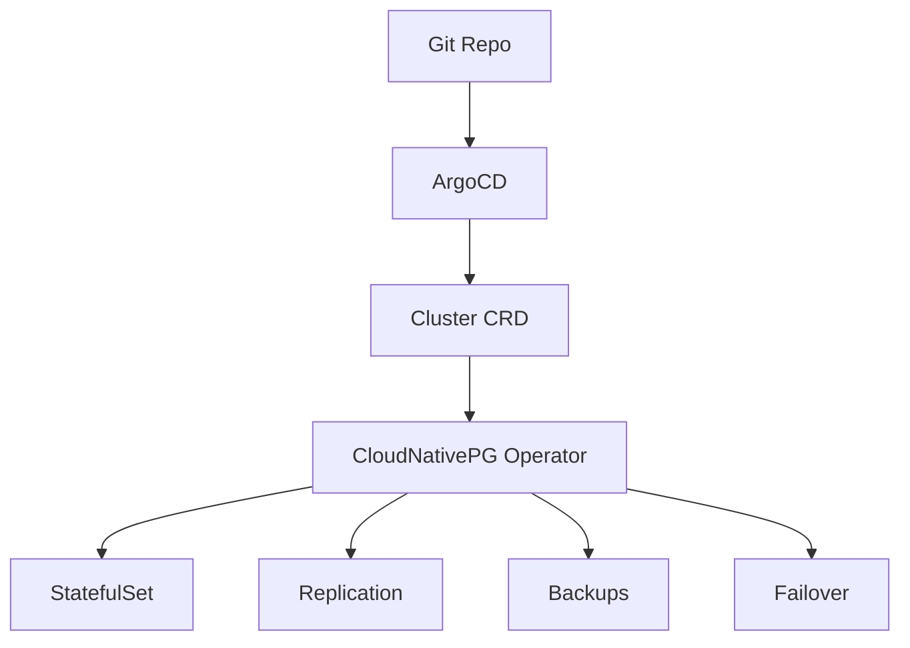

# How to Handle Stateful Applications with GitOps

Author: [nawazdhandala](https://github.com/nawazdhandala)

Tags: ArgoCD, GitOps, Kubernetes, StatefulSet, Persistent Storage

Description: Learn how to manage stateful applications like databases, message queues, and caches in GitOps workflows with ArgoCD, including PVC handling and backup strategies.

---

Stateful applications are the hardest part of Kubernetes, and they get even trickier with GitOps. Unlike stateless deployments where you can freely create, update, and delete pods, stateful applications carry data that must survive deployments, rollbacks, and even cluster failures.

This guide walks through practical patterns for managing stateful workloads with ArgoCD without losing data or your sanity.

## What Makes Stateful Applications Different

Stateful applications in Kubernetes typically involve:

- **StatefulSets** with ordered pod creation and stable network identities
- **PersistentVolumeClaims (PVCs)** that hold data across pod restarts
- **Headless Services** for direct pod addressing
- **Init scripts** that only run on first setup vs every restart

The challenge with GitOps is that ArgoCD manages the desired state declaratively. But stateful applications have runtime state that exists outside of Git. The PVC data, the database contents, the replication state - none of that is in your manifests.

## Pattern 1: StatefulSet with ArgoCD

Here is a basic PostgreSQL StatefulSet managed by ArgoCD:

```yaml
apiVersion: apps/v1
kind: StatefulSet
metadata:
  name: postgresql
spec:
  serviceName: postgresql
  replicas: 3
  selector:
    matchLabels:
      app: postgresql
  template:
    metadata:
      labels:
        app: postgresql
    spec:
      containers:
        - name: postgres
          image: postgres:16.2
          ports:
            - containerPort: 5432
          env:
            - name: POSTGRES_PASSWORD
              valueFrom:
                secretKeyRef:
                  name: postgres-credentials
                  key: password
            - name: PGDATA
              value: /var/lib/postgresql/data/pgdata
          volumeMounts:
            - name: data
              mountPath: /var/lib/postgresql/data
          resources:
            requests:
              memory: 512Mi
              cpu: 250m
            limits:
              memory: 1Gi
              cpu: 500m
  volumeClaimTemplates:
    - metadata:
        name: data
      spec:
        accessModes: ["ReadWriteOnce"]
        storageClassName: gp3
        resources:
          requests:
            storage: 50Gi
---
apiVersion: v1
kind: Service
metadata:
  name: postgresql
spec:
  clusterIP: None    # Headless service for StatefulSet
  selector:
    app: postgresql
  ports:
    - port: 5432
```

## Protecting PVCs During Sync

One of the biggest risks with stateful applications in ArgoCD is accidental PVC deletion. If ArgoCD prunes resources and deletes a PVC, your data is gone.

### Disable Pruning for Stateful Resources

Set sync options to prevent ArgoCD from deleting PVCs:

```yaml
apiVersion: argoproj.io/v1alpha1
kind: Application
metadata:
  name: postgresql
  namespace: argocd
spec:
  project: default
  source:
    repoURL: https://github.com/myorg/config-repo.git
    targetRevision: main
    path: apps/postgresql/overlays/production
  destination:
    server: https://kubernetes.default.svc
    namespace: database
  syncPolicy:
    automated:
      prune: false    # Never auto-prune stateful apps
      selfHeal: true
    syncOptions:
      - PrunePropagationPolicy=orphan    # Orphan resources instead of deleting
```

### Use Resource Exclusions

Configure ArgoCD globally to never prune PVCs:

```yaml
# argocd-cm ConfigMap
apiVersion: v1
kind: ConfigMap
metadata:
  name: argocd-cm
  namespace: argocd
data:
  resource.exclusions: |
    - apiGroups:
        - ""
      kinds:
        - PersistentVolumeClaim
      clusters:
        - "*"
```

Or use ignore differences to avoid showing PVC changes as drift:

```yaml
spec:
  ignoreDifferences:
    - group: ""
      kind: PersistentVolumeClaim
      jsonPointers:
        - /spec/resources/requests/storage
        - /status
```

## Pattern 2: Operator-Managed Stateful Applications

For production databases, use Kubernetes operators instead of raw StatefulSets. Operators handle the complex lifecycle management that GitOps cannot.

### Example: CloudNativePG for PostgreSQL

```yaml
apiVersion: postgresql.cnpg.io/v1
kind: Cluster
metadata:
  name: production-db
spec:
  instances: 3
  imageName: ghcr.io/cloudnative-pg/postgresql:16.2

  storage:
    size: 100Gi
    storageClass: gp3

  backup:
    barmanObjectStore:
      destinationPath: s3://my-backups/production-db
      s3Credentials:
        accessKeyId:
          name: s3-creds
          key: ACCESS_KEY_ID
        secretAccessKey:
          name: s3-creds
          key: SECRET_ACCESS_KEY
    retentionPolicy: "30d"

  postgresql:
    parameters:
      max_connections: "200"
      shared_buffers: "256MB"
```

ArgoCD manages the operator CRD, and the operator manages the actual database instances, replication, failover, and backups. This separation of concerns works well:



### Example: Strimzi for Kafka

```yaml
apiVersion: kafka.strimzi.io/v1beta2
kind: Kafka
metadata:
  name: production-kafka
spec:
  kafka:
    version: 3.7.0
    replicas: 3
    listeners:
      - name: plain
        port: 9092
        type: internal
        tls: false
      - name: tls
        port: 9093
        type: internal
        tls: true
    storage:
      type: persistent-claim
      size: 100Gi
      class: gp3
    config:
      offsets.topic.replication.factor: 3
      transaction.state.log.replication.factor: 3
      transaction.state.log.min.isr: 2
  zookeeper:
    replicas: 3
    storage:
      type: persistent-claim
      size: 20Gi
      class: gp3
```

## Handling Updates to Stateful Applications

Updating stateful applications requires more care than stateless ones.

### Image Updates

Updating the container image in a StatefulSet triggers a rolling update by default. ArgoCD handles this like any other manifest change. However, for databases, you should:

1. Verify the new version supports in-place upgrades
2. Take a backup before the upgrade
3. Consider using sync waves to backup before updating

```yaml
# Backup job runs first
apiVersion: batch/v1
kind: Job
metadata:
  name: pre-upgrade-backup
  annotations:
    argocd.argoproj.io/hook: PreSync
    argocd.argoproj.io/hook-delete-policy: BeforeHookCreation
spec:
  template:
    spec:
      containers:
        - name: backup
          image: postgres:16.2
          command:
            - /bin/sh
            - -c
            - |
              pg_dumpall -h postgresql -U postgres > /backup/pre-upgrade.sql
          volumeMounts:
            - name: backup
              mountPath: /backup
      volumes:
        - name: backup
          persistentVolumeClaim:
            claimName: backup-pvc
      restartPolicy: Never
```

### Storage Resizing

PVC resizing is supported in most cloud providers but requires the StorageClass to have `allowVolumeExpansion: true`. Update the size in Git and let ArgoCD apply it:

```yaml
volumeClaimTemplates:
  - metadata:
      name: data
    spec:
      accessModes: ["ReadWriteOnce"]
      storageClassName: gp3
      resources:
        requests:
          storage: 100Gi    # Increased from 50Gi
```

Note that PVC size can only be increased, never decreased. ArgoCD will show the change as out-of-sync until the volume expansion completes.

## Backup Strategies

Backups are critical for stateful workloads and must exist outside of the GitOps pipeline:

- Use Velero for cluster-level backup of PVCs
- Use application-specific backup tools (pg_dump, mongodump, etc.)
- Schedule backups with CronJobs managed by ArgoCD
- Store backups in object storage (S3, GCS, Azure Blob)
- Test restore procedures regularly

A CronJob for PostgreSQL backups managed by ArgoCD:

```yaml
apiVersion: batch/v1
kind: CronJob
metadata:
  name: postgres-backup
spec:
  schedule: "0 2 * * *"    # Daily at 2 AM
  jobTemplate:
    spec:
      template:
        spec:
          containers:
            - name: backup
              image: postgres:16.2
              command:
                - /bin/sh
                - -c
                - |
                  pg_dumpall -h postgresql -U postgres | \
                    gzip | \
                    aws s3 cp - s3://my-backups/postgres/$(date +%Y%m%d).sql.gz
              env:
                - name: PGPASSWORD
                  valueFrom:
                    secretKeyRef:
                      name: postgres-credentials
                      key: password
          restartPolicy: OnFailure
```

## Application Deletion Safety

When you delete a stateful ArgoCD Application, use non-cascading delete to keep the resources:

```bash
# Delete the ArgoCD Application but keep the StatefulSet and PVCs
argocd app delete postgresql --cascade=false
```

Or set the Application's finalizer behavior:

```yaml
metadata:
  finalizers: []    # No finalizers means resources are orphaned on deletion
```

## Summary

Managing stateful applications with GitOps requires extra care around PVC protection, backup strategies, and update procedures. Use operators for complex stateful workloads, disable pruning for stateful resources, and always have backup and restore procedures in place. ArgoCD works well with stateful applications as long as you respect the boundary between what Git manages (the desired state of Kubernetes resources) and what it cannot manage (the runtime data inside those resources).
