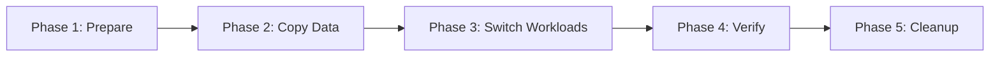

# How to Handle Stateful Migration with ArgoCD

Author: [nawazdhandala](https://github.com/nawazdhandala)

Tags: ArgoCD, GitOps, Kubernetes, Storage, StatefulSet

Description: Learn how to handle stateful workload migrations with ArgoCD, including moving StatefulSets between storage backends, migrating PVCs, and handling data during cluster transitions.

---

Migrating stateful workloads is one of the most challenging tasks in Kubernetes operations. When you are managing infrastructure through ArgoCD, you need a strategy that preserves data integrity while keeping your GitOps workflow intact. This post covers practical approaches to migrating stateful applications, including storage backend changes, PVC migrations, and cross-cluster data moves.

## Why Stateful Migrations Are Hard

Stateful migrations are difficult because Kubernetes PersistentVolumes are bound to specific storage backends. You cannot simply change a StorageClass on an existing PVC. Instead, you need to:

1. Provision new storage
2. Copy data from old to new storage
3. Update workloads to use the new storage
4. Verify data integrity
5. Clean up old storage

ArgoCD helps manage this process by tracking each step as a Git commit, giving you an audit trail and the ability to roll back configuration changes (though not the data itself).

## Migration Strategy Overview



Each phase corresponds to a set of Git commits that ArgoCD syncs. Let's walk through each phase.

## Phase 1: Prepare New Storage

First, create the new PVCs alongside the existing ones. Your Git repository should contain both:

```yaml
# storage/new-postgres-pvc.yaml
apiVersion: v1
kind: PersistentVolumeClaim
metadata:
  name: postgres-data-new
  namespace: database
  labels:
    migration: gp2-to-gp3
    migration-phase: prepare
spec:
  accessModes:
    - ReadWriteOnce
  storageClassName: gp3-csi  # New storage class
  resources:
    requests:
      storage: 100Gi  # Match or exceed current size
```

Commit this to Git and let ArgoCD sync it. The new PVC gets created while your existing workload continues using the old PVC.

## Phase 2: Data Copy Job

Create a Kubernetes Job that copies data from the old PVC to the new one. This job runs as an ArgoCD PreSync hook to ensure data is copied before the workload switches:

```yaml
# migration/data-copy-job.yaml
apiVersion: batch/v1
kind: Job
metadata:
  name: postgres-data-migration
  namespace: database
  annotations:
    argocd.argoproj.io/hook: PreSync
    argocd.argoproj.io/hook-delete-policy: BeforeHookCreation
    argocd.argoproj.io/sync-wave: "1"
spec:
  template:
    metadata:
      labels:
        app: data-migration
    spec:
      # Run on the same node as the data if using local storage
      containers:
        - name: migrate
          image: alpine:latest
          command:
            - /bin/sh
            - -c
            - |
              echo "Starting data migration..."

              # Use rsync for efficient copying with progress
              apk add --no-cache rsync

              # Copy data preserving permissions and timestamps
              rsync -avz --progress /old-data/ /new-data/

              # Verify the copy
              OLD_SIZE=$(du -sb /old-data | cut -f1)
              NEW_SIZE=$(du -sb /new-data | cut -f1)

              echo "Old size: $OLD_SIZE bytes"
              echo "New size: $NEW_SIZE bytes"

              if [ "$OLD_SIZE" -eq "$NEW_SIZE" ]; then
                echo "Migration verified - sizes match"
              else
                echo "WARNING: Size mismatch after copy"
                exit 1
              fi
          volumeMounts:
            - name: old-data
              mountPath: /old-data
              readOnly: true
            - name: new-data
              mountPath: /new-data
      volumes:
        - name: old-data
          persistentVolumeClaim:
            claimName: postgres-data  # Existing PVC
        - name: new-data
          persistentVolumeClaim:
            claimName: postgres-data-new  # New PVC
      restartPolicy: Never
  backoffLimit: 3
```

## Handling Database Quiescence

For databases, you need to stop writes before copying data. Use a multi-step approach with sync waves:

```yaml
# migration/step1-scale-down.yaml
apiVersion: batch/v1
kind: Job
metadata:
  name: scale-down-app
  namespace: database
  annotations:
    argocd.argoproj.io/hook: PreSync
    argocd.argoproj.io/hook-delete-policy: BeforeHookCreation
    argocd.argoproj.io/sync-wave: "0"
spec:
  template:
    spec:
      serviceAccountName: migration-sa
      containers:
        - name: scale-down
          image: bitnami/kubectl:latest
          command:
            - /bin/sh
            - -c
            - |
              # Scale down the application that uses the database
              kubectl scale deployment app-server -n production --replicas=0

              # Wait for pods to terminate
              kubectl wait --for=delete pod -l app=app-server -n production --timeout=120s

              # Create a checkpoint in postgres
              PGPASSWORD=$DB_PASSWORD psql -h postgres-svc -U postgres \
                -c "CHECKPOINT;" \
                -c "SELECT pg_switch_wal();"

              echo "Application scaled down and database checkpointed"
          env:
            - name: DB_PASSWORD
              valueFrom:
                secretKeyRef:
                  name: postgres-credentials
                  key: password
      restartPolicy: Never
  backoffLimit: 2
```

## Phase 3: Switch Workloads

After data is copied, update the StatefulSet or Deployment to use the new PVC. In Git, modify the workload manifest:

```yaml
# workloads/postgres-statefulset.yaml
apiVersion: apps/v1
kind: StatefulSet
metadata:
  name: postgres
  namespace: database
  annotations:
    migration-note: "Switched to gp3 storage on 2026-02-26"
spec:
  serviceName: postgres
  replicas: 1
  selector:
    matchLabels:
      app: postgres
  template:
    metadata:
      labels:
        app: postgres
    spec:
      containers:
        - name: postgres
          image: postgres:16
          volumeMounts:
            - name: data
              mountPath: /var/lib/postgresql/data
      volumes:
        - name: data
          persistentVolumeClaim:
            claimName: postgres-data-new  # Changed from postgres-data
```

For StatefulSets with volumeClaimTemplates, you cannot change the template directly. Instead, you need to delete and recreate the StatefulSet. Use ArgoCD sync waves to orchestrate this:

```yaml
# migration/recreate-statefulset.yaml
apiVersion: batch/v1
kind: Job
metadata:
  name: recreate-statefulset
  namespace: database
  annotations:
    argocd.argoproj.io/hook: PreSync
    argocd.argoproj.io/hook-delete-policy: BeforeHookCreation
    argocd.argoproj.io/sync-wave: "2"
spec:
  template:
    spec:
      serviceAccountName: migration-sa
      containers:
        - name: recreate
          image: bitnami/kubectl:latest
          command:
            - /bin/sh
            - -c
            - |
              # Delete statefulset without deleting pods (orphan)
              kubectl delete statefulset postgres -n database --cascade=orphan || true

              # Delete old pods
              kubectl delete pods -l app=postgres -n database --force || true

              echo "StatefulSet deleted - ArgoCD will recreate with new config"
      restartPolicy: Never
  backoffLimit: 2
```

## Phase 4: Verification

After ArgoCD syncs the new configuration, verify the migration:

```yaml
# migration/verify-migration.yaml
apiVersion: batch/v1
kind: Job
metadata:
  name: verify-migration
  namespace: database
  annotations:
    argocd.argoproj.io/hook: PostSync
    argocd.argoproj.io/hook-delete-policy: HookSucceeded
spec:
  template:
    spec:
      containers:
        - name: verify
          image: postgres:16
          command:
            - /bin/sh
            - -c
            - |
              # Run verification queries
              PGPASSWORD=$DB_PASSWORD psql -h postgres-svc -U postgres -d myapp <<EOF
              -- Check table counts
              SELECT schemaname, tablename, n_tup_ins
              FROM pg_stat_user_tables
              ORDER BY n_tup_ins DESC;

              -- Verify data integrity
              SELECT count(*) as total_users FROM users;
              SELECT count(*) as total_orders FROM orders;

              -- Check for corruption
              SELECT datname, checksum_failures
              FROM pg_stat_database
              WHERE datname = 'myapp';
              EOF

              echo "Verification complete"
          env:
            - name: DB_PASSWORD
              valueFrom:
                secretKeyRef:
                  name: postgres-credentials
                  key: password
      restartPolicy: Never
  backoffLimit: 1
```

## Phase 5: Cleanup

Once you have verified the migration is successful, remove the old PVC and migration resources from Git:

```yaml
# Simply remove these files from Git:
# - storage/old-postgres-pvc.yaml (if separately managed)
# - migration/data-copy-job.yaml
# - migration/step1-scale-down.yaml
# - migration/verify-migration.yaml
```

When ArgoCD syncs, it will clean up the migration Job resources. For the old PVC, if your reclaim policy is set to Retain, the underlying volume will be preserved even after PVC deletion. This gives you a safety net.

## Cross-Cluster Stateful Migration

For moving stateful workloads between clusters, use Velero backup and restore coordinated through ArgoCD:

```yaml
# In source cluster - trigger backup
apiVersion: velero.io/v1
kind: Backup
metadata:
  name: postgres-cluster-migration
  namespace: velero
spec:
  includedNamespaces:
    - database
  labelSelector:
    matchLabels:
      app: postgres
  snapshotVolumes: true
  storageLocation: shared-backup-location
  ttl: 72h0m0s
```

In the destination cluster, ArgoCD manages the restore:

```yaml
# In destination cluster
apiVersion: velero.io/v1
kind: Restore
metadata:
  name: postgres-cluster-migration-restore
  namespace: velero
spec:
  backupName: postgres-cluster-migration
  includedNamespaces:
    - database
  restorePVs: true
```

## Tips for Smooth Migrations

- Always test the migration procedure in a staging environment first
- Use ArgoCD sync waves to control the order of operations
- Keep migration resources in a separate directory so they can be easily removed after completion
- Set appropriate resource requests on migration jobs to prevent them from being OOM-killed during large data copies
- Consider using [OneUptime](https://oneuptime.com) to monitor application health during and after the migration

## Summary

Stateful migrations with ArgoCD follow a phased approach: prepare new storage, copy data, switch workloads, verify, and clean up. ArgoCD sync hooks and sync waves provide the orchestration mechanism, while Git gives you a complete audit trail of every step. The key is to treat each migration phase as a separate Git commit, allowing ArgoCD to apply changes incrementally and giving you clear rollback points throughout the process.
