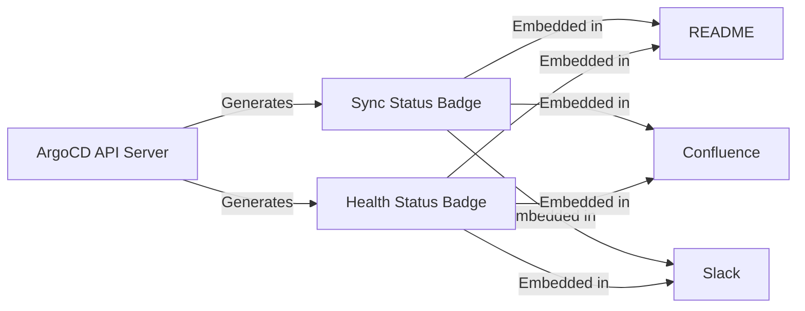

# How to Use Status Badges for ArgoCD Applications

Author: [nawazdhandala](https://github.com/nawazdhandala)

Tags: ArgoCD, GitOps, Kubernetes, CI/CD, Monitoring

Description: Learn how to generate and use ArgoCD status badges to display real-time sync and health status of your applications in dashboards, documentation, and communication channels.

---

ArgoCD status badges are small, auto-updating images that show the current sync status and health of your applications. You can embed these badges in README files, Confluence pages, Slack messages, internal dashboards, and anywhere else that renders images. They provide at-a-glance visibility into deployment status without needing to open the ArgoCD UI.

This guide covers how to enable, configure, and use ArgoCD status badges across your toolchain.

## What Are Status Badges?

Status badges are dynamically generated SVG or PNG images served by the ArgoCD API server. They update in real time to reflect the current state of your applications.

ArgoCD provides two types of badges per application:

1. **Sync Status Badge**: Shows whether the application is Synced, OutOfSync, or Unknown
2. **Health Status Badge**: Shows whether the application is Healthy, Degraded, Progressing, or Missing



## Enabling Badge Support

By default, ArgoCD badge endpoints are available but may require authentication. To allow unauthenticated access to badges (which is necessary for embedding in external tools), you need to enable anonymous access or configure the badge endpoint.

### Option 1: Enable Anonymous Badge Access

The simplest approach is to enable the badge endpoint without authentication:

```yaml
apiVersion: v1
kind: ConfigMap
metadata:
  name: argocd-cm
  namespace: argocd
data:
  # Enable status badge support
  statusbadge.enabled: "true"
```

This setting exposes the badge endpoint at `/api/badge` without requiring authentication, while all other API endpoints remain protected.

### Option 2: Token-Based Badge Access

For additional security, you can require a token for badge access. Generate an API token and include it in the badge URL:

```bash
# Generate an API token for badge access
argocd account generate-token --account badge-reader
```

Then use the token in the badge URL as a query parameter.

## Badge URL Format

The badge URLs follow this pattern:

```text
https://argocd.example.com/api/badge?name=<app-name>&revision=true
```

### Available Parameters

| Parameter | Description | Example |
|-----------|-------------|---------|
| `name` | Application name | `name=my-app` |
| `project` | Filter by project | `project=production` |
| `revision` | Show Git revision | `revision=true` |

### Badge URL Examples

```text
# Sync status badge for a specific application
https://argocd.example.com/api/badge?name=payment-service

# Badge showing the Git revision
https://argocd.example.com/api/badge?name=payment-service&revision=true

# Badge for all applications in a project
https://argocd.example.com/api/badge?project=production
```

## Embedding Badges in Markdown

The most common use case is embedding badges in README files or documentation:

```markdown
## Deployment Status

| Service | Status |
|---------|--------|
| Payment Service |  |
| User Service |  |
| Order Service |  |
```

### Badges with Links Back to ArgoCD

Make the badges clickable so users can jump to the ArgoCD application:

```markdown
[](https://argocd.example.com/applications/payment-service)
```

## Embedding Badges in HTML

For web dashboards or Confluence pages:

```html
<table>
  <tr>
    <th>Service</th>
    <th>Status</th>
    <th>Last Sync</th>
  </tr>
  <tr>
    <td>Payment Service</td>
    <td>
      <a href="https://argocd.example.com/applications/payment-service">
        
      </a>
    </td>
    <td id="payment-last-sync"></td>
  </tr>
  <tr>
    <td>User Service</td>
    <td>
      <a href="https://argocd.example.com/applications/user-service">
        
      </a>
    </td>
    <td id="user-last-sync"></td>
  </tr>
</table>
```

## Building a Status Dashboard

You can build a simple status dashboard using just HTML and ArgoCD badges:

```html
<!DOCTYPE html>
<html>
<head>
  <title>Deployment Status Dashboard</title>
  <style>
    body {
      font-family: -apple-system, BlinkMacSystemFont, 'Segoe UI', sans-serif;
      max-width: 800px;
      margin: 40px auto;
      padding: 0 20px;
    }
    h1 { color: #333; }
    .service-grid {
      display: grid;
      grid-template-columns: 1fr 1fr;
      gap: 16px;
      margin-top: 24px;
    }
    .service-card {
      border: 1px solid #e0e0e0;
      border-radius: 8px;
      padding: 16px;
    }
    .service-card h3 { margin-top: 0; }
    .service-card img { margin-top: 8px; }
  </style>
  <!-- Auto-refresh every 30 seconds -->
  <meta http-equiv="refresh" content="30">
</head>
<body>
  <h1>Production Deployment Status</h1>
  <div class="service-grid">
    <div class="service-card">
      <h3>Payment Service</h3>
      <a href="https://argocd.example.com/applications/payment-service">
        
      </a>
    </div>
    <div class="service-card">
      <h3>User Service</h3>
      <a href="https://argocd.example.com/applications/user-service">
        
      </a>
    </div>
    <div class="service-card">
      <h3>Order Service</h3>
      <a href="https://argocd.example.com/applications/order-service">
        
      </a>
    </div>
    <div class="service-card">
      <h3>Notification Service</h3>
      <a href="https://argocd.example.com/applications/notification-service">
        
      </a>
    </div>
  </div>
</body>
</html>
```

## Badge Caching Considerations

Badges are generated dynamically on each request. Keep these caching considerations in mind:

**Browser caching**: Browsers may cache badge images. Add a cache-busting parameter if you need real-time updates:

```markdown

```

**CDN caching**: If you use a CDN in front of ArgoCD, configure it to not cache badge responses or set a very short TTL.

**GitHub README caching**: GitHub caches images in README files through their proxy (camo.githubusercontent.com). Updates may take several minutes to appear. This is a known limitation.

## Programmatic Badge Access

You can also retrieve application status programmatically for building custom dashboards:

```bash
# Get application status via the ArgoCD API
curl -s -H "Authorization: Bearer $ARGOCD_TOKEN" \
  https://argocd.example.com/api/v1/applications/payment-service | \
  jq '{name: .metadata.name, sync: .status.sync.status, health: .status.health.status}'

# Output:
# {
#   "name": "payment-service",
#   "sync": "Synced",
#   "health": "Healthy"
# }
```

Or using the ArgoCD CLI:

```bash
# Get status of all applications
argocd app list -o json | jq '.[] | {name: .metadata.name, sync: .status.sync.status, health: .status.health.status}'
```

## Security Considerations

**Badge endpoints expose application names**: The badge endpoint reveals the existence and status of applications. If application names are sensitive, consider using a proxy that authenticates badge requests.

**Network security**: Even with `statusbadge.enabled`, make sure the ArgoCD server is not publicly accessible if you do not want external visibility into your deployment status.

**Token rotation**: If using token-based badge access, rotate the token periodically and update all badge URLs.

## Troubleshooting

**Badge shows "Unknown"**: The application might not exist, or the name might be misspelled. Verify with:

```bash
argocd app get <app-name>
```

**Badge returns 404**: The badge endpoint might not be enabled. Check:

```bash
kubectl get cm argocd-cm -n argocd -o jsonpath='{.data.statusbadge\.enabled}'
```

**Badge returns 403**: Authentication is required but not provided. Either enable `statusbadge.enabled` or provide a valid token in the request.

## Conclusion

ArgoCD status badges are a simple way to bring deployment visibility outside of the ArgoCD UI and into the tools your team already uses. Whether embedded in a README, a wiki page, or a custom dashboard, badges give everyone on the team a quick view of deployment health without logging into ArgoCD. For embedding badges specifically in README files, see our detailed guide on [embedding ArgoCD status badges in README files](https://oneuptime.com/blog/post/2026-02-26-argocd-status-badges-readme/view).
