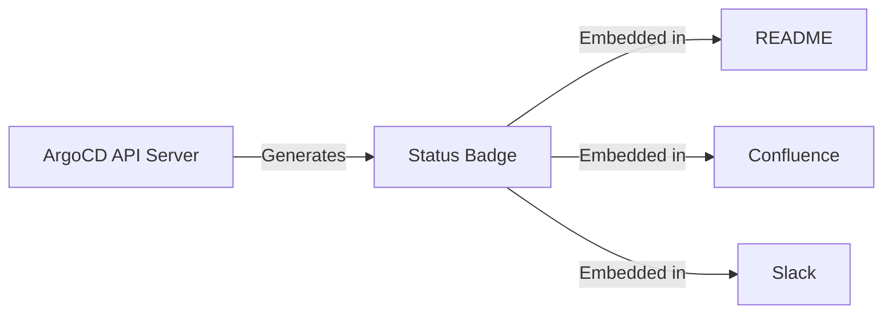

# How to Use Status Badges for ArgoCD Applications

Author: [nawazdhandala](https://github.com/nawazdhandala)

Tags: ArgoCD, GitOps, Kubernetes, CI/CD, Monitoring

Description: Learn how to generate and use ArgoCD status badges to display real-time sync and health status of your applications in dashboards, documentation, and communication channels.

---

ArgoCD status badges are small, auto-updating images that show the current sync status and health of your applications. You can embed these badges in README files, Confluence pages, Slack messages, internal dashboards, and anywhere else that renders images. They provide at-a-glance visibility into deployment status without needing to open the ArgoCD UI.

This guide covers how to enable, configure, and use ArgoCD status badges across your toolchain.

## What Are Status Badges?

Status badges are dynamically generated SVG images served by the ArgoCD API server. They update to reflect the current state of your applications.

ArgoCD provides a single badge that shows both status values for an application:

1. **Sync Status**: Shows whether the application is Synced, OutOfSync, or Unknown
2. **Health Status**: Shows whether the application is Healthy, Degraded, Progressing, Missing, Suspended, or Unknown


```mermaid
flowchart LR
    A[ArgoCD API Server] -->|Generates| B[Status Badge]
    B -->|Embedded in| C[README]
    B -->|Embedded in| D[Confluence]
    B -->|Embedded in| E[Slack]
```

## Enabling Badge Support

By default, ArgoCD status badges are disabled because the badge image is available without authentication once enabled. To embed badges in external tools, enable badge support and make sure you are comfortable exposing application status to anyone who can reach the URL.

### Option 1: Enable Badge Access

Enable the badge endpoint with the `statusbadge.enabled` setting:

```yaml
apiVersion: v1
kind: ConfigMap
metadata:
  name: argocd-cm
  namespace: argocd
data:
  # Enable status badge support
  statusbadge.enabled: "true"
```

This setting exposes the badge endpoint at `/api/badge` without requiring authentication, while all other API endpoints remain protected.

### Option 2: Override the Badge Base URL

If ArgoCD is behind a reverse proxy or you want generated badge snippets to use a different public hostname, configure `statusbadge.url`:

```yaml
apiVersion: v1
kind: ConfigMap
metadata:
  name: argocd-cm
  namespace: argocd
data:
  statusbadge.enabled: "true"
  statusbadge.url: "https://argocd.example.com/"
```

If you need authenticated badge access, put an authenticating proxy in front of the badge URL rather than adding tokens to badge query strings.

## Badge URL Format

The badge URLs follow this pattern:

```text
https://argocd.example.com/api/badge?name=<app-name>&revision=true
```

### Available Parameters

| Parameter | Description | Example |
|-----------|-------------|---------|
| `name` | Application name | `name=my-app` |
| `project` | Filter by project | `project=production` |
| `revision` | Show Git revision | `revision=true` |
| `showAppName` | Show the application name | `showAppName=true` |
| `keepFullRevision` | Do not truncate the displayed revision | `keepFullRevision=true` |
| `width` | Override the badge width | `width=500` |

### Badge URL Examples

```text
# Status badge for a specific application
https://argocd.example.com/api/badge?name=payment-service

# Badge showing the Git revision
https://argocd.example.com/api/badge?name=payment-service&revision=true

# Badge for all applications in a project
https://argocd.example.com/api/badge?project=production
```

## Embedding Badges in Markdown

The most common use case is embedding badges in README files or documentation:

```markdown
## Deployment Status

| Service | Status |
|---------|--------|
| Payment Service |  |
| User Service |  |
| Order Service |  |
```

### Badges with Links Back to ArgoCD

Make the badges clickable so users can jump to the ArgoCD application:

```markdown
[](https://argocd.example.com/applications/payment-service)
```

## Embedding Badges in HTML

For web dashboards or Confluence pages:

```html
<table>
  <tr>
    <th>Service</th>
    <th>Status</th>
    <th>Last Sync</th>
  </tr>
  <tr>
    <td>Payment Service</td>
    <td>
      <a href="https://argocd.example.com/applications/payment-service">
        
      </a>
    </td>
    <td id="payment-last-sync"></td>
  </tr>
  <tr>
    <td>User Service</td>
    <td>
      <a href="https://argocd.example.com/applications/user-service">
        
      </a>
    </td>
    <td id="user-last-sync"></td>
  </tr>
</table>
```

## Building a Status Dashboard

You can build a simple status dashboard using just HTML and ArgoCD badges:

```html
<!DOCTYPE html>
<html>
<head>
  <title>Deployment Status Dashboard</title>
  <style>
    body {
      font-family: -apple-system, BlinkMacSystemFont, 'Segoe UI', sans-serif;
      max-width: 800px;
      margin: 40px auto;
      padding: 0 20px;
    }
    h1 { color: #333; }
    .service-grid {
      display: grid;
      grid-template-columns: 1fr 1fr;
      gap: 16px;
      margin-top: 24px;
    }
    .service-card {
      border: 1px solid #e0e0e0;
      border-radius: 8px;
      padding: 16px;
    }
    .service-card h3 { margin-top: 0; }
    .service-card img { margin-top: 8px; }
  </style>
  <!-- Auto-refresh every 30 seconds -->
  <meta http-equiv="refresh" content="30">
</head>
<body>
  <h1>Production Deployment Status</h1>
  <div class="service-grid">
    <div class="service-card">
      <h3>Payment Service</h3>
      <a href="https://argocd.example.com/applications/payment-service">
        
      </a>
    </div>
    <div class="service-card">
      <h3>User Service</h3>
      <a href="https://argocd.example.com/applications/user-service">
        
      </a>
    </div>
    <div class="service-card">
      <h3>Order Service</h3>
      <a href="https://argocd.example.com/applications/order-service">
        
      </a>
    </div>
    <div class="service-card">
      <h3>Notification Service</h3>
      <a href="https://argocd.example.com/applications/notification-service">
        
      </a>
    </div>
  </div>
</body>
</html>
```

## Badge Caching Considerations

ArgoCD sends badge responses with `Cache-Control: private, no-store`. Keep these caching considerations in mind:

**Browser caching**: Browsers may cache badge images. Add a cache-busting parameter if you need real-time updates:

```markdown

```

**CDN caching**: If you use a CDN in front of ArgoCD, configure it to not cache badge responses or set a very short TTL.

**GitHub README caching**: GitHub caches images in README files through their proxy (camo.githubusercontent.com). Updates may take several minutes to appear. This is a known limitation.

## Programmatic Badge Access

You can also retrieve application status programmatically for building custom dashboards:

```bash
# Get application status via the ArgoCD API
curl -s -H "Authorization: Bearer $ARGOCD_TOKEN" \
  https://argocd.example.com/api/v1/applications/payment-service | \
  jq '{name: .metadata.name, sync: .status.sync.status, health: .status.health.status}'

# Output:
# {
#   "name": "payment-service",
#   "sync": "Synced",
#   "health": "Healthy"
# }
```

Or using the ArgoCD CLI:

```bash
# Get status of all applications
argocd app list -o json | jq '.[] | {name: .metadata.name, sync: .status.sync.status, health: .status.health.status}'
```

## Security Considerations

**Badge endpoints expose application names**: The badge endpoint reveals the existence and status of applications. If application names are sensitive, consider using a proxy that authenticates badge requests.

**Network security**: Even with `statusbadge.enabled`, make sure the ArgoCD server is not publicly accessible if you do not want external visibility into your deployment status.

**Proxy credential rotation**: If you put an authenticating proxy in front of badge requests, rotate those credentials periodically and update any clients that use them.

## Troubleshooting

**Badge shows "Unknown"**: The application might not exist, or the name might be misspelled. Verify with:

```bash
argocd app get <app-name>
```

**Badge shows "Unknown" even when the application exists**: The badge endpoint might not be enabled. Check:

```bash
kubectl get cm argocd-cm -n argocd -o jsonpath='{.data.statusbadge\.enabled}'
```

**Badge returns 400**: The application name, namespace, project, or width parameter might be invalid. Check the URL parameters and try the badge URL again.

## Conclusion

ArgoCD status badges are a simple way to bring deployment visibility outside of the ArgoCD UI and into the tools your team already uses. Whether embedded in a README, a wiki page, or a custom dashboard, badges give everyone on the team a quick view of deployment health without logging into ArgoCD. For embedding badges specifically in README files, see our detailed guide on [embedding ArgoCD status badges in README files](https://oneuptime.com/blog/post/2026-02-26-argocd-status-badges-readme/view).
