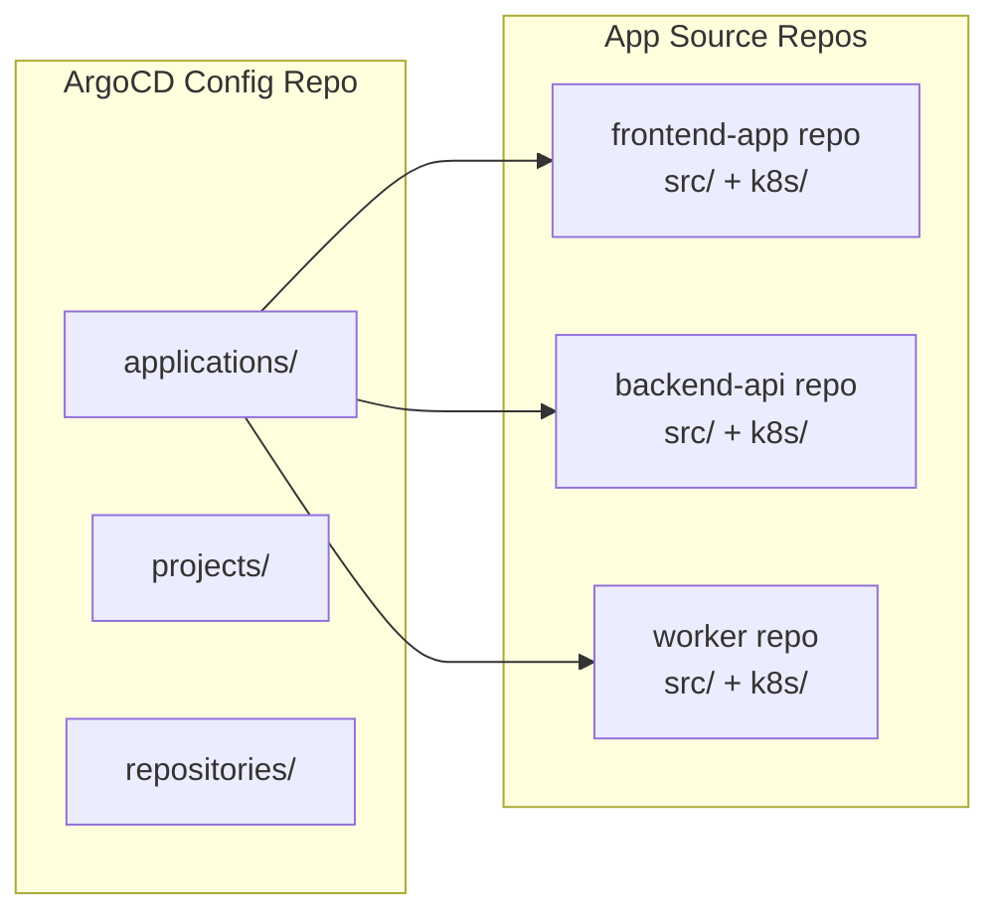

# How to Structure Your Git Repo for Declarative ArgoCD Setup

Author: [nawazdhandala](https://github.com/nawazdhandala)

Tags: ArgoCD, GitOps, Kubernetes, Repository Structure, Best Practices

Description: Learn how to organize your Git repositories for a declarative ArgoCD setup that scales across teams, environments, and clusters with clear separation of concerns.

---

The structure of your Git repositories directly affects how manageable your ArgoCD setup is. A poorly organized repo leads to tangled configurations, confusing pull requests, and deployment mistakes. A well-structured repo makes it easy to understand what is deployed where, review changes confidently, and onboard new team members. This guide covers proven repository structures for declarative ArgoCD management.

## The Two-Repo Approach

The most common and recommended approach separates configuration into two types of repositories:

1. **Application source repositories** - contain the actual application code and Kubernetes manifests (one per microservice)
2. **ArgoCD configuration repository** - contains ArgoCD Application, Project, and Repository definitions (one per organization or platform team)



The ArgoCD config repo is what ArgoCD manages as App-of-Apps. The application source repos are what ArgoCD deploys.

## Recommended Config Repo Structure

Here is a battle-tested structure for the ArgoCD configuration repository:

```text
argocd-config/
  README.md
  root-apps/
    production.yaml          # Root app for production environment
    staging.yaml             # Root app for staging environment
    infrastructure.yaml      # Root app for shared infrastructure
  projects/
    team-frontend.yaml
    team-backend.yaml
    team-data.yaml
    infrastructure.yaml
    platform.yaml
  repositories/
    credential-templates/
      github-org.yaml
    helm/
      bitnami.yaml
      prometheus-community.yaml
  clusters/
    production/
      us-east-1.yaml
      eu-west-1.yaml
    staging/
      us-east-1.yaml
  applications/
    production/
      frontend/
        app.yaml
      backend-api/
        app.yaml
      backend-worker/
        app.yaml
      redis/
        app.yaml
    staging/
      frontend/
        app.yaml
      backend-api/
        app.yaml
    infrastructure/
      cert-manager/
        app.yaml
      ingress-nginx/
        app.yaml
      external-secrets/
        app.yaml
    monitoring/
      prometheus/
        app.yaml
      grafana/
        app.yaml
      loki/
        app.yaml
```

## Why Directories Per Application

Using a directory per application (instead of a flat list of YAML files) allows you to add additional configuration alongside the Application manifest:

```text
applications/production/backend-api/
  app.yaml                    # ArgoCD Application manifest
  kustomization.yaml          # Optional: if using Kustomize to generate the app
  values-override.yaml        # Optional: environment-specific Helm values
```

This structure also makes it easy to add per-application resources like ConfigMaps or Secrets that the Application might reference.

## Application Source Repo Structure

Each application's source repository should have a clear layout for its Kubernetes manifests. Two popular approaches:

### Kustomize-Based Layout

```text
backend-api/
  src/                        # Application source code
  Dockerfile
  k8s/
    base/
      deployment.yaml
      service.yaml
      configmap.yaml
      kustomization.yaml
    overlays/
      production/
        kustomization.yaml    # Production patches
        replica-patch.yaml
        resource-patch.yaml
      staging/
        kustomization.yaml    # Staging patches
        replica-patch.yaml
```

The ArgoCD Application points to the appropriate overlay:

```yaml
spec:
  source:
    repoURL: https://github.com/myorg/backend-api.git
    path: k8s/overlays/production
```

### Helm-Based Layout

```text
backend-api/
  src/
  Dockerfile
  chart/
    Chart.yaml
    values.yaml               # Default values
    values-production.yaml    # Production overrides
    values-staging.yaml       # Staging overrides
    templates/
      deployment.yaml
      service.yaml
      ingress.yaml
```

The ArgoCD Application specifies the values file:

```yaml
spec:
  source:
    repoURL: https://github.com/myorg/backend-api.git
    path: chart
    helm:
      valueFiles:
        - values.yaml
        - values-production.yaml
```

## Environment Separation Strategies

### Strategy 1: Directory-Based (Recommended)

Separate environments by directory within the config repo:

```yaml
# applications/production/backend-api/app.yaml
apiVersion: argoproj.io/v1alpha1
kind: Application
metadata:
  name: backend-api-production
  namespace: argocd
spec:
  source:
    repoURL: https://github.com/myorg/backend-api.git
    targetRevision: v2.3.1    # Pinned version for production
    path: k8s/overlays/production
  destination:
    server: https://kubernetes.default.svc
    namespace: backend-production
```

```yaml
# applications/staging/backend-api/app.yaml
apiVersion: argoproj.io/v1alpha1
kind: Application
metadata:
  name: backend-api-staging
  namespace: argocd
spec:
  source:
    repoURL: https://github.com/myorg/backend-api.git
    targetRevision: main       # Tracks latest for staging
    path: k8s/overlays/staging
  destination:
    server: https://kubernetes.default.svc
    namespace: backend-staging
```

### Strategy 2: Branch-Based

Use different branches for different environments:

```text
main branch     -> staging configuration
production branch -> production configuration
```

This is simpler but makes it harder to review environment-specific changes and can lead to branch drift.

### Strategy 3: Cluster-Based

When each environment runs on a separate cluster:

```text
applications/
  cluster-prod-us/
    backend-api.yaml
    frontend.yaml
  cluster-prod-eu/
    backend-api.yaml
    frontend.yaml
  cluster-staging/
    backend-api.yaml
    frontend.yaml
```

## Naming Conventions

Consistent naming prevents confusion:

```yaml
# Application naming: {app-name}-{environment}
metadata:
  name: backend-api-production
  labels:
    app: backend-api
    environment: production
    team: backend

# Namespace naming: {app-name}-{environment} or {team}-{environment}
spec:
  destination:
    namespace: backend-production
```

## Handling Shared Configuration

Some configuration is shared across environments (like CRD definitions or cluster-wide policies). Put these in a dedicated directory:

```text
applications/
  shared/
    crds/
      app.yaml               # CRD installation
    cluster-policies/
      app.yaml               # OPA policies
  production/
    ...
  staging/
    ...
```

The shared directory gets its own root application or is included in both environment root applications.

## Pull Request Workflow

With a well-structured repo, pull requests become clear and focused:

```text
# Example PR: "Deploy backend-api v2.4.0 to production"
# Changed files:
#   applications/production/backend-api/app.yaml
#     - targetRevision: v2.3.1 -> v2.4.0

# Example PR: "Add new microservice: notification-service"
# New files:
#   applications/staging/notification-service/app.yaml
#   applications/production/notification-service/app.yaml
```

Use CODEOWNERS to require approvals from the right teams:

```text
# .github/CODEOWNERS
applications/production/**  @platform-team @sre-team
applications/staging/**     @platform-team
projects/**                 @platform-team
clusters/**                 @sre-team
```

## Scaling to Many Teams

As your organization grows, consider these patterns:

1. **One config repo per platform team** if teams are independent
2. **Subdirectories per team** within a single config repo if central governance is needed
3. **ApplicationSets** to reduce per-application YAML when patterns are repetitive

```text
argocd-config/
  applications/
    team-frontend/
      production/
        ...
      staging/
        ...
    team-backend/
      production/
        ...
      staging/
        ...
    team-data/
      production/
        ...
```

## Common Anti-Patterns

**Mixing application code and ArgoCD config** - Putting Application manifests in the same repo as application source code couples deployment configuration to code changes.

**One giant YAML file** - Putting all Application definitions in a single file makes PRs confusing and increases merge conflicts.

**No environment separation** - Using the same configuration for all environments leads to accidental production deployments.

**Deeply nested directories** - More than 3 levels of nesting makes navigation difficult. Keep it flat enough to be intuitive.

A thoughtful repository structure pays dividends as your ArgoCD deployment grows. Start with the two-repo approach, organize by environment and team, and enforce naming conventions. Your future self and your teammates will thank you when they need to debug a deployment issue at 2 AM.
