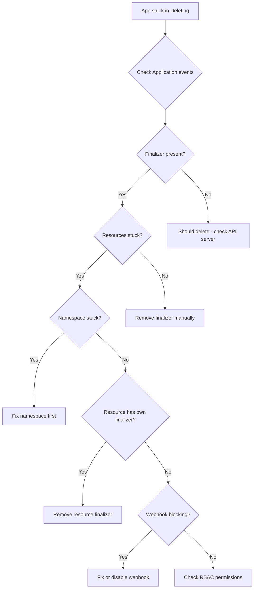

# How to Handle Stuck Application Deletion in ArgoCD

Author: [nawazdhandala](https://github.com/nawazdhandala)

Tags: ArgoCD, GitOps, Kubernetes, Troubleshooting, Application Management

Description: Learn how to diagnose and fix ArgoCD applications stuck in a deleting state due to finalizers, dependent resources, webhook issues, and other common blockers.

---

Few things are more frustrating than clicking delete on an ArgoCD application and watching it sit there in "Deleting" state forever. The application will not go away, you cannot modify it, and the ArgoCD UI shows it perpetually stuck. This happens more often than you might think, and the root cause is almost always related to finalizers or resources that cannot be deleted.

This guide covers every common reason ArgoCD applications get stuck during deletion and the exact steps to resolve each one.

## Why applications get stuck during deletion

When ArgoCD processes a cascade delete, it needs to delete all managed resources before removing the finalizer and completing the deletion. The process stalls when:

1. A managed resource has its own finalizer that blocks deletion
2. A Kubernetes namespace is stuck in Terminating state
3. The target cluster is unreachable
4. A webhook is rejecting delete requests
5. RBAC permissions prevent ArgoCD from deleting certain resources
6. A resource has owner references that create circular dependencies



## Step 1: Diagnose the problem

Start by checking what the Application status looks like:

```bash
# Get the application details
kubectl get application my-app -n argocd -o yaml

# Check the deletion timestamp - if set, the app is marked for deletion
kubectl get application my-app -n argocd -o jsonpath='{.metadata.deletionTimestamp}'

# Check what finalizers are blocking
kubectl get application my-app -n argocd -o jsonpath='{.metadata.finalizers}'
```

Check ArgoCD controller logs for deletion errors:

```bash
# Look for errors related to the stuck application
kubectl logs -n argocd -l app.kubernetes.io/name=argocd-application-controller \
  --since=10m | grep "my-app"
```

## Step 2: Find stuck managed resources

If the application has a cascade finalizer, check which resources are preventing cleanup:

```bash
# List all resources in the target namespace
kubectl get all -n my-app-namespace

# Look for resources stuck in Terminating state
kubectl get all -n my-app-namespace --field-selector metadata.deletionTimestamp!=''

# Check for non-standard resources that might be stuck
kubectl get pvc,configmap,secret,ingress -n my-app-namespace
```

## Fix: Resource with its own finalizer

The most common cause is a managed resource that has its own Kubernetes finalizer blocking deletion:

```bash
# Find the stuck resource and its finalizers
kubectl get deployment my-deployment -n my-app-namespace -o jsonpath='{.metadata.finalizers}'

# If safe, remove the blocking finalizer
kubectl patch deployment my-deployment -n my-app-namespace \
  --type json \
  -p '[{"op": "remove", "path": "/metadata/finalizers"}]'
```

For PersistentVolumeClaims with the `kubernetes.io/pvc-protection` finalizer:

```bash
# This finalizer prevents deletion while pods are using the PVC
# First, ensure no pods are mounting the PVC
kubectl get pods -n my-app-namespace -o json | \
  jq '.items[] | select(.spec.volumes[]?.persistentVolumeClaim.claimName == "my-pvc") | .metadata.name'

# If pods are already terminated, force-remove the finalizer
kubectl patch pvc my-pvc -n my-app-namespace \
  --type json \
  -p '[{"op": "remove", "path": "/metadata/finalizers"}]'
```

## Fix: Namespace stuck in Terminating

If the entire namespace is stuck in Terminating, it blocks all resource deletion in that namespace:

```bash
# Check namespace status
kubectl get namespace my-app-namespace -o jsonpath='{.status}'

# Find what is blocking namespace deletion
kubectl get namespace my-app-namespace -o json | jq '.status.conditions'

# Check for apiservices that might be unavailable
kubectl get apiservices | grep -v Available

# Force namespace deletion by removing its finalizer (last resort)
kubectl get namespace my-app-namespace -o json | \
  jq '.spec.finalizers = []' | \
  kubectl replace --raw "/api/v1/namespaces/my-app-namespace/finalize" -f -
```

## Fix: Target cluster unreachable

If the managed cluster is down or network connectivity is broken:

```bash
# Check cluster connectivity
argocd cluster list

# Test direct connectivity
kubectl --context my-remote-cluster get nodes

# If the cluster is permanently gone, remove the finalizer to unstick deletion
kubectl patch application my-app -n argocd \
  --type json \
  -p '[{"op": "remove", "path": "/metadata/finalizers"}]'
```

## Fix: Validating webhook blocking deletion

Admission webhooks can intercept and reject delete operations:

```bash
# List validating webhooks
kubectl get validatingwebhookconfigurations

# Check webhook logs for rejection messages
# (webhook pod location varies by setup)

# Temporarily disable the problematic webhook
kubectl delete validatingwebhookconfiguration my-webhook
# OR add a namespace exclusion
kubectl patch validatingwebhookconfiguration my-webhook --type json \
  -p '[{"op": "add", "path": "/webhooks/0/namespaceSelector/matchExpressions/-", "value": {"key": "kubernetes.io/metadata.name", "operator": "NotIn", "values": ["my-app-namespace"]}}]'
```

## Fix: RBAC preventing resource deletion

ArgoCD might lack permissions to delete certain resource types:

```bash
# Check if ArgoCD service account can delete the stuck resource
kubectl auth can-i delete deployments -n my-app-namespace \
  --as system:serviceaccount:argocd:argocd-application-controller

# If not, add the required permissions
# Check the ArgoCD cluster role
kubectl get clusterrole argocd-application-controller -o yaml
```

## The nuclear option: removing the finalizer

When all else fails and you need the application gone immediately, remove the ArgoCD finalizer:

```bash
# Remove all finalizers from the Application
kubectl patch application my-app -n argocd \
  --type merge \
  -p '{"metadata":{"finalizers":null}}'
```

This tells Kubernetes to stop waiting for ArgoCD to clean up resources and just delete the Application resource. The managed Kubernetes resources will remain in the cluster (they become orphaned).

**Important:** Only use this when you understand that the managed resources will not be cleaned up automatically. You will need to manually delete them afterward or recreate the application and do a proper cascade delete later.

## Preventing stuck deletions in the future

### Use background finalizer for large applications

```yaml
metadata:
  finalizers:
    # Background deletion avoids blocking on individual resource cleanup
    - resources-finalizer.argocd.argoproj.io/background
```

### Set resource deletion timeouts

```bash
# In argocd-cm ConfigMap
apiVersion: v1
kind: ConfigMap
metadata:
  name: argocd-cm
  namespace: argocd
data:
  # Timeout for individual resource deletion (default: no timeout)
  timeout.reconciliation: "180s"
```

### Monitor deletion operations

Set up alerts for applications that have been in Deleting state for too long:

```yaml
# PrometheusRule for stuck deletions
apiVersion: monitoring.coreos.com/v1
kind: PrometheusRule
metadata:
  name: argocd-deletion-alerts
spec:
  groups:
    - name: argocd-deletion
      rules:
        - alert: ArgocdApplicationDeletionStuck
          expr: |
            time() - argocd_app_info{deletion_timestamp!=""} > 600
          for: 5m
          labels:
            severity: warning
          annotations:
            summary: "ArgoCD application {{ $labels.name }} stuck in deletion for over 10 minutes"
```

## Complete recovery script

Here is a script that handles the most common stuck deletion scenarios:

```bash
#!/bin/bash
APP_NAME=$1
NAMESPACE=$(kubectl get application $APP_NAME -n argocd -o jsonpath='{.spec.destination.namespace}')

echo "Checking application $APP_NAME..."

# Check if app is stuck in deletion
DELETION_TS=$(kubectl get application $APP_NAME -n argocd -o jsonpath='{.metadata.deletionTimestamp}')
if [ -z "$DELETION_TS" ]; then
  echo "Application is not in deletion state"
  exit 0
fi

echo "Application stuck since: $DELETION_TS"

# Check for stuck resources in target namespace
echo "Checking for stuck resources in namespace $NAMESPACE..."
STUCK=$(kubectl get all -n $NAMESPACE --field-selector metadata.deletionTimestamp!='' -o name 2>/dev/null)

if [ -n "$STUCK" ]; then
  echo "Found stuck resources:"
  echo "$STUCK"
  echo "Removing finalizers from stuck resources..."
  for res in $STUCK; do
    kubectl patch $res -n $NAMESPACE --type json \
      -p '[{"op": "remove", "path": "/metadata/finalizers"}]' 2>/dev/null
  done
  echo "Waiting 10 seconds..."
  sleep 10
fi

# Check if application is still stuck
DELETION_TS=$(kubectl get application $APP_NAME -n argocd -o jsonpath='{.metadata.deletionTimestamp}' 2>/dev/null)
if [ -n "$DELETION_TS" ]; then
  echo "Application still stuck. Removing Application finalizer..."
  kubectl patch application $APP_NAME -n argocd \
    --type merge \
    -p '{"metadata":{"finalizers":null}}'
fi

echo "Done. Verifying..."
kubectl get application $APP_NAME -n argocd 2>/dev/null || echo "Application successfully deleted"
```

## Summary

Stuck ArgoCD application deletions are almost always caused by finalizers on managed resources, unreachable clusters, or admission webhooks blocking delete operations. Diagnose by checking controller logs and looking for resources stuck in Terminating state. Fix by removing blocking finalizers from individual resources, and use the Application finalizer removal as a last resort. Set up monitoring for deletion operations to catch stuck deletions early before they become a problem.
