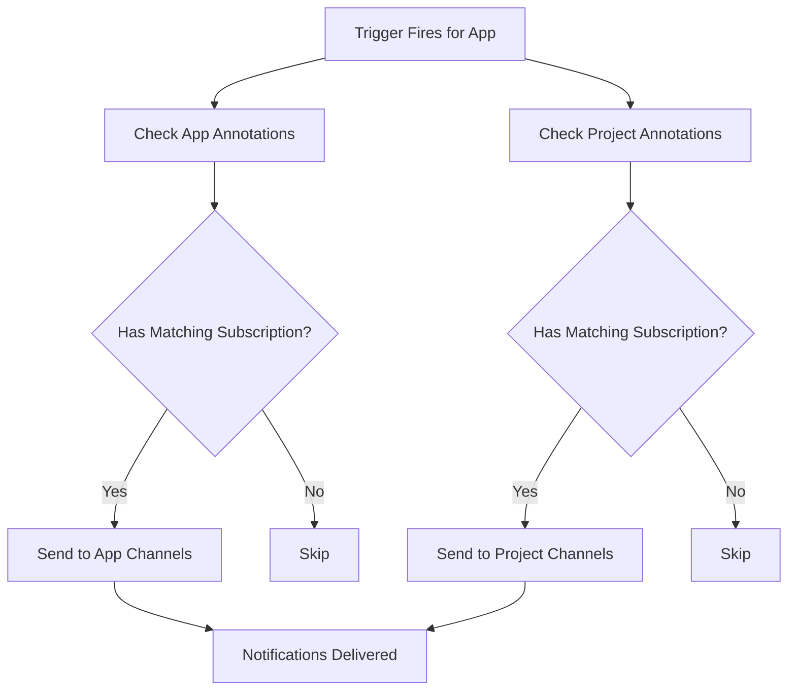

# How to Subscribe Projects to Notification Channels in ArgoCD

Author: [nawazdhandala](https://github.com/nawazdhandala)

Tags: ArgoCD, GitOps, Kubernetes, Notifications, DevOps

Description: Learn how to subscribe entire ArgoCD projects to notification channels so all applications within a project automatically receive alerts without individual annotation management.

---

When you manage dozens or hundreds of applications in ArgoCD, annotating each one individually with notification subscriptions becomes tedious and error-prone. ArgoCD supports project-level notification subscriptions, which automatically apply to every application in that project. This means you configure notifications once on the AppProject resource, and every application inherits those subscriptions.

## How Project-Level Subscriptions Work

ArgoCD notifications support subscriptions on `AppProject` resources using the same annotation pattern as Application subscriptions. When a notification trigger fires for an application, the notifications controller checks both the Application annotations and the parent Project annotations, then sends notifications to all matched channels.

The annotation format is identical:

```
notifications.argoproj.io/subscribe.<trigger-name>.<service-name>: <recipient>
```

The difference is that you place this annotation on the `AppProject` resource instead of individual `Application` resources.

## Basic Project Subscription

Here is an AppProject with notification subscriptions:

```yaml
apiVersion: argoproj.io/v1alpha1
kind: AppProject
metadata:
  name: production
  namespace: argocd
  annotations:
    # All apps in this project will notify on sync failure
    notifications.argoproj.io/subscribe.on-sync-failed.slack: prod-alerts
    # All apps in this project will notify on health degradation
    notifications.argoproj.io/subscribe.on-health-degraded.slack: prod-alerts
    # All apps in this project will notify on successful deploy
    notifications.argoproj.io/subscribe.on-deployed.slack: prod-deployments
spec:
  description: Production applications
  sourceRepos:
    - 'https://github.com/company/*'
  destinations:
    - namespace: '*'
      server: https://kubernetes.default.svc
```

Now every Application that specifies `spec.project: production` will automatically have these notification subscriptions without needing any annotations on the Application itself.

## Project Subscriptions with Multiple Services

Route project-level notifications through multiple channels:

```yaml
apiVersion: argoproj.io/v1alpha1
kind: AppProject
metadata:
  name: production
  namespace: argocd
  annotations:
    # Slack notifications
    notifications.argoproj.io/subscribe.on-sync-failed.slack: prod-alerts
    notifications.argoproj.io/subscribe.on-health-degraded.slack: prod-alerts
    notifications.argoproj.io/subscribe.on-deployed.slack: prod-deployments
    # Email notifications for failures
    notifications.argoproj.io/subscribe.on-sync-failed.email: prod-oncall@company.com
    # PagerDuty for critical alerts
    notifications.argoproj.io/subscribe.on-sync-failed.pagerduty: ""
    notifications.argoproj.io/subscribe.on-health-degraded.pagerduty: ""
```

## Different Projects, Different Channels

The real power of project subscriptions shows when you have multiple projects for different teams or environments:

```yaml
# Production project - high urgency alerts
apiVersion: argoproj.io/v1alpha1
kind: AppProject
metadata:
  name: production
  namespace: argocd
  annotations:
    notifications.argoproj.io/subscribe.on-sync-failed.slack: prod-alerts-critical
    notifications.argoproj.io/subscribe.on-sync-failed.pagerduty: ""
    notifications.argoproj.io/subscribe.on-health-degraded.slack: prod-alerts-critical
    notifications.argoproj.io/subscribe.on-health-degraded.pagerduty: ""
    notifications.argoproj.io/subscribe.on-deployed.slack: prod-deployments
spec:
  description: Production applications
  sourceRepos:
    - 'https://github.com/company/*'
  destinations:
    - namespace: 'prod-*'
      server: https://kubernetes.default.svc

---
# Staging project - informational alerts only
apiVersion: argoproj.io/v1alpha1
kind: AppProject
metadata:
  name: staging
  namespace: argocd
  annotations:
    notifications.argoproj.io/subscribe.on-sync-failed.slack: staging-deployments
    notifications.argoproj.io/subscribe.on-deployed.slack: staging-deployments
spec:
  description: Staging applications
  sourceRepos:
    - 'https://github.com/company/*'
  destinations:
    - namespace: 'staging-*'
      server: https://kubernetes.default.svc

---
# Dev project - minimal alerts
apiVersion: argoproj.io/v1alpha1
kind: AppProject
metadata:
  name: development
  namespace: argocd
  annotations:
    notifications.argoproj.io/subscribe.on-sync-failed.slack: dev-general
spec:
  description: Development applications
  sourceRepos:
    - 'https://github.com/company/*'
  destinations:
    - namespace: 'dev-*'
      server: https://kubernetes.default.svc
```

## Combining Project and Application Subscriptions

Project subscriptions do not replace application subscriptions. They are additive. If both the project and the application have subscriptions, notifications go to all configured channels.

```yaml
# Project subscribes all apps to general alerts
apiVersion: argoproj.io/v1alpha1
kind: AppProject
metadata:
  name: production
  annotations:
    notifications.argoproj.io/subscribe.on-sync-failed.slack: prod-alerts

---
# Individual app adds its own team-specific channel
apiVersion: argoproj.io/v1alpha1
kind: Application
metadata:
  name: payment-service
  annotations:
    # This is in ADDITION to the project subscription
    notifications.argoproj.io/subscribe.on-sync-failed.slack: team-payments-alerts
    notifications.argoproj.io/subscribe.on-sync-failed.pagerduty: ""
spec:
  project: production
```

When payment-service sync fails, notifications go to:
- `#prod-alerts` (from the project subscription)
- `#team-payments-alerts` (from the application subscription)
- PagerDuty (from the application subscription)

This layered approach lets platform teams set baseline alerting at the project level while individual teams add their own channels.

## Notification Flow with Projects

Here is how the notification system evaluates subscriptions:



## Adding Project Subscriptions via CLI

You can add subscriptions to existing projects using kubectl:

```bash
# Add a Slack subscription to a project
kubectl annotate appproject production \
  -n argocd \
  notifications.argoproj.io/subscribe.on-sync-failed.slack=prod-alerts

# Add a PagerDuty subscription
kubectl annotate appproject production \
  -n argocd \
  notifications.argoproj.io/subscribe.on-sync-failed.pagerduty=""

# Update an existing subscription
kubectl annotate appproject production \
  -n argocd \
  notifications.argoproj.io/subscribe.on-sync-failed.slack=new-channel \
  --overwrite

# Remove a subscription
kubectl annotate appproject production \
  -n argocd \
  notifications.argoproj.io/subscribe.on-sync-failed.slack-
```

## Team-Based Project Structure

A common pattern is to create one project per team with team-specific notification routing:

```yaml
# Backend team project
apiVersion: argoproj.io/v1alpha1
kind: AppProject
metadata:
  name: team-backend
  namespace: argocd
  annotations:
    notifications.argoproj.io/subscribe.on-sync-failed.slack: team-backend-alerts
    notifications.argoproj.io/subscribe.on-deployed.slack: team-backend-deploys
    notifications.argoproj.io/subscribe.on-health-degraded.slack: team-backend-alerts
spec:
  description: Backend team services
  sourceRepos:
    - 'https://github.com/company/backend-*'
  destinations:
    - namespace: 'backend-*'
      server: https://kubernetes.default.svc

---
# Frontend team project
apiVersion: argoproj.io/v1alpha1
kind: AppProject
metadata:
  name: team-frontend
  namespace: argocd
  annotations:
    notifications.argoproj.io/subscribe.on-sync-failed.slack: team-frontend-alerts
    notifications.argoproj.io/subscribe.on-deployed.slack: team-frontend-deploys
    notifications.argoproj.io/subscribe.on-health-degraded.slack: team-frontend-alerts
spec:
  description: Frontend team services
  sourceRepos:
    - 'https://github.com/company/frontend-*'
  destinations:
    - namespace: 'frontend-*'
      server: https://kubernetes.default.svc
```

When a new application is added to the `team-backend` project, it automatically gets the team's notification routing without any additional configuration.

## Verifying Project Subscriptions

Check the subscriptions on a project:

```bash
# View all annotations on a project
kubectl get appproject production -n argocd -o json | \
  jq '.metadata.annotations | to_entries[] | select(.key | startswith("notifications"))'

# List all projects with their notification subscriptions
kubectl get appprojects -n argocd -o json | \
  jq '.items[] | {name: .metadata.name, notifications: [.metadata.annotations // {} | to_entries[] | select(.key | startswith("notifications"))]}'
```

## Common Pitfalls

**Duplicate notifications**: If both the project and the application subscribe to the same trigger and channel, you will get duplicate messages. ArgoCD does not deduplicate across project and application subscriptions.

**Default project limitations**: The `default` project is created automatically and any application without a specified project goes into it. Be careful about adding broad subscriptions to the default project because it catches everything.

**Trigger must exist**: The trigger name in the annotation must be defined in `argocd-notifications-cm`. A missing trigger definition means the subscription silently does nothing.

**Service must be configured**: Just like application subscriptions, the service (slack, email, pagerduty, etc.) must be configured in the notifications ConfigMap with valid credentials.

Project subscriptions are the most efficient way to manage notifications at scale. For more granular control at the application level, see [how to subscribe individual applications to notification channels](https://oneuptime.com/blog/post/2026-02-26-argocd-subscribe-applications-notifications/view). For annotation-based subscription patterns, check out [using notification subscriptions with annotations](https://oneuptime.com/blog/post/2026-02-26-argocd-notification-subscriptions-annotations/view).
