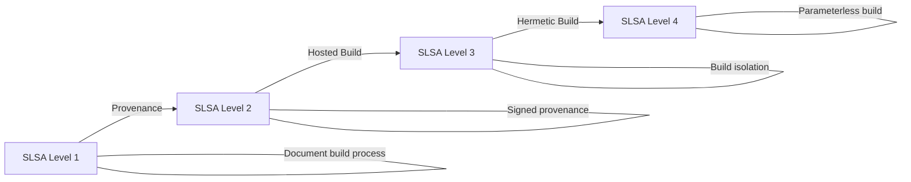

# How to Implement Supply Chain Security with ArgoCD

Author: [nawazdhandala](https://github.com/nawazdhandala)

Tags: ArgoCD, GitOps, Kubernetes, Supply Chain Security, SLSA

Description: Learn how to implement end-to-end supply chain security with ArgoCD, covering SLSA compliance, provenance tracking, SBOM integration, and policy enforcement through GitOps.

---

Software supply chain security has become one of the most critical concerns in modern DevOps. With ArgoCD managing your deployments, you have a unique opportunity to enforce supply chain security policies at every stage of the delivery pipeline. This post covers implementing a comprehensive supply chain security strategy using ArgoCD as the enforcement point.

## What Is Supply Chain Security

Supply chain security ensures that every component in your software delivery pipeline is trusted and verified - from source code to running containers. The SLSA (Supply chain Levels for Software Artifacts) framework defines four levels of maturity:



ArgoCD primarily helps enforce Levels 1 through 3 by verifying provenance, signatures, and attestations before deploying.

## The Supply Chain Security Stack

A complete supply chain security implementation with ArgoCD includes these components:

```yaml
# Deploy the entire security stack with an ApplicationSet
apiVersion: argoproj.io/v1alpha1
kind: ApplicationSet
metadata:
  name: supply-chain-security
  namespace: argocd
spec:
  generators:
    - list:
        elements:
          - name: kyverno
            namespace: kyverno
            chart: kyverno
            repoURL: https://kyverno.github.io/kyverno
            version: 3.1.0
          - name: sigstore-policy-controller
            namespace: cosign-system
            chart: policy-controller
            repoURL: https://sigstore.github.io/helm-charts
            version: 0.6.6
  template:
    metadata:
      name: "security-{{name}}"
    spec:
      project: security
      source:
        repoURL: "{{repoURL}}"
        chart: "{{chart}}"
        targetRevision: "{{version}}"
      destination:
        server: https://kubernetes.default.svc
        namespace: "{{namespace}}"
      syncPolicy:
        automated:
          selfHeal: true
          prune: true
        syncOptions:
          - CreateNamespace=true
          - ServerSideApply=true
```

## Provenance Verification

Build provenance records who built an artifact, from what source, using what build system. Verify provenance in ArgoCD deployments:

```yaml
# policies/verify-provenance.yaml
apiVersion: kyverno.io/v1
kind: ClusterPolicy
metadata:
  name: verify-slsa-provenance
  annotations:
    policies.kyverno.io/title: Verify SLSA Provenance
    policies.kyverno.io/severity: critical
spec:
  validationFailureAction: Enforce
  rules:
    - name: check-provenance
      match:
        any:
          - resources:
              kinds:
                - Pod
              namespaces:
                - production
      verifyImages:
        - imageReferences:
            - "registry.example.com/*"
          attestations:
            - type: https://slsa.dev/provenance/v1
              conditions:
                - all:
                    # Verify the build was from our GitHub org
                    - key: "{{ buildDefinition.externalParameters.source.uri }}"
                      operator: AnyIn
                      value:
                        - "https://github.com/your-org/*"
                    # Verify the build system is trusted
                    - key: "{{ runDetails.builder.id }}"
                      operator: AnyIn
                      value:
                        - "https://github.com/your-org/build-pipeline"
                        - "https://tekton.dev/chains/v2"
              attestors:
                - entries:
                    - keyless:
                        subject: "https://github.com/your-org/*"
                        issuer: "https://token.actions.githubusercontent.com"
```

## Generating SLSA Provenance in CI

Set up your CI pipeline to generate SLSA provenance:

```yaml
# .github/workflows/build-with-provenance.yaml
name: Build with SLSA Provenance
on:
  push:
    branches: [main]

jobs:
  build:
    runs-on: ubuntu-latest
    permissions:
      id-token: write    # Required for keyless signing
      contents: read
      packages: write
    steps:
      - uses: actions/checkout@v4

      - name: Install cosign
        uses: sigstore/cosign-installer@v3

      - name: Build and push image
        id: build
        run: |
          IMAGE=registry.example.com/myapp:${{ github.sha }}
          docker build -t $IMAGE .
          docker push $IMAGE
          DIGEST=$(docker inspect --format='{{index .RepoDigests 0}}' $IMAGE)
          echo "digest=$DIGEST" >> $GITHUB_OUTPUT

      - name: Generate SLSA provenance
        run: |
          cat > provenance.json <<EOF
          {
            "_type": "https://in-toto.io/Statement/v1",
            "subject": [{
              "name": "registry.example.com/myapp",
              "digest": {"sha256": "${{ steps.build.outputs.digest }}"}
            }],
            "predicateType": "https://slsa.dev/provenance/v1",
            "predicate": {
              "buildDefinition": {
                "buildType": "https://github.com/your-org/build-pipeline",
                "externalParameters": {
                  "source": {
                    "uri": "https://github.com/${{ github.repository }}",
                    "digest": {"sha1": "${{ github.sha }}"}
                  }
                }
              },
              "runDetails": {
                "builder": {
                  "id": "https://github.com/${{ github.repository }}/actions"
                },
                "metadata": {
                  "invocationId": "${{ github.run_id }}",
                  "startedOn": "$(date -u +%Y-%m-%dT%H:%M:%SZ)"
                }
              }
            }
          }
          EOF

      - name: Sign and attest provenance
        env:
          COSIGN_EXPERIMENTAL: "1"
        run: |
          # Keyless signing tied to GitHub Actions OIDC
          cosign sign ${{ steps.build.outputs.digest }}

          # Attest provenance
          cosign attest \
            --predicate provenance.json \
            --type slsaprovenance \
            ${{ steps.build.outputs.digest }}
```

## Dependency Verification

Verify that base images and dependencies are also signed and trusted:

```yaml
# policies/verify-base-images.yaml
apiVersion: kyverno.io/v1
kind: ClusterPolicy
metadata:
  name: verify-base-images
spec:
  validationFailureAction: Enforce
  rules:
    - name: verify-approved-base-images
      match:
        any:
          - resources:
              kinds:
                - Pod
      validate:
        message: "Only approved base images are allowed"
        pattern:
          spec:
            containers:
              - image: "registry.example.com/* | docker.io/library/alpine:* | docker.io/library/nginx:* | gcr.io/distroless/*"
```

## Git Commit Signing Verification

ArgoCD can verify that the Git commits it syncs from are signed:

```yaml
# In argocd-cm ConfigMap
apiVersion: v1
kind: ConfigMap
metadata:
  name: argocd-cm
  namespace: argocd
data:
  # Enable GPG signature verification for Git repos
  gpg.enabled: "true"
```

```yaml
# Add GPG keys for trusted developers
apiVersion: v1
kind: ConfigMap
metadata:
  name: argocd-gpg-keys-cm
  namespace: argocd
data:
  developer1: |
    -----BEGIN PGP PUBLIC KEY BLOCK-----
    ...
    -----END PGP PUBLIC KEY BLOCK-----
```

Then configure your ArgoCD Project to require signed commits:

```yaml
apiVersion: argoproj.io/v1alpha1
kind: AppProject
metadata:
  name: production
  namespace: argocd
spec:
  signatureKeys:
    - keyID: "ABCDEF1234567890"
    - keyID: "1234567890ABCDEF"
  sourceRepos:
    - "https://github.com/your-org/*"
  destinations:
    - namespace: production
      server: https://kubernetes.default.svc
```

## Registry Policies

Enforce that only images from trusted registries can be deployed:

```yaml
# policies/trusted-registries.yaml
apiVersion: kyverno.io/v1
kind: ClusterPolicy
metadata:
  name: restrict-image-registries
spec:
  validationFailureAction: Enforce
  rules:
    - name: only-trusted-registries
      match:
        any:
          - resources:
              kinds:
                - Pod
              namespaces:
                - production
                - staging
      validate:
        message: >-
          Images must come from trusted registries.
          Allowed: registry.example.com, gcr.io/distroless
        pattern:
          spec:
            =(initContainers):
              - image: "registry.example.com/* | gcr.io/distroless/*"
            containers:
              - image: "registry.example.com/* | gcr.io/distroless/*"
```

## PreSync Supply Chain Verification

Combine all checks in a comprehensive PreSync hook:

```yaml
# hooks/supply-chain-gate.yaml
apiVersion: batch/v1
kind: Job
metadata:
  name: supply-chain-gate
  annotations:
    argocd.argoproj.io/hook: PreSync
    argocd.argoproj.io/hook-delete-policy: BeforeHookCreation
spec:
  template:
    spec:
      containers:
        - name: verifier
          image: bitnami/cosign:latest
          command:
            - /bin/sh
            - -c
            - |
              IMAGE="registry.example.com/myapp:v2.0.0"

              echo "=== Supply Chain Verification ==="

              # Step 1: Verify image signature
              echo "1. Checking image signature..."
              cosign verify --key /keys/cosign.pub "$IMAGE"
              [ $? -ne 0 ] && echo "FAIL: Image not signed" && exit 1

              # Step 2: Verify SLSA provenance attestation
              echo "2. Checking SLSA provenance..."
              cosign verify-attestation \
                --key /keys/cosign.pub \
                --type slsaprovenance \
                "$IMAGE"
              [ $? -ne 0 ] && echo "FAIL: No provenance attestation" && exit 1

              # Step 3: Verify vulnerability scan attestation
              echo "3. Checking vulnerability scan..."
              cosign verify-attestation \
                --key /keys/cosign.pub \
                --type vuln \
                "$IMAGE"
              [ $? -ne 0 ] && echo "FAIL: No vulnerability scan attestation" && exit 1

              # Step 4: Verify SBOM attestation
              echo "4. Checking SBOM..."
              cosign verify-attestation \
                --key /keys/cosign.pub \
                --type spdx \
                "$IMAGE"
              [ $? -ne 0 ] && echo "WARN: No SBOM attestation (non-blocking)"

              echo ""
              echo "=== Supply chain verification PASSED ==="
          volumeMounts:
            - name: cosign-key
              mountPath: /keys
      volumes:
        - name: cosign-key
          secret:
            secretName: cosign-pub
      restartPolicy: Never
  backoffLimit: 1
```

## Monitoring Supply Chain Compliance

Track supply chain compliance across all deployments and use [OneUptime](https://oneuptime.com) to monitor for policy violations and unsigned deployment attempts.

## Summary

Implementing supply chain security with ArgoCD creates a trust chain from source code to running containers. The approach involves signing images in CI, generating SLSA provenance, attaching SBOMs and vulnerability scans as attestations, verifying everything through ArgoCD PreSync hooks and admission controllers, and enforcing registry and commit signing policies. ArgoCD serves as the ideal enforcement point because all deployments flow through it, making it impossible to bypass supply chain checks. Every policy is managed as code in Git, giving you a fully auditable security posture.
