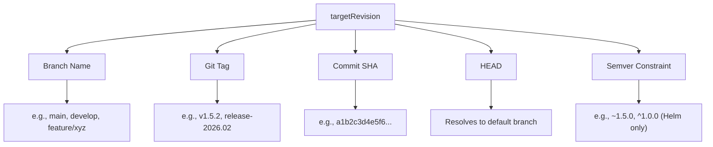

# How to Switch Between Tracking Strategies in ArgoCD

Author: [nawazdhandala](https://github.com/nawazdhandala)

Tags: ArgoCD, GitOps, Kubernetes, Deployment, CI/CD

Description: Learn how to switch between branch tracking, tag tracking, commit pinning, and semver strategies in ArgoCD for different environments and use cases.

---

ArgoCD supports multiple ways to track your source repository - branches, tags, commit SHAs, HEAD, and semver constraints. Choosing the right strategy for each environment is important, and knowing how to switch between them is equally critical. Whether you are promoting an application from staging to production or locking down a deployment during an incident, you need to be able to change tracking strategies smoothly.

This guide covers all the tracking strategies available in ArgoCD, when to use each one, and exactly how to switch between them.

## The Four Tracking Strategies

ArgoCD supports four primary tracking strategies through the `targetRevision` field:



Each one is appropriate for different situations:

| Strategy | Best For | Stability | Automation |
|----------|----------|-----------|------------|
| Branch | Dev/staging | Low - changes constantly | High - auto-deploy on push |
| Tag | Production releases | High - immutable reference | Medium - explicit promotion |
| Commit SHA | Incident response, compliance | Highest - absolute reference | Low - manual updates |
| HEAD | Simple setups, templates | Low - follows default branch | High - automatic |
| Semver | Helm chart versioning | Configurable via constraints | Medium to high |

## Switching Strategies via CLI

The `argocd app set` command lets you change the tracking strategy at any time:

```bash
# Switch from branch to tag
argocd app set my-app --revision v1.5.2

# Switch from tag to commit
argocd app set my-app --revision a1b2c3d4e5f6a1b2c3d4e5f6a1b2c3d4e5f6a1b2

# Switch from commit back to branch
argocd app set my-app --revision main

# Switch to HEAD
argocd app set my-app --revision HEAD

# For Helm chart apps, switch to semver constraint
argocd app set my-app --revision "~1.5.0"
```

After switching, trigger a sync if auto-sync is not enabled:

```bash
argocd app sync my-app
```

## Switching Strategies via Application Manifest

If you manage your ArgoCD applications declaratively (recommended), update the `targetRevision` in the manifest:

```yaml
apiVersion: argoproj.io/v1alpha1
kind: Application
metadata:
  name: my-app
  namespace: argocd
spec:
  source:
    repoURL: https://github.com/myorg/my-manifests.git
    # Change this value to switch strategies:
    # Branch:  targetRevision: main
    # Tag:     targetRevision: v1.5.2
    # Commit:  targetRevision: a1b2c3d4e5f6...
    # HEAD:    targetRevision: HEAD
    targetRevision: v1.5.2
    path: k8s/overlays/production
  destination:
    server: https://kubernetes.default.svc
    namespace: production
```

Commit this change to your app-of-apps repository and let ArgoCD sync it.

## Real-World Strategy Switching Scenarios

### Scenario 1: Promoting from Staging to Production

Your staging environment tracks a branch, and you want to promote a tested version to production using a tag:

```bash
# Step 1: Check what commit staging is running
argocd app get my-app-staging -o json | jq -r '.status.sync.revision'
# Output: a1b2c3d4e5f6...

# Step 2: Create a release tag at that commit
git tag -a v1.6.0 a1b2c3d4 -m "Release 1.6.0"
git push origin v1.6.0

# Step 3: Update production to track the new tag
argocd app set my-app-production --revision v1.6.0

# Step 4: Sync production
argocd app sync my-app-production
```

### Scenario 2: Emergency Lockdown During Incident

Switch from branch tracking to commit pinning to freeze a production deployment:

```bash
# Step 1: Get the current deployed commit
CURRENT_COMMIT=$(argocd app get my-app-production -o json | jq -r '.status.sync.revision')
echo "Currently deployed: $CURRENT_COMMIT"

# Step 2: Pin to this specific commit
argocd app set my-app-production --revision $CURRENT_COMMIT

# Step 3: Disable auto-sync to prevent any changes
argocd app set my-app-production --sync-policy none

echo "Application is now pinned and locked"
```

### Scenario 3: Post-Incident Recovery

After resolving an incident, switch back to normal tracking:

```bash
# Step 1: Verify the fix is on the main branch
git log main --oneline -3

# Step 2: Switch back to branch tracking
argocd app set my-app-production --revision main

# Step 3: Re-enable auto-sync
argocd app set my-app-production \
  --sync-policy automated \
  --auto-prune \
  --self-heal

# Step 4: Sync and verify
argocd app sync my-app-production
argocd app get my-app-production
```

### Scenario 4: Gradual Migration from Branch to Tag Tracking

If your team is moving from branch-based deployments to tag-based releases:

```bash
# Phase 1: Document current state
argocd app get my-app-production -o json | jq '{
  targetRevision: .spec.source.targetRevision,
  syncedRevision: .status.sync.revision,
  syncStatus: .status.sync.status
}'

# Phase 2: Create a tag at the current commit
CURRENT_COMMIT=$(argocd app get my-app-production -o json | jq -r '.status.sync.revision')
git tag -a v1.0.0 $CURRENT_COMMIT -m "Initial versioned release"
git push origin v1.0.0

# Phase 3: Switch to tag tracking
argocd app set my-app-production --revision v1.0.0

# Phase 4: Verify - app should stay Synced since the commit hasn't changed
argocd app get my-app-production
```

## Automating Strategy Switches

You can automate tracking strategy changes using CI/CD pipelines. Here is an example that automatically promotes the latest tag to production:

```yaml
# .github/workflows/promote.yaml
name: Promote to Production
on:
  workflow_dispatch:
    inputs:
      version:
        description: 'Version tag to deploy (e.g., v1.6.0)'
        required: true

jobs:
  promote:
    runs-on: ubuntu-latest
    steps:
      - name: Install ArgoCD CLI
        run: |
          curl -sSL -o argocd https://github.com/argoproj/argo-cd/releases/latest/download/argocd-linux-amd64
          chmod +x argocd
          sudo mv argocd /usr/local/bin/

      - name: Login to ArgoCD
        run: |
          argocd login argocd.example.com \
            --username admin \
            --password "${{ secrets.ARGOCD_PASSWORD }}" \
            --grpc-web

      - name: Switch to tag tracking
        run: |
          argocd app set my-app-production \
            --revision "${{ github.event.inputs.version }}"
          argocd app sync my-app-production --prune
          argocd app wait my-app-production --health --timeout 300
```

## Validating After a Strategy Switch

After switching strategies, always validate:

```bash
# Check the new target revision
argocd app get my-app -o json | jq '.spec.source.targetRevision'

# Check sync status
argocd app get my-app -o json | jq '.status.sync.status'

# Check health status
argocd app get my-app -o json | jq '.status.health.status'

# View the app history to see the transition
argocd app history my-app
```

## Summary

Switching between tracking strategies in ArgoCD is a single-field change - update `targetRevision` to a branch name, tag, commit SHA, HEAD, or semver constraint. The key is knowing which strategy to use for each environment and situation. Use branch or HEAD tracking for development, tag or semver for production releases, and commit pinning for emergency lockdowns. For detailed guides on each strategy, see our posts on [branch tracking](https://oneuptime.com/blog/post/2026-02-26-argocd-track-git-branch/view), [tag tracking](https://oneuptime.com/blog/post/2026-02-26-argocd-track-git-tag/view), and [commit pinning](https://oneuptime.com/blog/post/2026-02-26-argocd-pin-specific-git-commit/view).
