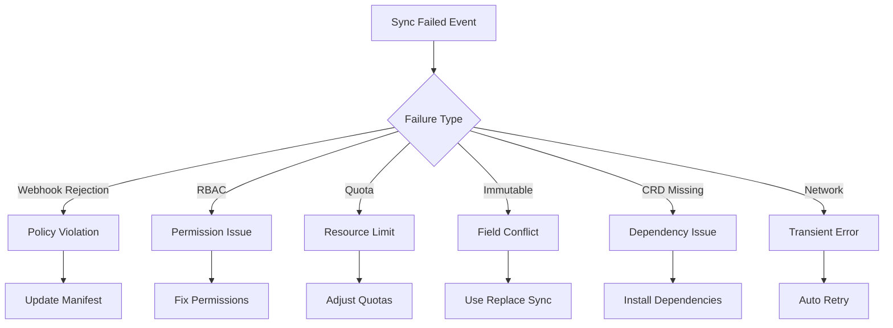

# How to Handle Sync Failed Events in ArgoCD

Author: [nawazdhandala](https://github.com/nawazdhandala)

Tags: ArgoCD, GitOps, Kubernetes, Troubleshooting, CI/CD

Description: Learn how to detect, diagnose, and automatically respond to sync failures in ArgoCD with notifications, automated diagnostics, and self-remediation patterns.

---

Sync failures are among the most common operational issues in ArgoCD. A failed sync means ArgoCD could not reconcile the desired state in Git with the actual state in the cluster. This can happen due to invalid manifests, resource conflicts, RBAC issues, webhook rejections, or resource quota limits. Detecting and responding to sync failures quickly is essential for maintaining the reliability of your GitOps pipeline.

This guide covers detecting sync failures through notifications, building automated diagnostic workflows, implementing retry strategies, and creating escalation paths.

## Common Causes of Sync Failures

Before diving into event handling, understanding why syncs fail helps you build better automation:

- **Invalid manifests**: YAML syntax errors or invalid field values
- **Admission webhook rejection**: OPA/Gatekeeper, Kyverno, or custom webhooks blocking resources
- **Resource conflicts**: Another process modified a resource ArgoCD is trying to manage
- **Resource quota exceeded**: Namespace quotas blocking resource creation
- **RBAC insufficient**: ArgoCD service account lacks permissions
- **CRD missing**: Custom Resource Definition not installed
- **Immutable field changes**: Attempting to change fields that cannot be updated in place
- **Image pull failures**: Container images that do not exist or require authentication

## Setting Up Sync Failure Notifications

Configure ArgoCD Notifications to detect sync failures:

```yaml
# argocd-notifications-cm ConfigMap
apiVersion: v1
kind: ConfigMap
metadata:
  name: argocd-notifications-cm
  namespace: argocd
data:
  # Trigger on sync failure
  trigger.on-sync-failed: |
    - description: Application sync has failed
      when: app.status.operationState.phase in ['Error', 'Failed']
      oncePer: app.status.operationState.syncResult.revision
      send:
        - sync-failed-alert
        - sync-failed-diagnostics
        - sync-failed-ticket

  # Trigger on sync running too long
  trigger.on-sync-stuck: |
    - description: Sync is running longer than expected
      when: app.status.operationState.phase == 'Running' and
            time.Now().Sub(time.Parse(app.status.operationState.startedAt)).Minutes() > 30
      send:
        - sync-stuck-alert

  # Detailed failure alert
  template.sync-failed-alert: |
    slack:
      channel: "{{index .app.metadata.labels "alert-channel" | default "platform-alerts"}}"
      title: "SYNC FAILED: {{.app.metadata.name}}"
      text: |
        *Application*: {{.app.metadata.name}}
        *Project*: {{.app.spec.project}}
        *Namespace*: {{.app.spec.destination.namespace}}
        *Revision*: `{{.app.status.operationState.syncResult.revision | truncate 8}}`
        *Phase*: {{.app.status.operationState.phase}}
        *Message*: {{.app.status.operationState.message}}
        *Started*: {{.app.status.operationState.startedAt}}

        *Failed Resources:*
        {{range .app.status.operationState.syncResult.resources}}
        {{if and (ne .status "Synced") (ne .status "Healthy")}}
        - {{.kind}}/{{.name}}: {{.message}}
        {{end}}
        {{end}}

        *Initiated by*: {{.app.status.operationState.operation.initiatedBy.username | default "auto-sync"}}

        <https://argocd.company.com/applications/{{.app.metadata.name}}|View in ArgoCD>
      color: "#FF0000"

  # Webhook for diagnostics system
  template.sync-failed-diagnostics: |
    webhook:
      diagnostics-api:
        method: POST
        body: |
          {
            "event": "sync.failed",
            "application": "{{.app.metadata.name}}",
            "project": "{{.app.spec.project}}",
            "namespace": "{{.app.spec.destination.namespace}}",
            "revision": "{{.app.status.operationState.syncResult.revision}}",
            "phase": "{{.app.status.operationState.phase}}",
            "message": "{{.app.status.operationState.message}}",
            "startedAt": "{{.app.status.operationState.startedAt}}",
            "finishedAt": "{{.app.status.operationState.finishedAt}}",
            "resources": [
              {{$first := true}}
              {{range .app.status.operationState.syncResult.resources}}
              {{if not $first}},{{end}}
              {
                "group": "{{.group}}",
                "version": "{{.version}}",
                "kind": "{{.kind}}",
                "name": "{{.name}}",
                "namespace": "{{.namespace}}",
                "status": "{{.status}}",
                "message": "{{.message}}"
              }
              {{$first = false}}
              {{end}}
            ]
          }

  # Create support ticket
  template.sync-failed-ticket: |
    webhook:
      ticketing-api:
        method: POST
        body: |
          {
            "title": "ArgoCD Sync Failed: {{.app.metadata.name}}",
            "priority": "{{index .app.metadata.labels "priority" | default "medium"}}",
            "team": "{{index .app.metadata.labels "team" | default "platform"}}",
            "description": "Sync failed for application {{.app.metadata.name}} in namespace {{.app.spec.destination.namespace}}. Error: {{.app.status.operationState.message}}",
            "labels": ["argocd", "sync-failure", "{{.app.spec.project}}"]
          }

  # Stuck sync alert
  template.sync-stuck-alert: |
    slack:
      channel: platform-alerts
      title: "SYNC STUCK: {{.app.metadata.name}}"
      text: |
        *Application*: {{.app.metadata.name}}
        *Status*: Sync has been running for over 30 minutes
        *Started*: {{.app.status.operationState.startedAt}}
        This may indicate a resource that cannot reach ready state.
      color: "#FFA500"

  # Services
  service.webhook.diagnostics-api: |
    url: https://diagnostics.internal.company.com/api/v1/events
    headers:
      - name: Content-Type
        value: application/json
      - name: Authorization
        value: $diagnostics-api-token

  service.webhook.ticketing-api: |
    url: https://tickets.internal.company.com/api/v1/tickets
    headers:
      - name: Content-Type
        value: application/json
      - name: Authorization
        value: $ticketing-api-token
```

## Automated Diagnostics

Build an automated diagnostics system that runs when a sync fails:

```python
# diagnostics/sync_failure_analyzer.py
import json
import logging

logger = logging.getLogger(__name__)

class SyncFailureAnalyzer:
    """Analyze sync failures and suggest remediation."""

    def analyze(self, event):
        """Analyze a sync failure event and return diagnostics."""
        message = event.get('message', '')
        resources = event.get('resources', [])
        diagnostics = {
            'application': event['application'],
            'root_cause': 'unknown',
            'remediation': [],
            'auto_fixable': False
        }

        # Check for common failure patterns
        if 'admission webhook' in message.lower():
            diagnostics['root_cause'] = 'admission_webhook_rejection'
            diagnostics['remediation'] = [
                'Check OPA/Gatekeeper policies',
                'Review webhook logs for rejection reason',
                'Ensure manifests comply with cluster policies'
            ]

        elif 'forbidden' in message.lower() or 'rbac' in message.lower():
            diagnostics['root_cause'] = 'insufficient_permissions'
            diagnostics['remediation'] = [
                'Check ArgoCD service account permissions',
                'Review ClusterRole/RoleBindings',
                'Verify AppProject source/destination permissions'
            ]
            diagnostics['auto_fixable'] = False

        elif 'quota' in message.lower():
            diagnostics['root_cause'] = 'resource_quota_exceeded'
            diagnostics['remediation'] = [
                'Check namespace resource quotas',
                'Reduce resource requests in manifests',
                'Request quota increase from platform team'
            ]

        elif 'immutable' in message.lower():
            diagnostics['root_cause'] = 'immutable_field_change'
            diagnostics['remediation'] = [
                'Delete and recreate the resource',
                'Use replace sync option',
                'Add argocd.argoproj.io/sync-options: Replace=true annotation'
            ]
            diagnostics['auto_fixable'] = True

        elif 'not found' in message.lower() and 'crd' in message.lower():
            diagnostics['root_cause'] = 'missing_crd'
            diagnostics['remediation'] = [
                'Install required CRD before syncing',
                'Use sync waves to order CRD installation',
                'Check if operator is installed'
            ]

        # Check individual resource failures
        failed_resources = [
            r for r in resources
            if r.get('status') not in ['Synced', 'Healthy', 'Succeeded']
        ]
        diagnostics['failed_resources'] = failed_resources
        diagnostics['total_failed'] = len(failed_resources)

        return diagnostics
```

## Retry Strategies

Configure intelligent retry behavior for transient failures:

```yaml
# In your ArgoCD Application
spec:
  syncPolicy:
    automated:
      prune: true
      selfHeal: true
    retry:
      limit: 5
      backoff:
        duration: 5s      # Initial backoff
        factor: 2          # Exponential factor
        maxDuration: 3m    # Maximum wait between retries
```

For more fine-grained control, handle retries programmatically:

```yaml
# Custom retry logic in notifications
trigger.on-sync-failed-with-retry: |
  - description: Sync failed, assess retry
    when: >-
      app.status.operationState.phase in ['Error', 'Failed'] and
      app.status.operationState.retryCount < 3
    send:
      - retry-sync

template.retry-sync: |
  webhook:
    argocd-api:
      method: POST
      path: "/api/v1/applications/{{.app.metadata.name}}/sync"
      body: |
        {
          "revision": "{{.app.status.operationState.syncResult.revision}}",
          "prune": true,
          "strategy": {
            "apply": {
              "force": false
            }
          }
        }
```

## Sync Failure Dashboard

Track sync failures over time to identify patterns:



## Escalation Path

Build an escalation workflow based on failure duration:

```yaml
# First failure: notify team channel
trigger.sync-failed-initial: |
  - when: app.status.operationState.phase in ['Error', 'Failed']
    oncePer: app.status.operationState.syncResult.revision
    send: [slack-team-channel]

# Failed for 15+ minutes: page on-call
trigger.sync-failed-escalate: |
  - when: >-
      app.status.operationState.phase in ['Error', 'Failed'] and
      time.Now().Sub(time.Parse(app.status.operationState.finishedAt)).Minutes() > 15
    send: [pagerduty-oncall]

# Failed for 1+ hour: escalate to management
trigger.sync-failed-critical: |
  - when: >-
      app.status.operationState.phase in ['Error', 'Failed'] and
      time.Now().Sub(time.Parse(app.status.operationState.finishedAt)).Hours() > 1
    send: [slack-management, create-incident]
```

## Application Annotations for Subscriptions

```yaml
metadata:
  annotations:
    notifications.argoproj.io/subscribe.on-sync-failed.slack: ""
    notifications.argoproj.io/subscribe.on-sync-failed.diagnostics-api: ""
    notifications.argoproj.io/subscribe.on-sync-stuck.slack: ""
```

## Conclusion

Sync failures are inevitable in any GitOps pipeline, but how you respond to them determines your team's operational efficiency. By setting up comprehensive notifications, automated diagnostics, and intelligent retry strategies, you reduce the mean time to resolution for sync failures. Use the notification `oncePer` field to avoid alert storms, build escalation paths for persistent failures, and track failure patterns to proactively address systemic issues. Integrate with [OneUptime](https://oneuptime.com) for centralized incident management that ties sync failures to your broader monitoring and alerting infrastructure.
