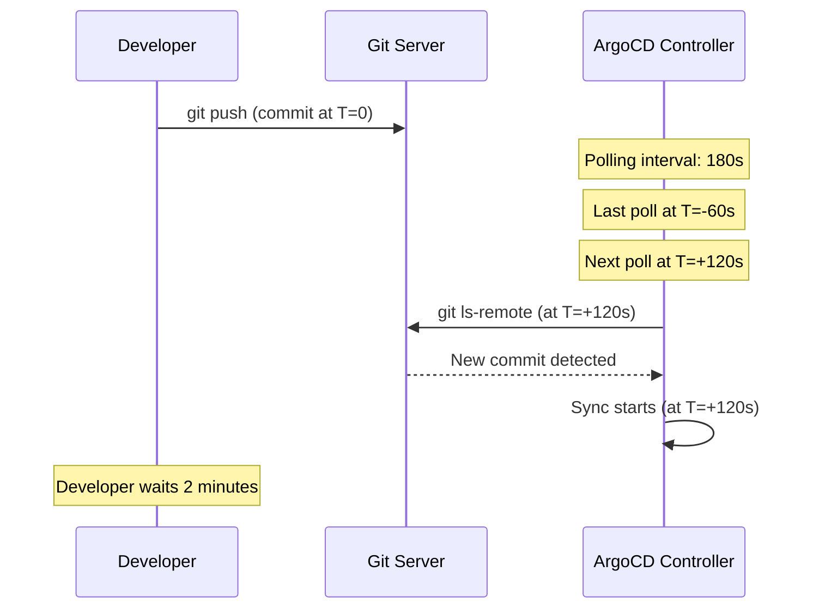
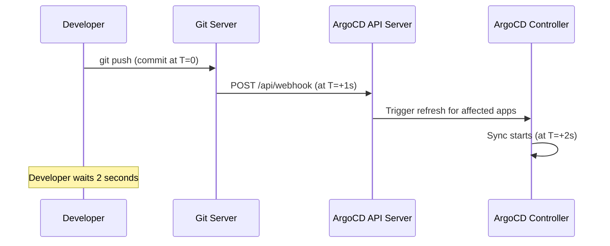

# How to Configure ArgoCD to Sync on Push (Not Polling)

Author: [nawazdhandala](https://github.com/nawazdhandala)

Tags: ArgoCD, GitOps, Kubernetes, Webhooks, Configuration

Description: Learn how to configure ArgoCD to detect Git changes via webhooks on push instead of polling, with step-by-step setup for GitHub, GitLab, and Bitbucket webhook integration.

---

By default, ArgoCD polls Git repositories every 3 minutes to check for changes. This means after pushing a commit, you wait up to 3 minutes before ArgoCD even notices the change. For teams that expect near-instant deployments, this delay is unacceptable. The solution is to configure webhooks so that ArgoCD is notified the moment a push happens. This guide covers the complete setup for every major Git provider.

## How Polling Works (And Why It Is Slow)

With default polling, ArgoCD's application controller periodically runs `git ls-remote` against every configured repository to check for new commits. The interval is controlled by `timeout.reconciliation`.



With polling, the average wait time is half the polling interval. For a 3-minute interval, you wait 1.5 minutes on average.

## How Webhooks Work (And Why They Are Fast)

With webhooks, the Git server notifies ArgoCD immediately when a push happens.



With webhooks, ArgoCD detects the change within seconds. The total time from push to sync start is typically under 5 seconds.

## Step 1: Configure ArgoCD Webhook Secret

First, configure a webhook secret in ArgoCD. This secret is used to validate that incoming webhook requests are actually from your Git provider, not an attacker.

```yaml
apiVersion: v1
kind: ConfigMap
metadata:
  name: argocd-cm
  namespace: argocd
data:
  # Set a webhook secret for your Git provider
  # Use the same secret when configuring the webhook in your Git provider
  webhook.github.secret: "your-super-secret-webhook-key"
  # webhook.gitlab.secret: "your-gitlab-webhook-secret"
  # webhook.bitbucket.secret: "your-bitbucket-webhook-secret"
  # webhook.bitbucketserver.secret: "your-bitbucket-server-webhook-secret"
  # webhook.gogs.secret: "your-gogs-webhook-secret"
```

```bash
# Apply the configuration
kubectl apply -f argocd-cm.yaml

# Restart the API server to pick up the new secret
kubectl rollout restart deployment/argocd-server -n argocd
```

Generate a strong random secret.

```bash
# Generate a random 32-character secret
openssl rand -hex 32
# Example output: a1b2c3d4e5f6a7b8c9d0e1f2a3b4c5d6a7b8c9d0e1f2a3b4c5d6a7b8c9d0e1f2
```

## Step 2: Configure Webhook in Your Git Provider

### GitHub Webhook Setup

```bash
# Using GitHub CLI
gh api repos/org/my-repo/hooks --method POST \
  --field name='web' \
  --field active=true \
  --field events='["push"]' \
  --field 'config[url]=https://argocd.example.com/api/webhook' \
  --field 'config[content_type]=json' \
  --field 'config[secret]=your-super-secret-webhook-key' \
  --field 'config[insecure_ssl]=0'
```

Or through the GitHub UI.

1. Go to your repository Settings then Webhooks
2. Click "Add webhook"
3. Set the Payload URL to `https://argocd.example.com/api/webhook`
4. Set Content type to `application/json`
5. Set the Secret to match what you configured in ArgoCD
6. Select "Just the push event"
7. Make sure "Active" is checked
8. Click "Add webhook"

### GitLab Webhook Setup

```bash
# Using GitLab API
curl -X POST "https://gitlab.com/api/v4/projects/PROJECT_ID/hooks" \
  -H "PRIVATE-TOKEN: your-gitlab-token" \
  -H "Content-Type: application/json" \
  -d '{
    "url": "https://argocd.example.com/api/webhook",
    "push_events": true,
    "tag_push_events": true,
    "token": "your-gitlab-webhook-secret",
    "enable_ssl_verification": true
  }'
```

Or through the GitLab UI.

1. Go to your project Settings, then Webhooks
2. Set the URL to `https://argocd.example.com/api/webhook`
3. Enter your webhook secret in the "Secret token" field
4. Check "Push events" and "Tag push events"
5. Check "Enable SSL verification"
6. Click "Add webhook"

### Bitbucket Webhook Setup

```bash
# Using Bitbucket API
curl -X POST "https://api.bitbucket.org/2.0/repositories/org/repo/hooks" \
  -H "Content-Type: application/json" \
  -u username:app-password \
  -d '{
    "description": "ArgoCD Webhook",
    "url": "https://argocd.example.com/api/webhook",
    "active": true,
    "events": ["repo:push"]
  }'
```

Bitbucket Cloud uses a different webhook payload format than Bitbucket Server. ArgoCD handles both formats automatically.

## Step 3: Ensure the Webhook Endpoint Is Accessible

The ArgoCD API server must be reachable from your Git provider's network. For cloud-hosted Git services (GitHub.com, GitLab.com, Bitbucket Cloud), this means ArgoCD needs a public endpoint.

```yaml
# Verify the ArgoCD service is accessible
# For Ingress-based setups:
apiVersion: networking.k8s.io/v1
kind: Ingress
metadata:
  name: argocd-server
  namespace: argocd
  annotations:
    nginx.ingress.kubernetes.io/backend-protocol: "HTTPS"
spec:
  rules:
  - host: argocd.example.com
    http:
      paths:
      - path: /
        pathType: Prefix
        backend:
          service:
            name: argocd-server
            port:
              number: 443
```

For ArgoCD installations behind a firewall, you may need to allowlist the Git provider's IP ranges.

```bash
# GitHub webhook IP ranges
# See: https://api.github.com/meta
curl -s https://api.github.com/meta | jq '.hooks'
```

## Step 4: Test the Webhook

After configuring the webhook, verify it works end to end.

```bash
# Make a test commit
cd your-repo
echo "# test" >> test-file.md
git add test-file.md
git commit -m "Test webhook delivery"
git push

# Check the webhook delivery status in your Git provider
# GitHub: Repository > Settings > Webhooks > Recent Deliveries
# GitLab: Project > Settings > Webhooks > Edit > Recent Events
# Bitbucket: Repository > Settings > Webhooks > Requests
```

```bash
# Check ArgoCD API server logs for webhook receipt
kubectl logs -n argocd deployment/argocd-server --tail=50 | grep -i webhook

# Check if the application detected the change
argocd app get my-app | grep "Last Synced"
```

## Step 5: Adjust Polling as a Fallback

With webhooks working, you can increase the polling interval to reduce load while keeping it as a safety net for missed webhooks.

```yaml
apiVersion: v1
kind: ConfigMap
metadata:
  name: argocd-cm
  namespace: argocd
data:
  webhook.github.secret: "your-super-secret-webhook-key"

  # Increase polling interval since webhooks handle immediate detection
  # 5 minutes instead of default 3 minutes
  timeout.reconciliation: "300"
```

Do not disable polling entirely (`timeout.reconciliation: "0"`) unless you are confident your webhooks are 100% reliable. Polling serves as a fallback for webhook delivery failures.

## Setting Up Webhooks for Multiple Repos

If you have many repositories, creating webhooks manually for each one is tedious. Automate with a script.

```bash
#!/bin/bash
# setup-webhooks.sh - Add ArgoCD webhook to all repos in an org

ORG="your-org"
WEBHOOK_URL="https://argocd.example.com/api/webhook"
WEBHOOK_SECRET="your-super-secret-webhook-key"

# List all repos in the org
repos=$(gh repo list $ORG --limit 1000 --json nameWithOwner -q '.[].nameWithOwner')

for repo in $repos; do
  echo "Setting up webhook for $repo..."

  # Check if webhook already exists
  existing=$(gh api "repos/$repo/hooks" -q '.[].config.url' 2>/dev/null | grep "$WEBHOOK_URL")

  if [ -z "$existing" ]; then
    gh api "repos/$repo/hooks" --method POST \
      --field name='web' \
      --field active=true \
      --field events='["push"]' \
      --field "config[url]=$WEBHOOK_URL" \
      --field 'config[content_type]=json' \
      --field "config[secret]=$WEBHOOK_SECRET" \
      --field 'config[insecure_ssl]=0' 2>/dev/null

    echo "  Webhook created for $repo"
  else
    echo "  Webhook already exists for $repo"
  fi
done
```

For GitHub organizations, you can also create an organization-level webhook that fires for all repositories.

```bash
# Organization-level webhook (covers all repos in the org)
gh api orgs/your-org/hooks --method POST \
  --field name='web' \
  --field active=true \
  --field events='["push"]' \
  --field 'config[url]=https://argocd.example.com/api/webhook' \
  --field 'config[content_type]=json' \
  --field 'config[secret]=your-webhook-secret'
```

## Monitoring Webhook Health

Set up monitoring to detect webhook delivery failures before they impact your workflow.

```bash
# Check for recent webhook delivery failures on GitHub
gh api repos/org/my-repo/hooks --jq '.[0].id' | xargs -I {} gh api repos/org/my-repo/hooks/{}/deliveries --jq '.[] | select(.status_code != 200) | {delivered_at, status_code}'
```

On the ArgoCD side, monitor the API server for webhook processing errors.

```promql
# Count webhook requests by status
rate(argocd_server_request_total{path="/api/webhook"}[5m])
```

## Troubleshooting

### Webhook Returns 403

The webhook secret does not match. Verify the secret in both ArgoCD's `argocd-cm` ConfigMap and the Git provider's webhook settings.

### Webhook Returns 404

The webhook URL is wrong. The correct path is `/api/webhook`, not `/webhook` or `/hooks`.

### Webhook Returns 502 or Times Out

The ArgoCD API server is not reachable from the Git provider. Check your firewall, Ingress, and load balancer settings.

### Webhook Delivered Successfully But ArgoCD Did Not Refresh

ArgoCD matches webhook payloads to applications by comparing the repository URL in the webhook with the `repoURL` in each Application spec. Ensure the URLs match exactly, including the protocol (SSH vs HTTPS) and trailing slashes.

## Summary

Replacing polling with webhooks reduces ArgoCD's change detection time from minutes to seconds. Configure a webhook secret in ArgoCD, set up the webhook in your Git provider, verify delivery works, and keep polling as a fallback with a longer interval. For organizations with many repos, use organization-level webhooks or automate per-repo webhook creation.
