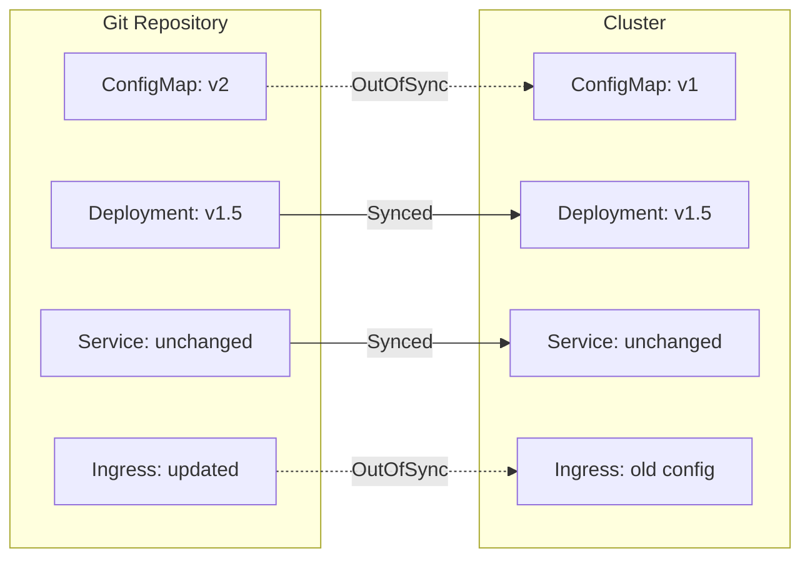

# How to Sync Only OutOfSync Resources in ArgoCD

Author: [nawazdhandala](https://github.com/nawazdhandala)

Tags: ArgoCD, GitOps, Kubernetes, Selective Sync, Efficiency

Description: Learn how to identify and sync only the resources that are actually out of sync in ArgoCD, reducing sync time and avoiding unnecessary resource updates.

---

When an ArgoCD application has 100 resources and only 3 are out of sync, syncing all 100 is wasteful. ArgoCD provides ways to target only the resources that actually differ from the desired state. This approach reduces sync time, minimizes unnecessary API calls to the Kubernetes cluster, and avoids accidental disruption to resources that are already in the correct state.

## Understanding OutOfSync Status

A resource is OutOfSync when its live state in the cluster differs from the desired state defined in Git. ArgoCD continuously compares these two states and flags any differences.



In this example, only the ConfigMap and Ingress are out of sync. The Deployment and Service match Git perfectly.

## The ApplyOutOfSyncOnly Sync Option

ArgoCD has a built-in sync option called `ApplyOutOfSyncOnly` that tells ArgoCD to only apply resources that are actually out of sync, skipping resources that already match the desired state.

```yaml
apiVersion: argoproj.io/v1alpha1
kind: Application
metadata:
  name: my-app
  namespace: argocd
spec:
  project: default
  source:
    repoURL: https://github.com/myorg/app.git
    targetRevision: main
    path: manifests/
  destination:
    server: https://kubernetes.default.svc
    namespace: production
  syncPolicy:
    syncOptions:
      - ApplyOutOfSyncOnly=true
    automated:
      prune: true
      selfHeal: true
```

With `ApplyOutOfSyncOnly=true`, when ArgoCD performs a sync (either manual or automatic), it skips resources that are already in sync. Only resources where the live state differs from Git are applied.

This is different from selective sync. Selective sync requires you to specify which resources to sync. `ApplyOutOfSyncOnly` automatically determines which resources need updating.

## Enabling ApplyOutOfSyncOnly via CLI

You can enable this option during a manual sync operation.

```bash
# Sync only out-of-sync resources
argocd app sync my-app --apply-out-of-sync-only

# Combine with other sync options
argocd app sync my-app \
  --apply-out-of-sync-only \
  --prune
```

Or set it as a default for the application.

```bash
# Add the sync option to an existing application
argocd app set my-app --sync-option ApplyOutOfSyncOnly=true
```

## Finding OutOfSync Resources

Before manually syncing out-of-sync resources, you need to identify them.

```bash
# List all resources and their sync status
argocd app resources my-app

# Filter to show only out-of-sync resources using JSON output
argocd app resources my-app --output json | \
  jq '.[] | select(.status == "OutOfSync") | {group: .group, kind: .kind, name: .name, namespace: .namespace}'
```

Example output:

```json
{
  "group": "",
  "kind": "ConfigMap",
  "name": "app-config",
  "namespace": "production"
}
{
  "group": "networking.k8s.io",
  "kind": "Ingress",
  "name": "web-ingress",
  "namespace": "production"
}
```

## Manual Selective Sync of OutOfSync Resources

Once you know which resources are out of sync, sync them specifically.

```bash
# Step 1: Get the out-of-sync resources
argocd app resources my-app --output json | \
  jq -r '.[] | select(.status == "OutOfSync") | "\(.group):\(.kind):\(.name)"'

# Output:
# :ConfigMap:app-config
# networking.k8s.io:Ingress:web-ingress

# Step 2: Sync only those resources
argocd app sync my-app \
  --resource :ConfigMap:app-config \
  --resource networking.k8s.io:Ingress:web-ingress
```

## Automating OutOfSync-Only Sync in CI/CD

Here is a script that automates finding and syncing only out-of-sync resources.

```bash
#!/bin/bash
# sync-outofsync-only.sh
# Syncs only resources that are actually out of sync

set -euo pipefail

APP_NAME="${1:?Usage: $0 APP_NAME}"

echo "Checking sync status for $APP_NAME..."

# Get out-of-sync resources
OOS_RESOURCES=$(argocd app resources "$APP_NAME" --output json | \
  jq -r '.[] | select(.status == "OutOfSync") | "\(.group):\(.kind):\(.name)"')

if [ -z "$OOS_RESOURCES" ]; then
  echo "All resources are in sync. Nothing to do."
  exit 0
fi

# Count resources
OOS_COUNT=$(echo "$OOS_RESOURCES" | wc -l | tr -d ' ')
echo "Found $OOS_COUNT out-of-sync resources:"
echo "$OOS_RESOURCES"

# Build resource flags
RESOURCE_FLAGS=""
while IFS= read -r resource; do
  RESOURCE_FLAGS="$RESOURCE_FLAGS --resource $resource"
done <<< "$OOS_RESOURCES"

# Sync only out-of-sync resources
echo ""
echo "Syncing out-of-sync resources..."
eval argocd app sync "$APP_NAME" $RESOURCE_FLAGS

# Wait for health
echo "Waiting for application to be healthy..."
argocd app wait "$APP_NAME" --health --timeout 300

echo "Sync complete. Application is healthy."
```

Use this in your CI/CD pipeline:

```yaml
# GitHub Actions example
jobs:
  deploy:
    runs-on: ubuntu-latest
    steps:
      - name: Sync out-of-sync resources
        run: |
          argocd login $ARGOCD_SERVER --username admin --password $ARGOCD_PASSWORD --grpc-web
          ./scripts/sync-outofsync-only.sh my-production-app
```

## Viewing Diffs for OutOfSync Resources

Before syncing, review what exactly is different for each out-of-sync resource.

```bash
# Show diff for the entire application (only out-of-sync resources have diffs)
argocd app diff my-app

# Show diff for a specific resource
argocd app diff my-app --resource :ConfigMap:app-config
```

The diff output shows you the exact changes that will be applied. This is critical for verifying that you are not accidentally syncing an unintended change.

## Performance Benefits

For large applications, `ApplyOutOfSyncOnly` significantly reduces sync time.

| Scenario | Full Sync | OutOfSync Only |
|---|---|---|
| 100 resources, 3 out of sync | ~100 API calls | ~3 API calls |
| 500 resources, 10 out of sync | ~500 API calls | ~10 API calls |
| 1000 resources, 1 out of sync | ~1000 API calls | ~1 API call |

Each API call to the Kubernetes API server takes time and consumes resources. For clusters with many ArgoCD applications, reducing unnecessary API calls improves overall cluster performance.

## Combining with Other Sync Options

`ApplyOutOfSyncOnly` works well with other sync options.

```yaml
syncPolicy:
  syncOptions:
    - ApplyOutOfSyncOnly=true
    - CreateNamespace=true
    - PrunePropagationPolicy=foreground
    - ServerSideApply=true
  automated:
    prune: true
    selfHeal: true
```

It also works with sync waves. ArgoCD still processes waves in order, but within each wave, it only applies resources that are out of sync.

## When Not to Use ApplyOutOfSyncOnly

There are scenarios where you want a full sync even if most resources are in sync.

After an ArgoCD upgrade, the comparison logic might change slightly, and a full sync ensures everything is truly aligned.

When you suspect cluster state has drifted in ways ArgoCD did not detect (for example, someone used `kubectl edit` directly), a full sync forces every resource to match Git.

When debugging, applying all resources gives you confidence that the entire desired state is in place, not just the parts ArgoCD flagged as out of sync.

For the general selective sync approach, see the [selective sync CLI guide](https://oneuptime.com/blog/post/2026-02-26-argocd-selective-sync-cli/view). For understanding sync options, check the [ArgoCD sync options documentation](https://oneuptime.com/blog/post/2026-01-30-argocd-sync-windows/view).
