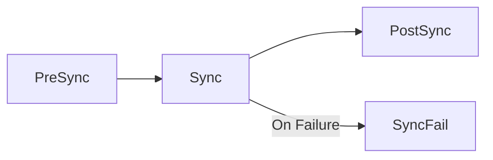

# How to Use Sync Phases in ArgoCD: PreSync, Sync, PostSync

Author: [nawazdhandala](https://github.com/nawazdhandala)

Tags: ArgoCD, GitOps, Kubernetes, Sync Hooks, Deployment Workflow

Description: Learn how to use ArgoCD sync phases including PreSync, Sync, and PostSync to orchestrate complex deployment workflows with ordered resource operations.

---

ArgoCD does not just blindly apply all your Kubernetes manifests at once. It organizes the sync operation into distinct phases, each serving a specific purpose in the deployment workflow. Understanding these phases gives you fine-grained control over when things happen during a deployment.

The three main sync phases are PreSync, Sync, and PostSync. There is also a SyncFail phase for error handling. Together, they let you build deployment workflows that include database migrations, smoke tests, notifications, and cleanup tasks - all orchestrated automatically.

## The Sync Phase Lifecycle

When ArgoCD syncs an application, it executes phases in this order:



1. **PreSync**: Runs before any application resources are applied. Use for preparation tasks like database migrations, cache warming, or configuration validation.

2. **Sync**: The main phase where application resources are applied to the cluster. This is where your Deployments, Services, ConfigMaps, and other resources get created or updated.

3. **PostSync**: Runs after all application resources are successfully applied. Use for verification tasks like smoke tests, notifications, or post-deployment configuration.

4. **SyncFail**: Runs only if the Sync phase fails. Use for cleanup, alerting, or rollback preparation.

## Assigning Resources to Phases

You assign a resource to a sync phase using the `argocd.argoproj.io/hook` annotation:

```yaml
# PreSync hook - runs before main resources
apiVersion: batch/v1
kind: Job
metadata:
  name: db-migrate
  annotations:
    argocd.argoproj.io/hook: PreSync
spec:
  template:
    spec:
      containers:
        - name: migrate
          image: myorg/db-migrate:1.0
          command: ["./migrate.sh"]
      restartPolicy: Never
  backoffLimit: 1
```

Resources without the hook annotation are part of the default **Sync** phase.

## PreSync Phase: Preparation

PreSync hooks run before any application resources are applied. Common uses:

### Database Migrations

```yaml
# Run database migrations before deploying new code
apiVersion: batch/v1
kind: Job
metadata:
  name: migration-v42
  annotations:
    argocd.argoproj.io/hook: PreSync
    argocd.argoproj.io/hook-delete-policy: HookSucceeded
spec:
  template:
    spec:
      containers:
        - name: migrate
          image: myorg/api:v42
          command: ["python", "manage.py", "migrate", "--no-input"]
          env:
            - name: DATABASE_URL
              valueFrom:
                secretKeyRef:
                  name: db-credentials
                  key: url
      restartPolicy: Never
  backoffLimit: 3
```

The migration runs and completes before ArgoCD deploys the new application version. If the migration fails, the sync stops and the old version keeps running.

### Configuration Validation

```yaml
# Validate configuration before deployment
apiVersion: batch/v1
kind: Job
metadata:
  name: config-validate
  annotations:
    argocd.argoproj.io/hook: PreSync
    argocd.argoproj.io/hook-delete-policy: HookSucceeded
spec:
  template:
    spec:
      containers:
        - name: validator
          image: myorg/config-validator:latest
          command:
            - /bin/sh
            - -c
            - |
              # Validate all config files
              echo "Validating configuration..."
              validate-config /config/*.yaml
              echo "Configuration valid"
          volumeMounts:
            - name: config
              mountPath: /config
      volumes:
        - name: config
          configMap:
            name: app-config
      restartPolicy: Never
  backoffLimit: 0
```

## Sync Phase: Main Deployment

The Sync phase is where your regular application resources live. You do not need any special annotations for resources in this phase - they are included by default:

```yaml
# These resources are part of the Sync phase (no hook annotation)
apiVersion: apps/v1
kind: Deployment
metadata:
  name: web-app
spec:
  replicas: 3
  selector:
    matchLabels:
      app: web-app
  template:
    metadata:
      labels:
        app: web-app
    spec:
      containers:
        - name: web
          image: myorg/web:v42
          ports:
            - containerPort: 8080
---
apiVersion: v1
kind: Service
metadata:
  name: web-app-svc
spec:
  selector:
    app: web-app
  ports:
    - port: 80
      targetPort: 8080
```

Within the Sync phase, you can further control ordering using sync waves (covered in the next topic).

## PostSync Phase: Verification

PostSync hooks run after all Sync phase resources are successfully applied. They are ideal for verification and notification tasks:

### Smoke Tests

```yaml
# Run smoke tests after deployment
apiVersion: batch/v1
kind: Job
metadata:
  name: smoke-test-v42
  annotations:
    argocd.argoproj.io/hook: PostSync
    argocd.argoproj.io/hook-delete-policy: HookSucceeded
spec:
  template:
    spec:
      containers:
        - name: smoke-test
          image: myorg/smoke-tests:latest
          command:
            - /bin/sh
            - -c
            - |
              # Wait for service to be ready
              echo "Waiting for service..."
              until curl -sf http://web-app-svc/health; do
                sleep 2
              done

              # Run smoke tests
              echo "Running smoke tests..."
              curl -sf http://web-app-svc/api/v1/status
              curl -sf http://web-app-svc/api/v1/health
              echo "Smoke tests passed"
      restartPolicy: Never
  backoffLimit: 1
```

### Deployment Notification

```yaml
# Send notification after successful deployment
apiVersion: batch/v1
kind: Job
metadata:
  name: notify-deploy-v42
  annotations:
    argocd.argoproj.io/hook: PostSync
    argocd.argoproj.io/hook-delete-policy: HookSucceeded
spec:
  template:
    spec:
      containers:
        - name: notify
          image: curlimages/curl:latest
          command:
            - /bin/sh
            - -c
            - |
              curl -X POST "$SLACK_WEBHOOK_URL" \
                -H 'Content-Type: application/json' \
                -d '{
                  "text": "Deployment v42 completed successfully in production"
                }'
          env:
            - name: SLACK_WEBHOOK_URL
              valueFrom:
                secretKeyRef:
                  name: slack-webhook
                  key: url
      restartPolicy: Never
  backoffLimit: 0
```

## SyncFail Phase: Error Handling

SyncFail hooks run only when the sync fails. Use them for cleanup and alerting:

```yaml
# Alert on sync failure
apiVersion: batch/v1
kind: Job
metadata:
  name: sync-fail-alert
  annotations:
    argocd.argoproj.io/hook: SyncFail
    argocd.argoproj.io/hook-delete-policy: HookSucceeded
spec:
  template:
    spec:
      containers:
        - name: alert
          image: curlimages/curl:latest
          command:
            - /bin/sh
            - -c
            - |
              curl -X POST "$PAGERDUTY_URL" \
                -H 'Content-Type: application/json' \
                -d '{
                  "routing_key": "'"$PD_KEY"'",
                  "event_action": "trigger",
                  "payload": {
                    "summary": "ArgoCD sync failed for production app",
                    "severity": "critical",
                    "source": "argocd"
                  }
                }'
          env:
            - name: PAGERDUTY_URL
              value: "https://events.pagerduty.com/v2/enqueue"
            - name: PD_KEY
              valueFrom:
                secretKeyRef:
                  name: pagerduty
                  key: routing-key
      restartPolicy: Never
  backoffLimit: 0
```

## Complete Deployment Workflow Example

Here is a complete example putting all phases together:

```yaml
# 1. PreSync: Database migration
apiVersion: batch/v1
kind: Job
metadata:
  name: migrate-v42
  annotations:
    argocd.argoproj.io/hook: PreSync
    argocd.argoproj.io/hook-delete-policy: HookSucceeded
spec:
  template:
    spec:
      containers:
        - name: migrate
          image: myorg/api:v42
          command: ["python", "manage.py", "migrate"]
      restartPolicy: Never
  backoffLimit: 3
---
# 2. Sync: Application deployment (no hook annotation)
apiVersion: apps/v1
kind: Deployment
metadata:
  name: api
spec:
  replicas: 3
  selector:
    matchLabels:
      app: api
  template:
    metadata:
      labels:
        app: api
    spec:
      containers:
        - name: api
          image: myorg/api:v42
---
# 3. PostSync: Smoke test
apiVersion: batch/v1
kind: Job
metadata:
  name: smoke-v42
  annotations:
    argocd.argoproj.io/hook: PostSync
    argocd.argoproj.io/hook-delete-policy: HookSucceeded
spec:
  template:
    spec:
      containers:
        - name: test
          image: myorg/smoke-tests:latest
          command: ["./run-tests.sh"]
      restartPolicy: Never
  backoffLimit: 1
---
# 4. SyncFail: Alert on failure
apiVersion: batch/v1
kind: Job
metadata:
  name: fail-alert
  annotations:
    argocd.argoproj.io/hook: SyncFail
    argocd.argoproj.io/hook-delete-policy: HookSucceeded
spec:
  template:
    spec:
      containers:
        - name: alert
          image: curlimages/curl:latest
          command: ["curl", "-X", "POST", "https://hooks.slack.com/...", "-d", "{\"text\":\"Deploy failed\"}"]
      restartPolicy: Never
  backoffLimit: 0
```

## Phase Failure Behavior

Understanding what happens when each phase fails:

- **PreSync fails**: Sync phase never starts. Application resources are not updated. The old version keeps running.
- **Sync fails**: PostSync does not run. SyncFail runs instead. Some resources may have been partially applied.
- **PostSync fails**: The sync operation is marked as failed even though resources were applied. The application might be running the new version but marked as "Failed."
- **SyncFail fails**: The failure is logged but does not affect the application state further.

## Best Practices

1. **Keep hooks idempotent.** Hooks might run multiple times if syncs are retried. Make sure running them twice does not cause issues.

2. **Use unique names.** Include the version or a hash in hook Job names to avoid conflicts with previous sync hooks.

3. **Set appropriate delete policies.** Without a delete policy, hook resources remain in the cluster after completion.

4. **Set backoff limits.** Always configure `backoffLimit` on Jobs to prevent infinite retries.

5. **Use appropriate restart policies.** Most hook Jobs should use `restartPolicy: Never` to let ArgoCD handle failures.

## Summary

ArgoCD sync phases provide a structured way to orchestrate complex deployment workflows. PreSync handles preparation, Sync deploys your application, PostSync verifies the deployment, and SyncFail handles errors. Combined with sync waves for ordering within each phase, you can build sophisticated deployment pipelines that run entirely within ArgoCD without external CI/CD tools.

For ordering resources within the Sync phase, see our guide on [how to order resource deployment with sync waves](https://oneuptime.com/blog/post/2026-02-26-argocd-sync-waves-resource-ordering/view).
