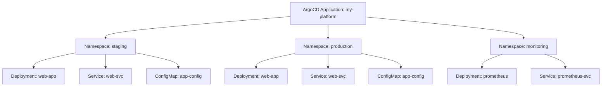

# How to Sync Only Resources in a Specific Namespace in ArgoCD

Author: [nawazdhandala](https://github.com/nawazdhandala)

Tags: ArgoCD, GitOps, Kubernetes, Namespace, Selective Sync

Description: Learn how to selectively sync resources in a specific namespace within a multi-namespace ArgoCD application, with practical patterns for staged rollouts and namespace isolation.

---

Multi-namespace applications in ArgoCD manage resources across several Kubernetes namespaces from a single application definition. When you only want to update resources in one namespace, such as rolling out a change to staging before production, you need namespace-scoped selective sync. This guide covers the techniques for targeting specific namespaces during sync operations.

## Multi-Namespace Application Structure

A multi-namespace application might deploy the same workload across different environments, or it might deploy different services into different namespaces.



When a change needs to be tested in staging first, you want to sync only the staging namespace resources.

## Listing Resources by Namespace

Start by identifying which resources belong to which namespace.

```bash
# List all resources grouped by namespace
argocd app resources my-platform --output json | \
  jq -r 'group_by(.namespace) | .[] | .[0].namespace as $ns | "\($ns):", (.[] | "  \(.group):\(.kind):\(.name)")'

# Example output:
# staging:
#   apps:Deployment:web-app
#   :Service:web-svc
#   :ConfigMap:app-config
# production:
#   apps:Deployment:web-app
#   :Service:web-svc
#   :ConfigMap:app-config
# monitoring:
#   apps:Deployment:prometheus
#   :Service:prometheus-svc
```

## Syncing Resources in a Single Namespace

ArgoCD CLI does not have a direct `--namespace-only` flag for sync, but you can filter resources by namespace and sync them selectively.

```bash
# Get all resources in the staging namespace
STAGING_RESOURCES=$(argocd app resources my-platform --output json | \
  jq -r '.[] | select(.namespace == "staging") | "\(.group):\(.kind):\(.name)"')

# Build and execute the sync command
RESOURCE_FLAGS=""
while IFS= read -r resource; do
  RESOURCE_FLAGS="$RESOURCE_FLAGS --resource $resource"
done <<< "$STAGING_RESOURCES"

eval argocd app sync my-platform $RESOURCE_FLAGS
```

## A Reusable Namespace Sync Script

Here is a script that makes namespace-scoped sync a one-liner.

```bash
#!/bin/bash
# sync-namespace.sh - Sync only resources in a specific namespace
# Usage: ./sync-namespace.sh APP_NAME NAMESPACE [--dry-run]

set -euo pipefail

APP_NAME="${1:?Usage: $0 APP_NAME NAMESPACE [--dry-run]}"
TARGET_NS="${2:?Usage: $0 APP_NAME NAMESPACE [--dry-run]}"
DRY_RUN="${3:-}"

echo "Finding resources in namespace $TARGET_NS for app $APP_NAME..."

# Get resources in the target namespace
RESOURCES=$(argocd app resources "$APP_NAME" --output json | \
  jq -r --arg ns "$TARGET_NS" \
  '.[] | select(.namespace == $ns) | "\(.group):\(.kind):\(.name)"')

if [ -z "$RESOURCES" ]; then
  echo "No resources found in namespace $TARGET_NS"
  exit 0
fi

COUNT=$(echo "$RESOURCES" | wc -l | tr -d ' ')
echo "Found $COUNT resources in $TARGET_NS:"
echo "$RESOURCES" | while read -r r; do echo "  - $r"; done

RESOURCE_FLAGS=""
while IFS= read -r resource; do
  RESOURCE_FLAGS="$RESOURCE_FLAGS --resource $resource"
done <<< "$RESOURCES"

if [ "$DRY_RUN" = "--dry-run" ]; then
  echo ""
  echo "Dry run:"
  eval argocd app sync "$APP_NAME" $RESOURCE_FLAGS --dry-run
else
  echo ""
  echo "Syncing..."
  eval argocd app sync "$APP_NAME" $RESOURCE_FLAGS
  echo "Sync complete for namespace $TARGET_NS"
fi
```

Usage:

```bash
# Sync only staging namespace
./sync-namespace.sh my-platform staging

# Preview what would sync in production
./sync-namespace.sh my-platform production --dry-run

# Sync monitoring namespace
./sync-namespace.sh my-platform monitoring
```

## Staged Rollout Across Namespaces

A common deployment pattern is to roll out changes to staging, verify them, and then roll out to production. With namespace-scoped sync, you can automate this.

```bash
#!/bin/bash
# staged-rollout.sh - Roll out changes namespace by namespace
set -euo pipefail

APP_NAME="my-platform"
NAMESPACES=("staging" "production")
WAIT_BETWEEN=60  # seconds to wait between namespace rollouts

for ns in "${NAMESPACES[@]}"; do
  echo "========================================="
  echo "Rolling out to namespace: $ns"
  echo "========================================="

  # Get resources in this namespace
  RESOURCES=$(argocd app resources "$APP_NAME" --output json | \
    jq -r --arg ns "$ns" \
    '.[] | select(.namespace == $ns and .status == "OutOfSync") | "\(.group):\(.kind):\(.name)"')

  if [ -z "$RESOURCES" ]; then
    echo "No out-of-sync resources in $ns. Skipping."
    continue
  fi

  RESOURCE_FLAGS=""
  while IFS= read -r resource; do
    RESOURCE_FLAGS="$RESOURCE_FLAGS --resource $resource"
  done <<< "$RESOURCES"

  # Sync the namespace
  eval argocd app sync "$APP_NAME" $RESOURCE_FLAGS

  # Wait for health
  echo "Waiting for resources in $ns to be healthy..."
  argocd app wait "$APP_NAME" --health --timeout 300

  # Wait before proceeding to the next namespace
  if [ "$ns" != "${NAMESPACES[-1]}" ]; then
    echo "Waiting $WAIT_BETWEEN seconds before next namespace..."
    sleep "$WAIT_BETWEEN"
  fi
done

echo "Staged rollout complete."
```

This script syncs staging first, waits for health, pauses for 60 seconds (giving you time to verify), then syncs production.

## Filtering by Namespace and Kind

Combine namespace filtering with kind filtering for even more precision.

```bash
# Sync only Deployments in the staging namespace
argocd app resources my-platform --output json | \
  jq -r '.[] | select(.namespace == "staging" and .kind == "Deployment") | "\(.group):\(.kind):\(.name)"' | \
  xargs -I{} echo "--resource {}" | \
  xargs argocd app sync my-platform

# Sync only ConfigMaps in production
argocd app resources my-platform --output json | \
  jq -r '.[] | select(.namespace == "production" and .kind == "ConfigMap") | "\(.group):\(.kind):\(.name)"' | \
  xargs -I{} echo "--resource {}" | \
  xargs argocd app sync my-platform
```

## Alternative: Separate Applications Per Namespace

If you frequently need namespace-scoped sync, consider whether your application should be split into separate ArgoCD Applications, one per namespace.

```yaml
# staging-app.yaml
apiVersion: argoproj.io/v1alpha1
kind: Application
metadata:
  name: web-app-staging
  namespace: argocd
spec:
  project: default
  source:
    repoURL: https://github.com/myorg/app.git
    targetRevision: main
    path: overlays/staging/
  destination:
    server: https://kubernetes.default.svc
    namespace: staging
---
# production-app.yaml
apiVersion: argoproj.io/v1alpha1
kind: Application
metadata:
  name: web-app-production
  namespace: argocd
spec:
  project: default
  source:
    repoURL: https://github.com/myorg/app.git
    targetRevision: main
    path: overlays/production/
  destination:
    server: https://kubernetes.default.svc
    namespace: production
```

With separate applications, syncing a single namespace is as simple as syncing the corresponding application. Each application has its own sync status, health status, and sync history.

This approach works well with Kustomize overlays, where each overlay directory contains the configuration specific to one namespace or environment.

```
app-repo/
  base/
    deployment.yaml
    service.yaml
    configmap.yaml
    kustomization.yaml
  overlays/
    staging/
      kustomization.yaml  # patches for staging
      configmap-patch.yaml
    production/
      kustomization.yaml  # patches for production
      configmap-patch.yaml
```

## Using ApplicationSets for Per-Namespace Applications

If you have many namespaces, manually creating an Application for each one is tedious. Use an ApplicationSet to generate them automatically.

```yaml
apiVersion: argoproj.io/v1alpha1
kind: ApplicationSet
metadata:
  name: web-app-per-namespace
  namespace: argocd
spec:
  generators:
    - list:
        elements:
          - namespace: staging
            overlay: staging
          - namespace: production
            overlay: production
          - namespace: canary
            overlay: canary
  template:
    metadata:
      name: "web-app-{{namespace}}"
    spec:
      project: default
      source:
        repoURL: https://github.com/myorg/app.git
        targetRevision: main
        path: "overlays/{{overlay}}"
      destination:
        server: https://kubernetes.default.svc
        namespace: "{{namespace}}"
      syncPolicy:
        automated:
          prune: true
          selfHeal: true
```

This creates one ArgoCD Application per namespace, each syncing independently. You can sync staging without affecting production because they are completely separate applications.

## Verifying Namespace-Scoped Sync Results

After syncing a specific namespace, verify the results.

```bash
# Check sync status for resources in the target namespace
argocd app resources my-platform --output json | \
  jq '.[] | select(.namespace == "staging") | {kind, name, status, health: .health.status}'

# Check pod status in the namespace
kubectl get pods -n staging

# Check recent events in the namespace
kubectl get events -n staging --sort-by=.metadata.creationTimestamp | tail -20
```

## Handling Cluster-Scoped Resources

Multi-namespace applications might include cluster-scoped resources like ClusterRoles, ClusterRoleBindings, or Namespaces. These resources do not belong to any specific namespace, so they will not be included in namespace-filtered syncs.

```bash
# Find cluster-scoped resources (namespace is empty)
argocd app resources my-platform --output json | \
  jq '.[] | select(.namespace == "" or .namespace == null) | {kind, name}'
```

If you need to sync cluster-scoped resources alongside namespace resources, include them explicitly.

```bash
# Sync staging namespace plus its related ClusterRole
argocd app sync my-platform \
  --resource :ConfigMap:app-config \
  --resource apps:Deployment:web-app \
  --resource :Service:web-svc \
  --resource rbac.authorization.k8s.io:ClusterRole:staging-reader
```

For the selective sync fundamentals, see the [selective sync guide](https://oneuptime.com/blog/post/2026-02-26-argocd-sync-specific-resources/view). For kind-based sync, check the [syncing specific kinds guide](https://oneuptime.com/blog/post/2026-02-26-argocd-sync-specific-resource-kinds/view).
