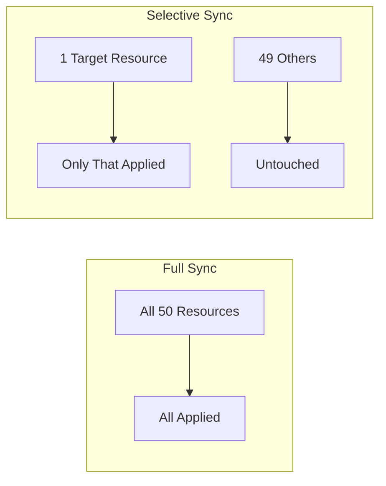

# How to Sync Only Specific Resources in ArgoCD

Author: [nawazdhandala](https://github.com/nawazdhandala)

Tags: ArgoCD, GitOps, Kubernetes, Selective Sync, Deployments

Description: Learn how to sync individual resources in ArgoCD instead of syncing the entire application, using the CLI, UI, and API for targeted deployments.

---

Sometimes you do not want to sync an entire application. Maybe one Deployment needs an update but the rest of the application is fine. Maybe you are troubleshooting a single ConfigMap and want to push just that change. ArgoCD supports selective sync, letting you target specific resources within an application.

This guide covers all the ways to sync specific resources in ArgoCD and when each approach makes sense.

## Why Selective Sync Matters

A typical ArgoCD application might contain dozens of resources: Deployments, Services, ConfigMaps, Secrets, Ingresses, RBAC resources, and more. When you sync the entire application, ArgoCD reconciles everything. This is usually fine, but there are scenarios where targeted sync is better.

Large applications with many resources take longer to sync completely. If you only changed one ConfigMap, syncing all 50 resources is wasteful.

During incident response, you might need to push a hotfix to a single Deployment without touching anything else. A full sync might pick up other pending changes that you are not ready to deploy.

When debugging, you might want to apply one resource at a time to isolate which change causes an issue.



## Selective Sync from the CLI

The ArgoCD CLI supports syncing specific resources using the `--resource` flag. You specify the resource by its group, kind, and name.

```bash
# Sync a single Deployment
argocd app sync my-app --resource apps:Deployment:my-deployment

# Sync a ConfigMap (core resources have an empty group)
argocd app sync my-app --resource :ConfigMap:app-config

# Sync a Service
argocd app sync my-app --resource :Service:my-service

# Sync a specific Secret
argocd app sync my-app --resource :Secret:db-credentials
```

The format is `group:kind:name`. For core Kubernetes resources like ConfigMaps, Services, and Secrets, the group is empty, so you start with a colon.

For resources in specific namespaces within a multi-namespace application, include the namespace.

```bash
# Sync a Deployment in a specific namespace
argocd app sync my-app --resource apps:Deployment:my-deployment --namespace production
```

## Syncing Multiple Specific Resources

You can sync multiple specific resources in one command by repeating the `--resource` flag.

```bash
# Sync a ConfigMap and its related Deployment together
argocd app sync my-app \
  --resource :ConfigMap:app-config \
  --resource apps:Deployment:my-app

# Sync all RBAC resources together
argocd app sync my-app \
  --resource rbac.authorization.k8s.io:Role:app-role \
  --resource rbac.authorization.k8s.io:RoleBinding:app-rolebinding \
  --resource :ServiceAccount:app-sa
```

This is useful when you have a group of related resources that need to update together but you do not want to sync the entire application.

## Selective Sync from the UI

In the ArgoCD web UI, selective sync is done through the application resource tree.

1. Navigate to your application in the ArgoCD UI
2. Find the resource you want to sync in the resource tree
3. Click on the resource to open its detail panel
4. Click the three-dot menu on the resource
5. Select "Sync" from the dropdown

The UI will show you a sync dialog for just that resource. You can review what will change before confirming.

For syncing multiple specific resources from the UI:

1. Click the "Sync" button at the application level
2. In the sync dialog, you will see a list of all resources
3. Uncheck "All" at the top
4. Check only the specific resources you want to sync
5. Click "Synchronize"

This gives you a checklist-style interface where you can pick exactly which resources to include in the sync operation.

## Resource Identification Format

Understanding the resource identification format is key to using selective sync effectively.

```text
GROUP:KIND:NAME
```

Here are the group identifiers for common Kubernetes resource types:

| Resource Type | Group | Example |
|---|---|---|
| ConfigMap | (empty) | `:ConfigMap:my-config` |
| Secret | (empty) | `:Secret:my-secret` |
| Service | (empty) | `:Service:my-svc` |
| ServiceAccount | (empty) | `:ServiceAccount:my-sa` |
| Deployment | apps | `apps:Deployment:my-deploy` |
| StatefulSet | apps | `apps:StatefulSet:my-sts` |
| DaemonSet | apps | `apps:DaemonSet:my-ds` |
| Ingress | networking.k8s.io | `networking.k8s.io:Ingress:my-ingress` |
| CronJob | batch | `batch:CronJob:my-cron` |
| Job | batch | `batch:Job:my-job` |
| Role | rbac.authorization.k8s.io | `rbac.authorization.k8s.io:Role:my-role` |
| ClusterRole | rbac.authorization.k8s.io | `rbac.authorization.k8s.io:ClusterRole:my-cr` |
| HPA | autoscaling | `autoscaling:HorizontalPodAutoscaler:my-hpa` |

For Custom Resources, use the CRD's API group.

```bash
# Sync a cert-manager Certificate
argocd app sync my-app --resource cert-manager.io:Certificate:my-cert

# Sync a Prometheus ServiceMonitor
argocd app sync my-app --resource monitoring.coreos.com:ServiceMonitor:my-monitor

# Sync an Istio VirtualService
argocd app sync my-app --resource networking.istio.io:VirtualService:my-vs
```

## Selective Sync via the API

For programmatic access, use the ArgoCD API to trigger selective syncs.

```bash
# Using curl to trigger a selective sync via the ArgoCD API
curl -X POST "https://argocd.example.com/api/v1/applications/my-app/sync" \
  -H "Authorization: Bearer $ARGOCD_TOKEN" \
  -H "Content-Type: application/json" \
  -d '{
    "resources": [
      {
        "group": "apps",
        "kind": "Deployment",
        "name": "my-deployment"
      },
      {
        "group": "",
        "kind": "ConfigMap",
        "name": "app-config"
      }
    ]
  }'
```

The API accepts an array of resource identifiers. Each identifier needs `group`, `kind`, and `name`. This is the approach to use in CI/CD pipelines or custom automation.

## Selective Sync with Sync Options

When doing a selective sync, you can still apply sync options to the operation.

```bash
# Selective sync with force (delete and recreate)
argocd app sync my-app \
  --resource apps:Deployment:my-app \
  --force

# Selective sync with replace instead of apply
argocd app sync my-app \
  --resource apps:Deployment:my-app \
  --replace

# Selective sync with dry run
argocd app sync my-app \
  --resource apps:Deployment:my-app \
  --dry-run
```

The `--dry-run` flag is particularly useful for selective sync. It lets you verify exactly what would change for a specific resource without applying anything.

## When to Use Selective Sync

Use selective sync for hotfixes during incidents, where you need to update one resource fast without waiting for a full sync.

Use it for configuration changes, where you update a ConfigMap or Secret and only need to sync that single resource.

Use it for debugging, where you apply resources one by one to identify which change causes an issue.

Avoid using selective sync as your default workflow. The strength of GitOps is that the entire desired state is applied consistently. Selective sync is a tool for specific situations, not a replacement for full syncs.

If you find yourself constantly using selective sync, it might be a sign that your application is too large and should be split into smaller ArgoCD Applications.

## Limitations of Selective Sync

Selective sync does not run sync waves or hooks. When you sync specific resources, ArgoCD applies them directly without processing wave annotations or executing PreSync/PostSync hooks. This means dependencies between resources are not enforced during selective sync.

Selective sync does not trigger pruning of resources not included in the selection. If you removed a resource from Git and do a selective sync of other resources, the removed resource will not be pruned until you do a full sync.

Auto-sync does not support selective sync. When ArgoCD detects drift and auto-sync is enabled, it always performs a full sync. You cannot configure auto-sync to only target specific resources.

For more on sync operations in general, see the [ArgoCD sync waves guide](https://oneuptime.com/blog/post/2026-02-09-argocd-sync-waves-ordered-deployments/view).
