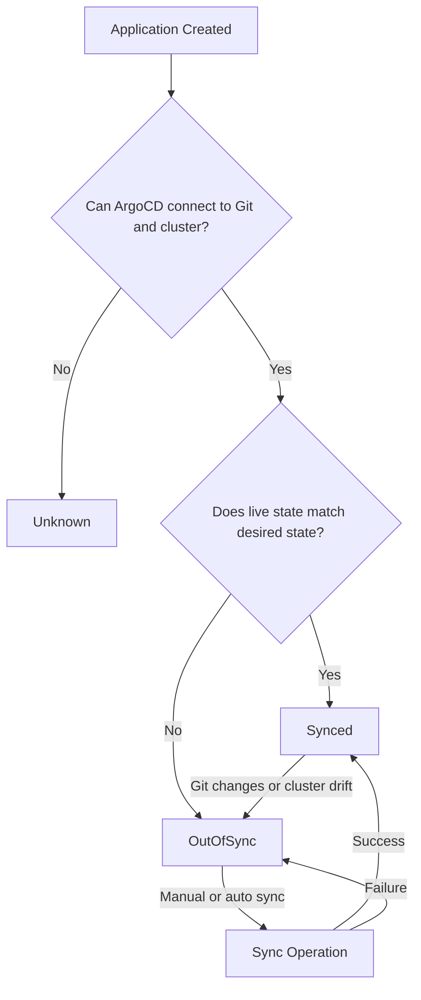

# Understanding Sync Status in ArgoCD: Synced vs OutOfSync

Author: [nawazdhandala](https://github.com/nawazdhandala)

Tags: ArgoCD, GitOps, Kubernetes, Sync, Troubleshooting

Description: A thorough explanation of ArgoCD sync status values including Synced, OutOfSync, and Unknown, with practical examples and troubleshooting tips.

---

Every ArgoCD Application has a sync status that tells you whether the Kubernetes cluster matches your Git repository. This sounds simple, but understanding the nuances of sync status - why an application shows OutOfSync, what triggers a status change, and how to fix common issues - is essential for working with ArgoCD effectively.

## The Three Sync Statuses

ArgoCD reports three possible sync statuses for each Application:

**Synced** - The live state in the cluster matches the desired state from Git. Every resource that should exist does exist, every resource that should not exist has been removed (if pruning is enabled), and the configuration of each resource matches what Git declares.

**OutOfSync** - The live state does not match the desired state. Something is different. Maybe a new commit changed a manifest, someone manually edited a resource, or a resource is missing from the cluster.

**Unknown** - ArgoCD cannot determine the sync status. This typically means there is a problem connecting to the Git repository, the Kubernetes cluster, or generating manifests.



## What "Synced" Really Means

When ArgoCD reports Synced, it means:

1. It successfully fetched the latest manifests from the Git repository
2. It successfully compared those manifests with the live cluster state
3. After normalization (ignoring server-generated fields, defaults, etc.), the two match
4. The sync was done at a specific Git revision, which is shown in the UI

Important: Synced does NOT mean healthy. An application can be Synced (cluster matches Git) but Degraded (pods are crashing). Sync status and health status are independent. You can have all four combinations:

| Sync Status | Health Status | Meaning |
|-------------|--------------|---------|
| Synced | Healthy | Everything is good |
| Synced | Degraded | Cluster matches Git, but something is broken |
| OutOfSync | Healthy | Cluster is running fine, but does not match Git |
| OutOfSync | Degraded | Cluster differs from Git AND something is broken |

## Common Reasons for OutOfSync

### 1. New Commits in Git

The most straightforward case. Someone committed a change to the Git repository - updated an image tag, changed a resource limit, added a new ConfigMap - and ArgoCD has detected the difference.

```bash
# Check what changed in Git
argocd app diff my-app

# Example output shows what would change during sync
===== apps/Deployment my-namespace/my-app ======
  containers:
  - name: my-app
-   image: myregistry/my-app:v1.0.0
+   image: myregistry/my-app:v1.1.0
```

### 2. Manual Cluster Changes (Drift)

Someone used kubectl to change a resource that ArgoCD manages. Maybe they scaled a Deployment manually, edited a ConfigMap, or added an annotation.

```bash
# Someone ran this, causing drift
kubectl scale deployment my-app --replicas=5 -n production

# But Git says replicas should be 3
# ArgoCD now reports OutOfSync
```

If self-healing is enabled, ArgoCD automatically reverts these changes. If not, you need to either sync the application (reverting the manual change) or update Git to match the manual change.

For more on self-healing, see [how to implement self-healing in ArgoCD](https://oneuptime.com/blog/post/2026-01-25-self-healing-applications-argocd/view).

### 3. Missing Resources

A resource defined in Git does not exist in the cluster. This can happen when:

- Someone deleted a resource with kubectl
- The initial sync partially failed
- A namespace was deleted

### 4. Extra Resources (Orphans)

A resource exists in the cluster that is no longer defined in Git. This happens when you remove a manifest from your repository. ArgoCD detects the extra resource and reports OutOfSync.

The extra resource will only be removed during sync if pruning is enabled in the sync policy or if you check the "Prune" option during a manual sync.

### 5. Admission Controllers or Operators Modifying Resources

Some clusters have admission controllers (like OPA Gatekeeper, Kyverno, or cloud provider webhooks) that modify resources as they are created. For example, an admission controller might add annotations, labels, or sidecar containers.

These modifications create differences between what Git declares and what actually exists in the cluster, causing OutOfSync even immediately after a sync.

The fix is to use diff customizations to tell ArgoCD to ignore these fields:

```yaml
# In the argocd-cm ConfigMap
apiVersion: v1
kind: ConfigMap
metadata:
  name: argocd-cm
  namespace: argocd
data:
  resource.customizations.ignoreDifferences.all: |
    managedFieldsManagers:
    - kube-controller-manager
    jsonPointers:
    - /metadata/annotations/injected-by-webhook
```

For more on customizing diffs, see [how to customize diffs in ArgoCD](https://oneuptime.com/blog/post/2026-01-25-customize-diffs-argocd/view).

### 6. Helm Default Values

Helm charts have default values that may produce different output depending on the Helm version or chart version. If the Repo Server renders manifests slightly differently than what was previously applied, ArgoCD may report OutOfSync.

## How ArgoCD Determines Sync Status

The comparison process is more sophisticated than a simple YAML diff. Here is what happens:

**Step 1: Normalize the desired state.** ArgoCD processes the manifests from Git through the rendering pipeline (Helm template, Kustomize build, etc.) to produce the final desired manifests.

**Step 2: Normalize the live state.** ArgoCD fetches the live resources from the Kubernetes API and strips out fields that are not relevant for comparison:
- `status` fields
- `metadata.managedFields`
- `metadata.creationTimestamp`
- `metadata.uid`
- `metadata.resourceVersion`
- `metadata.generation`

**Step 3: Apply defaults.** If the desired state omits a field that has a known default value in Kubernetes, ArgoCD treats them as equivalent. For example, if your manifest does not specify `imagePullPolicy` and the live resource has `imagePullPolicy: IfNotPresent` (the default), they are considered equal.

**Step 4: Compare.** After normalization, ArgoCD does a structured comparison of the two states. If any field differs, the application is OutOfSync.

## Viewing the Diff

You can see exactly what is different using the CLI or UI:

```bash
# Show the diff between desired and live state
argocd app diff my-app

# Show the diff in a specific format
argocd app diff my-app --local /path/to/local/manifests
```

In the UI, click on an OutOfSync application and navigate to any resource showing a difference. The "Diff" tab shows a side-by-side comparison of the desired and live states.

## Sync Operations

When you trigger a sync (manually or automatically), ArgoCD applies the desired state to the cluster. The sync operation can result in:

**Sync succeeded** - All resources were applied and are now matching the desired state. The status changes to Synced.

**Sync failed** - One or more resources could not be applied. The status remains OutOfSync. Check the sync operation details for error messages.

**Sync partially succeeded** - Some resources were applied but others failed. The status remains OutOfSync for the resources that failed.

```bash
# Sync an application
argocd app sync my-app

# Sync with prune to remove orphaned resources
argocd app sync my-app --prune

# Sync a specific resource only
argocd app sync my-app --resource apps:Deployment:my-app

# Dry run to see what would change
argocd app sync my-app --dry-run
```

## Automated Sync Policies

You can configure ArgoCD to sync automatically when it detects OutOfSync:

```yaml
apiVersion: argoproj.io/v1alpha1
kind: Application
metadata:
  name: my-app
spec:
  syncPolicy:
    automated:
      prune: true      # Automatically delete orphaned resources
      selfHeal: true   # Automatically revert manual changes
      allowEmpty: false # Do not sync if manifests are empty
    syncOptions:
    - Validate=true    # Validate resources before applying
    - CreateNamespace=true  # Create namespace if missing
    retry:
      limit: 5         # Retry failed syncs up to 5 times
      backoff:
        duration: 5s
        factor: 2
        maxDuration: 3m
```

With `selfHeal: true`, ArgoCD reverts any manual cluster changes within seconds, ensuring the cluster always matches Git.

## Troubleshooting Persistent OutOfSync

If an application stays OutOfSync even after syncing, here are the most common causes:

**Mutating webhooks.** An admission controller is modifying resources after ArgoCD applies them. Solution: configure ignore differences.

**Operator-managed fields.** A Kubernetes operator is modifying resources that ArgoCD also manages. Solution: either let ArgoCD or the operator manage the resource, not both.

**Manifest generation issues.** The Repo Server produces different output on each run (non-deterministic templates). Solution: fix the templates to be deterministic.

```bash
# Check if an app keeps going OutOfSync after sync
argocd app get my-app

# Look at the diff to understand what is different
argocd app diff my-app

# Check if specific resources are the problem
argocd app resources my-app
```

**Resource conflicts.** Two Applications manage the same resource. ArgoCD does not prevent this, but it causes conflicts. Solution: ensure each resource is managed by exactly one Application.

## The Bottom Line

Sync status is ArgoCD's way of telling you whether your cluster matches your Git repository. Synced means they match, OutOfSync means they differ, and Unknown means ArgoCD cannot tell. Most of your day-to-day work with ArgoCD involves understanding why something is OutOfSync and deciding whether to sync, update Git, or configure ArgoCD to ignore the difference. Mastering sync status is mastering ArgoCD itself.
